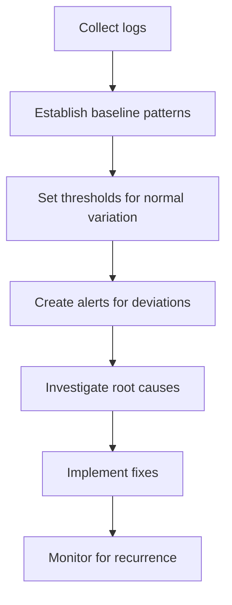

# Monitoring Gaps

## Introduction

When working with Grafana Loki, you might encounter situations where your log data isn't complete - there are gaps where expected logs are missing. These monitoring gaps can lead to incomplete visualizations, inaccurate alerts, and missing critical information during incident investigations.

In this guide, we'll explore what monitoring gaps are, why they occur, how to identify them, and most importantly, how to resolve them in your Grafana Loki setup.

## What Are Monitoring Gaps?

Monitoring gaps are periods where expected log data is missing from your Loki storage. These gaps might be:

- **Temporal gaps**: Missing logs for specific time periods
- **Source gaps**: Missing logs from specific sources (e.g., a particular pod, instance, or application)
- **Label gaps**: Missing logs for particular label combinations
- **Content gaps**: Missing specific types of log entries

## Common Causes of Monitoring Gaps

### 1. Agent Issues

- **Agent downtime**: Promtail, Fluentd, or other agents might crash or stop running
- **Configuration errors**: Improper file paths or incorrect glob patterns
- **Resource constraints**: Agent running out of memory or CPU

### 2. Network Problems

- **Connectivity issues**: Network interruptions between agents and Loki
- **Rate limiting**: Network throttling causing drops
- **Timeout issues**: Requests taking too long and being terminated

### 3. Loki Server Issues

- **Service unavailability**: Loki components being down
- **Rate limiting**: Loki rejecting logs due to ingestion limits
- **Out of resources**: Insufficient storage or memory

### 4. Data Issues

- **Log rotation**: Logs being rotated before collection
- **Application issues**: Application not generating logs during certain periods
- **Log format changes**: Changes breaking the parsing logic

## Identifying Monitoring Gaps

Let's explore how to detect gaps in your monitoring data:

### Visual Inspection

The simplest way to identify gaps is through visual inspection in Grafana dashboards:

1. Create a time series visualization showing log volume
2. Look for drops to zero or significant decreases
3. Check if the pattern correlates with specific events (deployments, maintenance, etc.)

### Using LogQL to Detect Gaps

You can use LogQL queries to identify potential gaps in your data:

```logql
sum(count_over_time({job="myapp"} [1m])) by (instance)
```

This query counts logs per instance in 1-minute windows. Zeros or unexpected drops indicate potential gaps.

For more sophisticated gap detection, you can use a query like:

```logql
sum by (instance) (count_over_time({job="myapp"}[5m] offset 5m)) 
  unless 
sum by (instance) (count_over_time({job="myapp"}[5m]))
```

This identifies instances that were logging 5 minutes ago but have stopped now.

### Implementing a Gap Detection Dashboard

Let's create a more structured approach with a dedicated gap detection dashboard:



## A Practical Example: Debugging Agent Issues

Let's walk through a common scenario where Promtail (Loki's agent) is causing gaps:

### Step 1: Check Promtail Status

First, verify if Promtail is running:

```bash
kubectl get pods -n loki | grep promtail
```

Example output:
```
promtail-abc12        1/1     Running   0          2d
promtail-def34        1/1     Running   0          2d
promtail-ghi56        0/1     CrashLoopBackOff   3          2d
```

This shows one of our Promtail pods is crashing.

### Step 2: Check Promtail Logs

Examine the logs of the failing pod:

```bash
kubectl logs promtail-ghi56 -n loki
```

Example output:
```
level=error ts=2023-06-10T15:04:32.654Z caller=promtail.go:182 msg="error creating targets" error="open /var/log/pods: no such file or directory"
```

This shows a configuration issue - the pod can't access the expected log path.

### Step 3: Fix the Configuration

Update the Promtail DaemonSet to ensure proper volume mounts:

```yaml
volumes:
- name: varlog
  hostPath:
    path: /var/log
- name: varlibdockercontainers
  hostPath:
    path: /var/lib/docker/containers
```

### Step 4: Verify the Fix

After applying the changes, check if logs are flowing again:

```logql
sum(rate({job="promtail"}[5m])) by (instance)
```

## Real-World Scenario: Debugging Loki Ingestion Issues

Another common cause of monitoring gaps is Loki rejecting logs due to rate limiting or resource constraints.

### Identifying the Issue

Check Loki's metrics to see if there are rejected samples:

```logql
sum(rate(loki_distributor_ingestion_rate_samples_rejected_total[5m])) by (reason)
```

Example output might show spikes in rejected samples due to "rate_limited" or "per_stream_rate_limited".

### Understanding Loki's Rate Limiting

Loki implements several rate limits to protect itself:

1. **Global rate limits**: Caps the total ingestion rate
2. **Per-tenant rate limits**: Limits each tenant's ingestion rate
3. **Per-stream rate limits**: Restricts ingestion for each unique label combination

### Adjusting Rate Limits

You can modify Loki's configuration to accommodate your log volume:

```yaml
limits_config:
  ingestion_rate_mb: 10
  ingestion_burst_size_mb: 20
  per_stream_rate_limit: 5MB
  per_stream_rate_limit_burst: 10MB
```

### Implementing Dynamic Rate Limiting

For production environments, consider implementing dynamic rate limiting that adjusts based on actual usage patterns:

```yaml
limits_config:
  ingestion_rate_strategy: "global"
  ingestion_rate_mb: 10
  ingestion_burst_size_mb: 20
```

## Preventing Monitoring Gaps

Here are strategies to minimize monitoring gaps in your Loki setup:

### 1. Implement Buffer and Retry Logic

Configure your agents with appropriate buffering and retry logic:

```yaml
clients:
  - url: http://loki:3100/loki/api/v1/push
    backoff_config:
      min_period: 500ms
      max_period: 5m
      max_retries: 10
    batchwait: 1s
    batchsize: 1048576
```

### 2. Set Up Proper Monitoring of Your Monitoring

Monitor the health of your monitoring system itself:

- Track agent status and resource usage
- Monitor Loki component health
- Set up alerts for sudden drops in log volume

### 3. Implement High Availability

For critical environments, implement redundancy:

- Run multiple Promtail instances per host
- Deploy Loki in a distributed mode
- Use multiple storage backends

### 4. Regular Validation

Implement regular validation tests:

- Inject test logs at known intervals
- Verify end-to-end log delivery
- Audit log completeness for critical systems

## Hands-On Exercise: Building a Gap Detection System

Let's create a simple system to detect and alert on monitoring gaps:

1. Create a LogQL query to detect gaps:

```logql
# Find instances that have stopped logging
sum by (instance) (count_over_time({job="myapp"}[15m] offset 15m)) 
  unless 
sum by (instance) (count_over_time({job="myapp"}[15m]))
```

2. Set up a Grafana alert with this query:
   - Navigate to Grafana Alerting
   - Create a new alert rule using the query above
   - Set the condition to alert when the result is > 0
   - Add appropriate notification channels

3. Create a recovery procedure document for when gaps are detected

## Summary

Monitoring gaps in Grafana Loki can undermine the reliability of your observability platform. By understanding the common causes, implementing detection mechanisms, and following the preventive measures outlined in this guide, you can ensure your log data remains complete and reliable.

Remember these key points:

- Regularly validate your log collection pipeline
- Monitor the components of your monitoring system
- Implement proper buffering and retry mechanisms
- Set up alerts for unexpected changes in log volume

By addressing monitoring gaps proactively, you'll build a more robust observability system that provides accurate insights when you need them most.

## Additional Resources

- [Grafana Loki Documentation](https://grafana.com/docs/loki/latest/)
- [Promtail Best Practices](https://grafana.com/docs/loki/latest/clients/promtail/)
- [LogQL Query Language Reference](https://grafana.com/docs/loki/latest/logql/)
- [Grafana Alerting Documentation](https://grafana.com/docs/grafana/latest/alerting/)