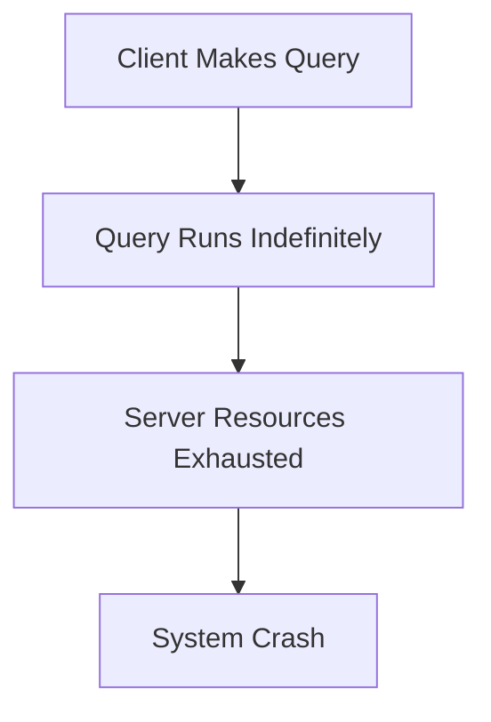

# Common Configuration Mistakes in Grafana Loki

## Introduction

When working with Grafana Loki, configuration mistakes can lead to various issues from performance degradation to complete system failure. As a distributed log aggregation system, Loki has several moving parts that need to be properly configured to work together efficiently. This guide will help you identify and resolve common configuration mistakes that beginners often encounter.

## Table of Contents

- [Storage Configuration Issues](#storage-configuration-issues)
- [Label Configuration Problems](#label-configuration-problems)
- [Retention Policy Misconfigurations](#retention-policy-misconfigurations)
- [Index and Query Performance Issues](#index-and-query-performance-issues)
- [Authentication and Authorization Mistakes](#authentication-and-authorization-mistakes)
- [Troubleshooting Process](#troubleshooting-process)

## Storage Configuration Issues

One of the most common areas where mistakes occur is in configuring Loki's storage.

### Missing or Incorrect Storage Paths

Loki requires specific paths for storing indexes and chunks. If these are misconfigured, Loki may fail to start or may not store logs properly.

```yaml
storage_config:
  boltdb_shipper:
    active_index_directory: /loki/index
    cache_location: /loki/index_cache
    cache_ttl: 24h
    shared_store: filesystem
  filesystem:
    directory: /loki/chunks
```

**Common mistake:** Using paths that don't exist or that Loki doesn't have permission to access.

**Solution:** Ensure directories exist and have appropriate permissions:

```bash
mkdir -p /loki/index /loki/index_cache /loki/chunks
chmod -R 755 /loki
```

### Incorrect S3 Bucket Configuration

When using S3 for storage, misconfiguration can prevent Loki from storing or retrieving logs.

```yaml
storage_config:
  aws:
    s3: s3://access_key:secret_access_key@region/bucket_name
    s3forcepathstyle: true
```

**Common mistake:** Invalid credentials or incorrect bucket name/region.

**Solution:** Verify your AWS credentials and bucket information. Use environment variables for credentials when possible:

```yaml
storage_config:
  aws:
    s3: s3://region/bucket_name
    s3forcepathstyle: true
```

Then set environment variables:

```bash
export AWS_ACCESS_KEY_ID=your_access_key
export AWS_SECRET_ACCESS_KEY=your_secret_key
```

## Label Configuration Problems

Labels are crucial for Loki's operation and query performance.

### Too Many Label Values

```yaml
limits_config:
  max_label_name_length: 1024
  max_label_value_length: 2048
  max_label_names_per_series: 30
```

**Common mistake:** Not setting limits on labels, leading to "cardinality explosion".

For example, if you have a label like `request_id` that has a unique value for each log entry:

```
{app="myapp", env="prod", request_id="38fh47vq98gh49gh984"} Log message here
```

This creates a new series for each request, quickly overwhelming Loki.

**Solution:** Limit high-cardinality labels and set appropriate limits:

```yaml
limits_config:
  max_label_names_per_series: 15
  cardinality_limit: 100000
  
scrape_configs:
  - job_name: system
    pipeline_stages:
      - regex:
          expression: '.*'
      - labels:
          app:
          env:
          # Remove high cardinality labels
          # request_id:  # Commented out to prevent cardinality issues
```

### Inconsistent Label Naming

**Common mistake:** Using different label names or values in different parts of your configuration.

**Solution:** Standardize your label naming across all components:

```yaml
scrape_configs:
  - job_name: app_logs
    static_configs:
      - targets:
          - localhost
        labels:
          job: app_logs  # Consistent with job_name
          environment: production  # Use 'environment' consistently, not sometimes 'env'
          app: myapp  # Use 'app' consistently, not sometimes 'application'
```

## Retention Policy Misconfigurations

Mistakes in retention policy configuration can lead to unexpected data loss or storage bloat.

### Incorrect Retention Period Configuration

```yaml
limits_config:
  retention_period: 24h
```

**Common mistake:** Setting too short or too long retention periods.

**Solution:** Set appropriate retention based on your needs and storage capacity:

```yaml
limits_config:
  retention_period: 168h  # 7 days
  
table_manager:
  retention_deletes_enabled: true
  retention_period: 168h
```

### Mismatched Retention Settings

**Common mistake:** Configuring different retention periods in different components.

**Solution:** Ensure consistency across all retention-related settings:

```yaml
limits_config:
  retention_period: 168h  # 7 days
  
table_manager:
  retention_deletes_enabled: true
  retention_period: 168h  # Same as above
  
compactor:
  retention_enabled: true
  retention_delete_delay: 2h
  retention_delete_worker_count: 150
```

## Index and Query Performance Issues

Improper configuration of queries and indexes can severely impact performance.

### Missing Index Limits

**Common mistake:** Not setting query timeout or limits:



**Solution:** Set appropriate query limits:

```yaml
limits_config:
  max_query_parallelism: 16
  max_query_series: 10000
  max_outstanding_per_tenant: 2048
  query_timeout: 1m
```

### Inefficient Chunk Cache Size

**Common mistake:** Setting chunk cache size too small:

```yaml
chunk_store_config:
  max_look_back_period: 0s
```

**Solution:** Configure an appropriate cache size:

```yaml
chunk_store_config:
  max_look_back_period: 168h  # Match your retention period
  
schema_config:
  configs:
    - from: 2020-07-01
      store: boltdb-shipper
      object_store: filesystem
      schema: v11
      index:
        prefix: index_
        period: 24h
```

## Authentication and Authorization Mistakes

Security misconfigurations can expose your logs or prevent legitimate access.

### Missing or Weak Authentication

**Common mistake:** Not setting up authentication:

```yaml
auth_enabled: false
```

**Solution:** Enable authentication and configure appropriate settings:

```yaml
auth_enabled: true

server:
  http_listen_port: 3100
  
# Use Grafana's built-in auth or configure external auth
```

### Incorrect Tenant Configuration

**Common mistake:** Misconfigured multi-tenancy:

```yaml
auth_enabled: true
```

**Solution:** Properly configure tenant settings:

```yaml
auth_enabled: true

server:
  http_listen_port: 3100
  
multi_tenant_compatible: true

limits_config:
  per_tenant_override_config: /etc/loki/overrides.yaml
  per_tenant_override_period: 10s
```

Then in `/etc/loki/overrides.yaml`:

```yaml
overrides:
  tenant1:
    ingestion_rate_mb: 10
    max_global_streams_per_user: 10000
  tenant2:
    ingestion_rate_mb: 20
    max_global_streams_per_user: 20000
```

## Troubleshooting Process

When facing configuration issues, follow this systematic approach:

1. **Check Logs**: Always start by examining Loki's logs:

```bash
journalctl -u loki -f
# or
kubectl logs -f deployment/loki -n monitoring
```

2. **Validate Configuration**: Use Loki's config validation tool:

```bash
loki -config.file=/etc/loki/loki.yaml -validate-only
```

3. **Test Connectivity**: Ensure Loki can connect to its storage:

```bash
curl -v http://localhost:3100/ready
```

4. **Examine Metrics**: Check Loki's metrics endpoint:

```bash
curl http://localhost:3100/metrics | grep loki_
```

5. **Inspect Component Status**: Check individual component status:

```bash
curl http://localhost:3100/distributor/ring
curl http://localhost:3100/ingester/ring
```

## Common Error Messages and Solutions

| Error Message | Likely Cause | Solution |
|---------------|--------------|----------|
| `failed to initialize storage: open /loki/index: permission denied` | Storage permissions issue | Correct directory permissions |
| `too many outstanding requests` | Query limits exceeded | Adjust `max_outstanding_per_tenant` |
| `context deadline exceeded` | Query timeout | Refine query or increase `query_timeout` |
| `label name not found` | Incorrect label reference | Check label names in your queries |
| `compactor: failed to upload compacted blocks` | Storage issues | Check storage configuration and permissions |

## Summary

Configuration mistakes in Grafana Loki often revolve around storage settings, label management, retention policies, and query performance settings. By understanding these common pitfalls and their solutions, you can maintain a healthy Loki deployment.

Remember these key points:
- Use appropriate label configurations to avoid cardinality issues
- Configure storage paths and permissions correctly
- Set reasonable query limits and timeouts
- Maintain consistent retention policies
- Regularly monitor and validate your configuration

## Practice Exercises

1. Identify and fix the configuration issues in this snippet:

```yaml
storage_config:
  boltdb_shipper:
    active_index_directory: /tmp/loki/index
  filesystem:
    directory: /tmp/loki/chunks

limits_config:
  # No limits defined

schema_config:
  configs:
    - from: 2020-10-24
      store: boltdb-shipper
      object_store: filesystem
      schema: v11
      index:
        prefix: index_
        period: 24h
```

2. Create a configuration for Loki that uses S3 storage with appropriate retention and query limits.

3. Design a labeling strategy for a multi-application environment that avoids cardinality problems.

## Additional Resources

- [Official Loki Configuration Documentation](https://grafana.com/docs/loki/latest/configuration/)
- [Grafana Loki Best Practices](https://grafana.com/docs/loki/latest/best-practices/)
- [Loki Troubleshooting Guide](https://grafana.com/docs/loki/latest/troubleshooting/)
- [Loki Configuration Examples Repository](https://github.com/grafana/loki/tree/main/production)