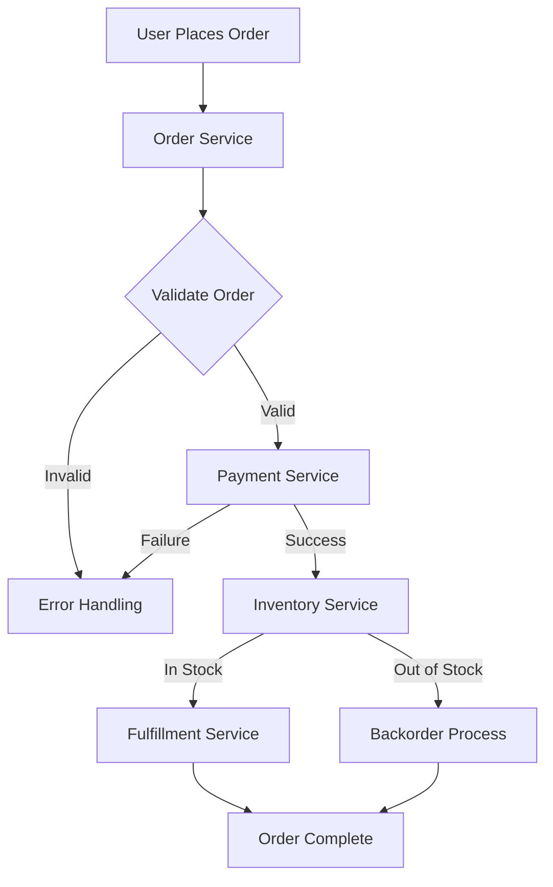

I'll create comprehensive educational content about Application Logging for your Grafana Loki Learning Path Structure website. This will be written in Docusaurus MDX format with all the requirements you've specified.

---
title: Application Logging
description: Learn how to implement effective application logging with Grafana Loki, including best practices, log levels, structured logging, and real-world examples

---

# Application Logging

## Introduction

Application logging is a critical practice in software development that involves recording events, messages, and data during program execution. When combined with Grafana Loki, a powerful log aggregation system, application logging becomes an essential component of your observability strategy.

In this guide, we'll explore how to implement effective application logging, understand logging best practices, and learn how to structure your logs for optimal analysis with Loki. By the end, you'll be able to implement a robust logging strategy that makes troubleshooting and monitoring your applications significantly easier.

## Why Application Logging Matters

Before diving into implementation details, let's understand why application logging is crucial:

1. **Troubleshooting**: Logs provide insights into what happened when an error occurred
2. **Monitoring**: Regular logging helps track application health and performance
3. **Auditing**: Logs create an audit trail for security and compliance purposes
4. **Analytics**: Log data can reveal usage patterns and user behavior

When combined with Loki's powerful querying capabilities, these logs become searchable, filterable, and visualizable, transforming raw log data into actionable insights.

## Log Levels and Their Purpose

Effective logging starts with understanding log levels. Each level represents a different severity or type of information:

| Level | Purpose | Example |
|-------|---------|---------|
| TRACE | Extremely detailed information, useful for debugging | `TRACE: Variable x = 42 at line 211` |
| DEBUG | Detailed information useful during development | `DEBUG: Cache miss for user profile #123` |
| INFO | Confirmation that things are working as expected | `INFO: User authentication successful` |
| WARN | Indication of potential issues that aren't critical | `WARN: API rate limit at 80%` |
| ERROR | Error events that might still allow the application to continue | `ERROR: Failed to process payment transaction` |
| FATAL | Severe errors that cause the application to abort | `FATAL: Database connection lost, shutting down` |

Using the right log level ensures logs are meaningful and that you can filter them appropriately in Loki.

## Structured Logging

When working with Loki, structured logging significantly improves log querying and analysis. Instead of plain text logs, structured logs contain key-value pairs that can be easily parsed and queried.

### Plain Text vs. Structured Logging

**Plain text logging:**

```
[2023-04-12 14:32:45] ERROR Server crashed after receiving request from 192.168.1.1 to /api/users
```

**Structured logging (JSON):**

```json
{
  "timestamp": "2023-04-12T14:32:45Z",
  "level": "ERROR",
  "message": "Server crashed after receiving request",
  "client_ip": "192.168.1.1",
  "endpoint": "/api/users",
  "request_id": "a1b2c3d4"
}
```

With structured logging, you can query specific fields in Loki, such as finding all errors from a specific `client_ip` or affecting a particular `endpoint`.

## Implementing Logging in Different Languages

Let's explore how to implement structured logging in various programming languages for use with Loki.

### Node.js with Winston

Winston is a popular logging library for Node.js that supports structured logging:

```javascript
const winston = require('winston');

// Create a logger
const logger = winston.createLogger({
  level: 'info',
  format: winston.format.json(),
  defaultMeta: { service: 'user-service' },
  transports: [
    new winston.transports.Console(),
    new winston.transports.File({ filename: 'app.log' })
  ]
});

// Example usage
function authenticateUser(username, password) {
  logger.info('Authentication attempt', { 
    username, 
    success: false, // Will be updated
    timestamp: new Date().toISOString() 
  });
  
  try {
    // Authentication logic here
    const success = true; // Assume successful for this example
    
    logger.info('Authentication successful', { 
      username, 
      success,
      timestamp: new Date().toISOString() 
    });
    
    return true;
  } catch (error) {
    logger.error('Authentication failed', { 
      username, 
      error: error.message,
      stack: error.stack,
      timestamp: new Date().toISOString() 
    });
    
    return false;
  }
}
```

### Python with structlog

Python's structlog library makes structured logging easy:

```python
import structlog
import datetime

# Configure the logger
structlog.configure(
    processors=[
        structlog.processors.TimeStamper(fmt="iso"),
        structlog.processors.JSONRenderer()
    ],
)

logger = structlog.get_logger()

# Example usage
def process_order(order_id, items, user_id):
    logger.info("Processing order", order_id=order_id, item_count=len(items), user_id=user_id)
    
    try:
        # Order processing logic
        total = sum(item['price'] for item in items)
        
        logger.info(
            "Order processed successfully",
            order_id=order_id,
            total_amount=total,
            processing_time_ms=215  # Example processing time
        )
        
        return {"success": True, "order_id": order_id, "total": total}
    except Exception as e:
        logger.error(
            "Order processing failed",
            order_id=order_id,
            error=str(e),
            user_id=user_id
        )
        
        return {"success": False, "error": str(e)}
```

### Java with Logback and SLF4J

For Java applications, combining Logback with SLF4J and using JSON formatting provides excellent structured logging:

```java
import org.slf4j.Logger;
import org.slf4j.LoggerFactory;
import net.logstash.logback.argument.StructuredArguments;

public class PaymentService {
    private static final Logger logger = LoggerFactory.getLogger(PaymentService.class);
    
    public boolean processPayment(String paymentId, double amount, String currency) {
        logger.info("Payment processing started", 
            StructuredArguments.kv("payment_id", paymentId),
            StructuredArguments.kv("amount", amount),
            StructuredArguments.kv("currency", currency));
        
        try {
            // Payment processing logic
            boolean success = true; // Assume success for this example
            
            if (success) {
                logger.info("Payment processed successfully", 
                    StructuredArguments.kv("payment_id", paymentId),
                    StructuredArguments.kv("processing_time_ms", 150));
            }
            
            return success;
        } catch (Exception e) {
            logger.error("Payment processing failed", 
                StructuredArguments.kv("payment_id", paymentId),
                StructuredArguments.kv("error", e.getMessage()),
                StructuredArguments.kv("amount", amount),
                StructuredArguments.kv("currency", currency));
            
            return false;
        }
    }
}
```

## Forwarding Logs to Loki

Once your application is generating structured logs, you need to forward them to Loki. Here are several approaches:

### Using Promtail

Promtail is the official agent for shipping logs to Loki:

```yaml
# promtail-config.yaml
server:
  http_listen_port: 9080
  grpc_listen_port: 0

positions:
  filename: /tmp/positions.yaml

clients:
  - url: http://loki:3100/loki/api/v1/push

scrape_configs:
  - job_name: application_logs
    static_configs:
      - targets:
          - localhost
        labels:
          job: application_logs
          environment: production
          __path__: /var/log/application/*.log
```

### Using Docker Driver for Containerized Applications

For containerized applications, the Loki Docker driver simplifies log shipping:

```dockerfile
# In your docker-compose.yml
version: '3'
services:
  app:
    image: your-application:latest
    logging:
      driver: loki
      options:
        loki-url: "http://loki:3100/loki/api/v1/push"
        loki-retries: "5"
        loki-batch-size: "400"
        labels: "job=application,environment=production"
```

## Creating Loki-Friendly Log Patterns

To maximize the value of your logs in Loki, consider these best practices:

1. **Include consistent labels**: Always include service, environment, and component
2. **Add request IDs**: Include a unique identifier for each request to trace its path
3. **Structure error information**: Include error type, message, and stack trace
4. **Include timing data**: Add processing time for performance analysis

Here's a real-world example pattern:

```javascript
// Node.js example of a well-structured log entry
logger.info('API request completed', {
  service: 'payment-api',
  environment: 'production',
  request_id: req.headers['x-request-id'] || uuidv4(),
  path: req.path,
  method: req.method,
  status_code: res.statusCode,
  response_time_ms: Date.now() - req.startTime,
  user_id: req.user?.id || 'anonymous',
  client_ip: req.ip,
  user_agent: req.headers['user-agent']
});
```

## Querying Application Logs in Loki

Once your logs are flowing into Loki, you can query them using LogQL. Here are some useful example queries:

### Finding Errors in a Specific Service

```
{service="payment-api"} |= "ERROR"
```

### Analyzing Response Times

```
{service="payment-api", environment="production"}
| json
| response_time_ms > 1000
| line_format "Slow request: {{.path}} took {{.response_time_ms}}ms"
```

### Tracking User Activity

```
{service="user-service"}
| json
| user_id=~"user-123.*"
| line_format "{{.timestamp}} {{.message}} ({{.user_id}})"
```

## Real-World Application: E-commerce Order Processing

Let's look at a complete real-world example of logging for an e-commerce order processing service:



Implementing proper logging across this flow helps track orders and troubleshoot issues:

```javascript
// Order service example
function processOrder(order) {
  const requestId = uuidv4();
  const startTime = Date.now();
  
  logger.info('Order received', {
    request_id: requestId,
    order_id: order.id,
    user_id: order.userId,
    total_amount: order.total,
    item_count: order.items.length,
    service: 'order-service'
  });
  
  // Validate order
  if (!validateOrder(order)) {
    logger.error('Order validation failed', {
      request_id: requestId,
      order_id: order.id,
      validation_errors: validateOrder.errors,
      service: 'order-service'
    });
    return { success: false, error: 'Validation failed' };
  }
  
  // Process payment
  const paymentResult = processPayment(order, requestId);
  if (!paymentResult.success) {
    return { success: false, error: 'Payment failed' };
  }
  
  // Check inventory
  const inventoryResult = checkInventory(order.items, requestId);
  if (inventoryResult.allInStock) {
    // Fulfill order
    fulfillOrder(order, requestId);
  } else {
    // Backorder process
    createBackorder(order, inventoryResult.outOfStockItems, requestId);
  }
  
  logger.info('Order processing complete', {
    request_id: requestId,
    order_id: order.id,
    processing_time_ms: Date.now() - startTime,
    status: 'complete',
    service: 'order-service'
  });
  
  return { success: true, orderId: order.id };
}
```

In Loki, you could then trace the entire order process with:

```
{request_id="3f8a61a2-1d2b-4c3d-b3e4-5f6a7b8c9d0e"}
| json
| line_format "{{.timestamp}} [{{.service}}] {{.message}} (Order: {{.order_id}})"
```

## Best Practices for Application Logging with Loki

To make the most of your application logging with Loki:

1. **Use consistent naming**: Keep field names consistent across services
2. **Add context wisely**: Include enough context for debugging without bloating logs
3. **Set appropriate log levels**: Use INFO for normal operations, reserve DEBUG for development
4. **Implement log rotation**: For file-based logs before shipping to Loki
5. **Add metadata labels**: Include service, environment, and version in all logs
6. **Sanitize sensitive data**: Never log passwords, tokens, or sensitive personal information
7. **Use structured logging**: Always log in a structured format (preferably JSON)
8. **Include timestamps**: Add ISO-8601 compliant timestamps to all logs
9. **Correlate with traces**: Include trace IDs when using distributed tracing

## Summary

Application logging is a critical component of modern software development, especially when paired with a powerful system like Grafana Loki. By implementing structured logging, using appropriate log levels, and following best practices, you can create logs that provide valuable insights into your application's behavior.

Remember these key points:
- Structure your logs using JSON or other machine-parseable formats
- Include contextual information like request IDs and user IDs
- Use appropriate log levels to distinguish between different types of events
- Forward logs to Loki using Promtail or Docker drivers
- Query logs effectively with LogQL to gain insights

By implementing these practices, you'll create a robust logging system that makes troubleshooting easier and provides valuable insights into your application's performance and behavior.

## Exercises

1. Implement structured logging in an application of your choice using one of the libraries mentioned.
2. Configure Promtail to forward your application logs to Loki.
3. Write LogQL queries to find:
   - All errors in your application
   - Requests that took longer than 500ms to process
   - All activities for a specific user
4. Create a Grafana dashboard that visualizes error rates and performance metrics from your logs.
5. Implement a correlation ID system to trace requests across multiple services.

## Additional Resources

- [Grafana Loki Documentation](https://grafana.com/docs/loki/latest/)
- [LogQL Query Language Reference](https://grafana.com/docs/loki/latest/logql/)
- [Structured Logging Best Practices](https://www.google.com)
- [Application Monitoring with Loki and Grafana](https://www.google.com)

Happy logging!