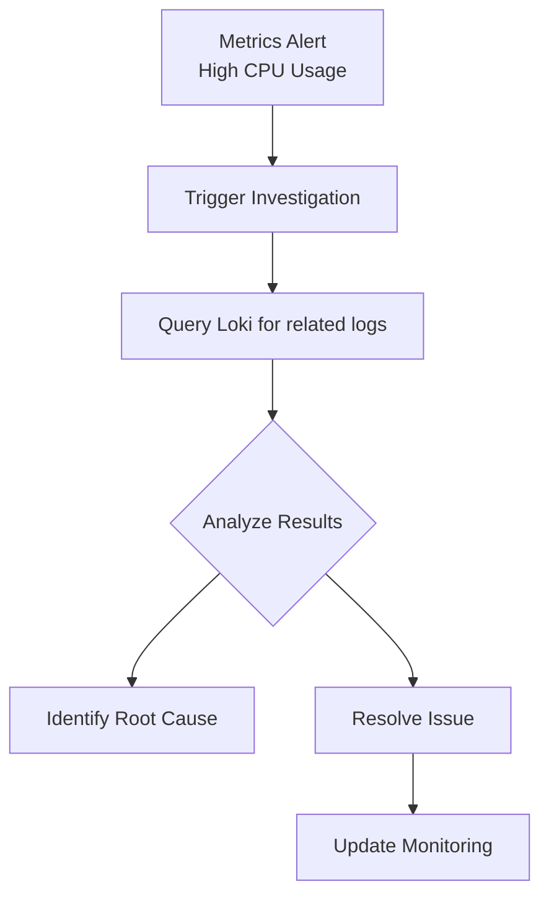

# Infrastructure Monitoring

## Introduction

Infrastructure monitoring is a critical aspect of maintaining healthy and reliable systems. As applications grow in complexity and scale, the ability to monitor infrastructure becomes essential for detecting issues, troubleshooting problems, and ensuring optimal performance. Grafana Loki provides powerful capabilities for infrastructure monitoring through log aggregation and analysis.

In this guide, we'll explore how to leverage Grafana Loki for effective infrastructure monitoring, covering key concepts, implementation strategies, and real-world examples that demonstrate its practical applications.

## What is Infrastructure Monitoring?

Infrastructure monitoring involves collecting, analyzing, and visualizing metrics and logs from various components of your IT infrastructure, including:

- Servers and virtual machines
- Containers and orchestration platforms (like Kubernetes)
- Network devices
- Storage systems
- Cloud resources

Effective monitoring helps teams to:

- Detect issues before they impact users
- Identify performance bottlenecks
- Troubleshoot problems quickly
- Plan capacity for future growth
- Ensure compliance with service level agreements (SLAs)

## Loki's Role in Infrastructure Monitoring

While traditional monitoring often focuses on metrics (such as CPU usage, memory, and disk space), logs provide crucial context for understanding system behavior. Grafana Loki specializes in log aggregation and analysis, making it an essential component of a comprehensive infrastructure monitoring strategy.

### Key Benefits of Loki for Infrastructure Monitoring

- **Lightweight and cost-effective**: Loki indexes metadata rather than full log content
- **Seamless integration** with Grafana and the Prometheus ecosystem
- **Label-based approach** that works well with dynamic infrastructure
- **LogQL query language** that's familiar to Prometheus users
- **Horizontally scalable** to accommodate growing infrastructure

## Setting Up Infrastructure Monitoring with Loki

Let's walk through the process of setting up basic infrastructure monitoring with Loki.

### Prerequisites

- A running Loki instance
- Promtail or other log collection agents deployed on your infrastructure
- Grafana for visualization

### Step 1: Configure Log Collection

The first step is to configure Promtail (or another log shipper) to collect logs from your infrastructure components. Here's a basic Promtail configuration for collecting system logs:

```yaml
server:
  http_listen_port: 9080
  grpc_listen_port: 0

positions:
  filename: /tmp/positions.yaml

clients:
  - url: http://loki:3100/loki/api/v1/push

scrape_configs:
  - job_name: system
    static_configs:
      - targets:
          - localhost
        labels:
          job: system
          env: production
          host: ${HOSTNAME}
    pipeline_stages:
      - regex:
          expression: '(?P<timestamp>\w+\s+\d+\s+\d+:\d+:\d+)\s+(?P<host>\S+)\s+(?P<application>\S+):\s+(?P<message>.+)'
      - labels:
          timestamp:
          host:
          application:
```

This configuration collects system logs and adds labels for job, environment, and hostname, making it easier to filter and analyze logs later.

### Step 2: Define Infrastructure-Specific Labels

Effective labeling is crucial for infrastructure monitoring. Consider these labeling strategies:

- Use `host` or `node` to identify specific servers
- Include `service` or `application` to categorize logs by service
- Add `environment` (prod, staging, dev) to distinguish between environments
- Include `component` (database, web server, cache) for specific infrastructure components

Example label structure:

```
{
  host="web-server-01",
  service="authentication",
  environment="production",
  component="nginx"
}
```

### Step 3: Create Useful Dashboards

Now, let's create a Grafana dashboard to visualize our infrastructure logs. Here's how to set up a basic infrastructure monitoring dashboard:

1. Create a new dashboard in Grafana
2. Add a "Logs" panel
3. Configure the query to filter by relevant labels

Example LogQL query for web server errors:

```
{job="system", component="nginx"} |= "error" | line_format "{{.host}} - {{.message}}"
```

Example for system resource issues:

```
{job="system"} |= "out of memory" or |= "CPU load" or |= "disk space"
```

## Common Infrastructure Monitoring Patterns with Loki

Let's explore common patterns for infrastructure monitoring using Loki.

### Pattern 1: Error Rate Monitoring

Tracking error rates can help identify problematic systems or components.

```
sum(rate({job="system"} |= "error" [$__interval])) by (host)
```

This query shows the rate of error messages per host over the selected time interval.

### Pattern 2: Service Health Checks

Monitor service health status across your infrastructure:

```
{job="system", application="health-check"} | json | status != "ok"
```

This assumes health check logs are in JSON format with a status field.

### Pattern 3: Security Monitoring

Detect potential security issues:

```
{job="system"} |= "failed password" or |= "authentication failure" or |= "unauthorized"
| line_format "{{.timestamp}} - {{.host}} - {{.message}}"
```

### Pattern 4: Correlating Logs with Metrics

Combine log data with metrics for more comprehensive monitoring:



Example dashboard setup: Create a dashboard with both metrics panels (using Prometheus) and log panels (using Loki) that share the same variables for host, service, and time range.

## Real-World Example: Troubleshooting Server Issues

Let's walk through a real-world example of using Loki for infrastructure monitoring and troubleshooting.

**Scenario**: Users report intermittent slowness on a web application.

**Step 1**: Check for error patterns across servers

Query:
```
{job="system", service="web-app"} |= "error" or |= "warning" or |= "timeout" or |= "failed"
| line_format "{{.timestamp}} - {{.host}} - {{.component}} - {{.message}}"
```

This might show database timeout errors on specific hosts.

**Step 2**: Investigate the database connections

Query:
```
{job="system", component="database"} |= "connection"
```

This might reveal connection pool exhaustion.

**Step 3**: Look for related issues in other components

Query:
```
{host="affected-server"} | logfmt | order_by(timestamp)
```

This timeline view might show cascading failures across components.

**Step 4**: Create an alert for future occurrences

```
sum(rate({job="system", component="database"} |= "connection timeout" [5m])) > 0
```

## Best Practices for Infrastructure Monitoring with Loki

To get the most out of Loki for infrastructure monitoring:

1. **Use consistent labeling**: Establish a consistent labeling scheme across all infrastructure components
2. **Filter at collection time**: Configure Promtail to filter unneeded logs before sending to Loki
3. **Set up alerts**: Create alerts for critical infrastructure issues
4. **Correlate with metrics**: Use Loki alongside Prometheus for comprehensive monitoring
5. **Implement log rotation**: Ensure logs are properly rotated to prevent storage issues
6. **Follow cardinality best practices**: Avoid high cardinality labels that can impact performance
7. **Use log levels effectively**: Ensure your applications use appropriate log levels (ERROR, WARN, INFO)

## Implementing Log Volume Monitoring

One often overlooked aspect of infrastructure monitoring is monitoring the monitoring system itself. Here's how to track log volume using Loki:

```
sum(rate({job="system"}[1h])) by (host)
```

This query shows the rate of logs per host, helping identify unusual logging patterns that might indicate problems or log flooding.

## Example: Creating an Infrastructure Health Dashboard

Here's how to create a comprehensive infrastructure health dashboard with Loki:

1. Create a new dashboard in Grafana
2. Add variables for environment, host, and service
3. Create panels for:
   - Error rates by service
   - Log volume by host
   - Recent critical errors
   - Service health status
   - Security events

Example query for the "Error rates by service" panel:

```
sum(rate({job="system", environment="$environment"} |= "error" [$__interval])) by (service)
```

## Summary

Infrastructure monitoring with Grafana Loki provides valuable insights into the health and performance of your systems. By collecting, analyzing, and visualizing logs from across your infrastructure, you can:

- Detect and troubleshoot issues quickly
- Understand system behavior and performance patterns
- Ensure reliability and availability of services
- Plan for future growth and optimization

The label-based approach of Loki makes it particularly well-suited for modern, dynamic infrastructure environments like containerized workloads and cloud resources.

## Further Learning

To deepen your knowledge of infrastructure monitoring with Loki, consider exploring:

- Advanced LogQL queries for complex analysis
- Multi-tenancy in Loki for large-scale infrastructure
- Integration with alerting systems
- Creating custom dashboards for specific infrastructure components
- Log retention and storage optimization strategies

## Exercises

1. Set up Promtail to collect logs from a specific infrastructure component (e.g., web server, database)
2. Create a Grafana dashboard with panels showing error rates, log volume, and recent critical issues
3. Write LogQL queries to identify the top 10 hosts by error rate
4. Implement an alert for when a specific service stops logging (which might indicate it has crashed)
5. Create a log pipeline that extracts and labels important infrastructure metrics from log messages