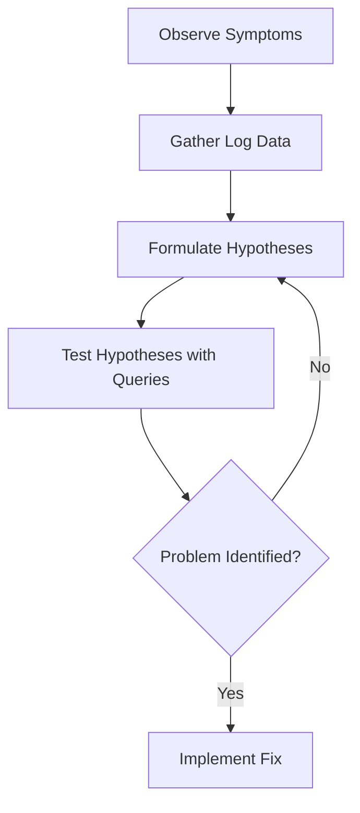

# Debugging Production Issues

## Introduction

When systems fail in production, every minute counts. Debugging production issues quickly and efficiently is a critical skill for any engineer or operator. Grafana Loki, a horizontally scalable, highly available log aggregation system, offers powerful capabilities for investigating and resolving production problems.

In this guide, we'll explore how to use Loki as your primary debugging tool when production systems encounter issues. You'll learn techniques to query, analyze, and correlate logs to identify root causes and implement solutions.

## Why Loki for Production Debugging?

Loki excels at production debugging for several reasons:

- **Low overhead**: Unlike traditional logging systems, Loki indexes metadata rather than full text, minimizing resource usage
- **Fast querying**: LogQL provides flexible, powerful query capabilities across your entire log data
- **Integration**: Loki works seamlessly with other Grafana ecosystem tools like Prometheus and Tempo
- **Correlation**: Easily correlate logs with metrics and traces to get the full picture

## Setting Up for Effective Debugging

### Establishing a Baseline

Before diving into debugging, ensure your Loki deployment is properly configured:

```yaml
loki:
  config:
    limits_config:
      retention_period: 30d
    chunk_store_config:
      max_look_back_period: 30d
```

This configuration ensures you retain enough historical data to establish normal behavior patterns and investigate issues spanning longer timeframes.

### Essential LogQL Queries for Debugging

Here are some essential query patterns for effective debugging:

1. **Finding errors for a specific service**:

```logql
{app="payment-service"} |= "error" | json | status_code >= 500
```

2. **Tracing requests through multiple services**:

```logql
{environment="production"} |= "request_id=abc123" | line_format "{{.timestamp}} {{.service}}: {{.message}}"
```

3. **Identifying spike in errors**:

```logql
sum(rate({app=~".*-service"} |= "error" [5m])) by (app)
```

## Practical Debugging Workflow

Let's walk through a practical debugging workflow using Loki:

### Step 1: Detect the Issue

Typically, issues are detected through:
- Alerts from monitoring systems
- Customer reports
- Anomaly detection

For example, you might receive an alert that your payment service has a high error rate.

### Step 2: Isolate the Scope

First, determine which systems are affected:

```logql
sum(rate({environment="production"} |= "error" [5m])) by (app)
```

This query helps identify which applications are experiencing errors and at what rate.

### Step 3: Inspect Error Patterns

Once you've identified affected services, examine the specific errors:

```logql
{app="payment-service"} |= "error" 
| json 
| line_format "{{.timestamp}} [{{.level}}] {{.message}} (endpoint: {{.endpoint}})"
```

This query extracts structured information from your logs for easier analysis.

### Step 4: Correlate with Other Signals

Production debugging often requires correlating logs with metrics and traces:

<div className="code-example">
  <p>In Grafana, create a dashboard with:</p>
  <ul>
    <li>Error rate from logs (Loki)</li>
    <li>Request latency (Prometheus)</li>
    <li>CPU/Memory utilization (Prometheus)</li>
    <li>Distributed traces for problem requests (Tempo)</li>
  </ul>
</div>

### Step 5: Identify the Root Cause

Using the data collected, identify patterns that point to root causes:



## Real-World Use Case: Database Connection Issues

Let's walk through a complete debugging example:

**Scenario**: Users report intermittent failures in your e-commerce application.

### Step 1: Detect

You notice a spike in 500 errors in your application. Create a query to examine the error rate:

```logql
sum(rate({app="ecommerce-app"} |= "status=500" [5m])) by (instance)
```

### Step 2: Isolate

The query reveals that all instances are affected, but especially during high traffic periods. Next, examine error messages:

```logql
{app="ecommerce-app"} |= "status=500" | json | line_format "{{.timestamp}} {{.error_type}}: {{.message}}"
```

The results show many `DatabaseConnectionError` messages.

### Step 3: Investigate Database Logs

Check the database logs during the same time period:

```logql
{app="postgres"} | json | connection_count > 100
```

This reveals that the application is exceeding the database connection pool limits.

### Step 4: Correlate with Metrics

By examining the database connection metrics alongside the application errors, you confirm that high traffic periods cause connection pool exhaustion.

### Step 5: Fix the Issue

Implement a fix by increasing the connection pool size and adding connection pooling middleware:

```yaml
database:
  max_connections: 50
  connection_timeout: 30s
  idle_connections: 10
```

After deployment, verify the fix with Loki queries to ensure error rates have decreased.

## Advanced Debugging Techniques

### Using Derived Fields

Configure derived fields in Grafana to instantly jump from logs to related traces:

```yaml
derivedFields:
  - name: trace_id
    matcherRegex: "traceID=(\\w+)"
    url: "http://tempo:3100/traces/${__value.raw}"
```

### Creating Debugging Dashboards

Create specific debugging dashboards that combine:

1. Log panels showing error rates
2. Log panels showing detailed error messages
3. Metrics panels showing system performance
4. Trace panels for distributed tracing

This provides a complete view during incident response.

### Debugging with Alerts

Configure Loki alerts to proactively notify you of potential issues:

```yaml
groups:
  - name: production
    rules:
      - alert: HighErrorRate
        expr: sum(rate({app=~".*-service"} |= "error" [5m])) by (app) > 0.01
        for: 5m
        labels:
          severity: critical
        annotations:
          summary: High error rate in {{ $labels.app }}
```

## Best Practices

1. **Use structured logging**: Structured logs with JSON format make extraction and analysis much easier
2. **Include context in logs**: Add request IDs, user IDs, and transaction IDs for better correlation
3. **Log at appropriate levels**: Use ERROR for actual errors, WARN for potential issues, INFO for significant events
4. **Create specialized queries**: Build a library of useful LogQL queries for common debugging scenarios
5. **Set up persistent dashboards**: Create and save dashboards for common failure modes

## Summary

Debugging production issues with Grafana Loki provides a powerful approach to quickly identify and resolve problems in your applications. By following a systematic debugging workflow and leveraging Loki's capabilities, you can:

- Quickly detect and isolate issues
- Correlate logs with metrics and traces
- Identify root causes efficiently
- Implement and verify fixes

The techniques described in this guide will help you build confidence in your ability to tackle production issues effectively, minimizing downtime and improving system reliability.

## Additional Resources

- [Grafana Loki Official Documentation](https://grafana.com/docs/loki/latest/)
- [LogQL Query Language Reference](https://grafana.com/docs/loki/latest/logql/)
- [Grafana Explore Documentation](https://grafana.com/docs/grafana/latest/explore/)

## Exercises

1. Set up a local Loki instance and practice writing LogQL queries for different error scenarios
2. Create a dashboard that combines logs, metrics, and traces for a sample application
3. Implement structured logging in an application and query it with Loki
4. Simulate a production issue and practice the debugging workflow to identify the root cause