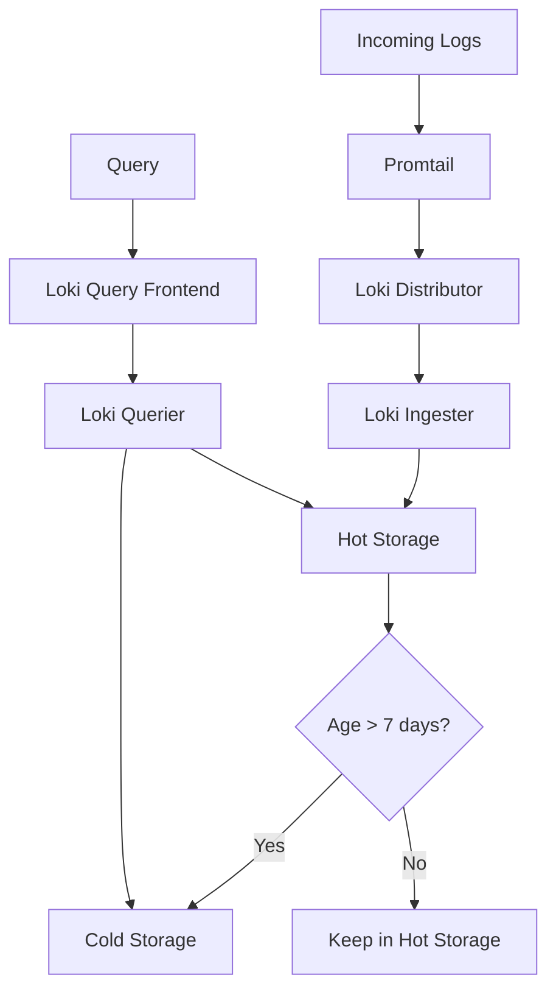

# Cost Optimization Patterns

## Introduction

When implementing Grafana Loki in production environments, managing costs becomes a critical consideration. As log volumes grow, storage requirements increase, and query complexity expands, costs can escalate quickly. This guide explores proven patterns and strategies to optimize costs while maintaining the effectiveness of your logging system.

Cost optimization in Loki involves finding the right balance between retention periods, log volume, query efficiency, and storage tiers. By implementing these patterns, you can significantly reduce expenses while still meeting your observability needs.

## Understanding Loki's Cost Factors

Before diving into optimization patterns, let's understand what drives costs in a Loki deployment:

1. **Storage Volume**: The amount of log data stored
2. **Query Frequency**: How often logs are queried
3. **Query Complexity**: The processing power required for queries
4. **Retention Period**: How long logs are kept
5. **Infrastructure**: Resources required to run Loki components

## Pattern 1: Log Volume Reduction

One of the most effective ways to reduce costs is to be selective about what you log.

### Implementing Log Levels

Use appropriate log levels to filter out unnecessary information before it reaches Loki:

```yaml
# Example Promtail configuration with log level filtering
scrape_configs:
  - job_name: system
    static_configs:
      - targets: [localhost]
        labels:
          job: varlogs
          __path__: /var/log/*.log
    pipeline_stages:
      - match:
          selector: '{job="varlogs"}'
          stages:
            - regex:
                expression: '(DEBUG|INFO|WARN|ERROR)'
            - labels:
                level:
            - drop:
                expression: 'level="DEBUG"'
```

This configuration drops all DEBUG level logs before they're sent to Loki, reducing storage requirements.

### Implementing Dynamic Sampling

Instead of logging everything, implement sampling for high-volume, low-value logs:

```yaml
# Example Promtail configuration with sampling
scrape_configs:
  - job_name: high_volume_service
    static_configs:
      - targets: [localhost]
        labels:
          job: high_volume_service
          __path__: /var/log/service/*.log
    pipeline_stages:
      - match:
          selector: '{job="high_volume_service"}'
          stages:
            - tenant:
                value: "tenant1"
            - sampling:
                rate: 10 # Only send 1 out of every 10 log lines
```

### Pattern in Action

Let's say you have a busy service generating 10GB of logs daily. By implementing log level filtering to exclude DEBUG logs (typically 40-50% of all logs) and sampling high-volume endpoints at 10%, you could reduce your log volume by 60-70%, resulting in proportional cost savings.

## Pattern 2: Optimize Log Labels and Content

Labels in Loki significantly impact both storage and query performance. Optimizing them is crucial for cost reduction.

### Cardinality Management

High cardinality (too many unique label combinations) can increase costs dramatically:

```yaml
# BAD PRACTICE - High cardinality labels
{app="payment-service", instance="10.0.0.1", request_id="a1b2c3d4", user_id="12345", status_code="200"}

# GOOD PRACTICE - Appropriate cardinality
{app="payment-service", component="api", env="prod", status="success"}
```

Keep high-cardinality data in the log content rather than in labels:

```
# Log line with high-cardinality data in content, not labels
{"timestamp":"2023-05-10T12:01:22Z", "message":"Request completed", "request_id":"a1b2c3d4", "user_id":"12345", "status_code":200}
```

### Label Normalization

Normalize label values to reduce unique combinations:

```yaml
# Example Promtail configuration with label normalization
scrape_configs:
  - job_name: api_service
    static_configs:
      - targets: [localhost]
        labels:
          job: api
          __path__: /var/log/api/*.log
    pipeline_stages:
      - regex:
          expression: 'status_code=(\d{3})'
      - labels:
          status_category:
            value: '{{ if eq (substr .status_code 0 1) "2" }}success{{ else if eq (substr .status_code 0 1) "4" }}client_error{{ else if eq (substr .status_code 0 1) "5" }}server_error{{ else }}other{{ end }}'
```

This approach categorizes HTTP status codes into broader groups, reducing cardinality while preserving useful information.

## Pattern 3: Strategic Log Retention

Not all logs need to be kept for the same duration. Implementing tiered retention strategies can significantly reduce costs.

### Configure Retention by Tenant or Stream

```yaml
# Example Loki configuration with different retention periods
limits_config:
  retention_period: 744h  # Default retention (31 days)
  
  retention_stream:
    - selector: '{env="prod", component="security"}'
      priority: 1
      period: 8760h  # 1 year for security logs
      
    - selector: '{env="prod", component="payment"}'
      priority: 2
      period: 2160h  # 90 days for payment logs
      
    - selector: '{env="dev"}'
      priority: 3
      period: 168h   # 7 days for dev logs
```

### Implement Log Compaction

For logs that need longer retention but not at full detail, consider compaction:

```yaml
# Example compaction configuration
compactor:
  working_directory: /loki/compactor
  shared_store: s3
  compaction_interval: 10m
  retention_enabled: true
  retention_delete_delay: 2h
  retention_delete_worker_count: 150
```

Compaction allows you to retain the essence of logs while reducing storage requirements.

## Pattern 4: Storage Tiering

Loki allows for different storage backends for different types of data, allowing cost optimization through tiering.

### Configure Storage Tiers

```yaml
# Example Loki configuration with storage tiers
storage_config:
  boltdb_shipper:
    active_index_directory: /loki/index
    cache_location: /loki/index_cache
    shared_store: s3
    cache_ttl: 24h
  aws:
    s3: s3://loki:password@region/bucket
    
schema_config:
  configs:
    - from: 2020-07-01
      store: boltdb-shipper
      object_store: aws
      schema: v11
      index:
        prefix: index_
        period: 24h
```

### Implement Hot/Cold Configuration

For more advanced setups, you can implement true hot/cold configurations:



## Pattern 5: Query Optimization

Inefficient queries can increase costs due to CPU usage and extended query times.

### Use Label Filters First

Always filter by labels before searching log content:

```
# Less efficient query
{app="payment"} |= "error"

# More efficient query
{app="payment", level="error"}
```

### Limit Time Ranges

Be specific about time ranges to minimize the data scanned:

```
# Less efficient query
{app="payment", level="error"}

# More efficient query
{app="payment", level="error"} | last 1h
```

### Use the Right Operators

Different operators have different performance profiles:

```
# Expensive regex operation
{app="payment"} |~ "error.*timeout"

# More efficient operation
{app="payment", level="error"} |= "timeout"
```

### Leverage Metrics from Logs

For aggregations and dashboards, use LogQL to extract metrics once rather than repeatedly querying logs:

```
# Extract error count metrics from logs
sum(count_over_time({app="payment", level="error"}[1h])) by (component)
```

## Real-World Implementation Example

Let's walk through a complete example of implementing cost optimization for a microservices application:

### Scenario

A retail application processing 5GB of logs per day with the following components:
- User Service (high volume)
- Payment Service (compliance-critical)
- Inventory Service (operational)
- Marketing Service (analytics)

### Implementation

1. **Log Volume Reduction:**

```yaml
# Promtail configuration
scrape_configs:
  - job_name: user_service
    static_configs:
      - labels:
          app: user
          __path__: /var/log/user/*.log
    pipeline_stages:
      - match:
          selector: '{app="user"}'
          stages:
            - regex:
                expression: '(DEBUG|INFO|WARN|ERROR)'
            - labels:
                level:
            - drop:
                expression: 'level="DEBUG"'
            - sampling:
                rate: 5
```

2. **Label Optimization:**

```yaml
# Fixed labels configuration for consistent cardinality
static_configs:
  - targets:
      - localhost
    labels:
      app: user
      environment: production
      region: us-west
      tier: web
```

3. **Retention Configuration:**

```yaml
# Loki configuration
limits_config:
  retention_period: 168h  # 7 days default
  
  retention_stream:
    - selector: '{app="payment"}'
      priority: 1
      period: 2160h  # 90 days for payment 
      
    - selector: '{app="user", level="ERROR"}'
      priority: 2
      period: 720h   # 30 days for user errors
```

4. **Storage Tiering:**

```yaml
# Storage configuration
schema_config:
  configs:
    - from: 2023-01-01
      store: boltdb-shipper
      object_store: s3
      schema: v11
      index:
        prefix: index_
        period: 24h

storage_config:
  aws:
    s3: s3://bucket:password@region/bucket
    s3forcepathstyle: true
  boltdb_shipper:
    active_index_directory: /loki/index
    cache_location: /loki/cache
    shared_store: s3
```

### Results

This implementation could achieve:
- 70% reduction in stored log volume through filtering and sampling
- 40% reduction in storage costs through tiered retention
- 30% reduction in query costs through optimized labels and queries

## Best Practices Summary

1. **Filter Early**: Drop unnecessary logs at the source
2. **Watch Cardinality**: Keep high-cardinality data in log content, not labels
3. **Tier Your Storage**: Not all logs need the same retention period
4. **Optimize Queries**: Filter by labels first, then content
5. **Monitor Usage**: Regularly review what's driving your costs
6. **Consider Aggregation**: Extract metrics from logs for long-term trends

## Exercises

1. Analyze your current logging setup and identify the top three opportunities for cost optimization.
2. Create a tiered retention policy for your application based on compliance and operational needs.
3. Implement a label normalization strategy to reduce cardinality in your logs.
4. Set up a test environment to measure the impact of your optimizations before applying them to production.

## Additional Resources

- [Grafana Loki Documentation on Cost Optimization](https://grafana.com/docs/loki/latest/operations/storage/)
- [LogQL Query Optimization Guide](https://grafana.com/docs/loki/latest/logql/)
- [Loki Cardinality Management](https://grafana.com/docs/loki/latest/operations/observability/)