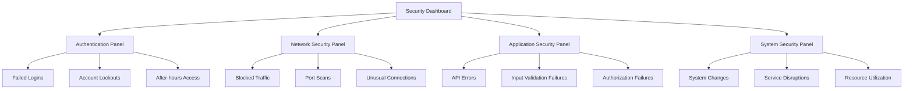

# Security Logging

## Introduction

Security logging is a critical practice in modern infrastructure monitoring that focuses on capturing, storing, and analyzing log data specifically for security purposes. When implemented with Grafana Loki, security logging becomes a powerful capability that allows organizations to detect threats, investigate incidents, and maintain compliance with security standards.

In this guide, we'll explore how to leverage Grafana Loki for security logging purposes, turning your logging system into a basic Security Information and Event Management (SIEM) solution. You'll learn how to collect security-relevant logs, create meaningful queries, and set up alerts for potential security incidents.

## Why Security Logging Matters

Before diving into implementation, let's understand why security logging is essential:

1. **Threat Detection**: Identifying unusual patterns or known attack signatures
2. **Incident Investigation**: Providing evidence and context during security incidents
3. **Compliance Requirements**: Meeting regulatory standards that require security monitoring
4. **Audit Trails**: Maintaining records of who did what and when
5. **Operational Security**: Understanding the security posture of your systems

## Setting Up Security Logging with Loki

### Step 1: Identifying Security-Relevant Log Sources

The first step is to identify which log sources contain security-relevant information:

| Log Source | Security Relevance |
|------------|-------------------|
| Authentication Logs | User logins, authentication failures, privilege escalations |
| Firewall Logs | Connection attempts, blocked traffic, network anomalies |
| Application Logs | Authorization failures, input validation errors, sensitive operations |
| System Logs | System changes, service starts/stops, kernel messages |
| API Gateway Logs | API access patterns, authorization failures, rate limiting |

### Step 2: Configuring Promtail for Security Log Collection

Let's configure Promtail to collect security-relevant logs and add appropriate labels:

```yaml
scrape_configs:
  - job_name: auth_logs
    static_configs:
      - targets:
          - localhost
        labels:
          job: auth_logs
          security_relevant: "true"
          log_type: "authentication"
    pipeline_stages:
      - regex:
          expression: '(?P<timestamp>\w+\s+\d+\s+\d+:\d+:\d+).*sshd\[\d+\]:\s+(?P<event_type>Failed|Accepted)\s+password\s+for\s+(?P<username>\w+).*from\s+(?P<src_ip>\d+\.\d+\.\d+\.\d+)'
      - labels:
          event_type:
          username:
          src_ip:
```

This configuration:
1. Collects authentication logs
2. Adds security-specific labels
3. Extracts important fields like event type, username, and source IP

### Step 3: Creating Security-Focused LogQL Queries

Once your security logs are flowing into Loki, you can create specialized LogQL queries to detect security events:

#### Failed Login Attempts

```
{job="auth_logs", event_type="Failed"} | json | count_over_time({src_ip="*"}[15m]) > 5
```

This query finds hosts with more than 5 failed login attempts within a 15-minute window.

#### Privilege Escalation

```
{job="auth_logs"} |= "sudo" | pattern `<_> sudo: <username> : TTY=<_> ; PWD=<_> ; USER=<target_user> ; COMMAND=<command>` | target_user="root"
```

This query identifies when users escalate to root privileges.

#### Web Application Attacks

```
{job="nginx_access"} |= "GET" | pattern `<_> <_> <_> [<_>] "<method> <path> <_>" <status> <_> <_> "<_>" "<user_agent>"` | status=~"4.." | pattern_path=~"/admin|/wp-login|/config"
```

This query detects attempts to access sensitive admin paths.

### Step 4: Building a Security Dashboard

Let's create a Grafana dashboard specifically for security monitoring:



### Step 5: Setting Up Security Alerts

Configure Grafana alerts to notify your team of potential security incidents:

```yaml
# Alert rule example for suspicious login activity
groups:
  - name: security_alerts
    rules:
      - alert: BruteForceAttempt
        expr: sum by(src_ip) (count_over_time({job="auth_logs", event_type="Failed"}[15m])) > 5
        for: 5m
        labels:
          severity: critical
          category: security
        annotations:
          summary: "Possible brute force attack detected"
          description: "Multiple failed login attempts from IP {{ $labels.src_ip }}"
```

## Real-World Security Logging Patterns

### Pattern 1: Segmented Security Logging

For organizations with strict compliance requirements, you might separate your security logs from operational logs:

```yaml
# Promtail configuration for segmented security logging
clients:
  - url: http://loki-operational:3100/loki/api/v1/push
    tenant_id: ops
    
  - url: http://loki-security:3100/loki/api/v1/push
    tenant_id: security
    
scrape_configs:
  - job_name: security_logs
    pipeline_stages:
      # Processing stages here
    relabel_configs:
      - source_labels: ['__path__']
        regex: '.*(auth|audit|sudo).*'
        action: keep
    static_configs:
      - targets:
          - localhost
        labels:
          tenant: security
```

### Pattern 2: Security Event Correlation

Correlating events across different systems can provide better security insights:

```
# Find successful logins after multiple failures
{job="auth_logs", event_type="Accepted"} | json | by_labels count_over_time({job="auth_logs", event_type="Failed", src_ip="$src_ip", username="$username"}[30m]) > 3
```

### Pattern 3: Threat Intelligence Integration

You can enhance security logging by matching against known threat indicators:

```
# Check logs against a list of malicious IPs
{job="firewall"} | json | src_ip=~"203.0.113.1|198.51.100.2|192.0.2.3"
```

## Implementing Log Retention for Compliance

Many security standards require specific log retention periods. Configure Loki's retention accordingly:

```yaml
# Loki configuration with security-focused retention
schema_config:
  configs:
    - from: 2020-07-01
      store: boltdb-shipper
      object_store: filesystem
      schema: v11
      index:
        prefix: index_
        period: 24h

compactor:
  working_directory: /loki/compactor
  shared_store: filesystem

limits_config:
  retention_period: 90d
  per_tenant_override_config: /etc/loki/retention.yaml

# In retention.yaml:
overrides:
  security:
    retention_period: 365d
```

## Best Practices for Security Logging

1. **Consistent Timestamp Format**: Use a unified time format (preferably UTC) across all systems
2. **Structured Logging**: Use JSON or another structured format for easier parsing
3. **Field Normalization**: Normalize fields like usernames, IPs, and event types across different log sources
4. **Sensitive Data Handling**: Be careful about logging sensitive information (PII, passwords, tokens)
5. **Log Integrity**: Ensure logs cannot be tampered with (consider write-once storage)
6. **Alert Tuning**: Regularly review and tune security alerts to reduce false positives

## Summary

Security logging with Grafana Loki provides a powerful way to monitor, detect, and investigate security events across your infrastructure. By properly configuring log collection, creating targeted LogQL queries, building security dashboards, and setting up appropriate alerts, you can significantly enhance your security posture.

Remember that security logging is not just a technical implementation but an ongoing process that requires regular tuning and attention. As threats evolve, so should your security logging practices.

## Additional Resources

- [Grafana Loki LogQL Documentation](https://grafana.com/docs/loki/latest/logql/)
- [OWASP Logging Cheat Sheet](https://cheatsheetseries.owasp.org/cheatsheets/Logging_Cheat_Sheet.html)
- [NIST Guide to Computer Security Log Management](https://nvlpubs.nist.gov/nistpubs/Legacy/SP/nistspecialpublication800-92.pdf)

## Exercises

1. Configure Promtail to collect SSH authentication logs from your system and add appropriate security labels.
2. Create a LogQL query to detect failed login attempts for a specific user.
3. Build a simple Grafana dashboard with panels showing key security metrics.
4. Set up an alert that triggers when suspicious activity is detected in your logs.
5. Implement a log retention policy that complies with your organization's security requirements.