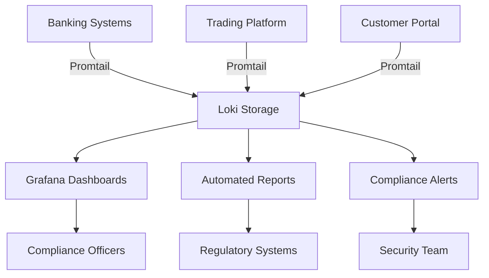

# Compliance Reporting

## Introduction

Compliance reporting is a critical use case for log management systems like Grafana Loki. Organizations need to maintain comprehensive audit trails for security, operational, and regulatory requirements. Loki's efficient log storage and powerful querying capabilities make it an excellent tool for implementing compliance reporting solutions.

In this guide, you'll learn how to configure Loki to collect, store, and analyze logs for compliance purposes. We'll cover setting up proper log retention policies, creating compliance dashboards, and implementing automated reporting workflows.

## Understanding Compliance Logging Requirements

Before diving into implementation, it's important to understand common compliance requirements for logging:

- **Data Retention**: Many regulations specify minimum periods for keeping logs (typically 1-7 years)
- **Tamper Prevention**: Ensuring logs cannot be modified after creation
- **Access Controls**: Restricting who can view sensitive log data
- **Audit Trails**: Tracking who accessed what data and when
- **Alert Mechanisms**: Notifications for suspicious or non-compliant activities

## Setting Up Loki for Compliance Logging

### Step 1: Configure Proper Retention Policies

Loki allows you to set retention periods for your logs, which is essential for compliance requirements.

```yaml
limits_config:
  retention_period: 8760h  # 1 year retention
  
compactor:
  working_directory: /loki/compactor
  shared_store: s3
  retention_enabled: true
  retention_delete_delay: 2h
  retention_delete_worker_count: 150
```

This configuration ensures logs are kept for at least one year before being eligible for deletion, meeting many common compliance requirements.

### Step 2: Enable Audit Logging for Loki Itself

For comprehensive compliance, it's important to audit the audit system itself:

```yaml
auth_enabled: true

server:
  http_listen_port: 3100
  
analytics:
  reporting_enabled: true
  
tracing:
  enabled: true
```

This configuration enables Loki's internal audit logging, providing visibility into who is accessing the system and what queries they're running.

## Implementing Compliance Use Cases

Let's explore some common compliance reporting use cases with Loki.

### Use Case 1: Security Compliance Monitoring

For security standards like PCI DSS, SOC 2, or ISO 27001, you need to track authentication attempts, user access, and privilege changes.

#### LogQL Queries for Security Compliance

```logql
{job="auth-service"} |= "authentication" | json | user_id != "" and status="failed" 
| count_over_time[24h] > 5
```

This query identifies users with multiple failed authentication attempts in a 24-hour period, which could indicate potential security breaches.

#### Creating a Security Compliance Dashboard

<div className="tip-box">
  <strong>Tip:</strong> Create dedicated dashboards for each compliance framework your organization follows.
</div>

Here's how to create a compliance dashboard in Grafana that connects to your Loki datasource:

1. In Grafana, create a new dashboard
2. Add a new panel and select Loki as the datasource
3. Use LogQL queries that track key security metrics:
   - Failed login attempts
   - Privilege escalation events
   - Access to sensitive data
   - System configuration changes

### Use Case 2: GDPR Data Access Reporting

For GDPR compliance, you need to track who accessed what personal data and when.

```logql
{app="user-service"} |= "data_access" 
| json 
| data_type=~"personal|financial|medical" 
| unwrap accessed_by_user
```

This query extracts all instances where personal, financial, or medical data was accessed, including who accessed it.

## Creating Automated Compliance Reports

For regular compliance reporting, you can set up automated workflows:

### Step 1: Set Up Scheduled Queries with Grafana Alerting

Configure Grafana alerts to run your compliance queries on a schedule:

```yaml
# Grafana Alert Configuration
name: Weekly-Compliance-Report
schedule: "0 9 * * 1"  # 9 AM every Monday
query:
  datasourceUid: loki
  model:
    expr: '{job="auth-service"} |= "failed" | json | count_over_time[7d]'
    instant: false
    range: true
    intervalMs: 86400000  # Daily intervals
for: 10m
```

### Step 2: Export Results to Compliance Systems

Use Grafana's HTTP notification channels to send reports to external compliance systems:

```yaml
# Notification Channel Configuration
name: ComplianceReportExport
type: webhook
settings:
  url: https://compliance-system.example.com/api/reports
  httpMethod: POST
  username: ${COMPLIANCE_API_USER}
  password: ${COMPLIANCE_API_PASSWORD}
```

## Advanced Compliance Patterns

### Pattern 1: Log Integrity Verification

To ensure log data hasn't been tampered with, implement checksums:

```logql
{app="security-service"} 
| json 
| line_format "{{.timestamp}} {{.message}} {{.user_id}}" 
| sha256 as checksum
| line_format "{{.checksum}}"
```

Store these checksums in a separate, secured system for later verification.

### Pattern 2: Dynamic Data Masking for PII

To comply with privacy regulations while still enabling analysis:

```logql
{app="user-transactions"} 
| regexp "creditcard=(?P<cc>[0-9]{16})" 
| line_format "{{replace .message .cc \"XXXX-XXXX-XXXX-\" (slice .cc 12 16)}}"
```

This masks credit card numbers while preserving the last 4 digits for identification.

## Real-World Example: Financial Services Compliance

Let's look at how a financial institution might set up Loki for compliance reporting:

<div className="example-box">
  <strong>Case Study: ABC Financial</strong>
  <p>
    ABC Financial needed to comply with SOX, PCI DSS, and AML regulations. They implemented Loki with the following pattern:
  </p>
  <ul>
    <li>Centralized logging from all systems into Loki</li>
    <li>7-year retention policy with immutable storage</li>
    <li>Automated daily compliance reports</li>
    <li>Real-time alerts for suspicious activities</li>
  </ul>
</div>

Their implementation architecture looks like this:



## Summary

In this guide, we've explored how to implement compliance reporting with Grafana Loki. We've learned:

- How to configure Loki for compliance requirements
- Creating effective LogQL queries for compliance monitoring
- Setting up automated compliance reporting workflows
- Implementing advanced patterns like log integrity verification and PII masking

Compliance reporting is not just about meeting regulatory requirements—it's about building trust with customers and partners by demonstrating your commitment to security and privacy.

## Additional Resources

- [Grafana Loki's Official Documentation on Retention](https://grafana.com/docs/loki/latest/operations/storage/retention/)
- [LogQL Query Language Reference](https://grafana.com/docs/loki/latest/logql/)
- [Grafana Alerting Documentation](https://grafana.com/docs/grafana/latest/alerting/)

## Exercises

1. Set up a basic Loki instance with a 30-day retention policy
2. Create LogQL queries to track failed login attempts
3. Design a simple compliance dashboard in Grafana
4. Implement a scheduled export of access logs for weekly review
5. Create a data masking pattern for a log type of your choice