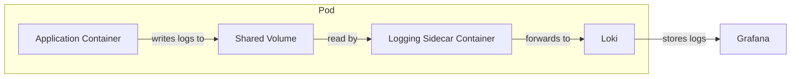
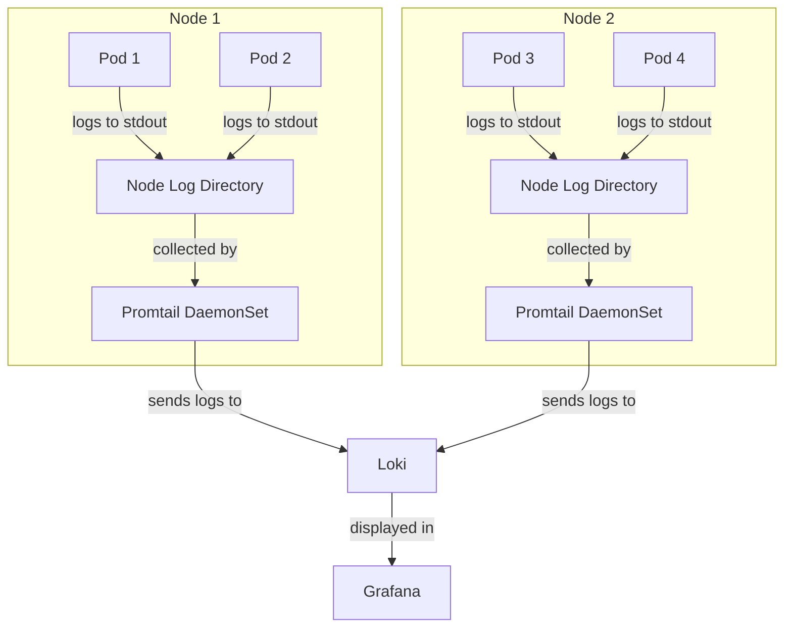
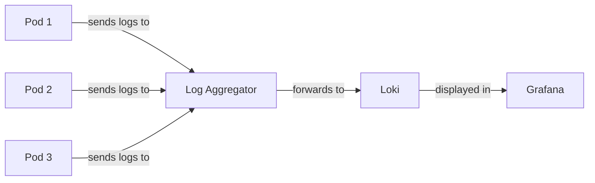
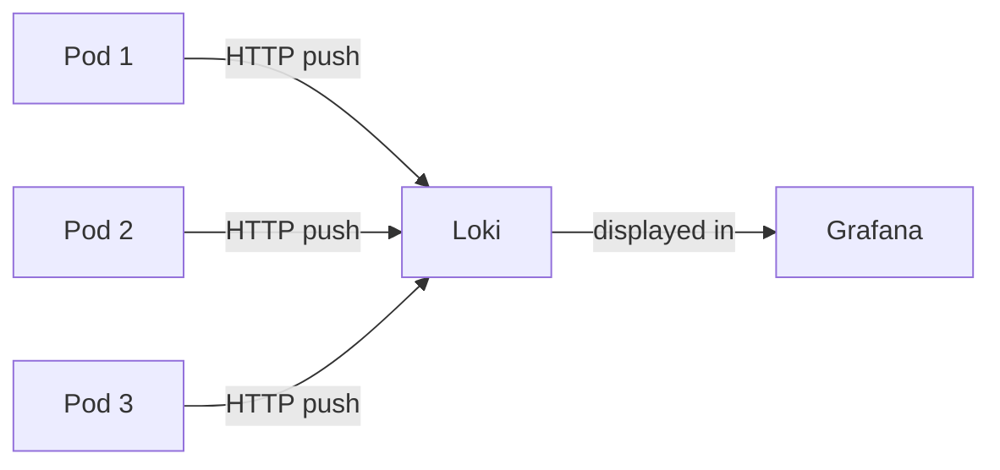

# Kubernetes Logging Patterns

## Introduction

In modern cloud-native environments, effective logging is critical for troubleshooting, monitoring, and understanding application behavior. Kubernetes, with its distributed nature, presents unique challenges and opportunities for logging. This guide explores common logging patterns when using Grafana Loki with Kubernetes, helping you implement effective observability strategies for your applications.

Logging in Kubernetes differs from traditional environments because:
- Applications run in ephemeral containers that can start, stop, or be rescheduled at any time
- Multiple instances of the same application can run simultaneously
- Applications are distributed across multiple nodes
- Kubernetes components generate their own logs

Grafana Loki, a horizontally scalable, highly available log aggregation system, is perfectly suited for Kubernetes environments due to its label-based approach that complements Kubernetes' label-oriented architecture.

## Common Kubernetes Logging Patterns

### 1. Sidecar Pattern

The sidecar pattern involves running a logging container alongside your application container in the same pod. This container's sole responsibility is to collect, process, and forward logs from the application container.



#### Implementing the Sidecar Pattern

Here's an example Kubernetes manifest for implementing the sidecar pattern:

```yaml
apiVersion: v1
kind: Pod
metadata:
  name: app-with-logging-sidecar
spec:
  containers:
  - name: app-container
    image: my-application:latest
    volumeMounts:
    - name: log-volume
      mountPath: /var/log/app
  
  - name: logging-sidecar
    image: grafana/promtail:latest
    args:
    - -config.file=/etc/promtail/promtail-config.yaml
    volumeMounts:
    - name: log-volume
      mountPath: /var/log/app
      readOnly: true
    - name: promtail-config
      mountPath: /etc/promtail
  
  volumes:
  - name: log-volume
    emptyDir: {}
  - name: promtail-config
    configMap:
      name: promtail-config
```

The corresponding Promtail configuration:

```yaml
server:
  http_listen_port: 9080

positions:
  filename: /tmp/positions.yaml

clients:
  - url: http://loki:3100/loki/api/v1/push

scrape_configs:
  - job_name: kubernetes-pods
    static_configs:
      - targets:
          - localhost
        labels:
          job: app-logs
          app: my-application
          __path__: /var/log/app/*.log
```

**Advantages:**
- Fine-grained control over log processing
- Can preprocess or transform logs before sending to Loki
- Works even for applications that only log to files

**Disadvantages:**
- Increased resource usage per pod
- Additional configuration complexity
- Requires coordination between application and sidecar

### 2. Node-level Agent Pattern

In this pattern, a logging agent runs on each Kubernetes node, collecting logs from all containers on that node.



#### Implementing the Node-level Agent Pattern

Deploy Promtail as a DaemonSet that runs on each node:

```yaml
apiVersion: apps/v1
kind: DaemonSet
metadata:
  name: promtail
  namespace: logging
spec:
  selector:
    matchLabels:
      app: promtail
  template:
    metadata:
      labels:
        app: promtail
    spec:
      serviceAccount: promtail
      containers:
      - name: promtail
        image: grafana/promtail:latest
        args:
        - -config.file=/etc/promtail/promtail-config.yaml
        volumeMounts:
        - name: promtail-config
          mountPath: /etc/promtail
        - name: docker-logs
          mountPath: /var/lib/docker/containers
          readOnly: true
        - name: pods-logs
          mountPath: /var/log/pods
          readOnly: true
      volumes:
      - name: promtail-config
        configMap:
          name: promtail-config
      - name: docker-logs
        hostPath:
          path: /var/lib/docker/containers
      - name: pods-logs
        hostPath:
          path: /var/log/pods
```

Promtail configuration for Kubernetes:

```yaml
server:
  http_listen_port: 3101

positions:
  filename: /tmp/positions.yaml

clients:
  - url: http://loki:3100/loki/api/v1/push

scrape_configs:
  - job_name: kubernetes-pods
    kubernetes_sd_configs:
      - role: pod
    pipeline_stages:
      - docker: {}
      - cri: {}
    relabel_configs:
      - source_labels:
          - __meta_kubernetes_pod_label_app
        target_label: app
      - source_labels:
          - __meta_kubernetes_pod_container_name
        target_label: container
      - source_labels:
          - __meta_kubernetes_pod_node_name
        target_label: node
```

**Advantages:**
- Lower overhead (one agent per node instead of per pod)
- Simplified deployment and maintenance
- Automatic collection of logs from all pods on a node
- Collection of node-level logs

**Disadvantages:**
- Less isolation between workloads
- May require privileged containers
- Less flexibility for per-application configuration

### 3. Log Aggregator Pattern

In this pattern, applications send logs to a centralized log aggregation service or broker within the cluster.



#### Implementing the Log Aggregator Pattern

First, deploy a log aggregator like Fluentd or Vector:

```yaml
apiVersion: apps/v1
kind: Deployment
metadata:
  name: fluentd-aggregator
  namespace: logging
spec:
  replicas: 2
  selector:
    matchLabels:
      app: fluentd-aggregator
  template:
    metadata:
      labels:
        app: fluentd-aggregator
    spec:
      containers:
      - name: fluentd
        image: fluentd:latest
        ports:
        - containerPort: 24224
        volumeMounts:
        - name: fluentd-config
          mountPath: /fluentd/etc
      volumes:
      - name: fluentd-config
        configMap:
          name: fluentd-aggregator-config
---
apiVersion: v1
kind: Service
metadata:
  name: fluentd-aggregator
  namespace: logging
spec:
  selector:
    app: fluentd-aggregator
  ports:
  - port: 24224
    protocol: TCP
    targetPort: 24224
```

Configure applications to log to the aggregator:

```yaml
apiVersion: apps/v1
kind: Deployment
metadata:
  name: sample-app
spec:
  replicas: 3
  selector:
    matchLabels:
      app: sample-app
  template:
    metadata:
      labels:
        app: sample-app
    spec:
      containers:
      - name: app
        image: my-app:latest
        env:
        - name: LOG_OUTPUT
          value: fluentd://fluentd-aggregator:24224
```

**Advantages:**
- Centralized log configuration management
- Advanced preprocessing capabilities
- Can buffer logs during outages
- Enables more complex routing logic

**Disadvantages:**
- Another component to maintain
- Potential single point of failure
- Additional network traffic within the cluster

### 4. Direct Logging to Loki

Applications can also be configured to log directly to Loki using its HTTP API.



#### Implementing Direct Logging

This pattern often requires modifications to your application or the use of a logging library that supports Loki. Here's a simple example in Go:

```go
package main

import (
    "os"
    "time"

    "github.com/grafana/loki-client-go/loki"
    "github.com/sirupsen/logrus"
)

func main() {
    lokiConfig := loki.Config{
        URL: "http://loki:3100/loki/api/v1/push",
        Labels: map[string]string{
            "app": "my-application",
            "environment": "production",
        },
    }
    
    client, err := loki.NewClient(lokiConfig)
    if err != nil {
        panic(err)
    }
    
    log := logrus.New()
    log.SetFormatter(&logrus.JSONFormatter{})
    log.AddHook(loki.NewHook(client))
    
    // Your application code
    log.Info("Application started successfully")
    // ...
}
```

**Advantages:**
- No additional components required
- Simplest architecture
- Direct control over labels and log content

**Disadvantages:**
- Requires application code changes
- No buffering if Loki is temporarily unavailable
- Potential performance impact on the application

## Best Practices for Kubernetes Logging with Loki

### 1. Structure Your Logs

Use structured logging (JSON format) whenever possible:

```javascript
// Instead of this:
console.log('User authenticated with ID 12345');

// Do this:
console.log(JSON.stringify({
  message: 'User authenticated',
  userId: 12345,
  level: 'info',
  timestamp: new Date().toISOString()
}));
```

### 2. Use Labels Effectively

- Include essential Kubernetes metadata:
  - Namespace
  - Pod name
  - Container name
  - Node name
  - Deployment/StatefulSet name
- Add application-specific labels:
  - Service name
  - Version
  - Environment

### 3. Log Level Management

Configure appropriate log levels for different environments:

```yaml
env:
- name: LOG_LEVEL
  valueFrom:
    configMapKeyRef:
      name: app-config
      key: log-level
```

### 4. Implement Log Rotation

For file-based logging, implement log rotation to prevent disk space issues:

```yaml
volumeMounts:
- name: log-volume
  mountPath: /var/log/app
volumes:
- name: log-volume
  emptyDir:
    sizeLimit: 500Mi
```

### 5. Use LogQL for Effective Querying

Examples of powerful LogQL queries:

```
# Find all error logs for a specific application
{app="payment-service"} |= "error"

# Count errors by type
sum by (error_type) (count_over_time({app="payment-service"} | json | error_type != "" [5m]))

# Calculate 90th percentile response times
quantile_over_time(0.9, 
  {app="api-gateway"} 
  | json 
  | duration > 0 
  | unwrap duration [5m])
```

## Implementing Logging Patterns: A Practical Example

Let's build a complete example combining the node-level agent pattern with structured logging.

### Step 1: Deploy Promtail as a DaemonSet

```yaml
# promtail-daemonset.yaml
apiVersion: apps/v1
kind: DaemonSet
metadata:
  name: promtail
  namespace: logging
spec:
  selector:
    matchLabels:
      app: promtail
  template:
    metadata:
      labels:
        app: promtail
    spec:
      serviceAccount: promtail
      containers:
      - name: promtail
        image: grafana/promtail:2.7.4
        args:
        - -config.file=/etc/promtail/promtail-config.yaml
        volumeMounts:
        - name: promtail-config
          mountPath: /etc/promtail
        - name: docker-logs
          mountPath: /var/lib/docker/containers
          readOnly: true
        - name: pods-logs
          mountPath: /var/log/pods
          readOnly: true
      volumes:
      - name: promtail-config
        configMap:
          name: promtail-config
      - name: docker-logs
        hostPath:
          path: /var/lib/docker/containers
      - name: pods-logs
        hostPath:
          path: /var/log/pods
```

### Step 2: Configure Promtail with JSON Parsing

```yaml
# promtail-config.yaml
apiVersion: v1
kind: ConfigMap
metadata:
  name: promtail-config
  namespace: logging
data:
  promtail-config.yaml: |
    server:
      http_listen_port: 3101

    positions:
      filename: /tmp/positions.yaml

    clients:
      - url: http://loki.logging.svc.cluster.local:3100/loki/api/v1/push

    scrape_configs:
      - job_name: kubernetes-pods
        kubernetes_sd_configs:
          - role: pod
        pipeline_stages:
          - docker: {}
          - json:
              expressions:
                level: level
                message: message
                user: user
                traceId: traceId
          - labels:
              level:
              user:
              traceId:
        relabel_configs:
          - source_labels:
              - __meta_kubernetes_pod_label_app
            target_label: app
          - source_labels:
              - __meta_kubernetes_pod_container_name
            target_label: container
          - source_labels:
              - __meta_kubernetes_namespace
            target_label: namespace
          - source_labels:
              - __meta_kubernetes_pod_name
            target_label: pod
```

### Step 3: Sample Application with Structured Logging

```yaml
# sample-app.yaml
apiVersion: apps/v1
kind: Deployment
metadata:
  name: sample-app
  namespace: default
spec:
  replicas: 2
  selector:
    matchLabels:
      app: sample-app
  template:
    metadata:
      labels:
        app: sample-app
    spec:
      containers:
      - name: app
        image: sample-app:latest
        ports:
        - containerPort: 8080
        env:
        - name: LOG_FORMAT
          value: "json"
        - name: LOG_LEVEL
          value: "info"
```

### Step 4: Sample Application Code (Node.js)

```javascript
// app.js
const express = require('express');
const winston = require('winston');
const { v4: uuidv4 } = require('uuid');

// Configure structured logging
const logger = winston.createLogger({
  level: process.env.LOG_LEVEL || 'info',
  format: winston.format.json(),
  defaultMeta: { service: 'sample-app' },
  transports: [
    new winston.transports.Console()
  ]
});

const app = express();
const port = 8080;

// Request logging middleware
app.use((req, res, next) => {
  const traceId = uuidv4();
  req.traceId = traceId;
  
  // Log the request
  logger.info({
    message: `Received ${req.method} request to ${req.path}`,
    method: req.method,
    path: req.path,
    traceId: traceId,
    remoteAddr: req.ip
  });
  
  // Track response time
  const start = Date.now();
  res.on('finish', () => {
    const duration = Date.now() - start;
    logger.info({
      message: `Completed ${req.method} request to ${req.path}`,
      method: req.method,
      path: req.path,
      statusCode: res.statusCode,
      duration: duration,
      traceId: traceId
    });
  });
  
  next();
});

app.get('/', (req, res) => {
  logger.info({
    message: 'Processing root endpoint request',
    traceId: req.traceId
  });
  res.send('Hello, Loki!');
});

app.get('/error', (req, res) => {
  logger.error({
    message: 'Something went wrong',
    error: 'Simulated error',
    traceId: req.traceId
  });
  res.status(500).send('Error occurred');
});

app.listen(port, () => {
  logger.info({
    message: `Sample application started on port ${port}`,
    port: port
  });
});
```

### Step 5: Query the Logs in Grafana

Once everything is set up, you can use Grafana to query your logs:

1. Basic query to see all logs from the sample app:
   ```
   {app="sample-app"}
   ```

2. Filter to see only error logs:
   ```
   {app="sample-app", level="error"}
   ```

3. Track a specific request using trace ID:
   ```
   {app="sample-app"} |= "5f4dcc3b-5abd-4a9c-bcdd-1234567890ab"
   ```

4. Analyze response times:
   ```
   {app="sample-app"} 
   | json 
   | duration > 0 
   | line_format "{{.duration}}ms - {{.method}} {{.path}} ({{.statusCode}})"
   ```

## Summary

Kubernetes logging patterns with Grafana Loki provide powerful approaches to solve the challenges of collecting, storing, and analyzing logs in distributed systems. We've explored four key patterns:

1. **Sidecar Pattern**: Offers per-pod control and customization
2. **Node-level Agent Pattern**: Provides efficiency and simplicity
3. **Log Aggregator Pattern**: Enables centralized control and preprocessing
4. **Direct Logging**: Simplifies architecture for Loki-aware applications

The best pattern for your environment depends on your specific requirements, application design, and operational constraints. Often, a combination of patterns works best for complex environments with diverse workloads.

By implementing structured logging, effective labeling, and appropriate log levels, you'll build a logging system that not only helps with troubleshooting but provides valuable insights into your application's behavior and performance.

## Additional Resources

- [Grafana Loki Documentation](https://grafana.com/docs/loki/latest/)
- [Kubernetes Logging Architecture](https://kubernetes.io/docs/concepts/cluster-administration/logging/)
- [LogQL Query Language Reference](https://grafana.com/docs/loki/latest/logql/)
- [Promtail Configuration](https://grafana.com/docs/loki/latest/clients/promtail/configuration/)

## Exercises

1. **Basic Setup Exercise**:
   - Deploy Loki and Promtail in your Kubernetes cluster
   - Configure Promtail to collect logs from a sample application
   - Verify logs are being collected in Grafana

2. **Pattern Comparison Exercise**:
   - Implement both the sidecar and node-level agent patterns
   - Compare resource usage and log delivery reliability
   - Document which pattern works better for your workloads

3. **Advanced LogQL Exercise**:
   - Create a LogQL query that calculates error rates over time
   - Build a dashboard that shows top error types by frequency
   - Set up alerts for unusual log patterns

4. **Log Pipeline Exercise**:
   - Modify the Promtail configuration to extract custom fields from your logs
   - Create derived fields that link logs to traces
   - Build a visualization that correlates log events with application metrics