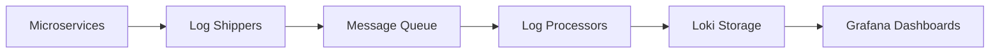

# Microservices Logging

## Introduction

In a microservices architecture, applications are composed of multiple small, independently deployable services that communicate over a network. While this approach offers many benefits like scalability and development agility, it introduces significant challenges for monitoring and troubleshooting. When a request flows through multiple services, tracking what happened across the entire system becomes complex.

This is where effective logging for microservices becomes crucial. In this guide, we'll explore how to implement a robust logging strategy for microservices using Grafana Loki, a horizontally-scalable, highly-available log aggregation system.

## The Challenges of Microservices Logging

Before diving into solutions, let's understand the unique challenges of logging in a microservices environment:

1. **Distributed Tracing**: Requests often span multiple services, making it difficult to follow a transaction end-to-end.
2. **Volume of Logs**: With many services generating logs independently, the volume can be overwhelming.
3. **Inconsistent Formats**: Different services might use different logging formats, complicating analysis.
4. **Correlation**: Connecting related log entries across services is essential but challenging.
5. **Infrastructure Complexity**: Microservices often run in containers or ephemeral environments.

## Structured Logging Basics

The foundation of effective microservices logging is structured logging. Unlike traditional plain text logs, structured logs are formatted as data objects (typically JSON) with consistent fields.

For example, instead of:

```
[2023-10-15 08:12:45] User service: User john.doe logged in successfully
```

A structured log would look like:

```json
{
  "timestamp": "2023-10-15T08:12:45Z",
  "level": "INFO",
  "service": "user-service",
  "message": "User logged in successfully",
  "user_id": "john.doe",
  "request_id": "cf58dfa3-8f35-4c3e-aa97-8ff958a1f1e3"
}
```

### Benefits of Structured Logging

- **Machine Parsable**: Easy to query and filter with tools like Loki
- **Consistent Format**: All services use the same structure
- **Rich Context**: Additional metadata beyond just text
- **Correlation Support**: Fields like `request_id` facilitate tracing

## Implementing Structured Logging with Loki

Let's look at how to implement structured logging across microservices with Grafana Loki.

### Step 1: Choose a Logging Library

Most programming languages have libraries that support structured logging. Here are examples in popular languages:

**Node.js with Winston:**

```javascript
const winston = require('winston');

const logger = winston.createLogger({
  level: 'info',
  format: winston.format.json(),
  defaultMeta: { service: 'payment-service' },
  transports: [
    new winston.transports.Console()
  ],
});

// Usage example
logger.info('Payment processed', {
  amount: 99.99,
  currency: 'USD',
  customer_id: 'cust_123',
  request_id: req.headers['x-request-id']
});
```

**Python with structlog:**

```python
import structlog
import logging

# Configure structlog
structlog.configure(
    processors=[
        structlog.processors.TimeStamper(fmt="iso"),
        structlog.processors.JSONRenderer()
    ],
    context_class=dict,
    logger_factory=structlog.PrintLoggerFactory(),
)

# Create logger with service name
log = structlog.get_logger(service="inventory-service")

# Usage example
def check_inventory(product_id, request_id):
    log.info("Checking inventory", 
             product_id=product_id, 
             request_id=request_id,
             available=True,
             quantity=42)
```

**Java with Logback and Logstash JSON encoder:**

```java
import org.slf4j.Logger;
import org.slf4j.LoggerFactory;
import org.slf4j.MDC;

public class OrderService {
    private static final Logger logger = LoggerFactory.getLogger(OrderService.class);
    
    public void createOrder(String orderId, String customerId, String requestId) {
        // Add context to Mapped Diagnostic Context
        MDC.put("service", "order-service");
        MDC.put("request_id", requestId);
        
        try {
            logger.info("Order created successfully");
            // Logic for creating order
        } finally {
            MDC.clear(); // Clean up
        }
    }
}
```

### Step 2: Define Common Log Fields

To ensure consistency across services, define a standard set of fields that every log entry should include:

1. **timestamp**: When the event occurred
2. **service**: Which microservice generated the log
3. **level**: Severity (INFO, WARN, ERROR, etc.)
4. **message**: Human-readable description
5. **request_id/trace_id**: Unique identifier for tracing requests
6. **span_id** (optional): For more detailed distributed tracing
7. **Additional context**: Relevant to the specific event

### Step 3: Set Up Loki Collection

Configure your application containers to send logs to Loki. A common approach is using Promtail, Loki's log collector agent.

Here's a basic Docker Compose setup:

```yaml
version: '3'
services:
  app-service:
    image: your-microservice:latest
    logging:
      driver: "json-file"
      options:
        max-size: "10m"
        max-file: "3"
    # Other service config...
  
  promtail:
    image: grafana/promtail:latest
    volumes:
      - /var/lib/docker/containers:/var/lib/docker/containers:ro
      - ./promtail-config.yml:/etc/promtail/config.yml
    command: -config.file=/etc/promtail/config.yml
    # Other config...
    
  loki:
    image: grafana/loki:latest
    ports:
      - "3100:3100"
    # Other config...
```

A simple Promtail configuration:

```yaml
server:
  http_listen_port: 9080

positions:
  filename: /tmp/positions.yaml

clients:
  - url: http://loki:3100/loki/api/v1/push

scrape_configs:
  - job_name: docker
    docker_sd_configs:
      - host: unix:///var/run/docker.sock
        refresh_interval: 5s
    relabel_configs:
      - source_labels: ['__meta_docker_container_name']
        target_label: 'container'
      - source_labels: ['__meta_docker_container_log_stream']
        target_label: 'logstream'
    pipeline_stages:
      - json:
          expressions:
            level: level
            service: service
            request_id: request_id
            message: message
      - labels:
          level:
          service:
          request_id:
```

### Step 4: Generate Request IDs for Tracing

To trace requests across services, implement a consistent approach for propagating request IDs:

1. **Generate a unique ID**: When a request first enters your system
2. **Pass it between services**: Include it in API calls, message queues, etc.
3. **Include it in every log entry**: Add it as a field in structured logs

Here's how this might work in Express.js with a middleware:

```javascript
const { v4: uuidv4 } = require('uuid');
const express = require('express');
const app = express();

// Request ID middleware
app.use((req, res, next) => {
  // Use existing request ID from header or generate new one
  req.requestId = req.headers['x-request-id'] || uuidv4();
  
  // Set for downstream services
  res.setHeader('x-request-id', req.requestId);
  
  next();
});

// Add to logger context
app.use((req, res, next) => {
  req.logger = logger.child({ request_id: req.requestId });
  next();
});

// Example route
app.get('/api/products', (req, res) => {
  req.logger.info('Fetching products', { limit: req.query.limit });
  // ...
});
```

## Querying Microservices Logs in Loki

Once your logs are flowing into Loki, you can perform powerful queries to troubleshoot issues.

### Basic Queries

Filter logs from a specific service:

```
{service="payment-service"}
```

Find all errors:

```
{level="ERROR"}
```

### Trace a Request

The real power comes in tracing requests across services:

```
{request_id="cf58dfa3-8f35-4c3e-aa97-8ff958a1f1e3"} | json
```

This returns all logs from all services with this request ID, in chronological order.

### Analyze Response Times

Extract and analyze numeric values using Loki:

```
sum by (service) (
  rate({app="my-app"} | json | response_time > 0 [5m])
)
```

## Advanced Patterns

### Pattern 1: Centralized vs. Decentralized Logging

**Centralized Approach**:
- All services send logs to a single Loki instance
- Pros: Simplified management, unified view
- Cons: Single point of failure, potential bottleneck

**Decentralized Approach**:
- Multiple Loki instances, potentially one per service or team
- Pros: Isolated, scales well for very large deployments
- Cons: More complex, harder to correlate across boundaries

For most organizations, starting with centralized logging and moving to a hybrid approach as you scale is recommended.

### Pattern 2: Log Aggregation Pipeline

A robust log processing pipeline might include:



This allows for buffering during spikes and preprocessing logs before storage.

### Pattern 3: Contextual Logging

Enhance your logs with additional context that helps debugging:

1. **User context**: Include user ID or session information
2. **Business context**: Order IDs, cart value, etc.
3. **Technical context**: Host info, deployment version
4. **Performance metrics**: Response times, queue sizes

Example of enriched logging in a Node.js service:

```javascript
function logWithContext(req, level, message, additional = {}) {
  const logData = {
    // Request context
    request_id: req.requestId,
    path: req.path,
    method: req.method,
    
    // User context
    user_id: req.user?.id,
    
    // Business context
    tenant_id: req.headers['x-tenant-id'],
    
    // Technical context
    service: 'order-service',
    version: process.env.SERVICE_VERSION,
    
    // Additional fields
    ...additional
  };
  
  logger[level](message, logData);
}

// Usage
app.post('/api/orders', (req, res) => {
  logWithContext(req, 'info', 'Creating new order', {
    order_items: req.body.items.length,
    total_amount: req.body.total
  });
  // Process order...
});
```

## Best Practices

1. **Use structured logging consistently**: Ensure all services follow the same format.
2. **Log at the appropriate level**: Not too much, not too little.
3. **Include request IDs for all logs**: Essential for distributed tracing.
4. **Separate application logs from infrastructure logs**: Different retention and querying needs.
5. **Consider log sampling for high-volume events**: Log every Nth occurrence for very frequent events.
6. **Set up alerts on critical log patterns**: Proactively detect issues.
7. **Define clear logging policies**: What to log, what not to log, retention periods.
8. **Avoid logging sensitive information**: PII, credentials, etc.

## Implementing Log Rotation and Retention in Loki

Loki allows configuring retention policies to manage log growth:

```yaml
limits_config:
  retention_period: 30d  # Keep logs for 30 days

schema_config:
  configs:
    - from: 2020-07-01
      store: boltdb-shipper
      object_store: filesystem
      schema: v11
      index:
        prefix: index_
        period: 24h
```

## Summary

Effective microservices logging with Grafana Loki requires:

1. **Structured logging** for consistent, queryable logs
2. **Request IDs** for tracing transactions across services
3. **Standardized log fields** for easier querying
4. **Proper collection infrastructure** to aggregate logs centrally
5. **Retention policies** to manage log volume

By implementing these patterns, you'll gain visibility into your microservices architecture, making debugging and monitoring significantly easier.

## Exercises

1. Set up structured logging in a sample microservice using your preferred language.
2. Implement request ID propagation between two microservices.
3. Configure Promtail to collect logs from your containers.
4. Create a Grafana dashboard that shows error rates across all services.
5. Write a LogQL query that finds the slowest API endpoints based on response times.

## Additional Resources

- [Grafana Loki Documentation](https://grafana.com/docs/loki/latest/)
- [LogQL Query Language Reference](https://grafana.com/docs/loki/latest/logql/)
- [Distributed Tracing with Tempo](https://grafana.com/docs/tempo/latest/)
- [Microservices Observability Patterns](https://microservices.io/patterns/observability/)