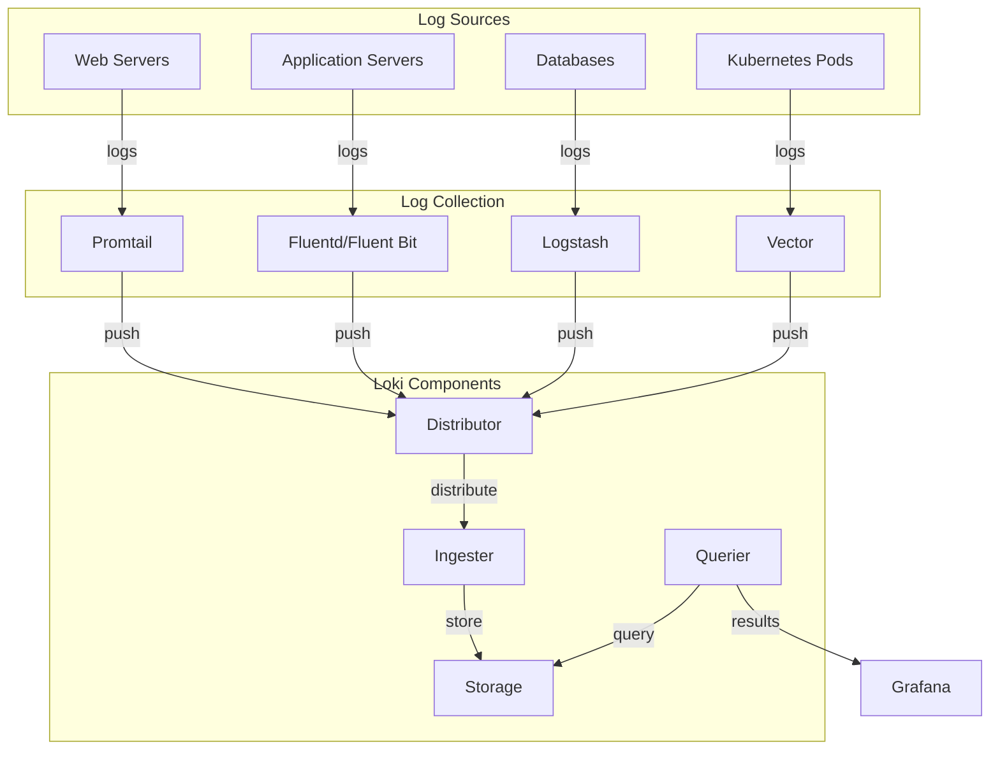

# Centralized Logging Architecture

## Introduction

In modern distributed systems, applications and services generate vast amounts of logs across multiple servers, containers, and microservices. Managing these logs individually becomes increasingly challenging as your infrastructure grows. A centralized logging architecture solves this problem by collecting, storing, and making logs accessible from a single location.

Grafana Loki provides an efficient and cost-effective approach to centralized logging that's particularly well-suited for cloud-native environments. In this guide, we'll explore the fundamentals of designing a centralized logging architecture with Loki, from basic concepts to implementation details.

## Understanding Centralized Logging

### What is Centralized Logging?

Centralized logging is an architectural pattern where logs from multiple sources are:

1. **Collected** from distributed systems
2. **Aggregated** into a central repository
3. **Indexed** for efficient searching
4. **Visualized** through dashboards and queries

### Why Centralized Logging Matters

Consider a typical microservice architecture with dozens of services running across multiple environments:

- Without centralized logging, debugging requires connecting to individual servers
- Correlating events across services becomes nearly impossible
- Retention policies must be managed individually
- Access controls are difficult to enforce consistently

A centralized approach addresses these challenges by providing a unified view of your entire system's logs.

## Loki-Based Centralized Logging Architecture

Grafana Loki offers a unique approach to centralized logging that's designed to be cost-effective and efficient. Let's explore a typical Loki-based architecture:



### Key Components

1. **Log Sources**: Any system generating logs
2. **Log Collection**: Agents that collect, parse, and forward logs
3. **Loki Components**: Process, index, and store logs
4. **Grafana**: Visualization and query interface

## Building a Centralized Logging Pipeline

Let's walk through creating a centralized logging pipeline with Loki, step by step.

### Step 1: Deploy Loki

Loki can be deployed in various configurations depending on your scale needs. For beginners, the single binary mode is simplest:

```yaml
# loki-config.yaml
auth_enabled: false

server:
  http_listen_port: 3100

ingester:
  lifecycler:
    ring:
      kvstore:
        store: inmemory
      replication_factor: 1
    final_sleep: 0s
  chunk_idle_period: 5m
  chunk_retain_period: 30s

schema_config:
  configs:
    - from: 2020-05-15
      store: boltdb-shipper
      object_store: filesystem
      schema: v11
      index:
        prefix: index_
        period: 24h

storage_config:
  boltdb_shipper:
    active_index_directory: /loki/boltdb-shipper-active
    cache_location: /loki/boltdb-shipper-cache
    cache_ttl: 24h
    shared_store: filesystem
  filesystem:
    directory: /loki/chunks

limits_config:
  enforce_metric_name: false
  reject_old_samples: true
  reject_old_samples_max_age: 168h

compactor:
  working_directory: /loki/compactor
  shared_store: filesystem
```

To run Loki with Docker:

```bash
docker run -d --name loki -v $(pwd):/mnt/config -p 3100:3100 grafana/loki:latest -config.file=/mnt/config/loki-config.yaml
```

### Step 2: Configure Log Collection with Promtail

Promtail is Loki's dedicated log collector. Here's a basic configuration:

```yaml
# promtail-config.yaml
server:
  http_listen_port: 9080
  grpc_listen_port: 0

positions:
  filename: /tmp/positions.yaml

clients:
  - url: http://loki:3100/loki/api/v1/push

scrape_configs:
  - job_name: system
    static_configs:
      - targets:
          - localhost
        labels:
          job: varlogs
          __path__: /var/log/*log
  
  - job_name: application
    static_configs:
      - targets:
          - localhost
        labels:
          job: application
          app: myapp
          __path__: /var/log/myapp/*.log
```

Run Promtail with Docker:

```bash
docker run -d --name promtail -v $(pwd):/mnt/config -v /var/log:/var/log grafana/promtail:latest -config.file=/mnt/config/promtail-config.yaml
```

### Step 3: Connect Grafana to Loki

Add Loki as a data source in Grafana:

1. Navigate to Configuration > Data Sources
2. Click "Add data source"
3. Select "Loki" from the list
4. Enter the URL (e.g., `http://loki:3100`)
5. Click "Save & Test"

### Step 4: Create Basic Queries

Now you can query your logs in Grafana's Explore view:

```
{job="application", app="myapp"} |= "ERROR"
```

This query filters logs from the application job that contain the word "ERROR".

## Advanced Configurations

As your system grows, you'll need to scale your logging architecture. Let's look at more advanced configurations.

### High-Availability Setup

For production deployments, consider a microservices-based approach:

```yaml
# Production Loki configuration (excerpt)
ingester:
  chunk_idle_period: 30m
  chunk_retain_period: 5m
  lifecycler:
    ring:
      kvstore:
        store: consul
        prefix: loki/ring
      replication_factor: 3

storage_config:
  aws:
    s3: s3://region/bucket
    dynamodb:
      dynamodb_url: dynamodb://region
```

### Structured Logging with JSON

Configure Promtail to parse JSON logs:

```yaml
scrape_configs:
  - job_name: app_json_logs
    static_configs:
      - targets:
          - localhost
        labels:
          job: app
          __path__: /var/log/app/*.log
    pipeline_stages:
      - json:
          expressions:
            level: level
            user: user
            message: message
      - labels:
          level:
          user:
```

Then query using extracted fields:

```
{job="app"} | user="john" | level="error"
```

### Log Processing Pipeline

Promtail supports sophisticated log processing:

```yaml
pipeline_stages:
  - regex:
      expression: '(?P<ip>\S+) - (?P<user>\S+) \[(?P<timestamp>\S+) \S+\] "(?P<method>\S+) (?P<path>\S+) (?P<protocol>\S+)" (?P<status>\d+) (?P<size>\d+)'
  - labels:
      method:
      status:
      path:
  - timestamp:
      source: timestamp
      format: RFC3339
  - output:
      source: message
```

## Real-World Examples

### Monitoring Kubernetes Applications

This example shows how to set up centralized logging for Kubernetes applications:

```yaml
# promtail-k8s-config.yaml (excerpt)
scrape_configs:
  - job_name: kubernetes-pods
    kubernetes_sd_configs:
    - role: pod
    relabel_configs:
    - source_labels:
      - __meta_kubernetes_pod_annotation_prometheus_io_scrape
      action: keep
      regex: true
    - source_labels:
      - __meta_kubernetes_pod_container_name
      target_label: container_name
    - source_labels:
      - __meta_kubernetes_pod_label_app
      target_label: app
    - source_labels:
      - __meta_kubernetes_namespace
      target_label: namespace
```

Deploy with Helm:

```bash
helm repo add grafana https://grafana.github.io/helm-charts
helm install promtail grafana/promtail --set "loki.serviceName=loki"
```

### Troubleshooting Production Issues

Here's how you might troubleshoot a production issue using centralized logging:

1. Start with a service-level query:
   ```
   {app="payment-service"} |= "transaction failed"
   ```

2. Add context by correlating with other services:
   ```
   {app=~"payment-service|order-service"} |= "order-123456"
   ```

3. Create a temporary dashboard with key metrics:
   ```
   sum(rate({app="payment-service"} |= "transaction failed"[5m])) by (status_code)
   ```

## Best Practices

1. **Use Labels Efficiently**
   - Labels are indexed and affect query performance
   - Keep cardinality under control (avoid labels with unlimited values)
   - Use no more than 10-15 labels per stream

2. **Optimize Storage**
   - Configure appropriate retention periods
   - Use chunk_target_size to balance storage efficiency
   - Consider compression options

3. **Query Performance**
   - Filter by labels first, then content
   - Use time range restrictions
   - Avoid using regex searches on high-volume logs

4. **Security Considerations**
   - Implement authentication and authorization
   - Encrypt data in transit and at rest
   - Consider log redaction for sensitive information

## Summary

A centralized logging architecture with Grafana Loki offers significant benefits:

- **Simplified Troubleshooting**: Quickly identify and resolve issues across distributed systems
- **Improved Collaboration**: Shared access to logs for developers and operations teams
- **Enhanced Security**: Consistent audit trails and access controls
- **Cost Efficiency**: Loki's index-based approach reduces storage costs
- **Scalability**: Grows with your infrastructure needs

By following the practices outlined in this guide, you can implement an effective centralized logging solution that enhances your observability capabilities while keeping costs under control.

## Further Learning

### Exercises

1. Set up a basic Loki stack using Docker Compose
2. Configure structured logging for a sample application
3. Create a Grafana dashboard with key logging metrics
4. Implement a multi-tenant Loki deployment

### Additional Resources

- Grafana Loki Documentation
- LogQL Query Language Reference
- Observability Best Practices Guide
- Loki Performance Tuning Guide