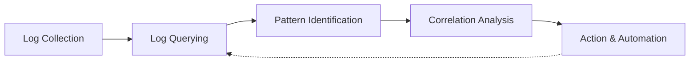
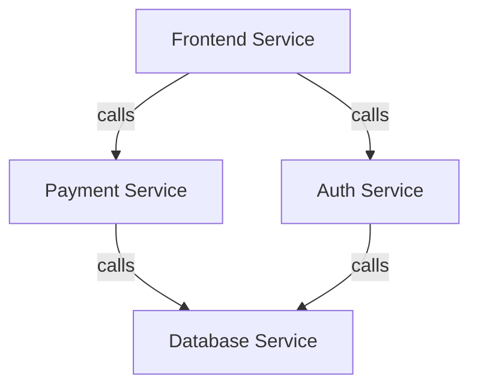

# Log Analysis Workflows

## Introduction

Log analysis is a critical aspect of modern infrastructure management and application troubleshooting. As systems grow in complexity, the ability to efficiently analyze logs becomes increasingly important. Grafana Loki, a horizontally-scalable, highly-available log aggregation system, provides powerful tools for collecting, storing, and analyzing logs from various sources.

In this guide, we'll explore common log analysis workflows with Grafana Loki that will help you troubleshoot issues, monitor system health, and extract valuable insights from your logs. Whether you're investigating an incident, tracking down a bug, or setting up monitoring for your applications, these workflows will provide a structured approach to log analysis.

## Understanding Log Analysis Workflows

A log analysis workflow is a systematic process for collecting, processing, querying, and visualizing log data to extract meaningful information. Effective workflows typically follow these general phases:



Let's explore each of these phases and how to implement them using Grafana Loki.

## 1. Log Collection Workflow

Before you can analyze logs, you need to collect them efficiently. Loki works with various log collection agents.

### Setting Up Promtail

Promtail is the recommended agent for collecting logs and sending them to Loki:

```yaml
scrape_configs:
  - job_name: system
    static_configs:
    - targets:
        - localhost
      labels:
        job: varlogs
        __path__: /var/log/*log
```

This configuration tells Promtail to:
1. Collect logs from `/var/log/*log`
2. Label them with `job=varlogs`
3. Send them to Loki

### Structuring Log Labels

Effective log analysis starts with proper labeling. Labels in Loki are crucial for filtering and organizing logs:

```yaml
- job_name: app_logs
  static_configs:
  - targets:
      - localhost
    labels:
      job: app
      environment: production
      service: payment-processor
      component: api
      __path__: /var/log/app/*.log
```

**Best Practices for Labeling:**
- Use labels for high-cardinality dimensions (service, component, environment)
- Keep label values consistent across your infrastructure
- Avoid putting high-cardinality data in labels (user IDs, request IDs)

## 2. Log Querying Workflow

Once logs are collected, you need effective querying strategies to find relevant information.

### Using LogQL for Basic Querying

Loki uses LogQL, a query language specifically designed for logs:

```logql
{app="payment-service", environment="production"} |= "error"
```

This query:
1. Selects logs from the payment-service in production
2. Filters for entries containing the word "error"

### Filtering and Pattern Matching

To narrow down your search to specific patterns:

```logql
{app="payment-service"} |= "payment failed" 
  | json | status_code >= 400
```

This query:
1. Looks for logs containing "payment failed"
2. Parses JSON fields in the log
3. Filters for status codes greater than or equal to 400

### Visualizing Log Metrics

Convert logs to metrics for visualization:

```logql
sum by(status_code)(
  count_over_time(
    {app="payment-service"} | json | status_code != "" [5m]
  )
)
```

This query:
1. Counts log entries per status code over 5-minute windows
2. Sums the counts by status code
3. Creates a time series suitable for graphing in Grafana

## 3. Pattern Identification Workflow

Identifying patterns in logs helps spot trends and anomalies.

### Finding Error Patterns

To identify the most common errors:

```logql
{app="web-server"} |= "ERROR" 
  | pattern `<_> ERROR <message>` 
  | count by (message) 
  | sort
```

This query:
1. Extracts error messages using pattern parsing
2. Counts occurrences of each message
3. Sorts the results

### Rate Analysis

To detect unusual error rates:

```logql
rate(
  {app="web-server"} |= "ERROR" [5m]
)
```

This query calculates the rate of errors per second over 5-minute windows.

### Creating a Pattern Identification Dashboard

Here's how to set up a dashboard for pattern identification:

1. Create a new dashboard in Grafana
2. Add a Time Series panel for error rates
3. Add a Table panel for error distributions
4. Add a Logs panel for direct log viewing

## 4. Correlation Analysis Workflow

Correlating logs across services helps understand complex issues.

### Tracing Request Flows

Use trace IDs to follow requests across services:

```logql
{env="production"} |= "trace_id=abc123"
```

This query finds all log entries containing a specific trace ID across all services.

### Time-Based Correlation

To find related events within a time window:

1. Identify a problematic timestamp
2. Query across multiple services within that time range:

```logql
{env="production"} 
  | json 
  | status_code >= 500 
  | (timestamp >= "2023-06-01T10:15:00Z" and timestamp <= "2023-06-01T10:20:00Z")
```

### Service Dependency Analysis

To understand service dependencies during failures:



Create queries for each service and visualize them on a timeline to spot cascading failures.

## 5. Action & Automation Workflow

Automating responses to log patterns improves system reliability.

### Creating Alerts

Set up alerts for critical patterns:

```yaml
groups:
  - name: loki_alerts
    rules:
      - alert: HighErrorRate
        expr: sum(rate({app="payment-service"} |= "ERROR" [5m])) > 0.1
        for: 5m
        labels:
          severity: critical
        annotations:
          summary: High error rate in payment service
          description: Payment service is experiencing errors at a rate of {{ $value }} per second
```

### Automated Remediation

Connect alerts to automation tools:

1. Grafana alerts trigger webhook notifications
2. Webhooks invoke automation scripts or tools
3. Actions are taken based on specific error patterns

### Alert Investigation Dashboard

Create dedicated dashboards for alert investigation:

1. Include contextual service metrics
2. Add log panels filtered for relevant time periods
3. Include related service dependencies

## Real-World Example: Troubleshooting a Production Issue

Let's walk through a real-world example of using these workflows to troubleshoot an issue.

### Scenario: Payment Processing Failures

**Step 1: Initial Alert**

You receive an alert about increased error rates in the payment service.

**Step 2: Identify Error Patterns**

```logql
{app="payment-service"} |= "ERROR" [30m]
  | pattern `<_> ERROR <message>`
  | count by (message)
  | sort
```

This reveals multiple "Connection timeout" errors when connecting to the database.

**Step 3: Correlation Analysis**

Check database logs at the same time:

```logql
{app="database-service"} [30m]
  | json
  | connection_count > 100
```

This shows an unusually high number of connections.

**Step 4: Root Cause Analysis**

Looking at the application logs more closely:

```logql
{app="payment-service"} |= "connection" [30m]
  | json
  | line_format "{{.message}} - {{.connection_id}}"
```

You discover that connections aren't being properly closed after transactions.

**Step 5: Resolution**

After fixing the connection leak:

```logql
rate({app="payment-service"} |= "ERROR" [5m])
```

The error rate returns to normal levels.

## Setting Up Your Own Log Analysis Workflow

Let's create a practical workflow you can implement today:

### 1. Create a Log Analysis Dashboard

Set up a Grafana dashboard with these panels:

1. **Error Rate Overview**
   ```logql
   sum by (app)(rate({environment="production"} |= "ERROR" [5m]))
   ```

2. **Top Errors by Service**
   ```logql
   topk(10, sum by (app, error_type)(count_over_time({environment="production"} |= "ERROR" | json | error_type != "" [1h])))
   ```

3. **Log Browser**
   A logs panel with predefined filters for quick investigation

### 2. Implement Regular Log Reviews

Schedule weekly reviews of:
- Unusual error patterns
- Performance degradation trends
- Security-related log entries

### 3. Document Common Patterns

Create a "pattern library" documenting:
- Known error signatures
- Resolution steps for common issues
- Queries for investigating specific problems

## Summary

Effective log analysis workflows with Grafana Loki follow a structured approach:

1. **Collection** - Gather logs with proper labeling
2. **Querying** - Use LogQL to find relevant information
3. **Pattern Identification** - Spot trends and anomalies
4. **Correlation Analysis** - Connect related events across services
5. **Action & Automation** - Respond to issues systematically

By implementing these workflows, you'll be able to:
- Troubleshoot issues more efficiently
- Identify problems before they impact users
- Build a data-driven approach to system reliability

## Additional Resources

- **Practice Exercises:**
  1. Set up Promtail to collect logs from a sample application
  2. Create a dashboard to monitor application errors
  3. Implement an alert for unusual log patterns

- **Further Reading:**
  - Grafana Loki documentation
  - LogQL query language reference
  - Effective logging practices for modern applications