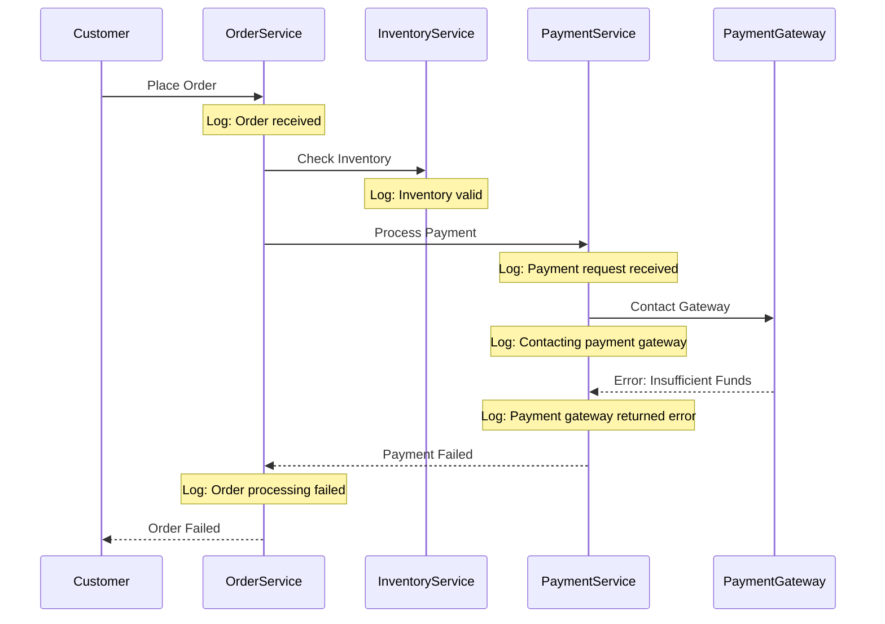

# Event Correlation

## Introduction

Event correlation is a powerful technique in log management that helps you establish relationships between different log entries across multiple sources. In distributed systems, a single user action or system event often generates logs across various services, making it challenging to follow the sequence of events. Grafana Loki provides capabilities to correlate these distributed events, which is crucial for efficient troubleshooting, root cause analysis, and understanding system behavior.

In this guide, we'll explore how to effectively correlate events in Grafana Loki, using trace IDs, session IDs, and other correlation techniques to connect the dots between related log entries.

## Why Event Correlation Matters

Before diving into the techniques, let's understand why event correlation is essential:

- **End-to-End Visibility**: Track requests as they flow through your microservices architecture
- **Faster Troubleshooting**: Quickly identify which component in your stack is causing issues
- **Root Cause Analysis**: Understand the chain of events that led to a failure
- **User Experience Monitoring**: Follow a user's journey across different system components

## Correlation Techniques in Loki

### Using Trace IDs

Trace IDs are unique identifiers assigned to a request as it travels through your system. They're a fundamental aspect of distributed tracing and can be utilized in Loki for correlating logs.

#### Example: Finding logs related to a specific trace

```logql
{app="frontend"} |= "trace_id=abc123" or {app="backend"} |= "trace_id=abc123" or {app="database"} |= "trace_id=abc123"
```

This query fetches all logs containing the trace ID "abc123" across frontend, backend, and database applications.

### Using LogQL with Labels

Loki's LogQL allows you to create correlations using labels:

```logql
{app="payment-service"} 
| json 
| transaction_id="tx_12345" 
```

In this example, we're parsing JSON logs and filtering for a specific transaction ID.

### Correlation with `by` and `without` Operators

For more advanced correlation, you can use the `by` and `without` operators:

```logql
sum by (request_id) (rate({app=~"frontend|backend|database"}[5m]))
```

This query groups log entries by `request_id` across all three applications and calculates the rate over 5 minutes.

## Implementing Correlation in Your Applications

To effectively use event correlation, your applications need to include correlation identifiers in their logs. Here's how to implement this:

### 1. Generate and Propagate Correlation IDs

```python
# Python example using Flask
import uuid
from flask import Flask, request, g

app = Flask(__name__)

@app.before_request
def before_request():
    # Generate or get trace ID from incoming request
    trace_id = request.headers.get('X-Trace-ID', str(uuid.uuid4()))
    g.trace_id = trace_id
    
@app.after_request
def after_request(response):
    # Add trace ID to response headers
    response.headers['X-Trace-ID'] = g.trace_id
    return response
```

### 2. Include Correlation IDs in Logs

```java
// Java example using Log4j
import org.apache.logging.log4j.LogManager;
import org.apache.logging.log4j.Logger;
import org.apache.logging.log4j.ThreadContext;

public class OrderService {
    private static final Logger logger = LogManager.getLogger(OrderService.class);
    
    public void processOrder(String orderId, String traceId) {
        // Set the trace ID in the logging context
        ThreadContext.put("traceId", traceId);
        
        logger.info("Starting order processing for order ID: {}", orderId);
        
        try {
            // Process order
            logger.info("Order processed successfully");
        } catch (Exception e) {
            logger.error("Error processing order", e);
        } finally {
            // Clear the context
            ThreadContext.remove("traceId");
        }
    }
}
```

## Real-World Example: Troubleshooting a Failed Transaction

Let's walk through a practical example of using event correlation to troubleshoot a failed payment transaction in an e-commerce application.

### Scenario

A customer reports a failed purchase. You have the order ID (`order-12345`) but need to understand what went wrong.

### Step 1: Find the Order Logs

```logql
{app="order-service"} |= "order-12345" | json | line_format "{{.timestamp}} {{.level}} {{.message}} (Trace: {{.trace_id}})"
```

Output:
```
2023-04-10T14:23:45Z INFO Order received for processing (Trace: t-7890abc)
2023-04-10T14:23:46Z INFO Validating inventory (Trace: t-7890abc)
2023-04-10T14:23:47Z INFO Initiating payment processing (Trace: t-7890abc)
2023-04-10T14:23:50Z ERROR Order processing failed: payment declined (Trace: t-7890abc)
```

### Step 2: Use the Trace ID to Find Related Payment Service Logs

```logql
{app="payment-service"} |= "t-7890abc" | json
```

Output:
```json
{"timestamp":"2023-04-10T14:23:47Z","level":"INFO","message":"Payment request received","trace_id":"t-7890abc","amount":129.99,"payment_method":"credit_card"}
{"timestamp":"2023-04-10T14:23:48Z","level":"INFO","message":"Contacting payment gateway","trace_id":"t-7890abc","gateway":"stripe"}
{"timestamp":"2023-04-10T14:23:49Z","level":"ERROR","message":"Payment gateway returned error","trace_id":"t-7890abc","error_code":"insufficient_funds"}
{"timestamp":"2023-04-10T14:23:50Z","level":"ERROR","message":"Payment processing failed","trace_id":"t-7890abc","reason":"insufficient_funds"}
```

### Step 3: Visualize the Correlated Events in Grafana

You can create a timeline view in Grafana to visualize the sequence of events:



By correlating logs across services using the trace ID, we quickly identified that the payment failed due to insufficient funds, without having to manually search through logs from multiple services.

## Advanced Correlation with Derived Fields

Loki allows you to set up derived fields in the data source configuration to automatically extract trace IDs and link them to traces in Tempo or other tracing systems.

1. Go to Configuration > Data Sources > Loki
2. In the Derived Fields section, add a new field:
   - Name: `traceID`
   - Regex: `trace_id=(\w+)`
   - URL: `${__value.raw}`

Now, whenever Loki displays a log line containing a trace ID, it will be clickable, taking you directly to the related trace in your tracing system.

## Correlation Across Different Data Sources

Grafana enables correlation not just within Loki but across different data sources:

### Logs-to-Metrics Correlation

Find metric spikes and then correlate them with related logs:

```logql
sum(rate({app="api-server"} | unwrap bytes_processed[5m])) by (instance)
```

Then, when you see a spike in the graph, you can click on that time point and select "View logs" to see logs from the same time period.

### Logs-to-Traces Correlation

As mentioned earlier, using derived fields allows you to connect log entries directly to traces. This creates a seamless troubleshooting experience where you can:

1. Identify a problem in a log
2. Click the trace ID to view the full distributed trace
3. See the exact path of the request and where time was spent

## Best Practices for Event Correlation

1. **Consistent Correlation IDs**: Ensure all services use and propagate the same correlation ID format
2. **Structured Logging**: Use JSON or another structured format to make parsing easier
3. **Context Enrichment**: Include relevant context (user ID, request path, etc.) in logs
4. **Standardized Timestamps**: Use consistent time formats across all services
5. **Label Carefully**: Design your Loki labels to facilitate effective correlation
6. **Sampling Strategy**: For high-volume systems, implement intelligent sampling to capture complete traces for important events

## Summary

Event correlation in Grafana Loki is a powerful technique that helps you understand the relationships between log entries across distributed systems. By implementing proper correlation IDs, using LogQL effectively, and leveraging Grafana's visualization capabilities, you can dramatically improve your ability to troubleshoot issues and understand system behavior.

The key takeaways from this guide:

- Use trace IDs or other correlation identifiers consistently across your services
- Structure your logs in a way that makes correlation easier
- Leverage LogQL's filtering and aggregation capabilities
- Set up derived fields to link logs to traces
- Visualize correlated events to understand the sequence and relationships

## Exercises

1. Set up a basic application with three services that pass a correlation ID between them, and configure Loki to ingest these logs.
2. Write a LogQL query that finds all logs related to a specific user session across multiple services.
3. Create a Grafana dashboard that shows correlated events from different services on a timeline.
4. Implement a derived field in your Loki data source to make trace IDs clickable.
5. Simulate a failure scenario and practice using correlation techniques to identify the root cause.

## Additional Resources

- [Grafana Loki Documentation](https://grafana.com/docs/loki/latest/)
- [LogQL Query Language Reference](https://grafana.com/docs/loki/latest/logql/)
- [Distributed Tracing with Tempo](https://grafana.com/docs/tempo/latest/)
- [Grafana Explore Documentation](https://grafana.com/docs/grafana/latest/explore/)