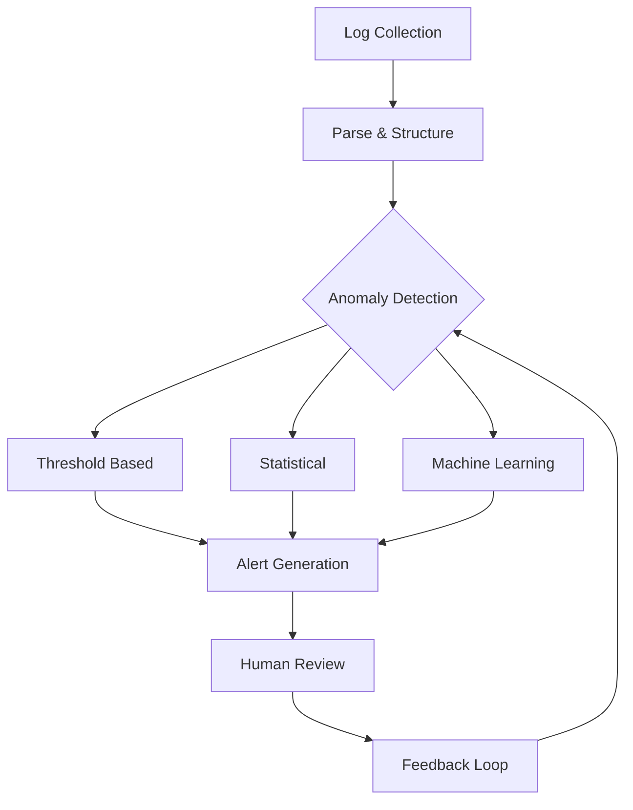

# Anomaly Detection

## Introduction

Anomaly detection is a critical technique in monitoring and observability that helps identify unusual patterns or behaviors in your log data. In the context of Grafana Loki, anomaly detection allows you to spot potential issues, security threats, or performance problems before they become critical failures.

This guide will walk you through how to implement various anomaly detection patterns using Grafana Loki's LogQL language, helping you build robust monitoring solutions that can automatically identify when something unusual happens in your systems.

## What is an Anomaly?

An anomaly (or outlier) in log data is an observation that deviates significantly from the expected behavior. Anomalies can be:

- **Point anomalies**: Single instances of unusual behavior (e.g., a sudden spike in error logs)
- **Contextual anomalies**: Instances unusual in a specific context (e.g., high CPU usage during low-traffic hours)
- **Collective anomalies**: Collections of related unusual events (e.g., a pattern of failed login attempts)

## Implementing Basic Anomaly Detection in Loki

### 1. Threshold-Based Anomaly Detection

The simplest form of anomaly detection is threshold-based, where you define static thresholds for normal behavior.

```logql
sum(rate({app="payment-service"} |= "error" [5m])) > 10
```

This query alerts when the error rate exceeds 10 errors per second over a 5-minute window.

Let's create a complete example dashboard panel:

```logql
# Query to detect when error rate crosses threshold
sum by (app) (
  rate({app=~".*service"} |= "error" [5m])
) > 0.2
```

This would trigger when any service's error rate exceeds 0.2 errors per second.

### 2. Statistical Anomaly Detection

More sophisticated anomaly detection uses statistical methods to dynamically determine "normal" behavior.

```logql
# Calculate the average and standard deviation of response times
avg by (app) (
  {app="web-app"} 
  | pattern `<_> response_time=<duration:float> <_>` 
  | unwrap duration
) > bool
avg by (app) (
  {app="web-app"} 
  | pattern `<_> response_time=<duration:float> <_>` 
  | unwrap duration
) + 3 * stddev by (app) (
  {app="web-app"} 
  | pattern `<_> response_time=<duration:float> <_>` 
  | unwrap duration
)
```

This example detects response times that exceed the mean plus three standard deviations (covering 99.7% of normal observations in a normal distribution).

## Advanced Anomaly Detection Patterns

### Sudden Change Detection

Detect when a metric suddenly changes by a large amount:

```logql
abs(
  sum(rate({app="auth-service"} |= "login" [5m])) 
  / 
  sum(rate({app="auth-service"} |= "login" [5m] offset 5m)) 
  - 1
) > 0.5
```

This alerts when the login rate changes by more than 50% compared to the previous 5-minute window.

### Anomalous Pattern Detection

Some anomalies aren't about volume but about unusual patterns:

```logql
{app="database"} 
| pattern `<_> query_time=<duration:float>ms <_>` 
| duration > 500
| count_over_time[5m] > 10
```

This identifies when more than 10 slow database queries (over 500ms) occur within 5 minutes.

## Real-World Example: Detecting Security Threats

Let's build a comprehensive example for detecting potential security breaches through failed login attempts:

```logql
# First, extract login attempts and their status
{app="auth-service"} 
| pattern `<_> user=<user> login <status> from IP <ip> <_>`
| status="failed"
# Count failed logins by IP
| count_over_time[10m] by (ip)
# Alert when failed attempts exceed threshold
> 5
```

This query:
1. Extracts failed login attempts from auth-service logs
2. Counts how many failures occur from each IP address within a 10-minute window
3. Flags IPs with more than 5 failed attempts

In a real application, you might enhance this to:
- Compare against historical patterns (e.g., typical failed login rates)  
- Add context (time of day, location, etc.)
- Correlate with other security signals

## Implementing a Complete Anomaly Detection System

A robust anomaly detection system typically combines multiple approaches:



### Components:

1. **Data Collection**: Gather logs from all relevant sources
2. **Parsing & Structuring**: Extract relevant fields for analysis
3. **Multiple Detection Methods**: Apply various techniques
4. **Alert Generation**: Notify when anomalies are detected
5. **Human Review**: Validate and classify alerts
6. **Feedback Loop**: Improve detection over time

## Practical Implementation in Grafana Loki

Let's walk through creating a complete anomaly detection dashboard:

1. **Set up log collection** from your applications to Loki
2. **Create a dashboard** with multiple panels:
   - Raw log volume panel
   - Error rate panel
   - Anomaly detection panel using the techniques above
3. **Add an alert** based on the anomaly detection query

Example Grafana alert configuration:

```yaml
name: Unusual Error Rate
data:
  - expr: |
      abs(
        sum(rate({app="production"} |= "error" [5m])) 
        / 
        sum(rate({app="production"} |= "error" [1h] offset 5m)) 
        - 1
      ) > 0.3
    for: 10m
message: Detected unusual error rate
labels:
  severity: warning
annotations:
  description: Error rate has changed by more than 30% compared to the previous hour
```

## Performance Considerations

Anomaly detection queries can be resource-intensive. Consider these tips:

1. **Limit the data scope** - Use labels to filter logs before processing
2. **Optimize time ranges** - Use appropriate time windows
3. **Pre-process when possible** - Consider using metrics instead of log queries for high-volume data
4. **Use recording rules** for complex, frequently used queries

## Summary

Anomaly detection in Grafana Loki enables you to:
- Identify unusual patterns in your log data automatically
- Detect potential issues before they become critical
- Establish baselines for normal behavior
- Create alerts for deviations from expected patterns

By implementing the patterns described in this guide, you can build a robust monitoring system that not only tracks your applications but also intelligently identifies when something unusual happens.

## Further Learning

To deepen your understanding of anomaly detection with Grafana Loki:

1. Experiment with different threshold values for your specific applications
2. Combine multiple detection techniques for more robust results
3. Correlate anomalies across different services to identify system-wide issues
4. Explore advanced statistical techniques like moving averages and seasonality adjustments

## Exercise

Create an anomaly detection query for your application that:
1. Identifies when HTTP 500 errors exceed three standard deviations above the normal rate
2. Alerts only when this condition persists for at least 5 minutes
3. Groups results by service name and endpoint

This exercise will help you apply the concepts from this guide to your specific monitoring needs.