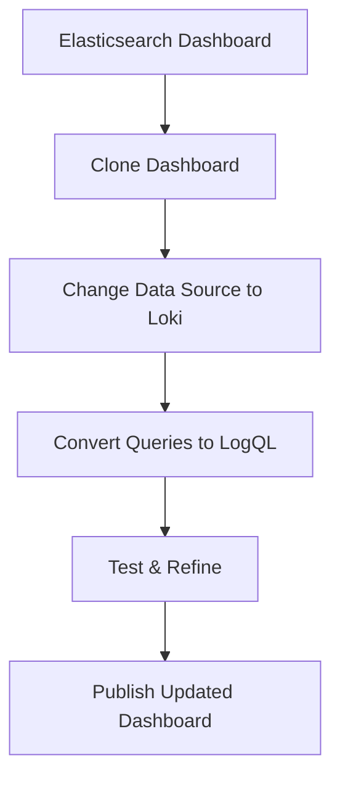
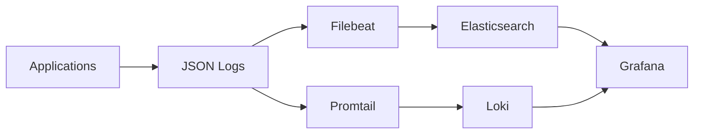

# Migrating from Elasticsearch

## Introduction

Migrating from Elasticsearch to Grafana Loki represents a significant shift in how you manage and analyze your logs. While Elasticsearch has been the go-to solution for log management for many years, Grafana Loki offers a more cost-effective and resource-efficient alternative, especially designed to work seamlessly with Grafana's visualization capabilities.

This guide will walk you through the process of migrating your logging infrastructure from Elasticsearch to Grafana Loki, covering key differences between the two systems, planning your migration, implementing the transition, and optimizing your new Loki setup.

## Understanding the Key Differences

Before diving into the migration process, it's important to understand the fundamental differences between Elasticsearch and Loki:

| Feature | Elasticsearch | Grafana Loki |
|---------|---------------|--------------|
| Indexing | Full-text indexing of logs | Indexes only metadata (labels) |
| Storage | Stores full log text in indices | Uses object storage for log data |
| Querying | Uses Elasticsearch Query DSL | Uses LogQL (similar to PromQL) |
| Resource Usage | Higher resource requirements | Lower resource footprint |
| Cost | Generally more expensive | Cost-effective, especially at scale |
| Integration | Works with ELK stack | Native integration with Grafana |

The most significant difference is in the indexing approach. Elasticsearch indexes the entire content of your logs, which provides powerful search capabilities but consumes substantial resources. Loki, on the other hand, only indexes metadata labels and stores the log content separately, making it more efficient but with some limitations on full-text search capabilities.

## Planning Your Migration

### Step 1: Assess Your Current Elasticsearch Setup

Begin by documenting your current Elasticsearch implementation:

```bash
# Get Elasticsearch cluster info
curl -X GET "localhost:9200/_cluster/health?pretty"

# List all indices
curl -X GET "localhost:9200/_cat/indices?v"

# Check index mapping for a specific index
curl -X GET "localhost:9200/your-log-index/_mapping?pretty"
```

### Step 2: Define Your Labeling Strategy for Loki

In Loki, effective labeling is crucial since you'll be querying based on these labels rather than doing full-text searches. Consider which fields in your Elasticsearch indices should become labels in Loki.

A good labeling strategy follows these principles:

- Include high-cardinality information in the log content, not in labels
- Use labels for dimensions you regularly filter on
- Keep the number of unique label combinations under control

For example, if you're logging application data, consider labels like:

```
{app="payment-service", environment="production", server="us-west-1"}
```

### Step 3: Set Up a Parallel Environment

It's advisable to run Loki alongside Elasticsearch during the transition period. This allows you to:

- Verify that all logs are correctly ingested into Loki
- Compare query results between systems
- Train your team on the new query language
- Gradually migrate dashboards and alerts

## Implementing the Migration

### Setting Up Grafana Loki

First, you'll need to install and configure Loki. Here's a simple Docker Compose example to get started:

```yaml
version: "3"
services:
  loki:
    image: grafana/loki:latest
    ports:
      - "3100:3100"
    volumes:
      - ./loki-config.yaml:/etc/loki/local-config.yaml
    command: -config.file=/etc/loki/local-config.yaml

  grafana:
    image: grafana/grafana:latest
    ports:
      - "3000:3000"
    depends_on:
      - loki
```

And a basic configuration file (`loki-config.yaml`):

```yaml
auth_enabled: false

server:
  http_listen_port: 3100

ingester:
  lifecycler:
    address: 127.0.0.1
    ring:
      kvstore:
        store: inmemory
      replication_factor: 1
    final_sleep: 0s
  chunk_idle_period: 5m
  chunk_retain_period: 30s

schema_config:
  configs:
    - from: 2020-10-24
      store: boltdb-shipper
      object_store: filesystem
      schema: v11
      index:
        prefix: index_
        period: 24h

storage_config:
  boltdb_shipper:
    active_index_directory: /tmp/loki/boltdb-shipper-active
    cache_location: /tmp/loki/boltdb-shipper-cache
    cache_ttl: 24h
    shared_store: filesystem
  filesystem:
    directory: /tmp/loki/chunks

limits_config:
  enforce_metric_name: false
  reject_old_samples: true
  reject_old_samples_max_age: 168h

chunk_store_config:
  max_look_back_period: 0s

table_manager:
  retention_deletes_enabled: false
  retention_period: 0s
```

### Configuring Log Collection

#### Using Promtail

Promtail is the official agent for collecting logs and sending them to Loki. Here's a basic configuration:

```yaml
server:
  http_listen_port: 9080
  grpc_listen_port: 0

positions:
  filename: /tmp/positions.yaml

clients:
  - url: http://loki:3100/loki/api/v1/push

scrape_configs:
  - job_name: system
    static_configs:
      - targets:
          - localhost
        labels:
          job: varlogs
          __path__: /var/log/*log
```

#### Migrating from Filebeat to Promtail

If you're using Filebeat with Elasticsearch, you'll need to switch to Promtail for Loki. The configuration mapping generally looks like:

| Filebeat Concept | Promtail Equivalent |
|------------------|---------------------|
| Input | scrape_config |
| Processor | pipeline_stages |
| Output | client |

For example, a Filebeat configuration like:

```yaml
filebeat.inputs:
- type: log
  enabled: true
  paths:
    - /var/log/nginx/access.log
  fields:
    app: nginx
    environment: production

processors:
- add_host_metadata: ~
- add_cloud_metadata: ~

output.elasticsearch:
  hosts: ["elasticsearch:9200"]
```

Would translate to a Promtail configuration like:

```yaml
scrape_configs:
  - job_name: nginx
    static_configs:
      - targets:
          - localhost
        labels:
          app: nginx
          environment: production
          __path__: /var/log/nginx/access.log
    
    pipeline_stages:
      - json:
          expressions:
            timestamp: time
            level: level
            message: msg
      - timestamp:
          source: timestamp
          format: RFC3339
      - labels:
          level:
```

### Converting Queries

One of the most significant changes when migrating from Elasticsearch to Loki is the query language. Here's a comparison of common queries:

#### Search For Text
**Elasticsearch:**
```
GET /logs/_search
{
  "query": {
    "match": {
      "message": "error"
    }
  }
}
```

**Loki:**
```
{app="myapp"} |= "error"
```

#### Filter By Field
**Elasticsearch:**
```
GET /logs/_search
{
  "query": {
    "bool": {
      "must": [
        { "match": { "service": "api" } },
        { "match": { "level": "error" } }
      ]
    }
  }
}
```

**Loki:**
```
{service="api", level="error"}
```

#### Time Range Query
**Elasticsearch:**
```
GET /logs/_search
{
  "query": {
    "range": {
      "@timestamp": {
        "gte": "2023-01-01T00:00:00Z",
        "lt": "2023-01-02T00:00:00Z"
      }
    }
  }
}
```

**Loki:**
```
{app="myapp"} | from="2023-01-01T00:00:00Z" to="2023-01-02T00:00:00Z"
```

### Migrating Dashboards

When migrating dashboards from Elasticsearch to Loki, you'll need to update your data sources and queries. In Grafana:

1. Add Loki as a data source
2. Clone your Elasticsearch dashboards
3. Edit panels to use Loki data source
4. Update queries using LogQL syntax
5. Test and adjust visualizations as needed

Here's a visualization of this flow:



## Optimization and Best Practices

### Label Optimization

To ensure efficient operation of your Loki system:

- Keep the number of unique label value combinations under 10,000
- Avoid using high-cardinality fields as labels (e.g., user IDs, request IDs)
- Use dynamic labels sparingly

### Query Optimization

LogQL queries can be optimized by:

- Using label filters first to narrow down the data set
- Using line filters (`|=`, `!=`, `|~`, `!~`) next to further refine
- Applying parser expressions last to extract and process values

For example, start with:
```
{app="payment", environment="production"}
```

Then add text filtering:
```
{app="payment", environment="production"} |= "error" != "timeout"
```

Finally, extract specific values:
```
{app="payment", environment="production"} |= "error" != "timeout" | json | response_time > 1000
```

### Retention and Storage Strategies

Configure appropriate retention policies to manage storage costs:

```yaml
# In Loki configuration
limits_config:
  retention_period: 720h  # 30 days
```

Consider using different storage tiers for hot (recent) and cold (archived) logs:

```yaml
schema_config:
  configs:
    - from: 2020-10-24
      store: boltdb-shipper
      object_store: aws
      schema: v11
      index:
        prefix: index_
        period: 24h
```

## Real-World Example: Migrating a Microservices Application

Let's walk through a concrete example of migrating a microservices application's logging from Elasticsearch to Loki.

### Scenario

- 10 microservices running in Kubernetes
- Currently using Filebeat to ship logs to Elasticsearch
- 5 GB of logs generated daily
- Requirements to retain logs for 30 days

### Implementation Steps

1. **Deploy Loki stack in Kubernetes:**

```yaml
# helm install loki grafana/loki-stack --set grafana.enabled=true
```

2. **Update application logging:**

Ensure applications are writing structured logs in JSON format:

```java
logger.info("{\"service\":\"payment-processor\", \"event\":\"transaction_processed\", \"transaction_id\":\"1234\", \"amount\":100.50, \"status\":\"success\"}");
```

3. **Configure Promtail to extract labels:**

```yaml
scrape_configs:
  - job_name: kubernetes-pods
    kubernetes_sd_configs:
      - role: pod
    pipeline_stages:
      - json:
          expressions:
            service: service
            event: event
      - labels:
          service:
          event:
```

4. **Create a transition dashboard:**

Build a side-by-side comparison dashboard in Grafana showing the same metrics from both Elasticsearch and Loki.



5. **Gradually shift traffic:**

Begin by sending a small percentage of logs to both systems, then gradually increase until all logs are flowing to both. After validation, gradually decrease Elasticsearch ingestion.

## Summary

Migrating from Elasticsearch to Grafana Loki involves several key steps:

1. Understanding the architectural differences between the two systems
2. Developing an effective labeling strategy
3. Setting up a parallel logging infrastructure
4. Converting your queries from Elasticsearch Query DSL to LogQL
5. Updating dashboards and alerting rules
6. Optimizing your Loki setup for performance and cost

While the migration requires careful planning, the benefits of Loki's cost-effective approach to log storage and its tight integration with Grafana make it an attractive option for many organizations.

## Additional Resources

- [Grafana Loki Documentation](https://grafana.com/docs/loki/latest/)
- [LogQL Query Language Reference](https://grafana.com/docs/loki/latest/logql/)
- [Promtail Configuration](https://grafana.com/docs/loki/latest/clients/promtail/configuration/)
- [Loki Best Practices](https://grafana.com/docs/loki/latest/best-practices/)

## Exercises

1. Set up a local Loki instance using Docker Compose and ingest some sample logs.
2. Convert three common Elasticsearch queries you use to LogQL format.
3. Create a Grafana dashboard that visualizes logs from your Loki instance.
4. Implement a label extraction pipeline in Promtail for structured JSON logs.
5. Configure retention policies for different types of logs in your environment.