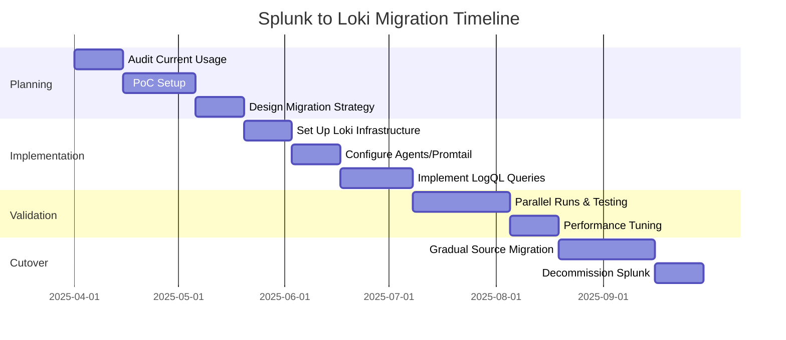

# Migrating from Splunk to Grafana Loki

## Introduction

Migrating from Splunk to Grafana Loki is a strategic move that many organizations consider when looking to modernize their logging infrastructure while potentially reducing costs. Splunk has been an industry-standard log management solution for years, but Grafana Loki offers a compelling alternative with its cost-effective design and tight integration with the Grafana ecosystem.

This guide walks you through the process of migrating your logging infrastructure from Splunk to Grafana Loki, covering everything from initial planning to implementation and validation, while highlighting the key differences between the two systems.

## Understanding the Differences

Before diving into migration, it's essential to understand the fundamental differences between Splunk and Loki:

| Feature | Splunk | Grafana Loki |
|---------|--------|--------------|
| **Architecture** | Full-text indexing of logs | Index only metadata, storing compressed logs separately |
| **Query Language** | SPL (Splunk Processing Language) | LogQL |
| **Pricing Model** | Volume-based license | Open-source core, capacity-based when using enterprise |
| **Storage Requirements** | High | Lower (doesn't index full text) |
| **Ecosystem** | Extensive apps ecosystem | Integrated with Grafana observability stack |

## Planning Your Migration

### 1. Audit Your Current Splunk Implementation

Start by documenting your current Splunk usage:

```bash
# Example Splunk command to list all index usage
| REST /services/data/indexes 
| table title, currentDBSizeMB, homePath, coldPath, thawedPath
```

Document:
- Data sources and ingestion methods
- Data volumes per source
- Retention policies
- Critical dashboards and alerts
- Custom applications and scripts
- Query patterns and performance requirements

### 2. Define Migration Scope and Timeline

Determine whether you'll:
- Migrate completely in one go (risky but faster)
- Run both systems in parallel (safer but requires more resources)
- Migrate incrementally by source or application

Create a phased migration plan:



## Setting Up Grafana Loki

### 1. Deploy Loki Infrastructure

You can deploy Loki using:
- Docker
- Kubernetes with Helm
- Binary deployment

For a simple Docker setup:

```bash
# Pull and run Loki using Docker
docker run -d --name loki -p 3100:3100 grafana/loki:latest

# Pull and run Promtail (log collector)
docker run -d --name promtail -p 9080:9080 \
  -v /var/log:/var/log \
  -v $(pwd)/promtail-config.yaml:/etc/promtail/config.yaml \
  grafana/promtail:latest
```

For production deployments, consider using Kubernetes with the Loki Helm chart:

```bash
# Add Grafana Helm repo
helm repo add grafana https://grafana.github.io/helm-charts

# Update Helm repos
helm repo update

# Install Loki stack with Promtail
helm install loki grafana/loki-stack \
  --set grafana.enabled=true,prometheus.enabled=true,prometheus.alertmanager.persistentVolume.enabled=false,prometheus.server.persistentVolume.enabled=false
```

### 2. Configure Log Collection

Create a basic Promtail configuration file (`promtail-config.yaml`):

```yaml
server:
  http_listen_port: 9080
  grpc_listen_port: 0

positions:
  filename: /tmp/positions.yaml

clients:
  - url: http://loki:3100/loki/api/v1/push

scrape_configs:
  - job_name: system
    static_configs:
    - targets:
        - localhost
      labels:
        job: varlogs
        __path__: /var/log/*log
```

### 3. Configure Grafana

Connect Grafana to Loki:

```yaml
# Add this to your Grafana datasources configuration
apiVersion: 1
datasources:
  - name: Loki
    type: loki
    access: proxy
    url: http://loki:3100
    version: 1
```

## Migrating Splunk Components

### 1. Translate Splunk Forwarders to Promtail

Splunk uses Forwarders to collect logs, while Loki typically uses Promtail.

Map your Splunk forwarder configurations to Promtail:

```yaml
# Example Promtail config equivalent to Splunk forwarder collecting Apache logs
scrape_configs:
  - job_name: apache
    static_configs:
    - targets:
        - localhost
      labels:
        job: apache
        environment: production
        __path__: /var/log/apache2/*log
    
    # Add timestamp extraction similar to Splunk props.conf
    pipeline_stages:
      - regex:
          expression: '^(?P<timestamp>\d{4}-\d{2}-\d{2} \d{2}:\d{2}:\d{2})'
      - timestamp:
          source: timestamp
          format: '2006-01-02 15:04:05'
```

For Windows systems, consider using Promtail or other agents like NXLog, Fluentd, or Fluent Bit.

### 2. Convert SPL Queries to LogQL

This is often the most challenging part of migration. Here are some examples of converting Splunk queries to LogQL:

**Splunk Query:**
```
index=web_logs status=500 | stats count by host
```

**LogQL Equivalent:**
```
{job="web_logs"} |= "status=500" | json | count by host
```

**Splunk Query with Field Extraction:**
```
index=apache_logs | rex field=_raw "(?<ip>\d+\.\d+\.\d+\.\d+) - - \[(?<timestamp>.*?)\] \"(?<method>\w+) (?<url>.*?)\"" | table ip, method, url
```

**LogQL Equivalent:**
```
{job="apache_logs"} | regexp `(?P<ip>\d+\.\d+\.\d+\.\d+) - - \[(?P<timestamp>.*?)\] \"(?P<method>\w+) (?P<url>.*?)\"` | line_format "{{.ip}} {{.method}} {{.url}}"
```

Common conversion patterns:

| SPL | LogQL |
|-----|-------|
| `index=name` | `{job="name"}` |
| `sourcetype=type` | `{source="type"}` |
| `field=value` | `{field="value"}` or filter with `\| json \| field="value"` |
| `stats count by field` | `\| json \| count by field` |
| `timechart count by field` | Use Grafana panels with LogQL query |

### 3. Rebuild Dashboards in Grafana

Recreate your critical Splunk dashboards in Grafana:

1. Identify your most important Splunk dashboards
2. Convert SPL queries to LogQL
3. Create equivalent panels in Grafana
4. Use Grafana's additional visualization options

Example dashboard configuration:

```json
{
  "panels": [
    {
      "title": "HTTP Status Codes",
      "type": "timeseries",
      "datasource": "Loki",
      "targets": [
        {
          "expr": "sum(count_over_time({job=\"web_logs\"} | json | status=~\"5..\") [1m])) by (status)",
          "legendFormat": "{{status}}",
          "refId": "A"
        }
      ]
    }
  ]
}
```

## Handling Advanced Splunk Features

### 1. Custom Apps and Add-ons

For custom Splunk apps:
- Identify functionality that can be replicated in Grafana
- Consider Grafana plugins for additional functionality
- Use custom Grafana panels for specific visualizations

### 2. Alerts and Monitoring

Migrate Splunk alerts to Grafana:

```yaml
# Example Grafana alert rule in YAML
apiVersion: 1
groups:
  - name: web_errors
    rules:
    - alert: HighErrorRate
      expr: sum(count_over_time({job="web_logs"} |= "status=500" [5m])) > 10
      for: 5m
      labels:
        severity: critical
      annotations:
        summary: High error rate on web servers
        description: More than 10 status 500 errors in the last 5 minutes
```

### 3. Data Retention and Storage

Configure Loki's retention and storage to match your Splunk policies:

```yaml
# Loki configuration for retention and storage
limits_config:
  retention_period: 30d

schema_config:
  configs:
    - from: 2020-10-24
      store: boltdb-shipper
      object_store: s3
      schema: v11
      index:
        prefix: index_
        period: 24h

storage_config:
  boltdb_shipper:
    active_index_directory: /loki/boltdb-shipper-active
    cache_location: /loki/boltdb-shipper-cache
    cache_ttl: 24h
    shared_store: s3
  aws:
    s3: s3://access_key:secret_key@region/bucket_name
```

## Best Practices for a Successful Migration

1. **Start Small**
   - Begin with non-critical data sources
   - Validate functionality before proceeding to more important systems

2. **Run in Parallel**
   - Dual-write logs to both systems during transition
   - Compare query results to ensure data integrity

3. **Monitor Performance**
   - Track Loki's resource usage
   - Optimize configurations for your specific workloads

4. **Train Your Team**
   - Provide LogQL training for Splunk users
   - Document common query patterns and their LogQL equivalents

5. **Plan for Downtime**
   - Schedule maintenance windows for any potential service disruptions
   - Have rollback procedures ready

## Validating Your Migration

Ensure your migration was successful by:

1. **Verifying Data Completeness**
   ```bash
   # Splunk query to count events in last hour
   index=web_logs earliest=-1h | stats count
   
   # Equivalent LogQL
   count_over_time({job="web_logs"}[1h])
   ```

2. **Comparing Query Results**
   - Run identical queries in both systems
   - Compare results for any discrepancies

3. **Testing Dashboard Functionality**
   - Ensure all dashboards return expected data
   - Verify alert functionality

4. **Performance Testing**
   - Compare query response times
   - Test system under peak load conditions

## Common Challenges and Solutions

### 1. Complex SPL Conversions

**Challenge:** Some advanced Splunk Processing Language features don't have direct LogQL equivalents.

**Solution:** 
- Use Grafana's built-in transformations for complex data manipulations
- Consider using Loki's query frontend for expensive operations
- Split complex queries into multiple panels with different visualization types

### 2. Data Volume Management

**Challenge:** Loki has different scaling characteristics than Splunk.

**Solution:**
- Implement proper label usage to avoid high cardinality
- Consider implementing log filtering at collection time
- Use compactor component for efficient storage

```yaml
# Example label configuration best practice
scrape_configs:
  - job_name: production
    static_configs:
    - targets:
        - localhost
      labels:
        env: production  # High-level environment (good)
        app: payment     # Application name (good)
        # Don't use high cardinality labels like:
        # user_id: "..."
        # request_id: "..."
```

### 3. User Adoption

**Challenge:** Users familiar with Splunk may resist changing to LogQL.

**Solution:**
- Create a "translation guide" for common queries
- Offer training sessions
- Highlight Grafana's additional visualization capabilities

## Summary

Migrating from Splunk to Grafana Loki offers significant benefits in terms of cost efficiency and integration with the broader Grafana observability stack. By following a methodical approach:

1. Start with thorough planning and understanding your current Splunk usage
2. Set up a proper Loki infrastructure
3. Systematically convert queries, dashboards, and alerts
4. Run parallel systems during transition
5. Validate thoroughly before decommissioning Splunk

While the migration process requires effort, the long-term benefits of a more cost-effective and integrated logging solution can provide significant ROI for organizations of all sizes.

## Additional Resources

- [Grafana Loki Documentation](https://grafana.com/docs/loki/latest/)
- [LogQL Query Language Reference](https://grafana.com/docs/loki/latest/logql/)
- [Promtail Configuration](https://grafana.com/docs/loki/latest/clients/promtail/configuration/)
- [Grafana Dashboard Documentation](https://grafana.com/docs/grafana/latest/dashboards/)

## Exercises

1. Install Loki and Promtail using Docker Compose and configure it to collect your local system logs.
2. Convert the following Splunk queries to LogQL:
   - `index=nginx status=404 | top uri`
   - `index=app_logs level=error | stats count by component`
3. Create a Grafana dashboard that displays error rates and response times from your web server logs.
4. Configure Loki retention and implement a log rotation strategy for your environment.
5. Design a migration plan for a hypothetical company with 500GB of daily log volume spread across web servers, application servers, and databases.