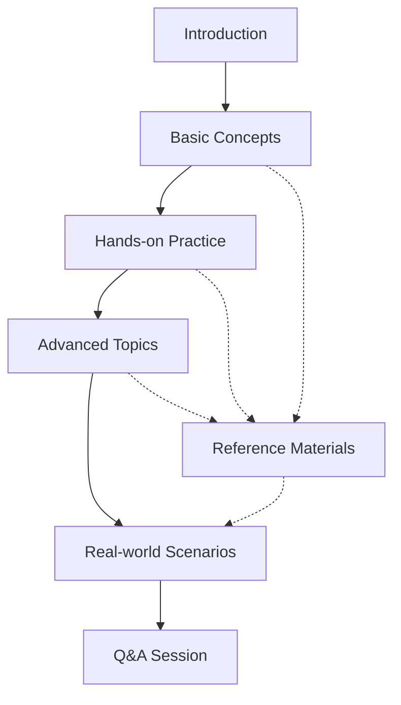

# User Training Approaches

## Introduction

When migrating to Grafana Loki, one of the most critical aspects of ensuring success is properly training your users. Even the most technically sound migration can fail if users aren't adequately prepared for the change. This guide explores different approaches to user training during a Grafana Loki migration, helping you develop a strategy that ensures high adoption rates and minimizes disruption to operations.

## Why User Training Matters

Migrating from traditional logging systems to Grafana Loki introduces new concepts, interfaces, and query languages. Without proper training:

- Users may struggle to find the logs they need
- Query performance may suffer due to inefficient search patterns
- The full power of Loki's label-based logging might remain underutilized
- Resistance to change might undermine the migration's success

## Core Training Approaches

### 1. Documentation-Based Training

Documentation serves as the foundation of any training program and provides a reference that users can return to as needed.

#### Key Components:

- **Quick Start Guides**: Concise instructions for common tasks
- **Query Language Reference**: Detailed LogQL documentation with examples
- **Migration Comparison Sheets**: Side-by-side comparisons of old vs. new ways to perform tasks

#### Implementation Example:

Create an internal knowledge base with sections like:

```markdown
## LogQL vs. Previous Query Language

| Task | Previous System Syntax | LogQL Syntax |
|------|------------------------|--------------|
| Find errors | `search "error"` | `{app="myapp"} |= "error"` |
| Filter by service | `service:auth` | `{service="auth"}` |
| Time-based filtering | `time > -1h` | `{app="myapp"} | time > -1h` |
```

### 2. Instructor-Led Workshops

Interactive sessions led by experienced team members or consultants can accelerate the learning curve.

#### Workshop Structure:

1. **Introduction to Loki Architecture**: Understanding the fundamentals
2. **Basic Query Techniques**: Hands-on practice with LogQL
3. **Advanced Querying**: Using metrics, parsing, and advanced filtering
4. **Dashboard Creation**: Building useful visualizations
5. **Q&A and Troubleshooting**: Addressing specific use cases

#### Workshop Flow Diagram:



### 3. Self-Paced Learning Modules

Create structured learning paths that allow users to learn at their own pace.

#### Module Example:

**Module 1: LogQL Basics**

```jsx
import Tabs from '@theme/Tabs';
import TabItem from '@theme/TabItem';

<Tabs>
  <TabItem value="lesson" label="Lesson">
    <h3>Introduction to LogQL</h3>
    <p>LogQL is Loki's query language. It's designed to feel familiar to Prometheus users while being optimized for log queries.</p>
    
    <h4>Basic Structure:</h4>
    <p>LogQL queries consist of two parts:</p>
    <ol>
      <li>A <strong>log stream selector</strong> that defines which log streams to query</li>
      <li>An optional <strong>filter expression</strong> to further refine the results</li>
    </ol>
  </TabItem>
  <TabItem value="practice" label="Practice Exercise">
    <h3>Your Turn</h3>
    <p>Try writing a query that:</p>
    <ol>
      <li>Selects logs from the "auth-service"</li>
      <li>Contains the string "login failed"</li>
      <li>From the last 30 minutes</li>
    </ol>
    <details>
      <summary>Solution</summary>
      <code>{`{app="auth-service"} |= "login failed" | time > -30m`}</code>
    </details>
  </TabItem>
</Tabs>
```

### 4. Embedded Champions Program

Designating and training "Loki Champions" across teams can create a network of internal experts.

#### Champion Responsibilities:

- Provide in-team training and support
- Collect feedback and common issues
- Develop team-specific query templates
- Collaborate with other champions to share best practices

#### Selection Criteria for Champions:

- Technical aptitude and interest
- Influence within their team
- Communication skills
- Willingness to allocate time to support others

### 5. Sandbox Environment

Provide a safe, non-production environment where users can experiment freely.

#### Sandbox Features:

- Pre-loaded with representative log data
- Example dashboards showing best practices
- Query performance feedback tools
- No risk of affecting production systems

#### Example Sandbox Exercise:

```jsx
<div className="codeblock-example">
  <h4>Sandbox Challenge #3: Debug an Authentication Issue</h4>
  <p>Scenario: Users are reporting intermittent authentication failures.</p>
  
  <p>Your task:</p>
  <ol>
    <li>Find all authentication errors in the last 4 hours</li>
    <li>Identify which user IDs are most affected</li>
    <li>Determine if the errors correlate with specific API versions</li>
  </ol>
  
  <p>Hints:</p>
  <ul>
    <li>Use the <code>rate</code> function to visualize error frequency</li>
    <li>Try the <code>json</code> parser to extract structured fields</li>
    <li>Consider creating a dashboard with multiple panels for different aspects</li>
  </ul>
</div>
```

## Progressive Training Strategy

Rather than attempting to train users on everything at once, consider a phased approach:

### Phase 1: Basic Functionality (Week 1-2)

- Focus on simple log filtering and basic LogQL
- Cover the Explore UI and navigation
- Ensure users can find their most-needed logs

### Phase 2: Intermediate Skills (Week 3-4)

- Introduce label-based filtering strategies
- Teach dashboard creation for common use cases
- Begin transitioning team-specific queries

### Phase 3: Advanced Capabilities (Week 5-6)

- Metrics extraction from logs
- Complex query optimization
- Integration with alerting systems

## Measuring Training Effectiveness

Implement metrics to gauge the success of your training program:

```jsx
<div className="metrics-table">
  <table>
    <thead>
      <tr>
        <th>Metric</th>
        <th>Measurement Method</th>
        <th>Target</th>
      </tr>
    </thead>
    <tbody>
      <tr>
        <td>Query Success Rate</td>
        <td>% of queries that return expected results</td>
        <td>&gt; 90%</td>
      </tr>
      <tr>
        <td>Time to Resolution</td>
        <td>Average time to find relevant logs for incidents</td>
        <td>&lt; previous system</td>
      </tr>
      <tr>
        <td>User Confidence</td>
        <td>Survey results: 1-5 scale</td>
        <td>&gt; 4.0 average</td>
      </tr>
      <tr>
        <td>Feature Utilization</td>
        <td>% of advanced features being used</td>
        <td>Increasing trend</td>
      </tr>
    </tbody>
  </table>
</div>
```

## Common Training Challenges and Solutions

### Challenge: Query Language Transition

**Solution:** Create "translation sheets" comparing old queries to LogQL equivalents. Develop a custom cheat sheet for your organization's most common queries.

### Challenge: Resistance to Change

**Solution:** Demonstrate clear benefits with real examples from users' daily tasks. Show how Loki can solve problems that were difficult with the previous system.

### Challenge: Time Constraints

**Solution:** Provide training in multiple formats (videos, documentation, workshops) and bite-sized modules that can be consumed in 15-30 minute sessions.

### Challenge: Varying Technical Skill Levels

**Solution:** Offer different training tracks - basic for casual users, advanced for power users, with clear progression paths between them.

## Case Study: Successful Training Implementation

A mid-sized e-commerce company migrating from ELK to Grafana Loki implemented a hybrid training approach:

1. They created a 4-week structured training program
2. Each team nominated a "Loki Champion" who received advanced training
3. They developed team-specific query libraries for common use cases
4. Daily "Loki Office Hours" provided immediate support during the transition

**Results:**
- 92% of users were proficient in basic queries within 2 weeks
- Mean time to resolution for incidents decreased by 35%
- User satisfaction with the logging system increased from 3.2/5 to 4.5/5

## Practical Example: Developing a Custom Training Dashboard

Creating a training-specific dashboard can accelerate the learning process:

```jsx
<div className="code-example">
  <h4>Training Dashboard Configuration</h4>
  <pre><code>{`
{
  "title": "Loki Training Dashboard",
  "panels": [
    {
      "title": "Query Playground",
      "type": "logs",
      "targets": [
        {
          "expr": "{filename=~\".*/training/.*\"}",
          "refId": "A"
        }
      ]
    },
    {
      "title": "Error Rate by Service",
      "type": "graph",
      "targets": [
        {
          "expr": "sum(rate({filename=~\".*/training/.*\"} |= \"error\" | unwrap level_count [5m])) by (service)",
          "refId": "B"
        }
      ]
    }
  ],
  "templating": {
    "list": [
      {
        "name": "service",
        "type": "query",
        "query": "label_values(service)"
      }
    ]
  }
}
  `}</code></pre>
</div>
```

This dashboard provides a safe environment for users to experiment with queries and see real-time results.

## Summary

Effective user training is a critical success factor in migrating to Grafana Loki. By implementing a comprehensive training strategy that includes:

- Multiple learning formats to accommodate different learning styles
- Progressive skill development from basic to advanced
- Hands-on practice in safe environments
- Embedded expertise through champions programs
- Clear documentation and reference materials

You can ensure that your users not only accept the migration but become proficient and enthusiastic about the new capabilities Loki provides.

## Additional Resources

- Practice Exercises: Create a set of increasingly challenging queries for users to test their skills
- Query Library: Develop a searchable repository of common queries for different use cases
- Feedback Loop: Establish a mechanism for users to request additional training on specific topics
- Regular Refreshers: Schedule periodic sessions to introduce new features and reinforce best practices

## Next Steps

After completing this guide, consider exploring:

- Advanced LogQL techniques
- Creating team-specific dashboards
- Implementing alerting based on log patterns
- Integrating Loki with other observability tools

The investment in thorough user training will pay dividends in faster incident resolution, more efficient troubleshooting, and better utilization of Loki's powerful capabilities.