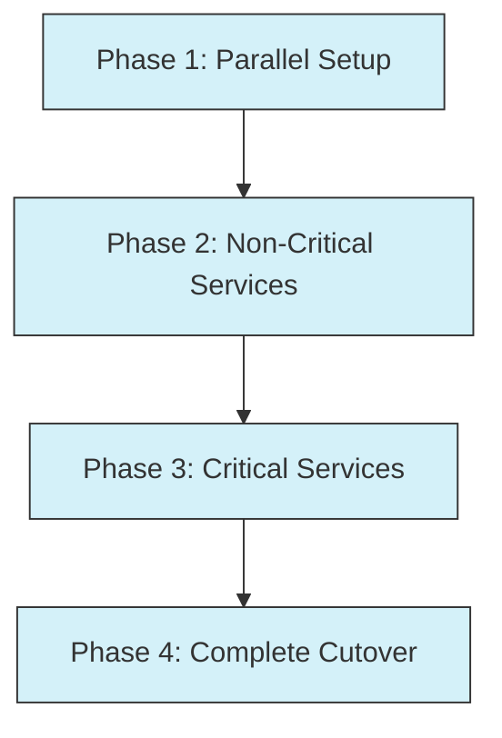
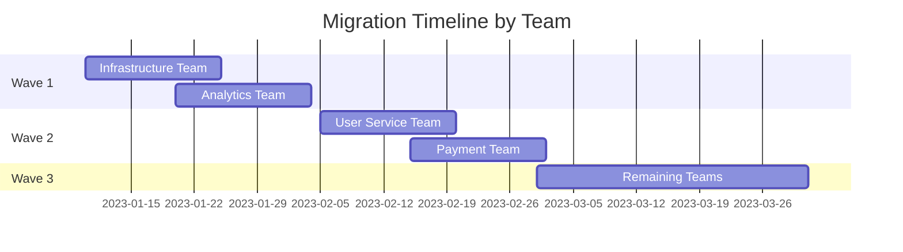
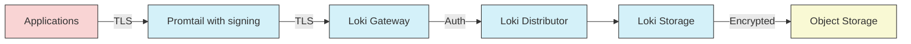

# Migration Case Studies

## Introduction

Migration to Grafana Loki from other logging solutions requires careful planning and execution. This guide explores real-world case studies of organizations that successfully migrated their logging infrastructure to Loki. By examining these practical examples, you'll gain insights into different migration approaches, challenges encountered, and solutions implemented.

These case studies demonstrate how various organizations with different requirements and constraints approached their migration to Loki, providing valuable lessons for your own migration journey.

## Case Study 1: E-Commerce Platform - Phased Migration

### Background

A mid-sized e-commerce platform was using the ELK stack (Elasticsearch, Logstash, Kibana) for logging but faced increasing costs and scaling challenges as their business grew.

### Migration Strategy: Phased Approach

The company adopted a phased migration strategy:



#### Phase 1: Parallel Setup

They set up Loki alongside their existing ELK stack, initially without sending any production logs:

```yaml
# Simple promtail configuration for initial testing
clients:
  - url: http://loki:3100/loki/api/v1/push
    
scrape_configs:
  - job_name: system
    static_configs:
    - targets:
        - localhost
      labels:
        job: system_logs
        env: test
        __path__: /var/log/*.log
```

#### Phase 2: Non-Critical Services

They redirected logs from non-critical services to both systems:

```yaml
# Promtail configuration for dual shipping
clients:
  - url: http://loki:3100/loki/api/v1/push
  
scrape_configs:
  - job_name: non_critical_services
    pipeline_stages:
      - json:
          expressions:
            timestamp: time
            level: level
            message: msg
      - labels:
          level:
      - timestamp:
          source: timestamp
          format: RFC3339
    static_configs:
    - targets:
        - non-critical-service
      labels:
        job: non_critical
        env: production
        service: inventory
        __path__: /var/log/non-critical/*.log
```

#### Phase 3: Critical Services

After validation, they gradually migrated critical services, comparing query results between both systems:

Example LogQL query compared to Elasticsearch query:

```
# LogQL Query
{service="payment-gateway"} |= "transaction" | json | status_code >= 400

# Equivalent Elasticsearch Query
service:payment-gateway AND transaction AND status_code:>=400
```

#### Phase 4: Complete Cutover

Finally, they completed the migration by:
1. Ensuring all dashboards were migrated to Grafana
2. Training the team on LogQL
3. Decommissioning the ELK stack

### Results

- **Cost Reduction**: 65% decrease in logging infrastructure costs
- **Query Performance**: 40% faster queries for common patterns
- **Storage Efficiency**: 80% reduction in storage requirements

### Lessons Learned

- The phased approach minimized risk
- Running both systems in parallel provided a safety net
- Team training on LogQL was essential for adoption

## Case Study 2: SaaS Provider - Microservices Migration

### Background

A SaaS provider with 50+ microservices needed to migrate from a complex, self-managed logging solution to something more scalable and cost-effective.

### Migration Strategy: Service-by-Service

Their approach focused on migrating one service team at a time:

#### Step 1: Centralized Label Schema

First, they established a consistent labeling schema across all services:

```yaml
# Label standardization guidelines
required_labels:
  - service_name    # The specific microservice
  - environment     # prod, staging, dev
  - component       # api, worker, cron, etc.
  - region          # geographical region
  
optional_labels:
  - version         # service version
  - customer_tier   # for multi-tenant services
```

#### Step 2: Custom Migration Toolkit

They developed a custom toolkit to assist teams with migration:

```go
// Example migration helper tool (simplified)
package main

import (
	"github.com/grafana/loki/pkg/logql"
)

func ValidateQuery(query string) (bool, error) {
	_, err := logql.ParseExpr(query)
	if err != nil {
		return false, err
	}
	return true, nil
}

func ConvertLegacyQuery(oldQuery string) (string, error) {
	// Custom logic to convert legacy queries to LogQL
	// ...
}
```

#### Step 3: Migration Waves

They organized migration in waves, with early adopters helping later teams:



#### Step 4: Query Library

They built a shared LogQL query library for common patterns:

```
# Error rate by service
sum by(service_name) (rate({env="production"} |= "error" [5m])) 

# 95th percentile latency
quantile_over_time(0.95, 
  {env="production", component="api"} 
  | json 
  | unwrap response_time_ms [5m]) by (service_name)
```

### Results

- **Consistency**: Standardized logging across all microservices
- **Developer Experience**: Improved with shared query library
- **Operational Overhead**: Reduced maintenance burden by 70%

### Lessons Learned

- Service-by-service migration worked well for their team structure
- Standard label schema was crucial for consistency
- Knowledge sharing between teams accelerated later migrations

## Case Study 3: Financial Institution - Compliance-Focused Migration

### Background

A financial institution with strict compliance requirements needed to migrate from a traditional logging system to Loki while maintaining audit capabilities and log retention policies.

### Migration Strategy: Compliance-First

#### Step 1: Compliance Requirements Mapping

They started by mapping compliance requirements to Loki capabilities:

| Requirement | Implementation |
|-------------|---------------|
| 7-year retention | Configure retention period with Compactor |
| Tamper-proof logs | Implement checksums and read-only bucket policies |
| Access audit | Enable audit logging for all Loki components |
| Data sovereignty | Deploy regional Loki instances |

#### Step 2: Multi-Tenant Configuration

They implemented a multi-tenant setup for separation of concerns:

```yaml
# Loki multi-tenant configuration
auth_enabled: true

server:
  http_listen_port: 3100

compactor:
  working_directory: /loki/compactor
  retention_enabled: true
  retention_delete_delay: 2h
  retention_delete_worker_count: 150

limits_config:
  enforce_metric_name: false
  reject_old_samples: true
  reject_old_samples_max_age: 168h
  retention_period: 26280h  # 3 years for general logs
  retention_stream:
    - selector: '{compliance="pci"}'
      priority: 1
      period: 52560h  # 6 years for PCI logs
    - selector: '{compliance="financial"}'
      priority: 2
      period: 61320h  # 7 years for financial reports
```

#### Step 3: Secure Data Pipeline

They implemented an end-to-end encrypted logging pipeline:



#### Step 4: Validation and Certification

Before full migration, they conducted a compliance validation process:

```yaml
# Validation test configuration
validation_tests:
  - name: retention_test
    description: "Verify retention policies are correctly applied"
    steps:
      - insert_sample_logs:
          tenant_id: financial
          compliance: financial
          count: 1000
      - advance_time: 7y
      - verify_logs_expired: true
      
  - name: access_control_test
    description: "Verify tenant isolation and access controls"
    steps:
      - insert_sample_logs:
          tenant_id: team_a
          compliance: pci
          count: 100
      - attempt_cross_tenant_access:
          from_tenant: team_b
          to_tenant: team_a
      - verify_access_denied: true
```

### Results

- **Compliance Maintained**: Successfully passed all compliance audits
- **Storage Costs**: Reduced storage costs by 55% while increasing retention
- **Query Speed**: Improved compliance investigations time by 70%

### Lessons Learned

- Early engagement with compliance teams was essential
- Multi-tenancy provided necessary isolation
- Log rotation and compression strategies were key to cost management

## Implementation Patterns

Across these case studies, several common patterns emerged:

### 1. Label Strategy

Effective use of labels is critical for a successful Loki migration:

```yaml
# Good labeling strategy example
scrape_configs:
  - job_name: application_logs
    static_configs:
    - targets:
        - application
      labels:
        # High cardinality (bad)
        # user_id: "{{.user_id}}"  # Don't do this!
        # request_id: "{{.request_id}}"  # Don't do this!
        
        # Low cardinality (good)
        app: payment-service
        environment: production
        tier: backend
        region: us-west
```

### 2. Query Conversion

Converting queries from previous systems to LogQL:

| System        | Original Query                     | LogQL Equivalent                                  |
|---------------|------------------------------------|---------------------------------------------------|
| Elasticsearch | `status:error AND service:auth`    | `{service="auth"} \|= "error"`                    |
| Splunk        | `index=prod "failed login" user=*` | `{index="prod"} \|= "failed login" \|~ "user=.+"` |
| Graylog       | `application:api AND level:ERROR`  | `{application="api"} \|= "ERROR"`                 |

### 3. Migration Verification

Common verification methods to ensure successful migration:

```go
// Example verification logic (pseudocode)
func VerifyMigration(oldSystem, lokiSystem, timeRange) {
    // 1. Check log volume matches
    oldCount := oldSystem.CountLogs(timeRange)
    lokiCount := lokiSystem.CountLogs(timeRange)
    
    if math.Abs(oldCount - lokiCount) / oldCount > 0.01 {
        return errors.New("Log count mismatch > 1%")
    }
    
    // 2. Verify critical queries return similar results
    for _, query := range criticalQueries {
        oldResults := oldSystem.RunQuery(query.oldSyntax)
        lokiResults := lokiSystem.RunQuery(query.lokiSyntax)
        
        if !compareResults(oldResults, lokiResults) {
            return errors.New("Query results mismatch")
        }
    }
    
    return nil
}
```

## Summary

These case studies demonstrate various approaches to migrating logging infrastructure to Grafana Loki, each tailored to specific organizational needs:

1. **E-commerce Platform**: Used a phased approach to minimize risk
2. **SaaS Provider**: Employed a service-by-service strategy for their microservices architecture
3. **Financial Institution**: Focused on compliance requirements throughout the migration

Key takeaways across all migrations:

- **Careful Planning**: Successful migrations require thorough planning
- **Incremental Approach**: Gradual migration reduces risk
- **Validation**: Continuous testing ensures data integrity
- **Knowledge Transfer**: Team training on LogQL is essential for adoption
- **Label Strategy**: Proper labeling is fundamental to Loki's efficient operation

## Exercises

1. **Planning Exercise**: Create a migration plan for a hypothetical application with three components: a web frontend, an API backend, and a batch processing system.

2. **Label Schema Design**: Design an effective label schema for a microservices architecture with 10+ services across development, staging, and production environments.

3. **Query Conversion**: Convert the following queries to LogQL:
   - Elasticsearch: `status_code:[400 TO 599] AND service:checkout`
   - Splunk: `source="application.log" error=* | stats count by error`

## Additional Resources

- [Grafana Loki Documentation](https://grafana.com/docs/loki/latest/)
- [LogQL Query Language Reference](https://grafana.com/docs/loki/latest/logql/)
- [Loki Best Practices](https://grafana.com/docs/loki/latest/best-practices/)
- [Loki Retention and Storage](https://grafana.com/docs/loki/latest/operations/storage/)
- [Multi-tenancy in Loki](https://grafana.com/docs/loki/latest/operations/multi-tenancy/)