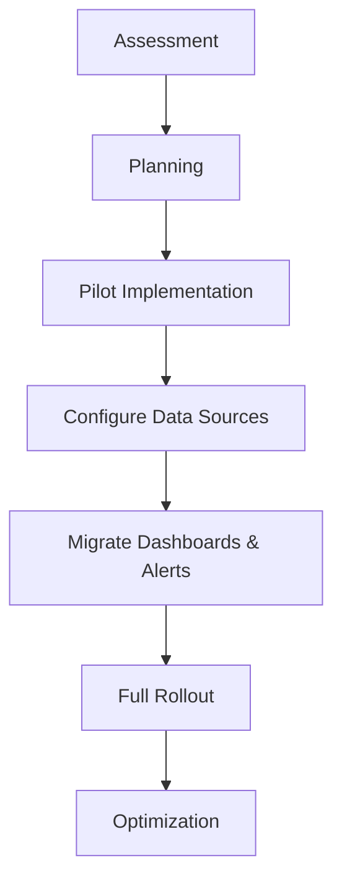

# Migrating from Traditional Logs

## Introduction

Transitioning from traditional logging systems to Grafana Loki represents a paradigm shift in how organizations handle their log data. Traditional logging solutions like the ELK stack (Elasticsearch, Logstash, Kibana), Splunk, or simple file-based logging often become expensive and difficult to scale as data volumes grow. Grafana Loki offers a cost-effective, efficient alternative with its unique index-free architecture and tight integration with the Grafana ecosystem.

This guide will walk you through the process of migrating from traditional logging solutions to Grafana Loki, covering everything from assessment and planning to implementation and optimization.

## Why Migrate to Loki?

Before diving into the migration process, let's understand why Loki might be the right choice for your organization:

- **Cost-efficiency**: Loki's design separates the indexing of metadata from the storage of log content, significantly reducing storage costs
- **Seamless Grafana integration**: Works natively with Grafana for unified metrics, logs, and traces visualization
- **Horizontal scalability**: Scales efficiently to handle growing log volumes
- **Flexible deployment options**: Works well in containers, Kubernetes, or traditional environments
- **Prometheus-inspired label model**: Familiar query patterns for teams already using Prometheus

## Migration Methodology

Migrating to Loki requires a systematic approach to ensure a smooth transition without disruption to your monitoring capabilities.



### 1. Assessment Phase

Before migrating, assess your current logging infrastructure:

```javascript
// Example log volume calculation
const dailyLogVolume = 500; // GB per day
const retentionPeriod = 30; // days
const totalStorage = dailyLogVolume * retentionPeriod;
console.log(`Estimated storage requirement: ${totalStorage} GB`);
```

Use this assessment phase to:

- Identify all current log sources and their formats
- Measure current log volumes and retention requirements
- Document existing query patterns and use cases
- Identify critical dashboards and alerts that depend on logs
- Understand current log shipping methods

### 2. Planning Phase

Create a detailed migration plan:

- Select a deployment strategy (fully managed, self-hosted, etc.)
- Choose the appropriate architecture based on your scale:
  - **Small scale**: Single binary
  - **Medium scale**: Microservices with object storage
  - **Large scale**: Microservices with chunking and caching

Example sizing configuration for a medium deployment:

```yaml
# Example Loki configuration sizing
limits_config:
  ingestion_rate_mb: 10
  ingestion_burst_size_mb: 20
  max_entries_limit_per_query: 10000
  max_chunks_per_query: 2000000
  max_query_series: 500
```

### 3. Implementing Loki

#### Setting Up Loki

For a basic Docker-based setup:

```bash
# Pull the Loki image
docker pull grafana/loki:latest

# Create a simple configuration
cat > loki-config.yaml << EOF
auth_enabled: false

server:
  http_listen_port: 3100

ingester:
  lifecycler:
    address: 127.0.0.1
    ring:
      kvstore:
        store: inmemory
      replication_factor: 1
    final_sleep: 0s
  chunk_idle_period: 5m
  chunk_retain_period: 30s

schema_config:
  configs:
    - from: 2020-10-24
      store: boltdb-shipper
      object_store: filesystem
      schema: v11
      index:
        prefix: index_
        period: 24h

storage_config:
  boltdb_shipper:
    active_index_directory: /loki/boltdb-shipper-active
    cache_location: /loki/boltdb-shipper-cache
    cache_ttl: 24h
    shared_store: filesystem
  filesystem:
    directory: /loki/chunks

limits_config:
  enforce_metric_name: false
  reject_old_samples: true
  reject_old_samples_max_age: 168h

chunk_store_config:
  max_look_back_period: 0s

table_manager:
  retention_deletes_enabled: false
  retention_period: 0s
EOF

# Run Loki
docker run -d --name loki -v $(pwd):/mnt/config -p 3100:3100 grafana/loki:latest -config.file=/mnt/config/loki-config.yaml
```

### 4. Configuring Log Shipping

Setting up the appropriate log shipping method is crucial. Here are common approaches:

#### Using Promtail

Promtail is Loki's purpose-built agent for sending logs:

```yaml
# Example promtail-config.yaml
server:
  http_listen_port: 9080
  grpc_listen_port: 0

positions:
  filename: /tmp/positions.yaml

clients:
  - url: http://loki:3100/loki/api/v1/push

scrape_configs:
  - job_name: system
    static_configs:
    - targets:
        - localhost
      labels:
        job: varlogs
        __path__: /var/log/*log
```

Run Promtail:

```bash
docker run -d --name promtail -v $(pwd):/mnt/config -v /var/log:/var/log grafana/promtail:latest -config.file=/mnt/config/promtail-config.yaml
```

#### Using Fluentd

For existing Fluentd deployments:

```ruby
# Example Fluentd configuration with Loki plugin
<source>
  @type tail
  path /var/log/containers/*.log
  pos_file /var/log/fluentd-containers.log.pos
  tag kubernetes.*
  read_from_head true
  <parse>
    @type json
    time_format %Y-%m-%dT%H:%M:%S.%NZ
  </parse>
</source>

<match **>
  @type loki
  url "http://loki:3100"
  extra_labels {"job":"fluentd"}
  flush_interval 10s
  flush_at_shutdown true
  buffer_chunk_limit 1m
</match>
```

#### Using Fluent Bit

For lightweight environments:

```ini
[INPUT]
    Name tail
    Path /var/log/*.log
    Tag system.*

[OUTPUT]
    Name loki
    Match *
    Host loki
    Port 3100
    Labels job=fluent-bit, env=production
    Label_Keys $kubernetes['namespace_name'],$kubernetes['pod_name']
```

### 5. Transitioning Queries and Dashboards

When migrating from traditional logging systems to Loki, you'll need to adapt your queries. Here are some common translations:

#### From Elasticsearch to LogQL

Elasticsearch:
```
GET logs/_search
{
  "query": {
    "bool": {
      "must": [
        { "match": { "service": "api" } },
        { "match_phrase": { "message": "error" } }
      ],
      "filter": [
        { "range": { "@timestamp": { "gte": "now-1h" } } }
      ]
    }
  }
}
```

Equivalent LogQL:
```
{service="api"} |= "error" | json
```

#### From Splunk to LogQL

Splunk:
```
index=production sourcetype=application service=api error | timechart count by severity
```

Equivalent LogQL:
```
{service="api"} |= "error" | json | rate(5m) by (severity)
```

#### Creating Loki Dashboards

Example Grafana dashboard JSON for Loki:

```json
{
  "panels": [
    {
      "datasource": "Loki",
      "description": "Error logs over time",
      "fieldConfig": {
        "defaults": {
          "color": {
            "mode": "palette-classic"
          },
          "custom": {
            "axisCenteredZero": false,
            "axisColorMode": "text",
            "axisLabel": "",
            "axisPlacement": "auto",
            "barAlignment": 0,
            "drawStyle": "line",
            "fillOpacity": 10,
            "gradientMode": "none",
            "hideFrom": {
              "legend": false,
              "tooltip": false,
              "viz": false
            },
            "lineInterpolation": "linear",
            "lineWidth": 1,
            "pointSize": 5,
            "scaleDistribution": {
              "type": "linear"
            },
            "showPoints": "never",
            "spanNulls": false,
            "stacking": {
              "group": "A",
              "mode": "none"
            },
            "thresholdsStyle": {
              "mode": "off"
            }
          },
          "thresholds": {
            "mode": "absolute",
            "steps": [
              {
                "color": "green",
                "value": null
              },
              {
                "color": "red",
                "value": 80
              }
            ]
          },
          "unit": "short"
        },
        "overrides": []
      },
      "gridPos": {
        "h": 8,
        "w": 12,
        "x": 0,
        "y": 0
      },
      "id": 2,
      "options": {
        "legend": {
          "calcs": [],
          "displayMode": "list",
          "placement": "bottom",
          "showLegend": true
        },
        "tooltip": {
          "mode": "single",
          "sort": "none"
        }
      },
      "targets": [
        {
          "datasource": "Loki",
          "editorMode": "code",
          "expr": "sum(count_over_time({app=\"frontend\"} |= \"error\" [$__interval]))",
          "legendFormat": "Errors",
          "range": true,
          "refId": "A"
        }
      ],
      "title": "Frontend Error Rate",
      "type": "timeseries"
    }
  ]
}
```

### 6. Phased Rollout Strategy

Implement a phased migration approach:

1. **Dual-write phase**: Send logs to both old system and Loki
2. **Verification phase**: Ensure all logs are properly captured in Loki
3. **Dashboard migration**: Create new dashboards or adapt existing ones
4. **Alert transition**: Set up new alerts in Loki and validate them
5. **Legacy decommissioning**: Once confident, retire old logging system

Example dual-writing configuration with Fluentd:

```ruby
<match **>
  @type copy
  <store>
    @type elasticsearch
    host elasticsearch
    port 9200
    logstash_format true
  </store>
  <store>
    @type loki
    url "http://loki:3100"
    extra_labels {"job":"fluentd"}
  </store>
</match>
```

### 7. Performance Optimization

After migration, optimize your Loki deployment:

#### Labels Best Practices

```yaml
# Good labeling practice - high cardinality fields NOT as labels
scrape_configs:
  - job_name: app_logs
    static_configs:
    - targets:
        - localhost
      labels:
        app: frontend
        environment: production
        # Don't do this:
        # request_id: ${REQUEST_ID}  # High cardinality!
      __path__: /var/log/app/*.log
```

#### Query Optimization

Efficient queries start with the label matchers, then use filtering:

```
# Inefficient
{} |= "status=500" |= "service=payment"

# Efficient 
{service="payment"} |= "status=500"
```

### 8. Common Challenges and Solutions

| Challenge | Solution |
|-----------|----------|
| High cardinality labels | Use log content filtering instead of high-cardinality labels |
| Query performance issues | Optimize queries to start with label filters |
| Missing logs | Verify log shipping configurations and network connectivity |
| High ingestion rate | Implement rate limiting or increase ingestion capacity |
| Retention management | Configure retention based on labels with `retention_period` |

## Real-World Migration Example

Let's walk through a complete example of migrating a microservices application from ELK to Loki:

### Before: ELK Setup

```yaml
# Filebeat configuration
filebeat.inputs:
- type: container
  paths:
    - '/var/lib/docker/containers/*/*.log'
  processors:
    - add_kubernetes_metadata:
        host: ${NODE_NAME}
        matchers:
        - logs_path:
            logs_path: "/var/lib/docker/containers/"

output.elasticsearch:
  hosts: ["elasticsearch:9200"]
  index: "logs-%{[agent.version]}-%{+yyyy.MM.dd}"
```

### After: Loki Setup

```yaml
# Promtail configuration
server:
  http_listen_port: 9080

positions:
  filename: /tmp/positions.yaml

clients:
  - url: http://loki:3100/loki/api/v1/push

scrape_configs:
  - job_name: kubernetes
    kubernetes_sd_configs:
      - role: pod
    pipeline_stages:
      - docker: {}
      - json:
          expressions:
            stream: stream
            service: service
            level: level
            message: log
      - labels:
          service:
          level:
```

### Migrating Kibana Dashboard to Grafana

Original Kibana Dashboard:
- Visualization showing error counts by service
- Table with detailed error messages
- Filters for service and severity

Grafana Equivalent:
```
# Panel 1: Error counts by service
sum by(service) (count_over_time({level="error"}[1h]))

# Panel 2: Detailed error table
{level="error"} 
| json 
| line_format "{{.service}} - {{.message}}"
```

## Best Practices Summary

1. **Label efficiently**: Avoid high-cardinality labels
2. **Structure your queries**: Start with label filters, then refine with text filters
3. **Monitor your monitoring**: Set up metrics for Loki itself
4. **Resource planning**: Ensure adequate resources for ingestion and querying
5. **Retention policy**: Implement retention based on importance of logs
6. **Standardize log formats**: Adopt structured logging where possible
7. **Gradual transition**: Use dual-writing during migration

## Conclusion

Migrating from traditional logging systems to Grafana Loki offers significant benefits in terms of cost-efficiency, scalability, and integration with the broader observability stack. By following a methodical approach to migration and adhering to best practices, you can ensure a smooth transition with minimal disruption to your monitoring capabilities.

The key to success lies in careful planning, thorough testing, and a phased implementation strategy. Remember that while the syntax and architecture may differ from traditional logging systems, the core principles of effective log management remain the same.

## Additional Resources

- [Grafana Loki Documentation](https://grafana.com/docs/loki/latest/)
- [LogQL Query Language Reference](https://grafana.com/docs/loki/latest/logql/)
- [Community Forums](https://community.grafana.com/)

## Exercises

1. Set up a local Loki instance using Docker and ship logs from a sample application
2. Convert three Elasticsearch queries to LogQL
3. Create a Grafana dashboard showing error rates and slow responses
4. Implement log shipping using two different agents (Promtail and Fluent Bit)
5. Design a labeling strategy for a microservices architecture