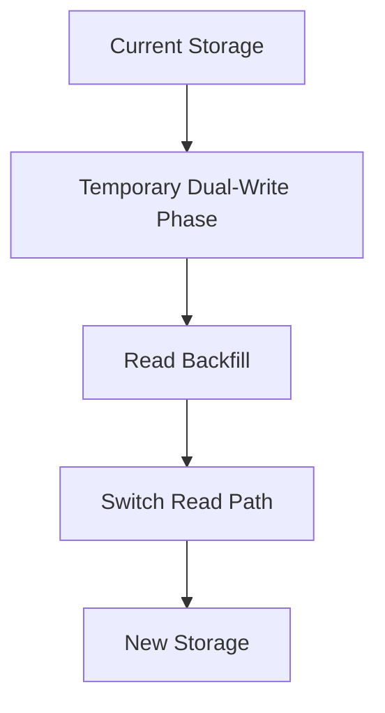
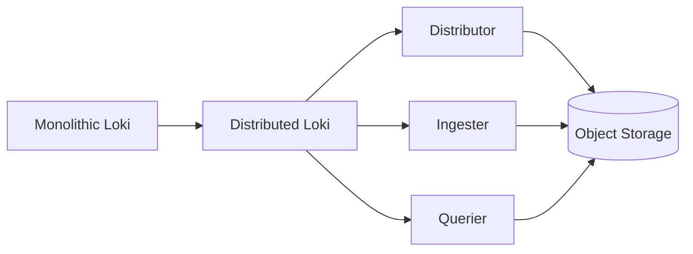

# Data Migration Techniques

## Introduction

Data migration is a critical process when working with observability platforms like Grafana Loki. As your logging needs evolve, you may need to move data between different Loki instances, storage backends, or even migrate from other logging solutions to Loki. This guide covers essential techniques for effectively planning and executing data migrations in Loki environments while minimizing downtime and preventing data loss.

## Understanding Data Migration in Loki Context

Grafana Loki stores log data in chunks, which are organized in a time-series index. When migrating data, you need to consider both the chunk data and the index metadata. Let's explore the key concepts before diving into specific techniques.

### Key Concepts

1. **Chunk Storage**: Loki's actual log data is stored in chunks, which can be located in various storage backends.
2. **Index Storage**: Metadata pointing to the location of chunks, typically stored in key-value stores.
3. **Schema Configuration**: Controls how data is organized, compressed, and indexed.
4. **Tenant Separation**: Loki uses multi-tenancy, which impacts how you migrate tenant-specific data.

## Data Migration Techniques

### 1. Export-Import Method

The most straightforward approach for migrating data is the export-import method, where you export logs from the source and import them into the destination.

#### Step-by-Step Process

1. Export logs from source Loki instance
2. Transform if necessary
3. Import into destination Loki instance

```bash
# Export logs from source Loki using LogCLI
logcli query '{app="application"}' --limit=5000 --output=raw > exported_logs.log

# Import logs to destination using promtail
cat exported_logs.log | promtail --client.url=http://new-loki:3100/loki/api/v1/push --client.external-labels=app=application
```

This technique works well for small to medium datasets but may not be efficient for large volumes of data.

### 2. Storage Backend Migration

When you need to change the underlying storage system (e.g., from filesystem to object storage), a storage backend migration is necessary.



#### Implementation Example

```yaml
# loki-config.yaml - Configuring multiple storage backends
storage_config:
  boltdb_shipper:
    active_index_directory: /loki/index
    cache_location: /loki/cache
    shared_store: s3
  aws:
    s3: s3://loki-bucket:loki/
    dynamodb:
      dynamodb_url: dynamodb://us-east-1
  filesystem:
    directory: /loki/chunks
```

During migration, you would:
1. Configure both old and new storage backends
2. Enable dual writing to both systems
3. Backfill historical data
4. Verify data consistency
5. Switch read path to the new storage

### 3. Using Loki's Transfer API

For Loki-to-Loki migrations, the Transfer API provides a more efficient method than export-import.

```bash
# Using curl to initiate a transfer between Loki instances
curl -X POST \
  http://source-loki:3100/loki/api/v1/transfer \
  -H "Content-Type: application/json" \
  -d '{
    "tenants": ["tenant1", "tenant2"],
    "destination": {
      "url": "http://destination-loki:3100",
      "bearer_token": "your-auth-token"
    },
    "time_range": {
      "start": "2023-01-01T00:00:00Z",
      "end": "2023-06-30T23:59:59Z"
    }
  }'
```

This approach:
- Maintains index structures
- Preserves time ranges
- Supports selective tenant migration
- Can be more efficient for large datasets

### 4. Schema Migration

When upgrading Loki or changing your schema configuration, you may need to perform a schema migration.

```yaml
# Example of schema configuration change
schema_config:
  configs:
    - from: 2022-01-01
      store: boltdb-shipper
      object_store: aws
      schema: v11
      index:
        prefix: index_
        period: 24h
    - from: 2023-01-01
      store: boltdb-shipper
      object_store: aws
      schema: v12
      index:
        prefix: index_
        period: 24h
```

The migration process involves:
1. Setting up the new schema configuration
2. Running Loki with both old and new schemas
3. Loki will read from both schemas but write only to the new one
4. Optionally, rewriting historical data to the new schema format

### 5. Compactor-Based Migration

For optimizing storage and performance, you can leverage Loki's compactor to migrate and transform data.

```yaml
# Compactor configuration
compactor:
  working_directory: /loki/compactor
  shared_store: s3
  compaction_interval: 10m
  retention_enabled: true
  retention_delete_delay: 2h
  retention_delete_worker_count: 150
```

The compactor can:
- Consolidate small chunks
- Apply retention policies during migration
- Optimize index structures
- Run alongside normal operations

## Real-World Migration Scenarios

### Migrating from ELK Stack to Loki

When moving from Elasticsearch to Loki, you'll need to:

1. Export logs from Elasticsearch
2. Transform the format to match Loki's requirements
3. Adjust timestamp formats
4. Add appropriate labels
5. Import into Loki

```bash
# Elasticsearch export script example
curl -X GET "localhost:9200/logs/_search?scroll=1m" -H "Content-Type: application/json" -d'
{
  "size": 1000,
  "query": {
    "match_all": {}
  }
}' > elastic_logs.json

# Transform and import (simplified)
cat elastic_logs.json | jq -r '.hits.hits[]._source | (.timestamp + " " + .message)' | \
  promtail --client.url=http://loki:3100/loki/api/v1/push --client.external-labels=source=elasticsearch
```

### Scaling Up: Migrating to a Distributed Loki Setup

As your logging needs grow, you might need to migrate from a monolithic Loki to a distributed architecture:



The migration process typically involves:
1. Setting up the new distributed environment
2. Configuring components (distributor, ingester, querier)
3. Using one of the above migration techniques to move the data
4. Gradually shifting traffic to the new setup
5. Verifying data consistency and query performance

```yaml
# Example distributed Loki configuration
auth_enabled: true

server:
  http_listen_port: 3100

distributor:
  ring:
    kvstore:
      store: memberlist

ingester:
  lifecycler:
    ring:
      kvstore:
        store: memberlist
      replication_factor: 2
    final_sleep: 0s
  chunk_idle_period: 30m
  chunk_retain_period: 1m

storage_config:
  aws:
    s3: s3://loki-bucket:loki/
  boltdb_shipper:
    active_index_directory: /loki/index
    shared_store: s3
    cache_location: /loki/cache

limits_config:
  enforce_metric_name: false
  reject_old_samples: true
  reject_old_samples_max_age: 168h
```

## Best Practices for Loki Data Migration

1. **Plan for Downtime**: Even with careful planning, complex migrations may require maintenance windows.

2. **Test Thoroughly**: Always test your migration process in a staging environment first.

3. **Backup Before Migration**: Create backups of critical log data before beginning any migration.

4. **Validate Data**: Implement verification steps to ensure data integrity after migration.

5. **Monitor Performance**: Track query performance before and after migration to identify any issues.

6. **Incremental Migration**: Consider migrating data in batches to minimize risk.

7. **Configure Rate Limits**: Adjust rate limits during migration to prevent overloading systems.

```yaml
# Example rate limiting configuration
limits_config:
  ingestion_rate_mb: 8
  ingestion_burst_size_mb: 16
  max_global_streams_per_user: 10000
  max_query_length: 12h
```

## Common Challenges and Solutions

| Challenge | Solution |
|-----------|----------|
| Large data volumes | Use incremental migration with time-based filtering |
| Schema compatibility | Transform data during migration |
| Downtime requirements | Implement dual-write strategies |
| Network constraints | Consider compression or edge node staging |
| Resource limitations | Scale infrastructure temporarily during migration |

## Summary

Data migration in Grafana Loki requires careful planning and execution. The techniques covered in this guide—export-import, storage backend migration, transfer API, schema migration, and compactor-based approaches—provide a solid foundation for handling various migration scenarios.

Remember that the best migration strategy depends on your specific requirements, including data volume, downtime tolerance, and the nature of the migration. Always test thoroughly in a non-production environment before performing migrations on critical systems.

## Exercises

1. Set up a test environment with two Loki instances and practice migrating data using the export-import method.

2. Configure a dual-write scenario where logs are sent to both old and new Loki instances.

3. Create a migration plan for moving from a single-tenant to a multi-tenant Loki setup.

4. Design a strategy for migrating from filesystem storage to object storage with minimal downtime.

5. Build a script to verify data consistency between source and destination Loki instances after migration.

## Additional Resources

- [Grafana Loki Documentation](https://grafana.com/docs/loki/latest/)
- [Loki Storage Documentation](https://grafana.com/docs/loki/latest/operations/storage/)
- [BoltDB Shipper](https://grafana.com/docs/loki/latest/operations/storage/boltdb-shipper/)
- [Loki Compactor](https://grafana.com/docs/loki/latest/operations/storage/boltdb-shipper/compactor/)