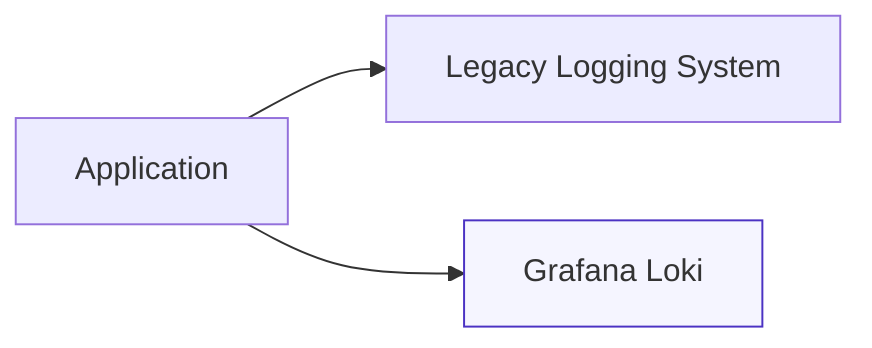
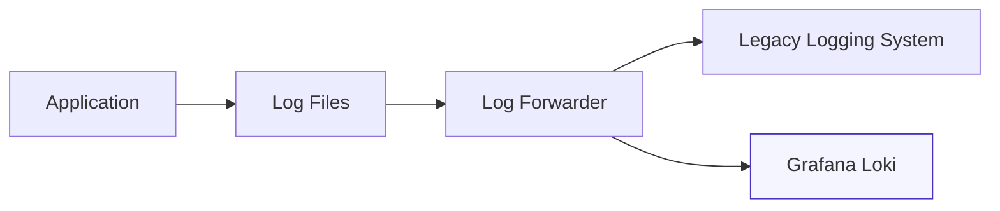
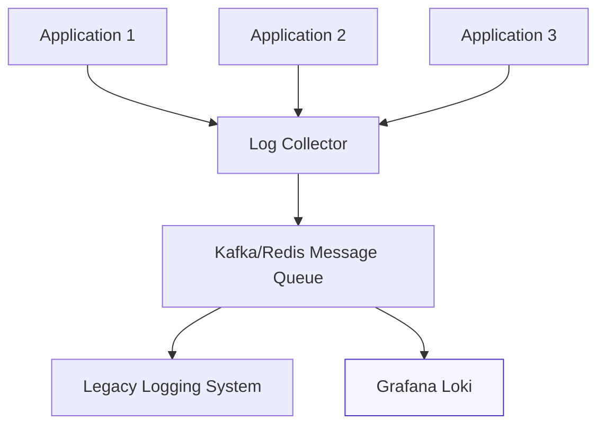

# Parallel Logging Approaches

## Introduction

When migrating your existing logging infrastructure to Grafana Loki, one of the most critical challenges is ensuring that no log data is lost during the transition. Parallel logging is a strategic approach that allows you to send logs to both your legacy logging system and Grafana Loki simultaneously during the migration phase. This method provides a safety net, allowing you to verify Loki's functionality and performance before completely cutting over from your existing solution.

In this guide, we'll explore various parallel logging approaches, implementation strategies, and best practices to ensure a smooth transition to Grafana Loki.

## Understanding Parallel Logging

Parallel logging involves configuring your applications or log forwarding agents to send identical log streams to multiple destinations. This technique creates redundancy during migration and provides several benefits:

- Zero data loss during migration
- Side-by-side comparison of logging systems
- Gradual transition rather than a high-risk "big bang" cutover
- Ability to validate queries and alerting in Loki before full commitment

Let's explore how to implement parallel logging in different scenarios.

## Common Parallel Logging Patterns

### 1. Application-Level Dual Logging

In this approach, your applications are modified to log to multiple destinations simultaneously.



#### Example: Configuring a Java Application with Log4j2

```java
<?xml version="1.0" encoding="UTF-8"?>
<Configuration status="INFO">
  <Appenders>
    <!-- Legacy Logging System Appender -->
    <Socket name="LegacyLoggerSocket" host="legacy-logger.example.com" port="9000">
      <JsonLayout compact="true" eventEol="true" />
    </Socket>
    
    <!-- Grafana Loki Appender -->
    <Http name="Loki" url="http://loki.example.com:3100/loki/api/v1/push">
      <Property name="Content-Type" value="application/json" />
      <JsonLayout compact="true" eventEol="true" />
      <LokiLayout>
        <Label name="app" value="my-java-app" />
        <Label name="environment" value="production" />
      </LokiLayout>
    </Http>
    
    <!-- Console output for local debugging -->
    <Console name="Console" target="SYSTEM_OUT">
      <PatternLayout pattern="%d{HH:mm:ss.SSS} [%t] %-5level %logger{36} - %msg%n" />
    </Console>
  </Appenders>
  
  <Loggers>
    <Root level="info">
      <AppenderRef ref="LegacyLoggerSocket" />
      <AppenderRef ref="Loki" />
      <AppenderRef ref="Console" />
    </Root>
  </Loggers>
</Configuration>
```

**Pros:**
- Direct integration without additional infrastructure
- Full control over what gets logged to each system

**Cons:**
- Requires code changes or configuration updates
- Can increase application complexity
- Potential performance impact from multiple logging endpoints

### 2. Log Forwarder Duplication

This approach uses log forwarding agents to duplicate log streams. Popular agents like Fluentd, Fluent Bit, Logstash, or Promtail can be configured to forward logs to multiple destinations.



#### Example: Configuring Fluent Bit for Parallel Logging

```ini
[SERVICE]
    Flush        1
    Log_Level    info
    Daemon       off

[INPUT]
    Name        tail
    Path        /var/log/application/*.log
    Tag         app.*
    Multiline.parser   java

[OUTPUT]
    Name        es
    Match       app.*
    Host        elasticsearch.example.com
    Port        9200
    Index       logs
    Type        _doc
    
[OUTPUT]
    Name        loki
    Match       app.*
    Host        loki.example.com
    Port        3100
    Labels      job=fluentbit, env=production
    Label_Keys  $container_name,$container_id
    Workers     2
    Line_Format json
```

**Pros:**
- No application changes required
- Centralized configuration management
- Can handle multiple applications and log formats

**Cons:**
- Additional infrastructure component to manage
- Potential single point of failure
- May introduce slight latency

### 3. Log Shipping Hub-and-Spoke Model

In larger environments, you might implement a centralized logging hub that aggregates logs before forwarding them to multiple destinations.



#### Example: Kafka and Logstash Configuration

Logstash configuration to consume from Kafka and output to multiple destinations:

```ruby
input {
  kafka {
    bootstrap_servers => "kafka:9092"
    topics => ["logs"]
    group_id => "logstash_processors"
    codec => "json"
    consumer_threads => 3
  }
}

filter {
  # Common processing for all logs
  json {
    source => "message"
  }
  
  # Add metadata for easier querying
  mutate {
    add_field => {
      "[@metadata][timestamp]" => "%{@timestamp}"
    }
  }
}

output {
  # Send to legacy Elasticsearch cluster
  elasticsearch {
    hosts => ["elasticsearch:9200"]
    index => "logs-%{+YYYY.MM.dd}"
  }
  
  # Send to Grafana Loki
  http {
    url => "http://loki:3100/loki/api/v1/push"
    http_method => "post"
    content_type => "application/json"
    format => "json"
    mapping => {
      "streams" => [
        {
          "stream" => {
            "job" => "logstash",
            "environment" => "production"
          },
          "values" => [
            [
              "%{[@metadata][timestamp]}000000000",
              "%{message}"
            ]
          ]
        }
      ]
    }
  }
}
```

**Pros:**
- Highly scalable for large environments
- Decouples log generation from processing
- Provides buffering during outages
- Enables advanced log processing before forwarding

**Cons:**
- More complex architecture
- Higher operational complexity
- Requires maintaining message queue infrastructure

## Implementation Strategy

### Phase 1: Planning and Assessment

1. **Inventory your logging sources**: Document all applications, servers, and services generating logs.
2. **Evaluate log volumes**: Understand the scale of your logging to properly size your Loki deployment.
3. **Select a parallel logging pattern**: Choose the most appropriate approach based on your infrastructure.
4. **Define success criteria**: Establish metrics to determine when to complete the migration.

### Phase 2: Pilot Implementation

1. **Start with non-critical applications**: Begin parallel logging with lower-risk systems.
2. **Configure log forwarders or applications**: Set up dual-destination logging.
3. **Validate log delivery**: Ensure logs appear in both systems correctly.
4. **Compare query results**: Run identical queries in both systems to verify consistency.

### Phase 3: Full Deployment

1. **Roll out to remaining systems**: Expand parallel logging to all applications.
2. **Monitor system performance**: Watch for any impact on application performance or log forwarder bottlenecks.
3. **Adjust as needed**: Fine-tune configurations based on observations.

### Phase 4: Migration Completion

1. **Validate all logs are in Loki**: Ensure no data gaps exist compared to the legacy system.
2. **Migrate dashboards and alerts**: Move monitoring capabilities to Loki.
3. **Gradually phase out legacy system**: Reduce usage of the old logging system.
4. **Final cutover**: Remove legacy logging endpoints when comfortable with Loki's performance.

## Real-World Example: Migrating from Elasticsearch to Loki

Let's walk through a practical example of migrating from an ELK (Elasticsearch, Logstash, Kibana) stack to Grafana Loki using Fluent Bit for parallel logging.

### Step 1: Set up Loki Infrastructure

First, deploy Loki alongside your existing ELK stack:

```yaml
# docker-compose.yml for Loki deployment
version: '3'
services:
  loki:
    image: grafana/loki:2.8.0
    ports:
      - "3100:3100"
    volumes:
      - ./loki-config.yaml:/etc/loki/local-config.yaml
    command: -config.file=/etc/loki/local-config.yaml
  
  promtail:
    image: grafana/promtail:2.8.0
    volumes:
      - ./promtail-config.yaml:/etc/promtail/config.yaml
      - /var/log:/var/log
    command: -config.file=/etc/promtail/config.yaml
  
  grafana:
    image: grafana/grafana:10.0.0
    ports:
      - "3000:3000"
    environment:
      - GF_SECURITY_ADMIN_PASSWORD=admin
    volumes:
      - grafana-storage:/var/lib/grafana
    depends_on:
      - loki

volumes:
  grafana-storage:
```

### Step 2: Configure Fluent Bit for Parallel Logging

```ini
# fluent-bit.conf
[SERVICE]
    Flush        1
    Log_Level    info
    Daemon       off

[INPUT]
    Name            tail
    Path            /var/log/nginx/access.log
    Tag             nginx.access
    Parser          nginx

[INPUT]
    Name            tail
    Path            /var/log/nginx/error.log
    Tag             nginx.error

[FILTER]
    Name            kubernetes
    Match           kube.*
    Kube_URL        https://kubernetes.default.svc:443
    Kube_CA_File    /var/run/secrets/kubernetes.io/serviceaccount/ca.crt
    Kube_Token_File /var/run/secrets/kubernetes.io/serviceaccount/token
    Merge_Log       On

# Output to Elasticsearch (legacy system)
[OUTPUT]
    Name            es
    Match           *
    Host            elasticsearch.svc
    Port            9200
    Logstash_Format On
    Retry_Limit     False
    Type            flb_type
    Time_Key        @timestamp

# Output to Loki (new system)
[OUTPUT]
    Name            loki
    Match           *
    Host            loki.svc
    Port            3100
    Labels          job=fluent-bit, env=${ENV}, service=${SERVICE_NAME}
    Label_Keys      $kubernetes['namespace_name'],$kubernetes['pod_name'],$kubernetes['container_name']
    Line_Format     json
    Workers         2
```

### Step 3: Compare and Validate

Create identical dashboards in both Kibana and Grafana to compare:

1. Log volume and patterns
2. Search performance
3. Error detection capabilities
4. Alert triggering

### Step 4: Gradual Transition

After validating Loki's functionality, gradually move user access from Kibana to Grafana:

1. First with read-only users
2. Then advanced users
3. Finally, critical monitoring teams

### Step 5: Decommission Legacy System

Once all teams are comfortable with Loki and all logs are confirmed to be properly captured:

1. Remove the Elasticsearch output from Fluent Bit
2. Scale down Elasticsearch resources
3. Eventually decommission the ELK stack completely

## Best Practices for Parallel Logging

### Performance Considerations

1. **Monitor resource usage**: Sending logs to multiple destinations increases CPU and network utilization.
2. **Implement rate limiting**: Prevent overwhelming either system during traffic spikes.
3. **Batch log entries**: Use efficient batching to minimize network overhead.
4. **Consider sample rates**: For very high-volume systems, consider sampling a percentage of logs.

### Data Consistency

1. **Use consistent timestamps**: Ensure both systems receive identical timestamps for correlation.
2. **Normalize log formats**: Use the same structure in both systems for easier comparison.
3. **Include unique identifiers**: Add trace IDs or correlation IDs to verify log capture.

### Operational Recommendations

1. **Start with low-risk applications**: Begin parallel logging with non-critical systems.
2. **Implement gradual rollout**: Add applications to parallel logging in phases.
3. **Create comparison dashboards**: Build tools to verify log consistency between systems.
4. **Document the transition plan**: Ensure all teams understand the migration timeline.

## Troubleshooting Common Issues

### Inconsistent Log Delivery

**Symptoms:**
- Missing logs in one system
- Significant time lag between systems

**Solutions:**
- Verify network connectivity to both endpoints
- Check for rate limiting or quota issues
- Ensure proper error handling in forwarders
- Implement retry mechanisms

### Performance Degradation

**Symptoms:**
- Increased CPU usage on application servers
- Higher latency in log processing

**Solutions:**
- Optimize batch sizes and flush intervals
- Scale up log forwarders
- Consider dedicated logging infrastructure
- Implement asynchronous logging at the application level

### Log Format Discrepancies

**Symptoms:**
- Different field names or structures between systems
- Parsing errors in one system but not the other

**Solutions:**
- Standardize log formats across applications
- Use transformation plugins in log forwarders
- Implement consistent parsing rules

## Summary

Parallel logging offers a safe and effective strategy for migrating to Grafana Loki from legacy logging systems. By sending logs to both systems simultaneously, you can validate Loki's functionality, train your team, and ensure a smooth transition without risking data loss.

Key takeaways:
- Choose the right parallel logging pattern based on your infrastructure
- Implement the migration in phases, starting with non-critical applications
- Monitor system performance and log consistency throughout the process
- Use the opportunity to standardize and improve your logging practices

By following the approaches outlined in this guide, you can successfully migrate to Grafana Loki while maintaining operational visibility and minimizing risk.

## Additional Resources

- [Grafana Loki Documentation](https://grafana.com/docs/loki/latest/)
- [Fluent Bit Documentation](https://docs.fluentbit.io/)
- [Promtail Documentation](https://grafana.com/docs/loki/latest/clients/promtail/)

## Exercises

1. **Implementation Planning**: Draft a parallel logging plan for a hypothetical application stack with three microservices, considering which approach would work best.

2. **Configuration Challenge**: Create a Fluent Bit configuration that sends logs to both Elasticsearch and Loki, but with different retention policies (keep logs for 7 days in Elasticsearch but 30 days in Loki).

3. **Performance Testing**: Design a test to measure the performance impact of parallel logging on an application server. What metrics would you collect, and how would you interpret the results?

4. **Migration Dashboard**: Sketch a Grafana dashboard that could help you monitor the progress of your migration by comparing log counts between your legacy system and Loki.