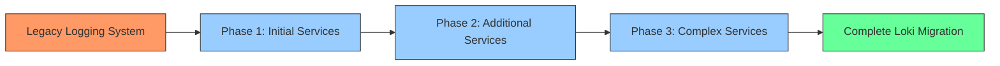
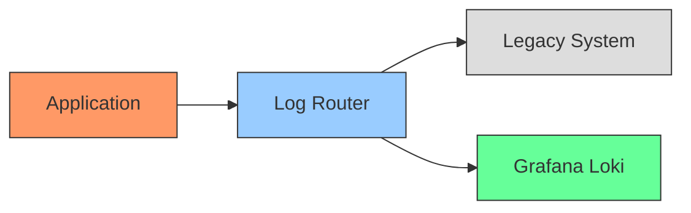
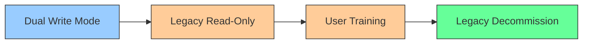

# Incremental Migration

## Introduction

When adopting Grafana Loki as your logging solution, you don't have to perform a complete system overhaul overnight. **Incremental migration** is a methodical approach that allows you to transition to Loki gradually, component by component or service by service. This strategy minimizes risks, reduces operational impact, and provides opportunities to learn and adjust as you progress.

In this guide, we'll explore how to plan and execute an incremental migration to Grafana Loki, the benefits of this approach, and practical examples to help you successfully implement this strategy in your environment.

## What is Incremental Migration?

Incremental migration involves moving your logging infrastructure to Grafana Loki in small, manageable phases rather than all at once. Think of it as crossing a river by stepping on stones one at a time, rather than trying to leap across in a single bound.



This approach has several key characteristics:

- **Gradual transition**: Services migrate one at a time or in small groups
- **Parallel operation**: Old and new logging systems run simultaneously during migration
- **Validation at each step**: Each migrated component is thoroughly tested before proceeding
- **Risk distribution**: Issues impact only the portion being migrated, not the entire system

## Benefits of Incremental Migration

Transitioning to Loki using an incremental approach offers numerous advantages:

1. **Reduced Risk**: By migrating in smaller chunks, you limit the blast radius of potential issues
2. **Operational Continuity**: Critical services maintain logging throughout the transition
3. **Learning Opportunity**: Early migrations inform and improve later ones
4. **Resource Management**: Spreads the resource demands of migration over time
5. **Easier Rollbacks**: If problems occur, you can roll back individual components
6. **Stakeholder Confidence**: Demonstrable success with initial services builds trust

## Planning Your Incremental Migration

Before beginning your migration journey, proper planning is essential. Here's a step-by-step approach:

### 1. Inventory Your Current Logging Infrastructure

Start by creating a comprehensive map of your existing logging environment:

```typescript
// Example inventory structure
const loggingInventory = {
  services: [
    {
      name: "payment-service",
      logVolume: "high",
      criticality: "high",
      currentSystem: "ELK",
      dependencies: ["transaction-db", "user-service"]
    },
    {
      name: "notification-service",
      logVolume: "medium",
      criticality: "medium",
      currentSystem: "Fluentd to CloudWatch",
      dependencies: ["message-queue"]
    },
    // Additional services...
  ],
  infrastructure: {
    collectors: ["Filebeat", "Fluentd"],
    storage: ["Elasticsearch", "CloudWatch"],
    visualizations: ["Kibana", "CloudWatch Dashboards"]
  }
};
```

### 2. Prioritize Services for Migration

Develop a prioritization framework to determine which services to migrate first:

- Start with **non-critical** services that have **low log volumes**
- Choose services with **fewer dependencies** on other systems
- Select services that are **representative** of your overall architecture
- Consider services where you have **strong domain knowledge**

### 3. Design a Dual-Write Strategy

During transition, implement a dual-write approach where logs are sent to both the legacy system and Loki:



### 4. Define Success Criteria

Establish clear metrics to determine when a service migration is complete:

- Log volume parity between old and new systems
- Query performance benchmarks
- Alert functionality verification
- User acceptance from operations teams

## Implementing Incremental Migration

Let's walk through a practical implementation of incremental migration to Grafana Loki.

### Phase 1: Pilot Service Migration

Start with a simple, non-critical service. For this example, we'll use a hypothetical analytics service.

#### Step 1: Set up Dual Logging

Configure Promtail to collect logs while maintaining your existing logging pipeline:

```yaml
# promtail-config.yaml
server:
  http_listen_port: 9080
  grpc_listen_port: 0

positions:
  filename: /tmp/positions.yaml

clients:
  - url: http://loki:3100/loki/api/v1/push

scrape_configs:
  - job_name: analytics-service
    static_configs:
      - targets:
          - localhost
        labels:
          job: analytics-service
          environment: production
          __path__: /var/log/analytics-service/*.log
```

#### Step 2: Verify Data Collection

Ensure logs are flowing correctly to both systems:

```bash
# Check log volume in Loki
curl -s -X GET "http://loki:3100/loki/api/v1/query_range" \
  --data-urlencode 'query={job="analytics-service"}' \
  --data-urlencode 'start=2023-01-01T00:00:00Z' \
  --data-urlencode 'end=2023-01-02T00:00:00Z' | jq '.data.result | length'
```

Expected output:
```
1452  # Number of log entries found
```

#### Step 3: Create Equivalent Dashboards and Alerts

Recreate your existing dashboards in Grafana using Loki as the data source:

```
sum(count_over_time({job="analytics-service"} |= "ERROR" [$__interval])) by (job)
```

### Phase 2: Scale to Additional Services

After successfully migrating your pilot service, expand to other services based on your prioritization framework.

#### Adapting Configuration for Multiple Services

Scale your Promtail configuration to handle multiple services:

```yaml
# Enhanced promtail-config.yaml
scrape_configs:
  - job_name: service-logs
    pipeline_stages:
      - regex:
          expression: '(?P<service>[\w-]+)\.log'
      - labels:
          service:
    static_configs:
      - targets:
          - localhost
        labels:
          environment: production
          __path__: /var/log/services/*/*.log
```

#### Implementing Service-Specific Processing

Add service-specific processing rules as needed:

```yaml
# Service-specific pipeline for payment processing
- job_name: payment-processing
  pipeline_stages:
    - json:
        expressions:
          level: level
          message: message
          user_id: user.id
          transaction_id: transaction.id
    - labels:
        level:
        user_id:
        transaction_id:
  static_configs:
    - targets:
        - localhost
      labels:
        job: payment-processing
        __path__: /var/log/payment-service/*.log
```

### Phase 3: Complex Service Migration

As you gain experience, tackle more complex services with specialized needs.

#### High-Volume Service Example

For high-volume services, implement sampling and filtering at the source:

```yaml
# High-volume service configuration
- job_name: high-volume-api
  pipeline_stages:
    - match:
        selector: '{job="high-volume-api"}'
        stages:
          - regex:
              expression: '.*level=(DEBUG|INFO|WARN|ERROR).*'
              source: line
          - labels:
              level:
    - drop:
        expression: 'level="DEBUG"'
        older_than: 24h
  static_configs:
    - targets:
        - localhost
      labels:
        job: high-volume-api
        __path__: /var/log/api-gateway/*.log
```

#### Critical Service with Advanced Requirements

For critical services, implement more sophisticated processing:

```yaml
# Critical service with parsing and relabeling
- job_name: payment-gateway
  pipeline_stages:
    - json:
    - tenant:
        source: tenant_id
    - output:
        source: message
  static_configs:
    - targets:
        - localhost
      labels:
        job: payment-gateway
        component: transactions
        __path__: /var/log/payment-gateway/*.log
```

## Validation and Comparison

Throughout the migration, continuously validate that Loki is capturing the same information as your legacy system.

### Log Volume Comparison

Create a dashboard to track log volume parity:

```
# Loki Query
sum(count_over_time({job="$service"}[$__interval]))

# Legacy System Query (example for Elasticsearch)
sum(count(source="$service"))
```

### Query Response Time Benchmark

Monitor query performance to ensure Loki meets your requirements:

```javascript
// Example benchmark script
const startTime = new Date().getTime();
fetch('http://loki:3100/loki/api/v1/query_range', {
  method: 'POST',
  body: JSON.stringify({
    query: '{job="payment-service"} |= "ERROR"',
    start: '2023-01-01T00:00:00Z',
    end: '2023-01-02T00:00:00Z',
  })
})
.then(response => response.json())
.then(data => {
  const endTime = new Date().getTime();
  console.log(`Query execution time: ${endTime - startTime}ms`);
  console.log(`Results found: ${data.data.result.length}`);
});
```

Expected output:
```
Query execution time: 248ms
Results found: 156
```

## Transitioning Off Legacy Systems

Once you've validated that Loki is working correctly for a service, you can begin the process of decommissioning the legacy logging for that service.

### Gradual Transition Steps:

1. **Read-only mode**: First, switch to read-only mode in the legacy system for the migrated service
2. **Historical data**: Decide whether to migrate historical data or keep it accessible in the legacy system
3. **User transition**: Help users adapt to querying in LogQL instead of your previous query language
4. **Resource reclamation**: Reclaim resources as services fully transition to Loki



## Common Challenges and Solutions

### Challenge: Label Cardinality Issues

**Problem**: High cardinality labels causing performance problems in Loki

**Solution**: Restructure your labeling strategy:

```yaml
# Before: High cardinality
- job_name: api-service
  static_configs:
    - labels:
        user_id: "{{.user_id}}"  # High cardinality - BAD!

# After: Better approach
- job_name: api-service
  pipeline_stages:
    - json:
        expressions:
          user_id: user_id
    # Keep high cardinality data in log line, not as labels
    - output:
        source: log_line
  static_configs:
    - labels:
        service: "api-service"
```

### Challenge: Query Performance Differences

**Problem**: LogQL queries are slower than in your legacy system

**Solution**: Optimize your queries and indexing strategy:

```
# Inefficient query
{job="payment-service"} |= "transaction" |= "failed" |= "user_id=12345"

# More efficient query
{job="payment-service"} |= "transaction failed" | json | user_id="12345"
```

### Challenge: Team Adaptation

**Problem**: Teams struggle to adapt to the new logging system

**Solution**: Create service-specific cheat sheets with equivalent queries:

```markdown
# Elasticsearch to Loki Query Translation

## Finding errors
- **Elasticsearch**: `level:ERROR AND service:payment`
- **Loki**: `{job="payment-service"} |= "ERROR"`

## Analyzing specific transactions
- **Elasticsearch**: `transaction_id:TX123456 AND status:failed`
- **Loki**: `{job="payment-service"} |= "TX123456" |= "failed"`
```

## Real-World Case Study: E-Commerce Platform

Let's examine a real-world example of an e-commerce platform migrating to Loki.

### System Description
- 15 microservices across 3 environments
- Currently using ELK stack with custom dashboards
- 20GB of log data generated daily

### Migration Plan

**Phase 1 (Weeks 1-2)**: Non-critical services
- Product catalog service
- Recommendation engine  

**Phase 2 (Weeks 3-4)**: Medium criticality
- User management
- Inventory service

**Phase 3 (Weeks 5-6)**: Business-critical
- Payment processing
- Order fulfillment

**Phase 4 (Weeks 7-8)**: Cleanup and optimization
- Legacy system decommissioning
- Query and dashboard refinement

### Implementation Details

The e-commerce platform implemented a custom log router using Fluentd:

```ruby
# fluentd.conf for dual-write during migration
<source>
  @type forward
  port 24224
</source>

<match service.**>
  @type copy
  
  <store>
    # Legacy Elasticsearch destination
    @type elasticsearch
    host elasticsearch.local
    port 9200
    logstash_format true
  </store>
  
  <store>
    # New Loki destination
    @type http
    endpoint http://loki:3100/loki/api/v1/push
    <format>
      @type json
    </format>
    <buffer>
      flush_interval 1s
    </buffer>
  </store>
</match>
```

### Results

After completing the migration:
- 30% reduction in storage costs
- 15% improvement in query response time for common patterns
- Successful transition with zero critical service disruptions

## Best Practices and Tips

To ensure a successful incremental migration to Grafana Loki:

1. **Start simple**: Begin with straightforward services that generate predictable logs
2. **Document everything**: Create a migration playbook that evolves as you learn
3. **Involve stakeholders early**: Include operations and development teams in planning
4. **Match existing capabilities**: Ensure critical queries and alerts work in Loki before cutting over
5. **Train your team**: Provide LogQL training sessions and reference materials
6. **Monitor the migration**: Track progress metrics to celebrate wins and identify issues

## Summary

Incremental migration provides a pragmatic path to adopting Grafana Loki without the risks associated with a "big bang" approach. By breaking the process into manageable phases, you can:

- Minimize operational disruption
- Learn and adapt as you go
- Build confidence with each successful migration
- Maintain logging continuity throughout the transition

With careful planning, systematic execution, and continuous validation, you can successfully transition your logging infrastructure to Grafana Loki while enhancing your overall observability capabilities.

## Additional Resources

To deepen your understanding of incremental migration strategies:

- Explore the [Grafana Loki documentation](https://grafana.com/docs/loki/latest/) for detailed configuration options
- Learn more about [LogQL query language](https://grafana.com/docs/loki/latest/query/) to optimize your logging queries
- Study the [Promtail pipeline stages](https://grafana.com/docs/loki/latest/clients/promtail/pipelines/) for advanced log processing techniques

## Exercises

1. Create an inventory of your current logging infrastructure, identifying potential services for initial migration
2. Design a dual-write configuration for a sample service in your environment
3. Develop a set of equivalent queries between your current logging system and Loki
4. Create a migration timeline with clear milestones and success criteria
5. Build a simple dashboard to monitor the progress of your incremental migration