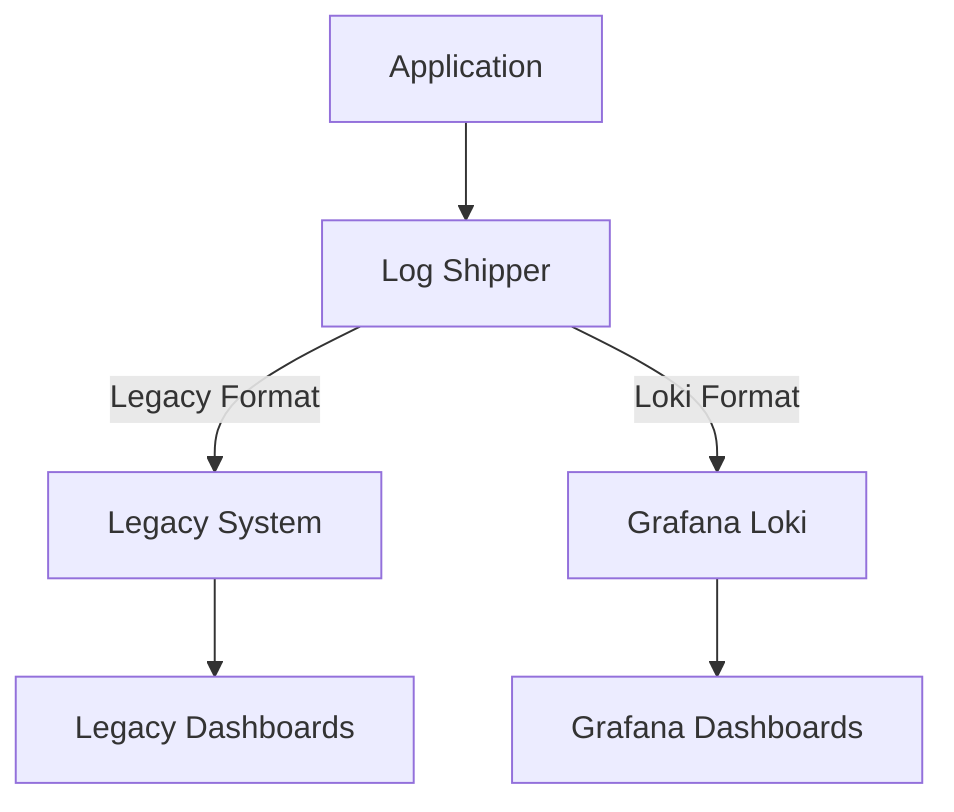

# Legacy System Integration

## Introduction

When adopting Grafana Loki for your observability needs, you'll rarely have the luxury of starting from scratch. Most organizations have existing logging infrastructure, referred to as "legacy systems," that contain valuable historical data and established workflows. This guide explores strategies for integrating Grafana Loki with your legacy logging systems, allowing for a smooth transition without disrupting existing operations.

Legacy system integration is a critical part of any migration strategy, enabling you to:

- Preserve access to historical log data
- Maintain business continuity during migration
- Gradually shift workloads to the new system
- Validate Loki's performance against existing solutions

## Understanding Your Legacy Landscape

Before integrating Loki, it's important to assess your current logging ecosystem:

### Common Legacy Logging Systems

- **Elasticsearch + Kibana**: Traditional ELK/Elastic Stack deployments
- **Splunk**: Enterprise logging and monitoring solution
- **Self-hosted solutions**: Graylog, syslog-ng, rsyslog
- **Cloud provider solutions**: AWS CloudWatch, Google Cloud Logging

### Key Integration Considerations

1. **Volume and retention requirements** - How much log data do you process daily?
2. **Query patterns** - How do teams currently search and analyze logs?
3. **Alerting and dashboards** - What visualizations and alerts need to be preserved?
4. **Data schema and structure** - What fields and formats are in use?

## Integration Approaches

Let's explore several approaches to integrate Loki with legacy systems:

### 1. Dual Write Pattern

The dual write pattern involves configuring your applications or log shippers to send logs to both your legacy system and Loki simultaneously.



#### Example: Configuring Promtail for Dual Shipping

```yaml
clients:
  - url: http://loki:3100/loki/api/v1/push
    tenant_id: tenant1
  
  # Legacy Elasticsearch output via Filebeat
  - url: filebeat://localhost:5044

scrape_configs:
  - job_name: system
    static_configs:
      - targets: [localhost]
        labels:
          job: varlogs
          __path__: /var/log/*log
```

**Benefits:**
- No immediate migration required
- Easy comparison between systems
- No data loss risk

**Challenges:**
- Additional infrastructure load
- Storage duplication
- Maintaining two systems

### 2. Log Forwarding

In this approach, you continue writing logs to your legacy system, then forward them to Loki using an integration tool.

#### Example: Forwarding from Elasticsearch to Loki

```javascript
// Simplified Node.js script for ES to Loki forwarding
const { Client } = require('@elastic/elasticsearch');
const axios = require('axios');

const es = new Client({ node: 'http://localhost:9200' });
const LOKI_URL = 'http://loki:3100/loki/api/v1/push';

async function forwardLogs() {
  // Query recent logs from Elasticsearch
  const result = await es.search({
    index: 'logs-*',
    body: {
      query: {
        range: {
          '@timestamp': {
            gte: 'now-5m'
          }
        }
      },
      sort: [{ '@timestamp': 'asc' }]
    }
  });
  
  // Transform and forward to Loki
  const entries = [];
  for (const hit of result.hits.hits) {
    const source = hit._source;
    const timestamp = new Date(source['@timestamp']).getTime() * 1000000; // convert to nanoseconds
    
    entries.push({
      stream: {
        app: source.app || 'unknown',
        env: source.environment || 'production',
        level: source.level || 'info'
      },
      values: [
        [timestamp.toString(), JSON.stringify(source)]
      ]
    });
  }
  
  if (entries.length > 0) {
    await axios.post(LOKI_URL, {
      streams: entries
    }, {
      headers: {
        'Content-Type': 'application/json'
      }
    });
    console.log(`Forwarded ${entries.length} logs to Loki`);
  }
}

// Run every minute
setInterval(forwardLogs, 60000);
forwardLogs();
```

**Benefits:**
- Single source of truth (legacy system)
- Minimal application changes
- Controlled migration pace

**Challenges:**
- Potential latency in Loki data
- Need for custom forwarding logic
- Duplicate storage costs

### 3. API-Based Integration

You can use Grafana's data source plugins to query both systems simultaneously, presenting unified dashboards.

#### Example: Configuring Multiple Data Sources in Grafana

```yaml
# Example Grafana datasources configuration
apiVersion: 1

datasources:
  - name: Loki
    type: loki
    access: proxy
    url: http://loki:3100
    isDefault: true
    
  - name: Elasticsearch
    type: elasticsearch
    access: proxy
    url: http://elasticsearch:9200
    database: logs-*
    jsonData:
      timeField: "@timestamp"
      esVersion: 7.10.0
```

With both data sources configured, you can create dashboards that query both systems:

```jsx
// Example Grafana dashboard panel using both data sources
{
  "panels": [
    {
      "title": "Error Logs Comparison",
      "type": "timeseries",
      "targets": [
        {
          "datasource": "Loki",
          "expr": "sum(count_over_time({level=\"error\"}[5m]))",
          "refId": "A",
          "legendFormat": "Loki Errors"
        },
        {
          "datasource": "Elasticsearch",
          "query": "level:error",
          "metrics": [{"type": "count"}],
          "refId": "B",
          "legendFormat": "Elasticsearch Errors"
        }
      ]
    }
  ]
}
```

**Benefits:**
- Unified visualization
- No immediate data migration needed
- Flexible transition

**Challenges:**
- Query complexity
- Performance variations
- Different query languages

### 4. Historical Data Import

To preserve access to historical data, you can perform a one-time import of your legacy logs into Loki.

#### Example: Elasticsearch to Loki Migration Script

```python
import elasticsearch
import requests
import json
import time
from datetime import datetime, timedelta

# Configure connections
es = elasticsearch.Elasticsearch(["http://elasticsearch:9200"])
LOKI_URL = "http://loki:3100/loki/api/v1/push"

# Start from 30 days ago
start_date = datetime.now() - timedelta(days=30)
end_date = datetime.now()

# Process one day at a time
current_date = start_date
while current_date < end_date:
    next_date = current_date + timedelta(days=1)
    
    # Query logs for the current day
    query = {
        "query": {
            "range": {
                "@timestamp": {
                    "gte": current_date.isoformat(),
                    "lt": next_date.isoformat()
                }
            }
        },
        "sort": [{"@timestamp": "asc"}],
        "size": 1000
    }
    
    # Use the scroll API for large datasets
    result = es.search(index="logs-*", body=query, scroll="2m")
    scroll_id = result["_scroll_id"]
    
    while True:
        hits = result["hits"]["hits"]
        if not hits:
            break
            
        # Transform to Loki format
        streams = {}
        for hit in hits:
            source = hit["_source"]
            
            # Create stream labels based on log attributes
            labels = {
                "app": source.get("app", "unknown"),
                "environment": source.get("environment", "production"),
                "level": source.get("level", "info")
            }
            
            # Convert to Loki stream key
            labels_key = json.dumps(labels, sort_keys=True)
            
            if labels_key not in streams:
                streams[labels_key] = {
                    "stream": labels,
                    "values": []
                }
            
            # Loki uses nanosecond timestamps
            timestamp = int(datetime.fromisoformat(source["@timestamp"].replace("Z", "+00:00"))
                           .timestamp() * 1000000000)
            
            # Add to values array
            streams[labels_key]["values"].append([
                str(timestamp),
                json.dumps(source)
            ])
        
        # Send to Loki in batches
        payload = {
            "streams": list(streams.values())
        }
        
        response = requests.post(
            LOKI_URL,
            json=payload,
            headers={"Content-Type": "application/json"}
        )
        
        if response.status_code != 204:
            print(f"Error sending to Loki: {response.text}")
        
        # Get next batch
        result = es.scroll(scroll_id=scroll_id, scroll="2m")
    
    # Move to next day
    print(f"Processed logs from {current_date.isoformat()}")
    current_date = next_date
    time.sleep(1)  # Rate limiting
```

**Benefits:**
- Complete historical data availability
- Eventual single system
- Searchable archive

**Challenges:**
- Resource-intensive import process
- Schema translation complexity
- Storage requirements

## Integration Patterns for Common Legacy Systems

### Elasticsearch Integration

For Elasticsearch users, consider:

1. **Using Filebeat with multiple outputs**
   - Configure Filebeat to send to both Elasticsearch and Loki
   
2. **Leveraging Logstash for transformation**
   - Use Logstash to transform and route logs between systems

```yaml
# Logstash configuration example
input {
  beats {
    port => 5044
  }
}

filter {
  # Common processing
  grok {
    match => { "message" => "%{COMMONAPACHELOG}" }
  }
}

output {
  # Send to Elasticsearch
  elasticsearch {
    hosts => ["http://elasticsearch:9200"]
    index => "logs-%{+YYYY.MM.dd}"
  }
  
  # Send to Loki
  http {
    url => "http://loki:3100/loki/api/v1/push"
    http_method => "post"
    content_type => "application/json"
    format => "json"
    mapping => {
      "streams" => [
        {
          "stream" => {
            "app" => "%{[fields][app]}",
            "environment" => "%{[fields][environment]}",
            "level" => "%{[log][level]}"
          },
          "values" => [
            [
              "%{[@timestamp]}", 
              "%{message}"
            ]
          ]
        }
      ]
    }
  }
}
```

### Splunk Integration

For Splunk users:

1. **Use the Universal Forwarder with multiple outputs**
   - Configure to send to both Splunk and a log file that Promtail reads

2. **Use HEC (HTTP Event Collector) integration**
   - Create a custom script to read from Splunk's API and forward to Loki

## Phased Migration Strategy

A successful integration typically follows these phases:

### Phase 1: Exploration & Setup
- Set up a small Loki instance
- Configure dual-write for a limited set of applications
- Create initial dashboards in Grafana

### Phase 2: Expanded Rollout
- Extend dual-write to more applications
- Import selected historical data
- Develop comparable alerting in Loki

### Phase 3: Legacy Reduction
- Reduce retention in legacy system
- Shift primary queries to Loki
- Train teams on LogQL

### Phase 4: Complete Migration
- Migrate remaining historical data
- Decommission legacy system
- Optimize Loki configuration

## Common Integration Challenges

### Schema and Label Conversion

Legacy systems and Loki use different approaches to log metadata. While Elasticsearch uses dynamic fields, Loki uses labels for efficient querying.

**Best Practices:**
- Only convert important fields to labels
- Keep high-cardinality data in the log line, not in labels
- Create a mapping document for field translations

### Query Language Differences

Teams familiar with Elasticsearch's query DSL or Splunk's SPL will need to learn LogQL.

**Example Queries Comparison:**

**Elasticsearch Query:**
```json
{
  "query": {
    "bool": {
      "must": [
        { "match": { "app": "payment-service" }},
        { "match_phrase": { "message": "transaction failed" }},
        { "range": { "@timestamp": { "gte": "now-1h" }}}
      ]
    }
  }
}
```

**Equivalent LogQL:**
```
{app="payment-service"} |= "transaction failed" [1h]
```

**Splunk Query:**
```
index=production app=payment-service "transaction failed" earliest=-1h
```

**Equivalent LogQL:**
```
{app="payment-service", environment="production"} |= "transaction failed" [1h]
```

### Performance Comparison

During integration, you'll want to benchmark Loki against your legacy system:

```jsx
// Grafana Panel for Query Performance Comparison
{
  "title": "Query Performance Comparison",
  "type": "timeseries",
  "targets": [
    {
      "datasource": "Prometheus",
      "expr": "sum(rate(loki_request_duration_seconds_sum{route=\"/loki/api/v1/query_range\"}[5m])) / sum(rate(loki_request_duration_seconds_count{route=\"/loki/api/v1/query_range\"}[5m]))",
      "legendFormat": "Loki Query Time"
    },
    {
      "datasource": "Prometheus",
      "expr": "sum(rate(elasticsearch_request_duration_seconds_sum{api=\"search\"}[5m])) / sum(rate(elasticsearch_request_duration_seconds_count{api=\"search\"}[5m]))",
      "legendFormat": "Elasticsearch Query Time"
    }
  ]
}
```

## Real-World Integration Example

Let's walk through a real-world scenario where a company migrates from Elasticsearch to Loki:

### Company Background
- E-commerce platform with 100+ microservices
- 2TB daily log volume
- Current setup: ELK stack with 30-day retention

### Integration Approach
1. **Proof of Concept**:
   - Started with dual-write for 5 critical services
   - Created parallel dashboards in Grafana

2. **Schema Mapping**:
   - Mapped Elasticsearch fields to Loki labels:

```yaml
# Mapping document example
elasticsearch_fields:
  service: → label 'service'
  kubernetes.namespace: → label 'namespace'
  kubernetes.pod_name: → label 'pod'
  level: → label 'level'
  # High cardinality fields kept in log content
  request_id: → log content
  user_id: → log content
```

3. **Technical Implementation**:
   - Used Fluentd with multiple outputs
   - Configured Grafana with both data sources
   - Created a LogQL cheat sheet for developers

4. **Gradual Transition**:
   - First month: 20% of services dual-writing
   - Second month: 60% of services, imported 7 days of historical data
   - Third month: 100% dual-write, reduced ES retention to 7 days
   - Fourth month: Decommissioned Elasticsearch

### Results
- 70% cost reduction in log storage
- 40% faster average query times
- More efficient label-based querying

## Summary

Legacy system integration is a critical part of migrating to Grafana Loki. By following the patterns and strategies outlined in this guide, you can create a smooth transition path that preserves historical data, minimizes disruption, and ultimately results in a more cost-effective and efficient logging solution.

Remember these key takeaways:

1. Start with a dual-write approach to validate Loki's capabilities
2. Create a clear mapping between legacy fields and Loki labels
3. Implement a phased migration to minimize risk
4. Train your team on LogQL and new querying patterns
5. Continuously compare performance to validate your migration

## Exercises

1. **Design an Integration Plan**
   - Create a migration plan for moving your current logging system to Loki
   - Include timeline, resource requirements, and success metrics

2. **Dual-Write Configuration**
   - Configure Promtail to send logs to both Loki and your existing system
   - Create a dashboard in Grafana showing data from both sources

3. **LogQL Translation**
   - Take 5 common queries from your legacy system and translate them to LogQL
   - Compare execution time and results

## Additional Resources

- [Grafana Loki Architecture Documentation](https://grafana.com/docs/loki/latest/fundamentals/architecture/)
- [LogQL Query Language Reference](https://grafana.com/docs/loki/latest/logql/)
- [Promtail Configuration Examples](https://grafana.com/docs/loki/latest/clients/promtail/configuration/)
- [Grafana Data Source Configuration](https://grafana.com/docs/grafana/latest/administration/data-source-management/)