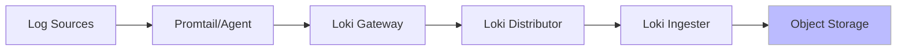
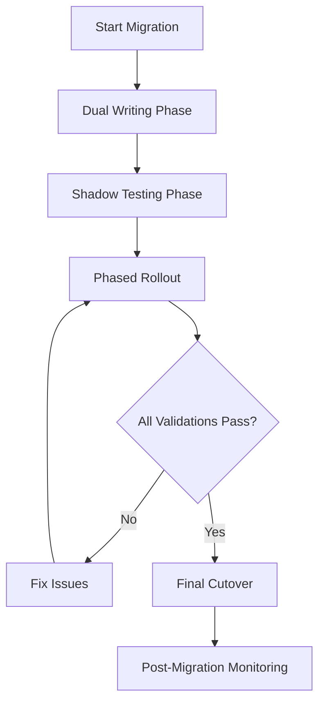

# Migration Validation

## Introduction

When migrating your logging infrastructure to Grafana Loki, validation is a critical final step that ensures your migration was successful. Migration validation involves verifying that your logs are being properly ingested, stored, and can be queried effectively in the new Loki environment. This process helps confirm that your migration strategy was implemented correctly and that your logging system meets all operational requirements.

In this guide, we'll explore why validation is essential, what aspects of your Loki deployment need validation, and provide practical approaches to verify your migration's success.

## Why Validation Matters

Validating your Loki migration is crucial for several reasons:

- **Data Integrity**: Ensures all logs are correctly transferred and accessible
- **Query Functionality**: Confirms that LogQL queries return expected results
- **Performance Assessment**: Verifies that the system meets performance requirements
- **Alerting Verification**: Ensures monitoring alerts work as expected
- **User Acceptance**: Builds confidence among team members using the new system

Without proper validation, you risk operational blindspots, missing data, or degraded monitoring capabilities that could impact your ability to troubleshoot issues in production.

## Key Validation Areas

### 1. Log Ingestion Validation

Confirming that logs are being properly ingested is the first step in validating your migration.



#### Validation Steps:

1. **Volume Verification**

Check that the expected volume of logs is being received:

```bash
# Using logcli to check ingestion rate
logcli query --from=1h "{job=\"system\"}" --analyze-labels
```

Expected output:
```
Active series: 326
Chunks: 1,432
Bytes: 38.2 MB
Labels with high cardinality:
instance (245 values)
```

2. **Label Verification**

Ensure that labels are correctly applied to incoming logs:

```bash
# List all label values for a specific label
logcli labels instance --from=1h
```

3. **Create a Test Log Entry**

Generate a unique, identifiable log entry and confirm it appears in Loki:

```bash
# Generate a test log with timestamp
echo "LOKI_MIGRATION_TEST_$(date +%s)" | logger -t migration-test

# Query for the test log
logcli query '{app="migration-test"} |= "LOKI_MIGRATION_TEST"' --from=5m
```

### 2. Query Performance Validation

Evaluate LogQL query performance against your requirements.

#### Validation Steps:

1. **Basic Query Testing**

Test basic log retrieval:

```bash
# Time a simple query
time logcli query '{job="nginx"}' --limit=1000 --from=1h
```

2. **Complex Query Testing**

Test more complex queries that use filters, regex, and aggregations:

```bash
# Complex query with parsing and filtering
logcli query '{job="nginx"} | json | status=~"5.." | rate[5m]' --from=1h
```

3. **Query Benchmark**

Create a script to benchmark different query patterns:

```python
import time
import subprocess

queries = [
    '{job="nginx"}',
    '{job="nginx"} |= "GET"',
    '{job="nginx"} | json | status >= 400',
    '{job="nginx"} | logfmt | duration > 200ms'
]

for query in queries:
    start = time.time()
    subprocess.run(["logcli", "query", query, "--from=1h", "--quiet"])
    duration = time.time() - start
    print(f"Query: {query} - Duration: {duration:.2f}s")
```

### 3. Data Retention Validation

Verify that your retention policies are correctly implemented.

#### Validation Steps:

1. **Retention Configuration Check**

Review your configured retention period:

```bash
# Check compactor config
kubectl get configmap -n loki loki-compactor-config -o yaml
```

2. **Historical Data Access**

Confirm that you can query logs at the boundaries of your retention period:

```bash
# Query oldest expected data
logcli query '{job="nginx"}' --from=30d --to=29d --limit=10
```

3. **Storage Utilization**

Monitor storage growth to ensure it aligns with expectations:

```bash
# If using Prometheus metrics
curl -s http://loki:3100/metrics | grep loki_ingester_memory_chunks
```

### 4. Comparison Validation

Compare query results between your old logging system and Loki to ensure data consistency.

#### Validation Steps:

1. **Query Equivalent Logs**

Run the same query in both systems and compare results:

```bash
# Example: Query in old system (e.g., Elasticsearch)
curl -s -X GET "elasticsearch:9200/logs/_search?q=service:api+AND+level:error&size=50"

# Equivalent query in Loki
logcli query '{service="api"} |= "error"' --limit=50
```

2. **Count Comparison**

Compare log counts between systems for the same time period:

```bash
# Create a script to compare counts
#!/bin/bash
OLD_COUNT=$(curl -s -X GET "elasticsearch:9200/logs/_count?q=timestamp:[2023-01-01 TO 2023-01-02]" | jq .count)
LOKI_COUNT=$(logcli query -q --from=2023-01-01T00:00:00Z --to=2023-01-02T00:00:00Z '{job="system"}' | wc -l)

echo "Old system log count: $OLD_COUNT"
echo "Loki log count: $LOKI_COUNT"
echo "Difference: $(($OLD_COUNT - $LOKI_COUNT))"
```

### 5. Alerting Validation

Verify that your alerting rules work properly with Loki.

#### Validation Steps:

1. **Rule Configuration Check**

Confirm your Prometheus alerting rules are correctly configured:

```yaml
# Example Loki alerting rule
groups:
  - name: loki_alerts
    rules:
      - alert: HighErrorRate
        expr: |
          sum(rate({job="nginx"} |= "ERROR" [5m])) by (job)
          /
          sum(rate({job="nginx"}[5m])) by (job)
          > 0.05
        for: 10m
        labels:
          severity: warning
        annotations:
          summary: High error rate detected
          description: "Error rate is {{ $value | humanizePercentage }} for {{ $labels.job }}"
```

2. **Controlled Test**

Generate test logs that should trigger an alert:

```bash
# Generate error logs that would trigger the alert
for i in {1..100}; do
  logger -t nginx "ERROR: Test error message $i"
  sleep 0.5
done
```

3. **Alert Verification**

Check that alerts fire appropriately:

```bash
# Check alert status in Prometheus
curl -s http://prometheus:9090/api/v1/alerts | jq
```

## Real-World Example: End-to-End Validation

Let's walk through a complete validation scenario for a web application migration to Loki.

### Scenario

You've migrated your web application logs from Elasticsearch to Grafana Loki. Now you want to validate that everything is working correctly.

### Validation Script

Here's a comprehensive validation script that you can adapt for your needs:

```bash
#!/bin/bash
# Loki Migration Validation Script

echo "=== Loki Migration Validation ==="
echo "Starting validation at $(date)"

# 1. Ingestion Validation
echo -e "
== Checking Log Ingestion =="
EXPECTED_JOBS=("nginx" "application" "database" "system")
for job in "${EXPECTED_JOBS[@]}"; do
  COUNT=$(logcli query -q --from=1h "{job=\"$job\"}" | wc -l)
  echo "Job '$job' logs in past hour: $COUNT"
  if [ $COUNT -eq 0 ]; then
    echo "WARNING: No logs found for job '$job'"
  fi
done

# 2. Label Validation
echo -e "
== Checking Label Schema =="
LABELS=$(logcli labels -q)
echo "Available labels: $LABELS"
REQUIRED_LABELS=("job" "instance" "environment" "service")
for label in "${REQUIRED_LABELS[@]}"; do
  if [[ ! "$LABELS" == *"$label"* ]]; then
    echo "WARNING: Required label '$label' not found"
  fi
done

# 3. Query Performance
echo -e "
== Testing Query Performance =="
QUERY='{job="nginx"} |= "GET /api"'
START=$(date +%s%N)
logcli query -q --from=1h "$QUERY" > /dev/null
END=$(date +%s%N)
DURATION=$(( ($END - $START) / 1000000 ))
echo "Query took $DURATION ms"
if [ $DURATION -gt 5000 ]; then
  echo "WARNING: Query performance exceeds 5000ms threshold"
fi

# 4. Data Consistency Test
echo -e "
== Testing Data Consistency =="
# Generate a unique test log
TEST_ID="MIGRATION_TEST_$(date +%s)"
echo "Generating test log with ID: $TEST_ID"
logger -t migration-test "$TEST_ID"
# Wait for log to be ingested
sleep 10
# Check if log appears in query
FOUND=$(logcli query -q --from=2m "{app=\"migration-test\"} |= \"$TEST_ID\"" | wc -l)
if [ $FOUND -gt 0 ]; then
  echo "Test log successfully found in Loki"
else
  echo "WARNING: Test log not found in Loki after 10 seconds"
fi

# 5. Dashboard Validation
echo -e "
== Validating Grafana Dashboards =="
DASHBOARD_IDS=(12345 12346 12347)  # Replace with your dashboard IDs
for id in "${DASHBOARD_IDS[@]}"; do
  HTTP_CODE=$(curl -s -o /dev/null -w "%{http_code}" "http://grafana:3000/api/dashboards/uid/$id")
  if [ $HTTP_CODE -eq 200 ]; then
    echo "Dashboard $id is accessible"
  else
    echo "WARNING: Dashboard $id returned HTTP $HTTP_CODE"
  fi
done

echo -e "
=== Validation Complete ==="
```

### Implementing a Gradual Cutover Strategy

During validation, it's often wise to implement a gradual cutover strategy:

1. **Dual Writing**: Send logs to both old and new systems
2. **Shadow Testing**: Query both systems and compare results
3. **Phased Rollout**: Migrate one service at a time, validating each
4. **Final Cutover**: Complete the migration after all validations pass



## Common Validation Issues and Solutions

| Issue | Symptoms | Solution |
|-------|----------|----------|
| Missing logs | Lower log volume than expected | Check Promtail configuration and target files |
| Label misconfiguration | Unable to query by expected labels | Review label extraction in Promtail config |
| Poor query performance | Slow query response times | Review cardinality, add appropriate indexes |
| Data retention issues | Unable to access older logs | Check compactor configuration and bucket storage |
| Inconsistent timestamps | Logs appear out of order | Verify timestamp parsing configuration |

## Validation Checklist

Use this checklist to ensure comprehensive validation:

- [ ] Log volume matches expected rates
- [ ] All required labels are present and correctly formatted
- [ ] Queries return expected results within performance requirements
- [ ] Historical data is accessible according to retention policy
- [ ] Alerts trigger appropriately when conditions are met
- [ ] Dashboards display data correctly and are performant
- [ ] End users can effectively search and analyze logs
- [ ] Data consistency between old and new systems is verified
- [ ] Error rates in the Loki components are within acceptable limits

## Summary

Migration validation is a critical step in ensuring your transition to Grafana Loki is successful. By systematically verifying log ingestion, query performance, data retention, and system integration, you can be confident that your logging infrastructure will meet your operational needs.

Remember that validation shouldn't be a one-time event. Continuous monitoring of your Loki deployment will help you identify and address issues as they arise, ensuring long-term success with your logging platform.

## Additional Resources

- Practice implementing the validation scripts provided in this guide
- Create a validation plan specific to your organization's logging needs
- Set up automated checks to continuously validate your Loki deployment
- Implement dashboards to monitor the health of your Loki instance