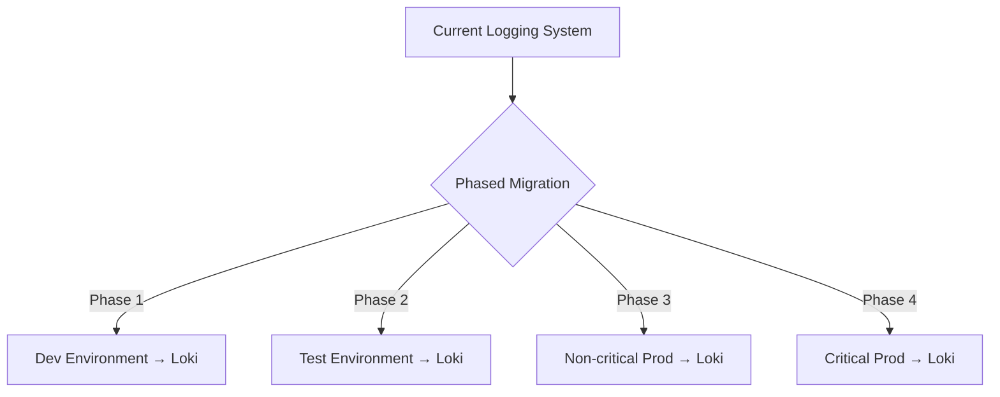
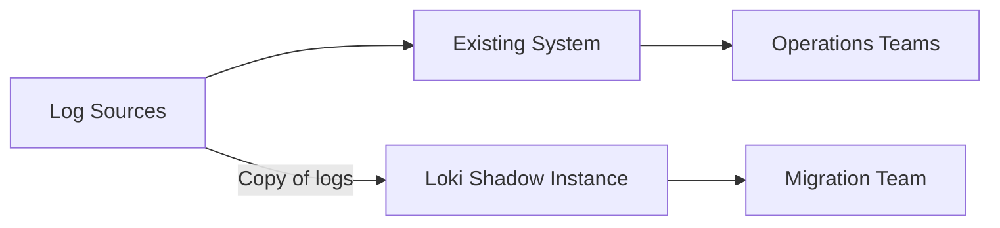

# Cutover Strategies

When migrating your logging solution to Grafana Loki, one of the most critical phases is the actual transition or "cutover" from your existing system. This process requires careful planning and execution to ensure continuity in your observability capabilities.

## What is a Cutover?

A cutover is the process of transitioning from one system to another, in this case, from your current logging solution to Grafana Loki. The cutover phase is when you actually switch your production workloads to start using the new system.

## Why Cutover Strategy Matters

A well-planned cutover strategy helps you:

- Minimize downtime and service disruption
- Maintain observability throughout the migration
- Reduce risks associated with the transition
- Ensure data continuity and completeness
- Build confidence in the new system

## Common Cutover Strategies for Loki Migration

Let's explore the main approaches for cutting over to Grafana Loki:

### 1. Big Bang Cutover

The big bang approach involves switching all systems to Loki at once, on a specific date and time.

<div className="strategy-box warning">
  <h4>⚠️ Approach with Caution</h4>
  <p>This strategy carries the highest risk but might be suitable for smaller environments.</p>
</div>

#### Characteristics:

- Full transition happens at once
- Shortest overall migration timeline
- Highest risk profile
- Requires the most intensive planning

#### Implementation Example:

```yaml
# Example Promtail configuration for big bang cutover
clients:
  - url: http://loki:3100/loki/api/v1/push
    
scrape_configs:
  - job_name: system
    static_configs:
    - targets:
        - localhost
      labels:
        job: varlogs
        __path__: /var/log/*log
```

After deployment, all logs immediately start flowing to Loki instead of your previous solution.

### 2. Phased Cutover

In a phased approach, you migrate different parts of your infrastructure to Loki in planned stages.

#### Characteristics:

- Gradual transition by application or infrastructure segment
- Medium overall timeline
- Moderate risk profile
- Allows for learning and adjustment between phases



#### Implementation Example:

For Phase 1 (Development Environment):

```yaml
# Promtail configuration for dev environment
clients:
  - url: http://loki:3100/loki/api/v1/push
    
scrape_configs:
  - job_name: dev-apps
    kubernetes_sd_configs:
      - role: pod
    relabel_configs:
      - source_labels: [__meta_kubernetes_namespace]
        action: keep
        regex: development
```

For each subsequent phase, you would update your configuration to include additional environments.

### 3. Parallel Processing (Dual-Write)

The parallel approach involves running both systems simultaneously for a period, with logs sent to both systems.

#### Characteristics:

- Lowest risk profile
- Longest overall timeline
- Provides a safety net
- Allows extensive validation before full cutover

#### Implementation Example:

```yaml
# Promtail configuration for dual-write
clients:
  - url: http://loki:3100/loki/api/v1/push
  - url: http://existing-system:8080/logs
    
scrape_configs:
  - job_name: dual-write
    static_configs:
    - targets:
        - localhost
      labels:
        job: application
        __path__: /var/log/app/*.log
```

With Vector:

```yaml
sources:
  app_logs:
    type: "file"
    include:
      - "/var/log/app/*.log"

sinks:
  loki:
    type: "loki"
    inputs: ["app_logs"]
    endpoint: "http://loki:3100"
    encoding:
      codec: "json"
  
  existing_system:
    type: "http"
    inputs: ["app_logs"]
    uri: "http://existing-system:8080/logs"
    encoding:
      codec: "json"
```

### 4. Shadow Mode

In shadow mode, you send logs to Loki in parallel but only use it for validation, while still relying on your existing system for operations.

#### Characteristics:

- Very low risk
- Validation-focused
- No immediate dependency on Loki
- Allows for thorough testing and optimization



#### Implementation Example:

Using Fluentd:

```ruby
<source>
  @type tail
  path /var/log/app/*.log
  tag app.logs
</source>

<match app.logs>
  @type copy
  <store>
    @type http
    endpoint http://existing-system:8080/logs
    format json
  </store>
  <store>
    @type loki
    url http://loki:3100
    extra_labels {"environment":"prod", "role":"shadow"}
  </store>
</match>
```

## Choosing the Right Cutover Strategy

Consider these factors when selecting your approach:

| Strategy | Risk Level | Timeline | Complexity | Best For |
|----------|------------|----------|------------|----------|
| Big Bang | High | Short | High | Small environments, tight deadlines |
| Phased | Medium | Medium | Medium | Most organizations |
| Parallel | Low | Long | High | Mission-critical systems |
| Shadow | Very Low | Longest | Medium | Risk-averse organizations |

## Implementing a Successful Cutover

### 1. Planning Phase

Before cutover:

- Establish success criteria
- Create a detailed timeline
- Identify dependencies
- Prepare rollback procedures
- Define monitoring metrics to validate the new system

### 2. Pre-Cutover Validation

```yaml
# Example validation query
{job="application"} |= "ERROR" 
| rate(5m) 
| compare with previous_system_metrics
```

Check that:
- Log volumes match between systems
- Query performance meets requirements
- Alert functionality works as expected
- Retention policies are correctly applied

### 3. Execution

During cutover:

```bash
# Example commands for monitoring cutover progress
# Check log ingestion rates to Loki
curl -s http://loki:3100/api/v1/query?query=sum\(rate\({job=\"varlogs\"}[5m]\)\)

# Verify log content is arriving
curl -s http://loki:3100/api/v1/query?query={job=\"varlogs\"} | head
```

### 4. Post-Cutover Activities

After cutover:
- Verify all data is flowing correctly
- Run validation queries and compare results
- Check dashboard functionality
- Confirm alerts are functioning
- Document any issues and resolutions

## Real-World Example: Migrating from Elasticsearch to Loki

Let's walk through a practical example of migrating from Elasticsearch to Loki using a phased approach:

### Phase 1: Infrastructure Setup

```yaml
# Docker Compose excerpt for Loki setup
version: '3'
services:
  loki:
    image: grafana/loki:2.8.0
    ports:
      - "3100:3100"
    volumes:
      - ./loki-config.yaml:/etc/loki/local-config.yaml
    command: -config.file=/etc/loki/local-config.yaml
```

### Phase 2: Dual-Write Configuration

Using Vector to send logs to both Elasticsearch and Loki:

```yaml
sources:
  app_logs:
    type: "file"
    include:
      - "/var/log/application/*.log"
    
transforms:
  parse_json:
    type: "remap"
    inputs: ["app_logs"]
    source: |
      . = parse_json!(.message)

sinks:
  elasticsearch:
    type: "elasticsearch"
    inputs: ["parse_json"]
    endpoint: "http://elasticsearch:9200"
    index: "logs-%Y.%m.%d"
  
  loki:
    type: "loki"
    inputs: ["parse_json"]
    endpoint: "http://loki:3100"
    labels:
      application: "my-app"
      environment: "production"
```

### Phase 3: Validation

Create a Grafana dashboard that compares metrics from both systems:

```javascript
// Example Grafana query for comparison
// Elasticsearch query
{
  "query": "level:error",
  "index": "logs-*"
}

// Equivalent Loki query
{application="my-app"} |= "level=error"
```

### Phase 4: Gradual Traffic Shift

Update Vector configuration to send increasing percentages of logs to Loki:

```yaml
# Vector configuration for traffic shifting
sinks:
  elasticsearch:
    type: "elasticsearch"
    inputs: ["parse_json"]
    endpoint: "http://elasticsearch:9200"
    index: "logs-%Y.%m.%d"
    healthcheck:
      enabled: true
    
  loki:
    type: "loki"
    inputs: ["parse_json"]
    endpoint: "http://loki:3100"
    labels:
      application: "my-app"
      environment: "production"
```

For routing with sampling, you would need to implement custom routing logic in your log forwarder.

### Phase 5: Complete Cutover

Final Vector configuration after cutover:

```yaml
sources:
  app_logs:
    type: "file"
    include:
      - "/var/log/application/*.log"
    
transforms:
  parse_json:
    type: "remap"
    inputs: ["app_logs"]
    source: |
      . = parse_json!(.message)

sinks:
  loki:
    type: "loki"
    inputs: ["parse_json"]
    endpoint: "http://loki:3100"
    labels:
      application: "my-app"
      environment: "production"
```

## Common Challenges and Solutions

### Challenge: Log Volume Discrepancies

**Problem:** Log counts differ between old and new systems.

**Solution:**
```yaml
# Add specific debugging to trace log flow
- job_name: volume_tracking
  static_configs:
  - targets:
      - localhost
    labels:
      debug: volume_tracking
      __path__: /var/log/app/*.log
```

### Challenge: Schema Mapping

**Problem:** Field structures differ between systems.

**Solution:**
```yaml
# Use transformations to map fields correctly
transforms:
  normalize_schema:
    type: "remap"
    inputs: ["app_logs"]
    source: |
      # Map Elasticsearch fields to Loki format
      .timestamp = .@timestamp
      ._labels.level = .log.level
      ._labels.service = .service.name
      del(.@timestamp)
```

### Challenge: Query Syntax Differences

**Problem:** Teams familiar with old query syntax struggle with LogQL.

**Solution:** Create a query translation guide:

```
# Elasticsearch to LogQL Examples
Elasticsearch: message:error AND service:billing
LogQL: {service="billing"} |= "error"

Elasticsearch: status:[400 TO 599]
LogQL: {job="nginx"} | json | status >= 400 and status < 600
```

## Summary

Choosing the right cutover strategy is crucial for a successful migration to Grafana Loki. Here's what we covered:

- **Big Bang Cutover**: Quick but risky, suitable for simple environments
- **Phased Cutover**: Balanced approach for most organizations
- **Parallel Processing**: Safest but requires more resources
- **Shadow Mode**: Lowest risk for initial validation

Remember that your migration is only as good as your cutover planning. Take time to:
1. Thoroughly test before cutting over
2. Prepare rollback procedures
3. Monitor carefully during and after cutover
4. Document your process for future migrations

## Additional Resources

- Try the [Loki Query Builder](https://grafana.com/docs/loki/latest/logql/query_examples/) to practice LogQL
- Set up a test environment with [Loki's Docker Compose](https://grafana.com/docs/loki/latest/installation/docker/)
- Practice writing dual-write configurations with different log shippers

## Exercises

1. Design a phased cutover plan for a hypothetical application with three components: a database, API service, and frontend.
2. Write a Vector configuration that sends logs to both Elasticsearch and Loki with appropriate field mapping.
3. Create a validation checklist that would help ensure your Loki migration is successful.
4. Draft a rollback procedure in case issues are encountered during cutover.