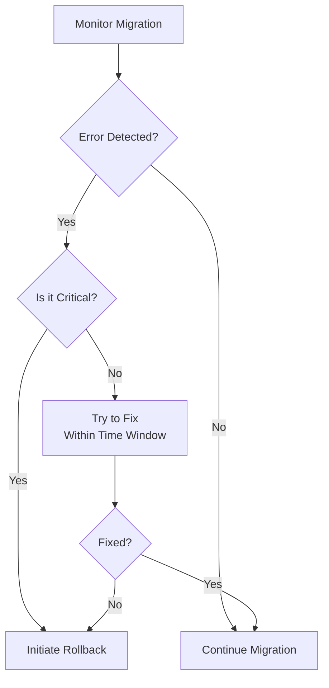

# Rollback Planning

## Introduction

When migrating between different versions of Grafana Loki or implementing significant changes to your logging infrastructure, having a robust rollback plan is essential. A rollback plan acts as your safety net, allowing you to quickly revert to a previous, known-working state when unexpected issues arise during or after migration.

In this guide, we'll explore the importance of rollback planning specifically for Grafana Loki migrations, how to create an effective rollback strategy, and provide practical examples for different migration scenarios.

## Why Rollback Planning Matters

Even with thorough testing, migrations can encounter unexpected issues in production environments due to:

- Differences between testing and production environments
- Unanticipated load patterns
- Unforeseen compatibility issues
- Hardware/infrastructure failures
- Configuration errors

A well-defined rollback plan helps minimize downtime, preserve data integrity, and maintain system reliability when these issues occur.

## Components of an Effective Rollback Plan

### 1. Pre-Migration Backups

Before any migration, ensure you have complete backups of:

```bash
# Example backup command for Loki configuration files
$ mkdir -p /backup/loki/config/$(date +%Y%m%d)
$ cp /etc/loki/local-config.yaml /backup/loki/config/$(date +%Y%m%d)/

# Example command to create a snapshot of your storage
$ loki-tool snapshot create --storage.path=/var/loki/chunks --destination=/backup/loki/snapshots/$(date +%Y%m%d)
```

The key elements to back up include:
- Configuration files
- Index data
- Stored log chunks
- Compactor state (if using compaction)
- Any custom dashboards or alerts

### 2. Decision Triggers

Define clear conditions that would trigger a rollback:



Example decision triggers might include:
- Error rates exceeding 0.5% of requests
- Query latency increasing by more than 100ms at p95
- Inability to ingest logs for more than 2 minutes
- Data corruption or loss detected
- Critical dashboards failing to load

### 3. Rollback Procedure Documentation

Document the exact steps needed to roll back, with explicit command examples:

```bash
# Example rollback script to restore configuration and restart service
#!/bin/bash
set -e

# 1. Stop the current Loki service
sudo systemctl stop loki

# 2. Restore the previous configuration
sudo cp /backup/loki/config/20240215/local-config.yaml /etc/loki/

# 3. Restore previous binary (if version change)
sudo cp /backup/loki/bin/loki-2.8.2 /usr/local/bin/loki

# 4. Restart the service
sudo systemctl start loki

# 5. Verify service is healthy
curl -s http://localhost:3100/ready || echo "Service failed to restart properly"
```

### 4. Testing the Rollback Plan

Never assume a rollback plan will work without testing. Validate the plan in a staging environment:

```bash
# Create a test environment mimicking production
$ docker-compose -f loki-test-env.yaml up -d

# Simulate your migration
$ ./upgrade-loki.sh

# Simulate a failure
$ ./inject-test-failure.sh

# Execute rollback procedure
$ ./rollback.sh

# Verify system returns to healthy state
$ ./verify-health.sh
```

## Real-World Rollback Scenarios

### Scenario 1: Version Upgrade Rollback

When upgrading from Loki 2.7 to 2.8, you encounter issues with the new compactor configuration:

```yaml
# New configuration causing issues in 2.8
compactor:
  working_directory: /loki/compactor
  shared_store: s3
  compaction_interval: 2h
```

Rollback steps:

1. Stop the Loki service:
   ```bash
   $ sudo systemctl stop loki
   ```

2. Reinstall the previous version binary:
   ```bash
   $ sudo dpkg -i loki_2.7.5_amd64.deb
   ```

3. Restore the previous configuration:
   ```bash
   $ sudo cp /backup/loki/config/20240215/local-config.yaml /etc/loki/
   ```

4. Restart the service:
   ```bash
   $ sudo systemctl start loki
   ```

5. Verify the service is running correctly:
   ```bash
   $ curl -s http://localhost:3100/ready
   $ curl -s http://localhost:3100/metrics | grep loki_build_info
   ```

### Scenario 2: Storage Migration Rollback

When migrating from local storage to object storage:

```yaml
# New storage configuration
storage_config:
  boltdb_shipper:
    active_index_directory: /loki/index
    cache_location: /loki/cache
    shared_store: s3
  aws:
    s3: s3://loki-logs:password@minio:9000/loki-data
    s3forcepathstyle: true
```

Rollback steps:

1. Stop the Loki service:
   ```bash
   $ sudo systemctl stop loki
   ```

2. Restore the previous storage configuration:
   ```bash
   $ sudo cp /backup/loki/config/20240301/local-config.yaml /etc/loki/
   ```

3. If needed, restore the local chunks from backup:
   ```bash
   $ sudo rsync -av /backup/loki/chunks/20240301/ /var/loki/chunks/
   ```

4. Restart the service:
   ```bash
   $ sudo systemctl start loki
   ```

5. Verify the logs are accessible:
   ```bash
   $ curl -s -H "Content-Type: application/json" -X POST -d '{"query":"{job=\"test\"}"}' http://localhost:3100/loki/api/v1/query_range
   ```

### Scenario 3: Configuration Change Rollback

When changing query limits configurations:

```yaml
# New query configuration causing problems
limits_config:
  max_entries_limit_per_query: 10000
  max_query_parallelism: 32
  max_query_series: 500
```

Rollback steps:

1. Identify the problematic configuration:
   ```bash
   $ grep -A 10 "limits_config" /etc/loki/local-config.yaml
   ```

2. Restore the previous configuration:
   ```bash
   $ sudo cp /backup/loki/config/20240310/local-config.yaml /etc/loki/
   ```

3. Reload Loki configuration (if your version supports it) or restart:
   ```bash
   $ curl -X POST http://localhost:3100/-/reload
   # Or restart if reload isn't supported
   $ sudo systemctl restart loki
   ```

4. Verify the query performance has returned to normal:
   ```bash
   $ time curl -s -H "Content-Type: application/json" -X POST -d '{"query":"{job=\"high-volume\"}","limit":1000}' http://localhost:3100/loki/api/v1/query_range
   ```

## Best Practices for Rollback Planning

1. **Document Everything**: Maintain detailed documentation of your current setup before migration.

2. **Automate Where Possible**: Create scripts for both the migration and rollback procedures.

3. **Test in Staging First**: Always validate migrations and rollbacks in a staging environment.

4. **Backup Before Migration**: Create comprehensive backups before beginning any migration.

5. **Monitoring During Migration**: Set up specific monitoring to detect issues during and after migration.

6. **Gradual Rollout**: Consider rolling out changes to a subset of your infrastructure first.

7. **Time Windows**: Schedule migrations during low-traffic periods.

8. **Define Success/Failure Criteria**: Establish clear metrics to determine if a migration is successful.

## Common Rollback Challenges

### 1. Data Loss During Rollback

When rolling back, you might encounter data loss for logs ingested after the migration. To mitigate this:

```yaml
# Temporary dual-write configuration during migration
schema_config:
  configs:
    - from: 2023-01-01
      store: boltdb-shipper
      object_store: filesystem
      schema: v12
      index:
        prefix: index_
        period: 24h
```

### 2. Schema Compatibility Issues

Schema changes can be particularly challenging to roll back:

```bash
# Check for schema compatibility issues before rolling back
$ loki-tool verify-index --index-path=/var/loki/index --schema-version=v11
```

### 3. Dependent Systems

Remember that other systems might be affected by your rollback:

```yaml
# Grafana dashboard configuration that might need adjustment after rollback
apiVersion: 1
datasources:
  - name: Loki
    type: loki
    url: http://loki:3100
    version: 1
    editable: false
```

## Summary

Effective rollback planning is a critical component of any successful Grafana Loki migration strategy. By creating comprehensive backups, defining clear decision triggers, documenting detailed rollback procedures, and testing your plans thoroughly, you can minimize the impact of migration issues and ensure the reliability of your logging infrastructure.

Remember:
- A good rollback plan is one you never need to use, but should always have ready
- Test your rollback procedures as thoroughly as you test your migrations
- Document everything, including decision criteria for when to roll back
- Automate as much of the process as possible to reduce human error

## Exercises

1. Create a rollback plan for upgrading your current Loki version to the latest release.
2. Design decision triggers specific to your environment and usage patterns.
3. Write and test a rollback script for a configuration change in your Loki deployment.
4. Practice a simulated rollback in your test environment, timing how long it takes to restore service.

## Additional Resources

- [Grafana Loki Documentation](https://grafana.com/docs/loki/latest/)
- [Loki Configuration Reference](https://grafana.com/docs/loki/latest/configuration/)
- [Loki Storage Documentation](https://grafana.com/docs/loki/latest/operations/storage/)
- [Loki Troubleshooting Guide](https://grafana.com/docs/loki/latest/operations/troubleshooting/)