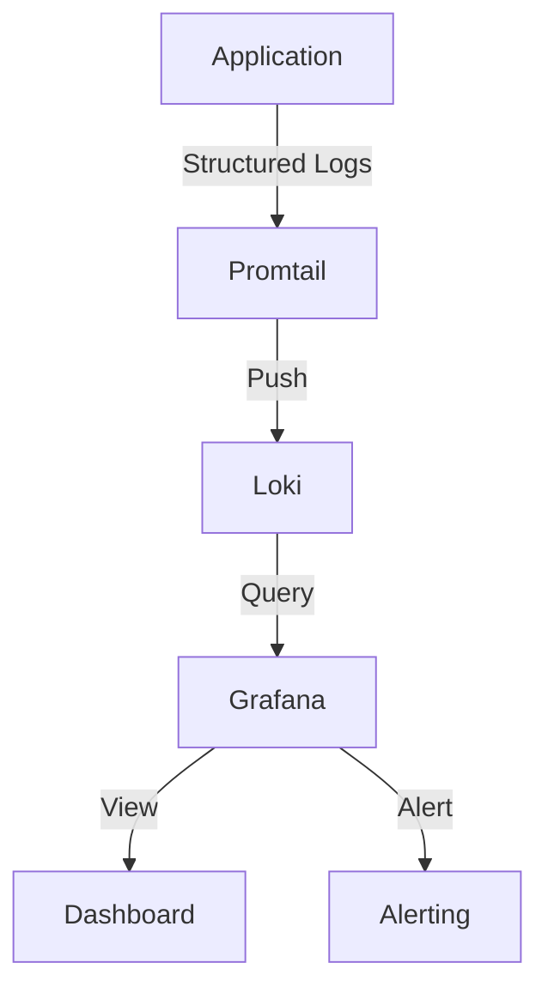

# Logging Standards

## Introduction

Logs are one of the most fundamental tools for understanding how applications behave. However, without proper structure and consistency, logs can quickly become a chaotic mess that hinders rather than helps troubleshooting efforts. This is especially true when working with Grafana Loki, a horizontally-scalable, highly-available log aggregation system.

In this guide, we'll explore logging standards and best practices that will help you create consistent, searchable, and valuable logs that integrate seamlessly with Grafana Loki. These standards will enable you to extract maximum value from your logging data and improve your observability capabilities.

## Why Logging Standards Matter

Before diving into specific standards, let's understand why they're crucial:

1. **Consistency** - Standardized logs are easier to parse, search, and analyze
2. **Efficiency** - Well-structured logs reduce the time spent on troubleshooting
3. **Scalability** - Standards become increasingly important as your system grows
4. **Integration** - Properly formatted logs work better with tools like Grafana Loki

## Key Components of Effective Logging Standards

### 1. Log Levels

Log levels help categorize log entries by their severity and importance. A good logging framework should support at least these standard levels:

| Level | Description | When to Use |
|-------|-------------|-------------|
| ERROR | Critical issues that require immediate attention | Application crashes, service unavailability |
| WARN | Potential issues that don't stop the application | Deprecated features, performance issues |
| INFO | Normal operational messages | Service startup/shutdown, significant operations |
| DEBUG | Detailed information useful for debugging | Function entry/exit, variable values |
| TRACE | Extremely detailed information | Step-by-step execution, rare edge cases |

When using Loki, setting appropriate log levels helps with filtering and creating meaningful alerts.

```javascript
// Example of using different log levels in JavaScript
logger.error("Database connection failed", { error: err });
logger.warn("API rate limit approaching", { currentRate: rate });
logger.info("User logged in successfully", { userId: user.id });
logger.debug("Processing request payload", { payload: req.body });
logger.trace("Entering function", { args: arguments });
```

### 2. Structured Logging

Grafana Loki works best with structured logs. Instead of plain text, structure your logs as JSON objects or another structured format. This allows for easier querying and extraction of specific fields.

```python
# Plain text logging (not recommended)
logger.info("User 123 made a purchase of $59.99 for product XYZ")

# Structured logging (recommended)
logger.info("User made purchase", {
    "userId": "123",
    "amount": 59.99,
    "productId": "XYZ",
    "timestamp": "2023-05-15T14:22:31Z"
})
```

With structured logging, you can create powerful LogQL queries in Loki:

```
{app="my-shop"} | json | amount > 50 | userId="123"
```

### 3. Standardized Timestamp Format

Use ISO 8601 (YYYY-MM-DDTHH:MM:SSZ) for timestamps to ensure consistency across your logging infrastructure:

```
2023-05-15T14:22:31.123Z
```

Many logging libraries can be configured to output timestamps in this format automatically:

```java
// Java example with Log4j2
Configuration configuration = ConfigurationFactory.newConfigurationBuilder()
    .setProperty("pattern", "%d{ISO8601} [%t] %-5level %logger{36} - %msg%n")
    .build();
```

### 4. Contextual Information

Always include relevant context in your logs to make them actionable:

- **Request ID** - A unique identifier for tracking requests across services
- **User ID** - The identifier of the affected user (when applicable)
- **Service Name** - The name of the service generating the log
- **Instance ID** - For containerized or scaled applications
- **Version** - Software version information

```go
// Go example
logger.WithFields(log.Fields{
    "requestId": "abc-123-xyz",
    "userId": user.ID,
    "service": "payment-processor",
    "instance": os.Getenv("HOSTNAME"),
    "version": "v1.2.3",
}).Info("Payment processed successfully")
```

## Implementing Logging Standards for Loki

Let's look at a more comprehensive example of implementing logging standards in a Node.js application using `winston` logger and integrating with Loki:

```javascript
const winston = require('winston');
const LokiTransport = require('winston-loki');

// Define a custom format for structured logging
const structuredFormat = winston.format.combine(
  winston.format.timestamp({
    format: 'YYYY-MM-DDTHH:mm:ss.SSSZ'
  }),
  winston.format.errors({ stack: true }),
  winston.format.json()
);

// Create the logger with multiple transports
const logger = winston.createLogger({
  level: process.env.LOG_LEVEL || 'info',
  defaultMeta: { 
    service: 'user-service',
    version: process.env.SERVICE_VERSION || '1.0.0',
    environment: process.env.NODE_ENV || 'development'
  },
  transports: [
    // Console output for local development
    new winston.transports.Console({
      format: winston.format.combine(
        winston.format.colorize(),
        winston.format.simple()
      )
    }),
    // Loki transport for production
    new LokiTransport({
      host: process.env.LOKI_HOST || 'http://loki:3100',
      labels: { job: 'user-service' },
      format: structuredFormat,
      replaceTimestamp: false,
      batching: true,
      interval: 5,
      clearOnError: false
    })
  ]
});

// Usage example
function processUserLogin(user, context) {
  logger.debug('Processing login attempt', { 
    userId: user.id,
    loginMethod: context.method,
    requestId: context.requestId,
    ipAddress: context.ip
  });
  
  // Login logic here...
  
  if (loginSuccessful) {
    logger.info('User logged in successfully', { 
      userId: user.id,
      requestId: context.requestId
    });
  } else {
    logger.warn('Login failed', { 
      userId: user.id,
      reason: 'Invalid credentials',
      attemptCount: user.failedLoginAttempts,
      requestId: context.requestId
    });
  }
}
```

## Log Label Standardization for Loki

Loki works best when you establish consistent label naming and usage patterns. Here are some recommended standards:

1. **Use a limited set of labels** - Loki performs better with fewer unique label combinations
2. **Focus on high-cardinality fields** - Use labels for service names, environments, but not for user IDs or request IDs
3. **Be consistent with label naming** - Use snake_case or camelCase, but be consistent

```yaml
# Promtail config example
scrape_configs:
  - job_name: application_logs
    static_configs:
      - targets:
          - localhost
        labels:
          job: application
          env: production
          app: user_service
          component: api
    pipeline_stages:
      - json:
          expressions:
            level: level
            timestamp: timestamp
            message: message
            userID: userID
            requestID: requestID
      - labels:
          level:
          component:
      - timestamp:
          source: timestamp
          format: RFC3339
      - output:
          source: message
```

## Visualizing Logs in Grafana

When your logs follow consistent standards, creating meaningful dashboards in Grafana becomes much easier:



Example LogQL queries to create visualizations:

```
# Error rate over time
sum(count_over_time({app="user-service", level="error"}[5m])) by (component)

# Top users experiencing errors
topk(10, sum by (userId) (count_over_time({app="user-service", level="error"}[24h])))

# Latency parsed from logs
rate({app="user-service"} | json | response_time > 0 [5m]) by (endpoint)
```

## Common Logging Anti-Patterns to Avoid

1. **Inconsistent formatting** - Mixing structured and unstructured logs
2. **Sensitive information in logs** - Never log passwords, tokens, or personally identifiable information
3. **Too verbose or too quiet** - Find the right balance in log verbosity
4. **Missing context** - Logs without context are difficult to troubleshoot
5. **Too many labels in Loki** - Creates performance issues

## Setting Up Logging Standards for Your Team

To implement logging standards across your organization:

1. **Create a logging style guide** - Document your standards
2. **Develop shared logging libraries** - Enforce standards programmatically
3. **Review logs in code reviews** - Ensure standards are followed
4. **Automate validation** - Use linters or other tools to check log format
5. **Provide training** - Ensure everyone understands the importance of standards

## Practical Exercise: Implementing Structured Logging

Try implementing these standards in your application:

1. Replace string concatenation with structured logging
2. Add consistent contextual information
3. Configure your logging framework to output ISO 8601 timestamps
4. Set up Promtail to extract labels from your structured logs
5. Create a Grafana dashboard that uses your newly structured logs

## Summary

Establishing and following logging standards is crucial for effectively using Grafana Loki. Well-structured logs improve troubleshooting efficiency, enable powerful querying capabilities, and help create meaningful visualizations and alerts.

Key takeaways:
- Use structured logging (preferably JSON)
- Include contextual information in every log
- Standardize log levels and their usage
- Be strategic with Loki labels
- Maintain consistent timestamp formats
- Avoid common anti-patterns

By implementing these standards, you'll transform your logs from a chaotic mess into a valuable observability asset that helps you understand and improve your applications.

## Additional Resources

- [Grafana Loki Documentation](https://grafana.com/docs/loki/latest/)
- [LogQL Query Language Reference](https://grafana.com/docs/loki/latest/logql/)
- [Promtail Configuration](https://grafana.com/docs/loki/latest/clients/promtail/configuration/)
- [Logging Best Practices](https://www.datadoghq.com/blog/logging-best-practices/)