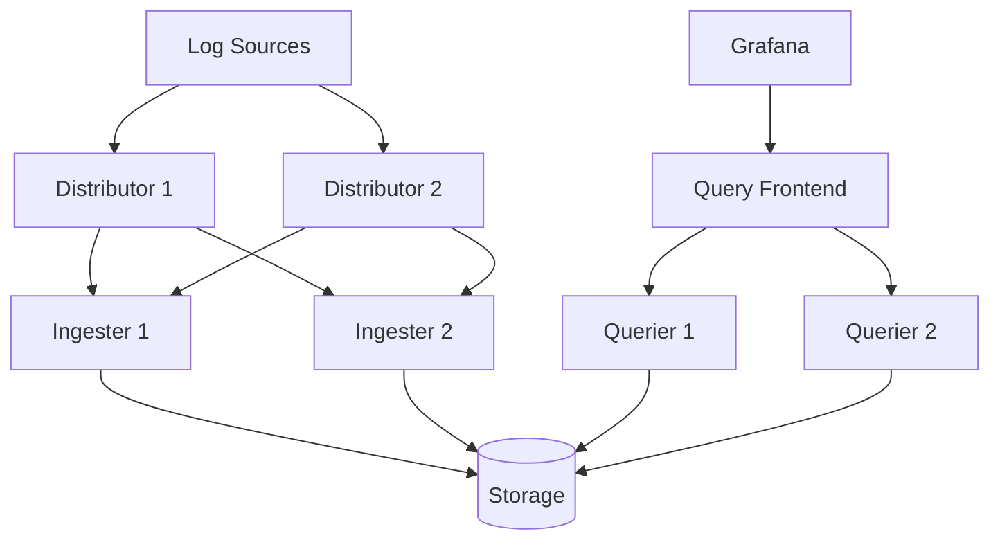

# Operational Guidelines for Grafana Loki

## Introduction

Operating Grafana Loki in a production environment requires careful planning and adherence to best practices to ensure reliability, performance, and scalability. This guide covers essential operational considerations for running Loki effectively, from resource allocation to monitoring and troubleshooting techniques. Whether you're deploying Loki for the first time or looking to optimize an existing installation, these guidelines will help you maintain a healthy logging system.

## Resource Planning

### Hardware Requirements

Loki has different resource profiles depending on which component you're running. Understanding these requirements helps in effective capacity planning:

- **Distributor**: CPU-intensive component that handles incoming log streams
- **Ingester**: Memory-intensive component that buffers logs before writing to storage
- **Querier**: CPU and memory-intensive component that processes queries
- **Query Frontend**: Lightweight component that manages query scheduling
- **Compactor**: Batch processing component with moderate resource needs

Here's a basic starting point for a small-to-medium deployment:

| Component | CPU | Memory | Disk |
|-----------|-----|--------|------|
| Distributor | 2 cores | 2-4 GB | Minimal |
| Ingester | 2 cores | 8-16 GB | 30-100 GB |
| Querier | 2-4 cores | 8-16 GB | Minimal |
| Query Frontend | 1 core | 2 GB | Minimal |
| Compactor | 2 cores | 4-8 GB | 10-20 GB |

### Storage Considerations

Loki's storage can be configured in multiple ways:

```yaml
storage_config:
  boltdb_shipper:
    active_index_directory: /loki/index
    cache_location: /loki/index_cache
    shared_store: s3
  aws:
    s3: s3://region/bucket
    dynamodb:
      dynamodb_url: dynamodb://region
```

When estimating storage needs, consider:

- Log volume per day
- Retention period
- Compression ratio (Loki achieves good compression for text logs)
- Index size (typically 1-10% of total log size)

A general formula for approximating storage:

```
Daily Storage = Daily Log Volume × (1 + Index Ratio) × Compression Factor
Total Storage = Daily Storage × Retention Period
```

## Scalability Considerations

### Horizontal Scaling

Loki is designed to scale horizontally. Each component can be scaled independently based on workload demands:



Key scaling recommendations:

1. **Distributors**: Scale based on log ingestion rate
2. **Ingesters**: Scale based on memory requirements for buffers
3. **Queriers**: Scale based on query load and complexity
4. **Query Frontend**: Less critical to scale, but add redundancy

### Microservices vs. Monolithic Deployment

Loki can be deployed in two primary modes:

- **Monolithic**: All components run in a single process
- **Microservices**: Components run as separate processes

For smaller deployments, the monolithic mode is simpler. For larger environments, microservices offer better scaling properties.

Monolithic configuration example:

```yaml
auth_enabled: false

server:
  http_listen_port: 3100

schema_config:
  configs:
    - from: 2020-10-24
      store: boltdb-shipper
      object_store: s3
      schema: v11
      index:
        prefix: index_
        period: 24h

common:
  path_prefix: /loki
  replication_factor: 1
  storage:
    s3:
      endpoint: s3:9000
      insecure: true
      bucketnames: loki-data
      access_key_id: loki
      secret_access_key: supersecret
      s3forcepathstyle: true
```

## Monitoring Loki

### Essential Metrics

Loki exposes Prometheus metrics on `/metrics`. Key metrics to monitor:

| Metric | Purpose | Alert Threshold |
|--------|---------|----------------|
| `loki_distributor_bytes_received_total` | Ingestion volume | Sudden changes |
| `loki_ingester_memory_chunks` | Chunks in memory | >80% of capacity |
| `loki_ingester_chunk_store_index_entries_per_chunk` | Index efficiency | >100,000 |
| `loki_query_frontend_queue_length` | Query backlog | Sustained >10 |
| `loki_request_duration_seconds` | Request latency | 99th percentile >5s |

Example Prometheus alert:

```yaml
groups:
- name: loki_alerts
  rules:
  - alert: LokiIngesterMemoryChunks
    expr: sum(loki_ingester_memory_chunks) by (namespace, job) > 80000
    for: 15m
    labels:
      severity: warning
    annotations:
      summary: "High memory usage in Loki ingester"
      description: "Loki ingester {{ $labels.job }} in {{ $labels.namespace }} has high memory chunk count"
```

### Dashboard Example

Create a Grafana dashboard to visualize Loki's health:

```javascript
// Dashboard JSON snippet (key panels)
{
  "panels": [
    {
      "title": "Request Rate",
      "targets": [
        {
          "expr": "sum(rate(loki_request_duration_seconds_count[5m])) by (route)"
        }
      ]
    },
    {
      "title": "Error Rate",
      "targets": [
        {
          "expr": "sum(rate(loki_request_duration_seconds_count{status_code=~\"5..\"}[5m])) by (route) / sum(rate(loki_request_duration_seconds_count[5m])) by (route)"
        }
      ]
    }
  ]
}
```

## Performance Tuning

### Query Optimization

Loki queries can be resource-intensive. Follow these best practices:

1. **Use Labels Efficiently**: Query by label first, filter by text second:

```logql
{app="frontend", env="prod"} |= "error" | json
```

2. **Limit Time Ranges**: Narrow time ranges to reduce data scanned:

```logql
{app="frontend"} |= "error" [5m]
```

3. **Use Line Filters Early**: Apply text filters early in the query pipeline:

```logql
{app="frontend"} |= "error" | json | line_format "{{.message}}"
```

### Chunk Cache Configuration

Configure chunk cache to improve query performance:

```yaml
chunk_store_config:
  max_look_back_period: 168h

table_manager:
  retention_deletes_enabled: true
  retention_period: 168h

limits_config:
  enforce_metric_name: false
  reject_old_samples: true
  reject_old_samples_max_age: 168h
  max_query_length: 721h
  
frontend:
  compress_responses: true
  
frontend_worker:
  frontend_address: query-frontend.loki:9095

querier:
  engine:
    timeout: 3m
    max_look_back_period: 30s
```

## Troubleshooting Common Issues

### High Cardinality Problems

High cardinality (too many label values) can cause performance issues. Identify with:

```logql
topk(10, count by (__name__) ({app="high-cardinality-app"}))
```

Solutions:
- Remove high cardinality labels from your log pipeline
- Use dynamic labels sparingly
- Consider using derived metrics instead of high-cardinality logs

### Ingestion Failures

If logs aren't appearing in Loki:

1. Check Distributor logs for errors
2. Verify Ingester has sufficient memory
3. Check for rate limiting issues:

```yaml
limits_config:
  ingestion_rate_mb: 10
  ingestion_burst_size_mb: 20
  max_global_streams_per_user: 5000
  max_entries_limit_per_query: 10000
```

### Query Timeouts

For queries that time out:

1. Reduce the time range
2. Add more specific label filters
3. Use the `logql.split-queries-by-interval` parameter:

```bash
curl -G -s "http://localhost:3100/loki/api/v1/query_range" \
  --data-urlencode "query={app=\"myapp\"}" \
  --data-urlencode "start=1602181800" \
  --data-urlencode "end=1602182100" \
  --data-urlencode "step=60" \
  --data-urlencode "logql.split-queries-by-interval=1h"
```

## Backup and Disaster Recovery

### Backup Strategy

Loki's storage can be backed up at the object storage level:

1. **Index Files**: Regularly back up the index store
2. **Chunks**: Back up chunk files from object storage
3. **Configuration**: Store configuration files in version control

Example backup script for S3:

```bash
#!/bin/bash
# Backup Loki chunks and index
AWS_REGION=us-west-2
BUCKET=loki-data
BACKUP_BUCKET=loki-backup

# Sync chunks and index
aws s3 sync \
  s3://$BUCKET/ \
  s3://$BACKUP_BUCKET/$(date +%Y-%m-%d)/ \
  --region $AWS_REGION
```

### Recovery Procedure

To recover from a disaster:

1. Restore object storage data
2. Deploy Loki with the same configuration
3. Point to the restored storage locations

```yaml
storage_config:
  boltdb_shipper:
    active_index_directory: /loki/index
    cache_location: /loki/index_cache
    shared_store: s3
  aws:
    s3: s3://region/restored-bucket
    s3forcepathstyle: true
```

## Summary

Operating Grafana Loki effectively requires attention to several key areas:

- Proper resource planning and allocation
- Strategic scaling based on workload demands
- Comprehensive monitoring of system health
- Query optimization and performance tuning
- Proactive troubleshooting of common issues
- Regular backup and disaster recovery testing

By following these operational guidelines, you can ensure that your Loki deployment remains reliable, performant, and scalable as your logging needs grow.

## Additional Resources

- [Official Loki Documentation](https://grafana.com/docs/loki/latest/)
- [LogQL Query Language Reference](https://grafana.com/docs/loki/latest/logql/)
- [Loki Architecture Documentation](https://grafana.com/docs/loki/latest/fundamentals/architecture/)

## Exercises

1. Configure a basic Loki monitoring dashboard in Grafana that tracks key metrics.
2. Simulate a high cardinality problem and implement a solution to reduce cardinality.
3. Create a backup and recovery plan for your Loki deployment.
4. Implement a query optimization strategy for a LogQL query that's timing out.
5. Design a scaling plan for Loki components based on different workload scenarios.