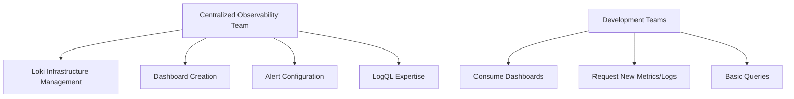
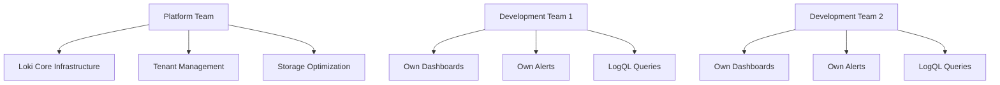
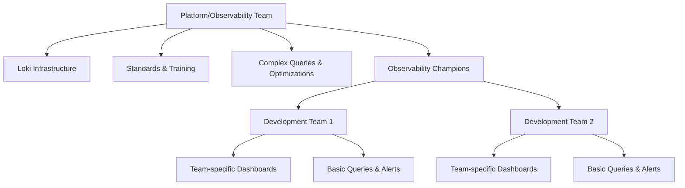
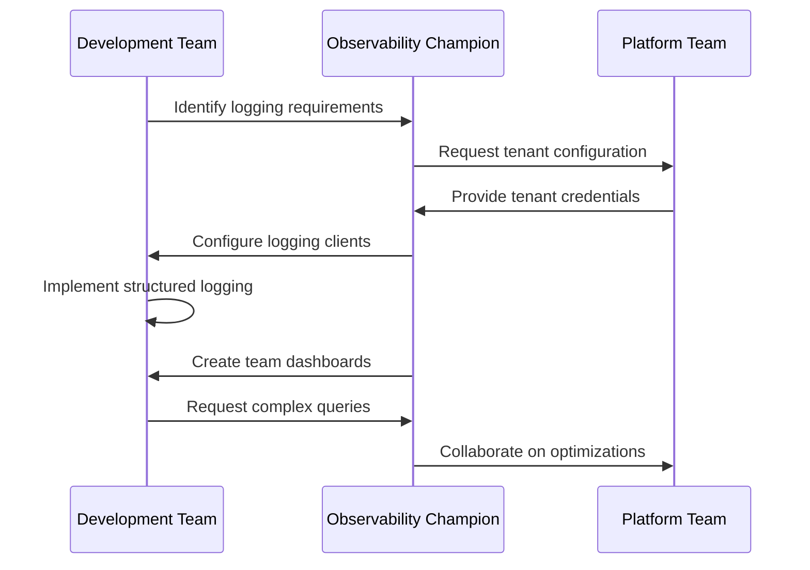
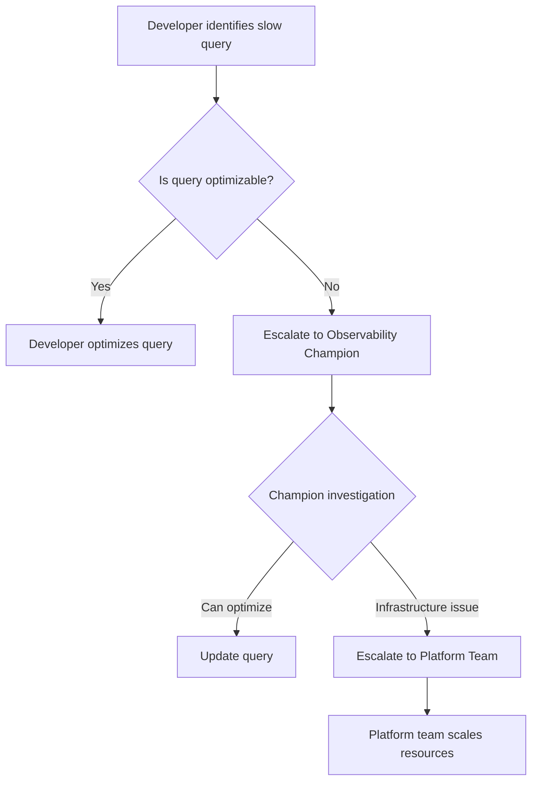

# Team Organization

## Introduction

When implementing Grafana Loki in production environments, how you organize your teams can significantly impact the success of your observability strategy. This guide explores best practices for structuring teams around Loki deployments, defining roles and responsibilities, and establishing workflows that promote efficient log management and monitoring.

Grafana Loki is a horizontally scalable, highly available log aggregation system inspired by Prometheus. While the technical aspects of Loki are crucial, the human organization around it is equally important for long-term success.

## Core Team Models for Loki Implementation

There are several approaches to organizing teams around Grafana Loki, each with its advantages and challenges.

### Centralized Observability Team

In this model, a dedicated team manages the entire Loki infrastructure and provides observability as a service to other teams.



**Advantages:**
- Specialized expertise in Loki configuration and optimization
- Consistent logging standards across the organization
- Reduced duplication of effort

**Challenges:**
- Potential bottlenecks for new dashboard or query requests
- Development teams may lack observability ownership
- Risk of disconnect between infrastructure and application needs

### Distributed Team Model

In this approach, each development team manages their own logging configurations while a central team maintains the core Loki infrastructure.



**Advantages:**
- Teams have direct control over their observability needs
- Faster iteration on team-specific monitoring
- Clear ownership of logs and metrics

**Challenges:**
- Risk of inconsistent practices
- Duplication of effort across teams
- Varied levels of LogQL expertise

### Hybrid Model (Recommended)

The hybrid model combines elements of both approaches, with a central platform team managing infrastructure and establishing standards, while embedding observability champions in each development team.



**Advantages:**
- Balanced approach with clear responsibilities
- Knowledge sharing between centralized expertise and domain-specific needs
- Scalable as organization grows

**Challenges:**
- Requires clear communication channels
- Needs active investment in training and knowledge sharing

## Key Roles and Responsibilities

Regardless of the team model you choose, certain roles are essential for a successful Loki implementation:

### Loki Infrastructure Engineers

Responsible for:
- Deploying and scaling Loki components
- Optimizing storage and query performance
- Managing tenant isolation and security
- Upgrading Loki versions

### LogQL Specialists

These team members specialize in:
- Writing efficient LogQL queries
- Creating reusable query templates
- Training other team members
- Troubleshooting complex query issues

### Observability Champions

Embedded in development teams, these individuals:
- Translate between dev teams and platform teams
- Establish logging best practices
- Help design effective dashboards
- Review logging patterns and improvements

### Application Developers

While not dedicated to observability, developers should:
- Understand basic LogQL syntax
- Follow established logging standards
- Use structured logging in applications
- Leverage logs for troubleshooting

## Practical Implementation Example

Let's walk through a practical example of implementing the hybrid team model:

1. **Phase 1: Infrastructure Setup**

The platform team establishes the core Loki infrastructure:

```yaml
# docker-compose.yaml for Loki setup managed by platform team
version: '3'
services:
  loki:
    image: grafana/loki:latest
    ports:
      - "3100:3100"
    volumes:
      - ./loki-config.yaml:/etc/loki/local-config.yaml
    command: -config.file=/etc/loki/local-config.yaml
  
  grafana:
    image: grafana/grafana:latest
    ports:
      - "3000:3000"
    environment:
      - GF_SECURITY_ADMIN_USER=admin
      - GF_SECURITY_ADMIN_PASSWORD=password
    volumes:
      - grafana-data:/var/lib/grafana

volumes:
  grafana-data:
```

2. **Phase 2: Establishing Team Workflows**

The platform team creates documentation and workflows for various teams:



3. **Phase 3: Implementing Logging Standards**

The team establishes organization-wide logging standards:

```javascript
// Example of structured logging standard implemented by development teams
logger.info({
  message: "User authentication successful",
  user_id: "user-123",
  component: "auth-service",
  environment: "production",
  traceId: "abc-123-def-456"
});
```

Output in Loki:
```json
{
  "timestamp": "2023-04-12T15:23:45Z",
  "message": "User authentication successful",
  "user_id": "user-123",
  "component": "auth-service",
  "environment": "production",
  "traceId": "abc-123-def-456",
  "level": "info"
}
```

4. **Phase 4: Cross-Team Collaboration**

Regular sync meetings ensure alignment:

- Weekly infrastructure status updates
- Monthly logging pattern reviews
- Quarterly observability workshops
- On-demand query optimization sessions

## Common Team Organization Challenges

### Challenge 1: Balancing Autonomy and Standards

**Solution:** Create a logging standards document that provides guidelines while allowing for service-specific customizations.

```javascript
// Example: Base logging structure with service-specific extensions
const baseLogObject = {
  service: "payment-processor",
  environment: process.env.ENVIRONMENT,
  version: "1.2.3",
  traceId: currentTraceId
};

// Teams can extend with service-specific fields
logger.info({
  ...baseLogObject,
  message: "Payment processed successfully",
  amount: 125.50,
  currency: "USD",
  paymentMethod: "credit_card"
});
```

### Challenge 2: Knowledge Silos

**Solution:** Implement regular knowledge sharing sessions and maintain a central repository of LogQL query examples.

```logql
# Example from central query repository
# Query: Error rate by service over time
sum by(service) (
  rate({environment="production"} |= "error" | unwrap level [1m])
)
```

### Challenge 3: Scale and Performance Management

**Solution:** Create clear escalation paths for query performance issues.



## Setting Up a Team Communication Framework

Effective team organization requires clear communication channels. Here's a recommended setup:

1. **Dedicated Slack/Teams Channel**
   - `#loki-infrastructure` for platform team discussions
   - `#observability-general` for cross-team collaboration

2. **Regular Meetings**
   - Weekly infrastructure status report
   - Bi-weekly observability office hours
   - Monthly log volume and retention planning

3. **Documentation**
   - Central Wiki for standards and examples
   - Service catalog with logging details
   - Query library with performance characteristics

Example team communication for an incident:

```
Observability Champion: @platform-team We're seeing increased error rates in the payment service logs. LogQL query:
`{app="payment-service"} |= "error" | rate[5m]`

Platform Team: Looking at it. Seeing increased load on Loki query frontend. Scaling up instances.

Development Team: We're deploying a fix for the payment gateway integration. Will update when complete.

Observability Champion: Created a temporary dashboard to track recovery: [link]
```

## Team Evolution Over Time

As your organization's Loki implementation matures, team organization should evolve accordingly:

### Early Stage
- Small platform team focused on infrastructure
- Basic documentation and examples
- Manual onboarding of new services

### Growth Stage
- Expanded platform team with specialists
- Self-service onboarding for standard cases
- Observability champions program established

### Mature Stage
- Automated infrastructure scaling
- Comprehensive query libraries
- SLOs for observability platform
- Advanced training and certification

## Summary

Effective team organization is crucial for maximizing the value of your Grafana Loki implementation. By adopting a hybrid approach with clear roles and responsibilities, you can balance centralized expertise with team autonomy. Remember these key points:

- Choose a team model that fits your organization's size and culture
- Define clear roles and responsibilities
- Establish consistent logging standards
- Create communication channels for cross-team collaboration
- Evolve your team structure as your Loki implementation matures

## Additional Resources

- **LogQL Practice Exercises**: Create a regular "LogQL challenge" to build expertise
- **Team Assessment Template**: Evaluate your current observability team structure
- **Skills Matrix**: Identify training needs across different roles

The most successful Loki implementations are built on solid technical foundations and thoughtful team organization. By investing in both aspects, you'll create a sustainable observability practice that provides ongoing value to your organization.