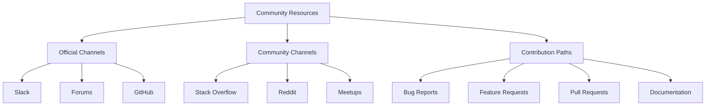

# Community Resources

## Introduction

Grafana Loki is an open-source project with a vibrant and active community. Connecting with this community can significantly enhance your Loki experience by providing access to collective knowledge, troubleshooting help, and opportunities to contribute. This guide explores the various community resources available to Loki users, from official documentation to community forums and contribution channels.

## Official Resources

### Documentation and Guides

Grafana Loki's official documentation is the foundation of community knowledge:

- **[Official Loki Documentation](https://grafana.com/docs/loki/latest/)** - Comprehensive guides, tutorials, and reference materials.
- **[GitHub Repository](https://github.com/grafana/loki)** - Source code, issues, and project management.
- **[Grafana Labs Blog](https://grafana.com/blog/)** - Regular posts about new features, use cases, and best practices.

### Communication Channels



Grafana Labs maintains several official communication channels:

- **Slack**: The [Grafana Labs Slack](https://slack.grafana.com/) has dedicated channels for Loki discussions:
  - `#loki` - General Loki discussions
  - `#loki-dev` - Development-focused conversations

- **Community Forums**: The [Grafana Community Forums](https://community.grafana.com/) include dedicated sections for Loki questions and discussions.

## Community-Driven Resources

### Q&A and Discussions

Several community platforms host valuable Loki discussions:

- **Stack Overflow**: Questions tagged with `grafana-loki` often receive detailed answers from community experts.
- **Reddit**: The r/grafana subreddit regularly features Loki-related discussions.

### User-Generated Content

The community produces a wealth of supplementary learning materials:

- **Blog Posts**: Community members regularly publish tutorials and case studies on personal blogs and tech publication platforms.
- **Video Tutorials**: YouTube hosts numerous Loki tutorials created by community members.
- **Conference Talks**: Recordings from GrafanaCON and other technical conferences showcase Loki use cases and best practices.

## Contributing to Loki

### Getting Started with Contributions

Contributing to Loki is a rewarding way to engage with the community:

1. **Familiarize yourself** with the [contribution guidelines](https://github.com/grafana/loki/blob/main/CONTRIBUTING.md).
2. **Start small** with documentation updates or simple bug fixes.
3. **Join discussions** in GitHub issues or pull requests.

### Example: Creating Your First Pull Request

Here's a simplified workflow for contributing to Loki:

```bash
# Fork and clone the repository
git clone https://github.com/yourusername/loki.git
cd loki

# Create a new branch
git checkout -b fix-documentation-typo

# Make your changes
# ...

# Commit and push
git commit -m "docs: fix typo in query documentation"
git push origin fix-documentation-typo

# Open a pull request through the GitHub UI
```

### Documentation Contributions

Documentation improvements are especially valuable to the community. Here's how a simple documentation fix might look:

```markdown
## Before
Loki uses a set of lables for each log stream.

## After
Loki uses a set of labels for each log stream.
```

## Community Support Patterns

### Asking Effective Questions

To get the best help from the community, follow these patterns:

1. **Provide context**: Share your Loki version, configuration, and environment.
2. **Include relevant logs**: Sanitize and include error messages or logs.
3. **Show your work**: Describe what you've already tried.

Example of a good question format:

```
Title: Query with line_format returning incorrect results

Details:
- Loki version: 2.8.2
- Query: `{app="myapp"} | line_format "{{.message}} {{.status_code}}"`
- Expected result: Log lines with formatted output
- Actual result: Empty result set

Configuration:
```yaml
loki:
  server:
    http_listen_port: 3100
  storage:
    type: filesystem
```

I've already verified logs exist with the basic query and that the labels are present.
```

### Sharing Solutions

When you solve a problem, sharing your solution helps the entire community:

1. **Document the issue** clearly.
2. **Explain your solution** step by step.
3. **Include code or configuration examples** when applicable.
4. **Note any caveats** or limitations.

## Real-World Community Success Stories

### Case Study: Community-Driven Feature

The LogQL query language has evolved significantly based on community feedback. For example, the `line_format` function was enhanced based on community needs:

```logql
# Before: Limited formatting options
{app="frontend"} | logfmt | line_format "{{.status_code}} {{.path}}"

# After: Enhanced with template functions from community request
{app="frontend"} | logfmt | line_format "{{.status_code}} {{reReplaceAll \"/api/v1/\" \"\" .path}}"
```

### Community Knowledge Exchange

The community regularly shares optimizations and tips, such as this cardinality management approach:

```yaml
# Community-recommended label structure to control cardinality
scrape_configs:
  - job_name: app_logs
    static_configs:
      - targets: [localhost]
        labels:
          # High-cardinality labels moved to structured logging
          job: app
          env: production
          # Avoid using high-cardinality labels like 'user_id'
```

## Staying Updated

### Following Development

To stay current with Loki developments:

1. **Watch the GitHub repository** for new releases and major changes.
2. **Subscribe to the Grafana Labs blog** for feature announcements.
3. **Join the #loki-announcements channel** in Slack for important updates.

### Release Participation

Community members can participate in release cycles:

- **Alpha/Beta testing**: Test pre-release versions and provide feedback.
- **Release candidates**: Verify fixes and feature implementations.

## Summary and Next Steps

The Grafana Loki community offers invaluable resources for users at all levels. By engaging with these resources, you can:

- Solve problems more efficiently with community support
- Stay updated on best practices and new features
- Contribute to the project's growth and improvement
- Build connections with other monitoring and observability professionals

### Getting Started Today

1. **Join the Slack workspace** and introduce yourself in the #loki channel
2. **Browse recent GitHub issues** to understand common challenges
3. **Explore the community forums** for in-depth discussions

### Exercise: Community Engagement

To practice engaging with the community, try these exercises:

1. Identify a documentation page that could be improved and draft potential changes
2. Find an unanswered question in the forums that you can help with
3. Set up a local development environment following the community contribution guide

By actively participating in the Grafana Loki community, you'll not only enhance your own knowledge but also contribute to the collective expertise that makes the project stronger.