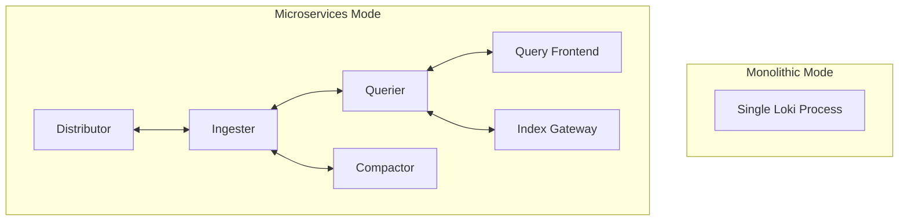
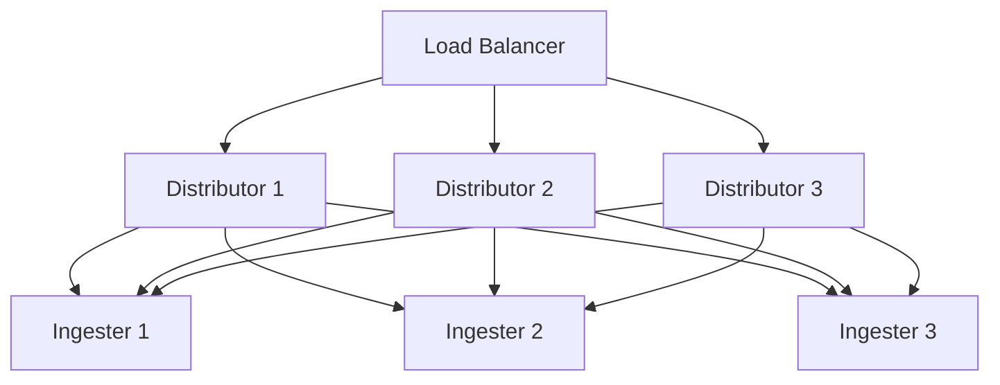

# Scaling Guidelines

## Introduction

Grafana Loki is designed to be horizontally scalable, allowing you to start small and grow your deployment as your logging needs increase. Whether you're running Loki on a single machine or across a distributed Kubernetes cluster, understanding how to effectively scale your implementation is crucial for maintaining performance and reliability.

This guide covers essential scaling considerations and best practices to help you grow your Loki deployment efficiently. We'll explore component-specific scaling approaches, resource optimization techniques, and architectural patterns that enable Loki to handle increasing log volumes.

## Scaling Fundamentals

Before diving into specific scaling strategies, let's understand the fundamental aspects that influence Loki's scalability.

### Key Scaling Dimensions

Loki scales across several dimensions:

- **Query load**: The number and complexity of queries
- **Ingest volume**: The amount of log data being sent to Loki
- **Retention period**: How long data is stored
- **Tenant count**: Number of separate organizations/projects using the same Loki instance

### Monolithic vs. Microservices Deployment

Loki supports two primary deployment modes:

1. **Monolithic mode**: All Loki components run in a single process
2. **Microservices mode**: Components are separated and can be scaled independently



## Scaling for Different Deployment Sizes

Let's examine scaling guidelines based on deployment size.

### Small Deployments (Up to 100GB/day)

For small environments, a monolithic deployment is typically sufficient:

```yaml
loki:
  config: |
    auth_enabled: false
    
    server:
      http_listen_port: 3100
    
    ingester:
      lifecycler:
        ring:
          kvstore:
            store: inmemory
          replication_factor: 1
      chunk_idle_period: 15m
      chunk_retain_period: 30s
      max_transfer_retries: 0
    
    schema_config:
      configs:
        - from: 2020-05-15
          store: boltdb-shipper
          object_store: filesystem
          schema: v11
          index:
            prefix: index_
            period: 24h
    
    storage_config:
      boltdb_shipper:
        active_index_directory: /data/loki/index
        cache_location: /data/loki/cache
        cache_ttl: 24h
        shared_store: filesystem
      filesystem:
        directory: /data/loki/chunks
    
    limits_config:
      ingestion_rate_mb: 10
      ingestion_burst_size_mb: 20
      max_global_streams_per_user: 5000
```

**Resource Guidelines:**
- CPU: 2-4 cores
- Memory: 4-8GB
- Storage: SSD for index data
- Network: 1Gbps

### Medium Deployments (100GB-1TB/day)

For medium-sized deployments, consider moving to microservices mode:

```yaml
# distributor configuration
distributor:
  replicas: 2
  resources:
    limits:
      cpu: 1
      memory: 1Gi
    requests:
      cpu: 500m
      memory: 500Mi

# ingester configuration
ingester:
  replicas: 3
  resources:
    limits:
      cpu: 2
      memory: 8Gi
    requests:
      cpu: 1
      memory: 4Gi

# querier configuration
querier:
  replicas: 2
  resources:
    limits:
      cpu: 2
      memory: 4Gi
    requests:
      cpu: 1
      memory: 2Gi
```

**Key Considerations:**
- Use replicated ingesters (replication_factor: 2-3)
- Implement separate object storage (S3, GCS, etc.)
- Add query frontends with query caching

### Large Deployments (1TB+/day)

For enterprise-scale deployments:

```yaml
# Additional specialized microservice components
querierFrontend:
  replicas: 3
  
compactor:
  replicas: 2
  
indexGateway:
  replicas: 3

ruler:
  replicas: 2
```

**Advanced Scaling Techniques:**
- Implement tenant isolation with resource limits per tenant
- Use read and write pools for ingesters
- Add index caching layers
- Consider using Cortex chunks storage

## Component-Specific Scaling Guidelines

### Scaling Distributors

Distributors handle incoming log streams and are generally CPU-bound:

```yaml
distributor:
  replicas: ${DISTRIBUTOR_REPLICAS}
  resources:
    limits:
      cpu: ${DISTRIBUTOR_CPU_LIMIT}
      memory: ${DISTRIBUTOR_MEMORY_LIMIT}
  
  # Adjust these parameters for higher throughput
  max_recv_msg_size: 10485760  # 10MB
  http_server_write_timeout: 1m
  http_server_read_timeout: 1m
```

**Scaling Indicators:**
- High CPU utilization
- Increasing request latency
- HTTP 429 responses (rate limiting)

### Scaling Ingesters

Ingesters are the most resource-intensive component and require careful scaling:

```yaml
ingester:
  replicas: ${INGESTER_REPLICAS}
  resources:
    limits:
      cpu: ${INGESTER_CPU_LIMIT}
      memory: ${INGESTER_MEMORY_LIMIT}
  
  # Performance tuning
  chunk_target_size: 1536000
  chunk_idle_period: 30m
  max_chunk_age: 1h
  
  lifecycler:
    ring:
      replication_factor: 3
```

**Memory Sizing Formula:**
```
Memory = (log_volume_per_day * replication_factor * chunk_retention_period) / ingester_count
```

### Scaling Queriers

Queriers become important as your query load increases:

```yaml
querier:
  replicas: ${QUERIER_REPLICAS}
  max_concurrent_queries: 20
  query_timeout: 2m
  engine:
    timeout: 1m
    max_look_back_period: 12h
```

**Scaling Indicators:**
- Query timeouts
- High query latency
- High memory usage during query execution

## Storage Optimization for Scaling

Storage choices significantly impact scalability:

### Object Storage Considerations

```yaml
storage_config:
  aws:
    s3: s3://region/bucket
    s3forcepathstyle: true
  boltdb_shipper:
    active_index_directory: /loki/index
    shared_store: s3
    cache_location: /loki/cache
    cache_ttl: 24h
```

**Best Practices:**
- Use dedicated SSD volumes for active index directories
- Implement caching for frequently accessed chunks
- Consider data lifecycle policies to manage older data

### Index Storage Optimization

```yaml
schema_config:
  configs:
    - from: 2020-10-24
      store: boltdb-shipper
      object_store: s3
      schema: v11
      index:
        prefix: index_
        period: 24h  # Shorter periods create more, smaller index files
```

**Tuning Options:**
- Adjust index periods based on query patterns
- Implement index caching for frequently queried time ranges
- Use index gateways for large deployments

## Multi-Tenancy Scaling

For environments with multiple teams or services:

```yaml
limits_config:
  ingestion_rate_mb: 10
  ingestion_burst_size_mb: 20
  
  # Per-tenant limits
  per_tenant_override_config: /etc/loki/tenant-limits.yaml
  
  # Global rate limit
  max_global_streams_per_user: 10000
```

Example tenant limits file:
```yaml
tenant1:
  ingestion_rate_mb: 20
  ingestion_burst_size_mb: 30
  max_streams_per_user: 15000

tenant2:
  ingestion_rate_mb: 5
  ingestion_burst_size_mb: 10
  max_streams_per_user: 5000
```

## Load Balancing and High Availability

Implementing proper load balancing enhances scalability:



**Configuration Example:**
```yaml
# Using Kubernetes for automatic scaling
apiVersion: autoscaling/v2
kind: HorizontalPodAutoscaler
metadata:
  name: loki-distributor
spec:
  scaleTargetRef:
    apiVersion: apps/v1
    kind: Deployment
    name: loki-distributor
  minReplicas: 2
  maxReplicas: 10
  metrics:
  - type: Resource
    resource:
      name: cpu
      target:
        type: Utilization
        averageUtilization: 70
```

## Monitoring Your Loki Deployment

Monitoring is essential to understand when and how to scale:

```yaml
# Prometheus metrics config
server:
  http_listen_port: 3100
  
# Additional metrics exposure
runtime_config:
  file: /etc/loki/runtime-config.yaml

# Important metrics to watch
# - loki_distributor_bytes_received_total
# - loki_ingester_memory_chunks
# - loki_chunk_store_index_entries_per_chunk
# - loki_query_frontend_queries_total
```

Create a Grafana dashboard to visualize these key metrics:

```
Useful Prometheus queries:
sum(rate(loki_distributor_bytes_received_total[5m])) by (tenant)
sum(loki_ingester_memory_chunks) by (tenant)
histogram_quantile(0.99, sum(rate(loki_query_frontend_query_duration_seconds_bucket[5m])) by (le))
```

## Practical Example: Scaling Exercise

Let's walk through scaling a Loki deployment from handling 50GB/day to 500GB/day:

1. **Initial setup**: Monolithic Loki with local storage
2. **First scaling step**: Migrate to object storage (S3)
3. **Second scaling step**: Split into microservices
4. **Third scaling step**: Add replication and query caching
5. **Final adjustments**: Implement autoscaling and per-tenant limits

### Exercise: Calculate Required Resources

Given:
- Log volume: 500GB/day
- Retention: 14 days
- Peak query rate: 100 queries/minute
- 5 tenants with varying log volumes

Calculate:
1. Required ingester count and sizing
2. Storage requirements
3. Query resource allocation

**Solution Outline:**
```
1. Total storage = 500GB * 14 days * 1.3 (overhead) = ~9.1TB
2. Ingester memory = (500GB * 3 (replication) * 1d) / 6 (ingesters) = ~250GB total
3. Querier count = (peak_QPS * avg_query_duration) / max_concurrent = ~4-6 queriers
```

## Troubleshooting Scaling Issues

Common scaling issues and solutions:

| Problem | Symptoms | Solution |
|---------|----------|----------|
| High ingestion latency | Slow log delivery, timeouts | Increase distributor replicas, check rate limits |
| Query timeouts | Slow dashboards, failed queries | Increase querier resources, implement query frontend caching |
| Out of memory errors | Ingester crashes, restarts | Increase memory limits, check chunk settings |
| High disk I/O | Slow queries, high latency | Use SSD for active index, implement index caching |

## Summary

Scaling Grafana Loki effectively requires:

1. Understanding your log volume and query patterns
2. Choosing the right deployment architecture for your size
3. Properly sizing and configuring individual components
4. Implementing appropriate storage solutions
5. Monitoring performance metrics to identify bottlenecks
6. Applying component-specific optimizations

By following these guidelines, you can ensure your Loki deployment grows smoothly alongside your organization's logging needs.

## Additional Resources

- Official Loki scaling documentation
- Grafana Loki capacity planning guide
- Community best practices for large-scale deployments

## Practice Exercises

1. Design a Loki deployment for handling 250GB/day with 30-day retention
2. Calculate the resource requirements for 10 tenants with varying log volumes
3. Create a monitoring dashboard with key scaling metrics
4. Implement a scaling plan to migrate from monolithic to microservices architecture