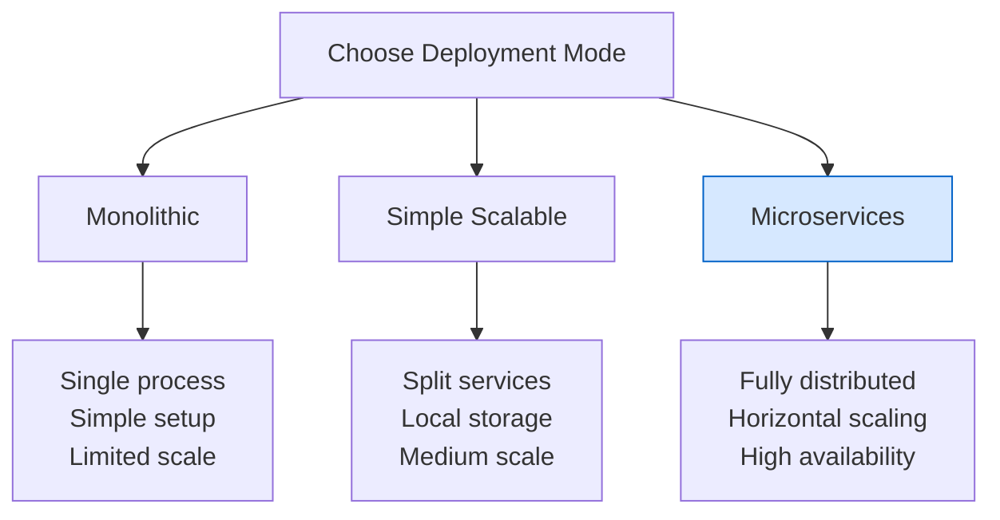

I'll create comprehensive educational content for the "Production Checklist" topic within the "Best Practices" section of your Grafana Loki Learning Path Structure. This will follow all the requirements you specified, including proper MDX formatting.

---
title: Production Checklist
description: Essential considerations and best practices when deploying Grafana Loki to production environments

---

# Production Checklist

## Introduction

Moving Grafana Loki from a development or testing environment to production requires careful planning and consideration. This production checklist covers essential configurations, optimizations, and best practices to ensure your Loki deployment is reliable, performant, and scalable in a production setting.

Whether you're deploying Loki for the first time or upgrading an existing installation, this guide will help you prepare for production-grade log aggregation and analysis with Grafana Loki.

## Deployment Considerations

### Deployment Modes

Loki offers several deployment modes, each suited for different scales and requirements:

- **Monolithic Mode**: All Loki components run in a single process
- **Simple Scalable Deployment**: Components are split into separate services but still use local storage
- **Microservices Mode**: Fully distributed deployment with separate scalable components

<div className="deployment-recommendation">
  <strong>Recommendation:</strong> For production environments, the microservices mode offers the best scalability and resilience.
</div>



### Hardware Requirements

Proper resource allocation is critical for Loki's performance in production:

| Component | CPU | Memory | Disk |
|-----------|-----|--------|------|
| Distributor | 2+ cores | 4-8GB | N/A |
| Ingester | 4+ cores | 8-16GB | Fast SSD (if using local storage) |
| Querier | 2+ cores | 8-16GB | N/A |
| Query Frontend | 2+ cores | 2-4GB | N/A |
| Compactor | 2+ cores | 8GB+ | Fast SSD (if using local storage) |

Remember to allocate additional resources for increased log volume and retention periods.

## Operational Requirements

### Storage Configuration

Loki requires properly configured storage for both:

1. **Index Store**: Stores metadata about your logs
2. **Chunk Store**: Stores the actual log content

For production deployments, use cloud object storage for chunks and a managed database for the index:

```yaml
storage_config:
  boltdb_shipper:
    active_index_directory: /loki/index
    cache_location: /loki/index_cache
    shared_store: s3
  aws:
    s3: s3://access_key:secret_access_key@region/bucket_name
    s3forcepathstyle: true
schema_config:
  configs:
    - from: 2020-07-01
      store: boltdb-shipper
      object_store: aws
      schema: v11
      index:
        prefix: index_
        period: 24h
```

### Networking and Load Balancing

Ensure proper network configuration for reliable operation:

- Configure load balancers for distributor components
- Set up service discovery for Loki components
- Implement proper health checks for all components
- Allocate sufficient bandwidth for log ingestion and query traffic

### Security Considerations

Production deployments should include these security measures:

- Enable authentication using Grafana or a reverse proxy
- Configure TLS for all exposed endpoints
- Implement proper RBAC for log access
- Use network policies to restrict communication between components
- Encrypt data at rest for index and chunk stores

## Performance Tuning

### Cardinality Control

High cardinality can severely impact Loki's performance. Implement these measures:

1. **Label Configuration**: Limit labels to those needed for querying
2. **Stream Limits**: Set limits on streams per tenant
3. **Rejection Rules**: Configure rules to reject logs with too many labels

Example configuration for cardinality limits:

```yaml
limits_config:
  max_label_name_length: 1024
  max_label_value_length: 2048
  max_label_names_per_series: 30
  reject_old_samples: true
  reject_old_samples_max_age: 168h
  ingestion_rate_mb: 4
  ingestion_burst_size_mb: 6
```

### Query Performance

Optimize query performance with these settings:

1. **Configure query frontend**: Use query sharding and result caching
2. **Parallel query execution**: Adjust parallelism settings based on server capacity
3. **Query limits**: Set reasonable limits on query time ranges and execution time

Example query frontend configuration:

```yaml
query_range:
  align_queries_with_step: true
  max_retries: 5
  cache_results: true
  results_cache:
    cache:
      enable_fifocache: true
      fifocache:
        max_size_items: 1024
        validity: 24h
  split_queries_by_interval: 30m
```

### Compaction and Retention

Configure appropriate compaction and retention policies:

```yaml
compactor:
  working_directory: /loki/compactor
  shared_store: s3
  compaction_interval: 10m
  retention_enabled: true
  retention_delete_delay: 2h
  retention_delete_worker_count: 150

limits_config:
  retention_period: 744h # 31 days
```

## Monitoring Loki Itself

### Metrics to Monitor

Set up monitoring for Loki's internal metrics:

- **Ingestion metrics**: `loki_distributor_bytes_received_total`, `loki_distributor_lines_received_total`
- **Query metrics**: `loki_querier_query_duration_seconds`, `loki_querier_request_duration_seconds`
- **Storage metrics**: `loki_ingester_memory_chunks`, `loki_chunk_store_index_entries_per_chunk`
- **Error rates**: `log_messages_total{level="error"}`, `loki_discarded_samples_total`

### Dashboards and Alerts

1. Import the official Loki monitoring dashboards in Grafana
2. Configure alerts for critical metrics
3. Set up log-based alerting for Loki's own logs

Example Prometheus alert:

```yaml
groups:
- name: loki_alerts
  rules:
  - alert: LokiRequestErrors
    expr: |
      sum(rate(loki_request_duration_seconds_count{status_code=~"5.."}[1m])) by (namespace, job)
      /
      sum(rate(loki_request_duration_seconds_count[1m])) by (namespace, job)
      > 0.05
    for: 15m
    labels:
      severity: warning
    annotations:
      summary: "Loki request errors (instance {{ $labels.instance }})"
      description: "{{ $labels.job }} is experiencing {{ $value | humanizePercentage }} errors."
```

## Scaling Considerations

### Vertical vs Horizontal Scaling

Different Loki components scale differently:

- **Ingesters**: Scale horizontally as log volume increases
- **Distributors**: Scale horizontally as more clients connect
- **Queriers**: Scale horizontally as query load increases
- **Query Frontend**: Scale vertically for better query performance

### Multi-tenancy Configuration

If using multi-tenancy, configure appropriate resource limits per tenant:

```yaml
limits_config:
  per_tenant_override_config: /etc/loki/overrides.yaml
  
# In overrides.yaml
overrides:
  "tenant1":
    ingestion_rate_mb: 10
    ingestion_burst_size_mb: 20
    max_global_streams_per_user: 25000
  "tenant2":
    ingestion_rate_mb: 5
    ingestion_burst_size_mb: 10
    max_global_streams_per_user: 10000
```

## Production Readiness Checklist

Use this checklist before going live with your Loki deployment:

- [ ] Storage configuration is production-ready (cloud storage or replicated local storage)
- [ ] Authentication and authorization are properly configured
- [ ] Resource limits are set for all components
- [ ] Cardinality limits are configured
- [ ] Monitoring and alerting are set up
- [ ] Retention and compaction policies are defined
- [ ] Backup and disaster recovery plans are in place
- [ ] Load testing has been performed
- [ ] High availability configuration is implemented
- [ ] Documentation is updated with production settings

## Example Microservices Deployment

Here's a simplified example of a microservices deployment using Docker Compose:

```yaml
version: "3"
services:
  distributor:
    image: grafana/loki:2.7.0
    command: "-config.file=/etc/loki/config.yaml -target=distributor"
    ports:
      - "3100:3100"
    volumes:
      - ./config.yaml:/etc/loki/config.yaml
    restart: always

  ingester:
    image: grafana/loki:2.7.0
    command: "-config.file=/etc/loki/config.yaml -target=ingester"
    volumes:
      - ./config.yaml:/etc/loki/config.yaml
      - loki-data:/loki
    restart: always
    
  querier:
    image: grafana/loki:2.7.0
    command: "-config.file=/etc/loki/config.yaml -target=querier"
    volumes:
      - ./config.yaml:/etc/loki/config.yaml
    restart: always
    
  query-frontend:
    image: grafana/loki:2.7.0
    command: "-config.file=/etc/loki/config.yaml -target=query-frontend"
    ports:
      - "3101:3100"
    volumes:
      - ./config.yaml:/etc/loki/config.yaml
    restart: always

volumes:
  loki-data:
```

## Troubleshooting Common Production Issues

### High Memory Usage

If ingesters show high memory usage:

1. Reduce `max_chunk_age` to flush chunks more frequently
2. Increase `chunk_target_size` to create fewer, larger chunks
3. Reduce the number of streams by controlling label cardinality

### Slow Queries

For sluggish query performance:

1. Enable the query frontend and result caching
2. Split queries with large time ranges using `split_queries_by_interval`
3. Index more frequently using a shorter `index.period`
4. Add more querier instances

### Failed Writes

If log writes are failing:

1. Check ingestion rate limits and increase if necessary
2. Verify storage connectivity
3. Monitor for out-of-memory conditions in ingesters
4. Ensure proper authentication configuration

## Summary

A production-ready Grafana Loki deployment requires careful planning and configuration across multiple dimensions including storage, performance, security, and scalability. By following this checklist, you can ensure your Loki deployment is robust, performant, and ready to handle production workloads.

Remember that monitoring Loki itself is critical to maintaining a healthy logging system. Regularly review performance metrics and adjust configuration as your log volume and query patterns evolve.

## Additional Resources

- [Grafana Loki Configuration Documentation](https://grafana.com/docs/loki/latest/configuration/)
- [Loki Production Best Practices](https://grafana.com/docs/loki/latest/best-practices/)
- [Loki Troubleshooting Guide](https://grafana.com/docs/loki/latest/operations/troubleshooting/)
- [Grafana Labs Community Forums](https://community.grafana.com/)

## Practice Exercises

1. Create a microservices deployment manifest for Loki using Kubernetes
2. Configure alerting for key Loki metrics in Prometheus
3. Develop a disaster recovery plan for your Loki deployment
4. Calculate storage requirements for different retention periods
5. Design a high availability configuration for geographically distributed deployments