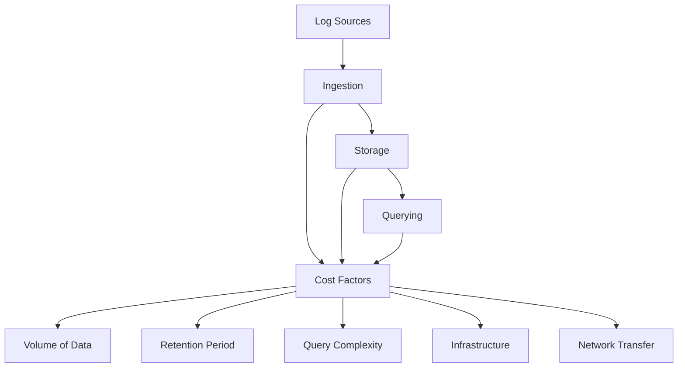

# Cost Management

## Introduction

When implementing Grafana Loki in production environments, understanding and managing costs is crucial for sustainable operations. Loki is designed to be cost-effective compared to traditional logging solutions, but without proper configuration and usage patterns, costs can still escalate unexpectedly.

This guide explores best practices for managing and optimizing costs in Grafana Loki deployments, helping you balance performance needs with budget constraints.

## Understanding Loki's Cost Factors

Before diving into optimization strategies, let's understand what drives costs in a Loki deployment:

1. **Storage**: The volume of log data ingested and retained
2. **Query Performance**: Resources required to serve queries
3. **Operational Overhead**: Infrastructure required to run Loki components
4. **Network Transfer**: Data movement between components and regions

<br />



## Cost Optimization Strategies

### 1. Log Volume Reduction

The most effective way to reduce costs is to be selective about what logs you ingest.

#### Pre-Filtering Logs

Filter logs before they reach Loki to reduce storage and processing costs:

```yaml
loki:
  config:
    clients:
      - url: http://loki:3100/loki/api/v1/push
        tenant_id: tenant1
    positions:
      filename: /tmp/positions.yaml
    scrape_configs:
      - job_name: system
        pipeline_stages:
          - match:
              selector: '{job="high_volume_app"}'
              stages:
                - regex:
                    expression: 'DEBUG|INFO'
                - drop:
                    source: level
```

This configuration drops all DEBUG and INFO level logs from the high_volume_app source, significantly reducing ingestion volume.

#### Implement Log Sampling

For high-volume, low-value logs, consider sampling:

```yaml
loki:
  config:
    clients:
      - url: http://loki:3100/loki/api/v1/push
    scrape_configs:
      - job_name: high_volume_service
        pipeline_stages:
          - sampling:
              rate: 10 # Keep only 1 in 10 logs
```

### 2. Efficient Label Usage

Labels in Loki are powerful but can significantly impact costs when used inefficiently.

#### Avoid High Cardinality Labels

High cardinality labels create numerous index entries, increasing storage and query costs:

```yaml
# DON'T DO THIS - High cardinality label
{app="payment-service", request_id="38fh3902hf293h29fh29f"}

# Better approach - Keep high cardinality data in the log line
{app="payment-service", component="api"} request_id=38fh3902hf293h29fh29f status=200
```

#### Label Naming Strategy

Create a consistent labeling strategy to avoid duplicative labels:

```yaml
# Inefficient - Duplicative information
{app="auth-service", service="auth", component="api", api="auth"}

# Efficient - Clear hierarchy without duplication
{app="auth-service", component="api"}
```

### 3. Optimizing Log Retention

Configure different retention periods based on log importance using Loki's compaction and retention configuration:

```yaml
compactor:
  working_directory: /loki/compactor
  shared_store: s3
  compaction_interval: 10m

schema_config:
  configs:
    - from: 2020-07-01
      store: boltdb-shipper
      object_store: s3
      schema: v11
      index:
        prefix: index_
        period: 24h

storage_config:
  boltdb_shipper:
    active_index_directory: /loki/index
    cache_location: /loki/cache
    cache_ttl: 24h
    shared_store: s3

limits_config:
  retention_period: 744h  # 31 days for all logs by default

  # Tenant-specific overrides
  per_tenant_override_config: /etc/loki/overrides.yaml
```

Example `overrides.yaml` for tenant-specific retention:

```yaml
overrides:
  tenant1:
    retention_period: 24h # 1 day for high-volume logs
  tenant2:
    retention_period: 2160h # 90 days for compliance logs
```

### 4. Query Optimization

Inefficient queries can drive up costs through excessive resource consumption.

#### Use Time-Based Queries

Always include a time range in your queries to limit the amount of data scanned:

```logql
{app="payment-service"} |= "error" [1h]
```

The `[1h]` at the end restricts the query to the last hour of logs.

#### Leverage LogQL Filtering

Filter at the query level as early as possible:

```logql
# Inefficient - Processes all logs, then filters
{app="auth-service"} | json | status >= 500

# Efficient - Filters early to reduce processing
{app="auth-service"} |= "status=5" | json | status >= 500
```

### 5. Infrastructure Right-Sizing

Tune your Loki deployment to match your workload.

#### Component Separation

For production deployments, separate Loki components to scale independently:

```yaml
# distributor.yaml
target: distributor
server:
  http_listen_port: 3100
distributor:
  ring:
    kvstore:
      store: memberlist

# ingester.yaml
target: ingester
server:
  http_listen_port: 3100
ingester:
  lifecycler:
    ring:
      kvstore:
        store: memberlist
      replication_factor: 2
    final_sleep: 0s
  chunk_idle_period: 1h
  chunk_target_size: 1048576
  max_chunk_age: 1h

# querier.yaml
target: querier
server:
  http_listen_port: 3100
querier:
  engine:
    timeout: 3m
```

#### Resource Allocation

Scale components based on their resource needs:

```yaml
resources:
  distributor:
    limits:
      cpu: 2
      memory: 2Gi
    requests:
      cpu: 500m
      memory: 1Gi
  ingester:
    limits:
      cpu: 4
      memory: 8Gi
    requests:
      cpu: 1
      memory: 4Gi
  querier:
    limits:
      cpu: 4
      memory: 8Gi
    requests:
      cpu: 1
      memory: 2Gi
```

### 6. Cloud Storage Optimization

When using cloud storage for Loki, optimize your storage configuration:

```yaml
storage_config:
  aws:
    s3: s3://region/bucket
    s3forcepathstyle: true
  boltdb_shipper:
    active_index_directory: /loki/index
    shared_store: s3
    cache_location: /loki/boltdb-cache
    cache_ttl: 24h
    resync_interval: 5m
```

Consider these additional cloud storage optimizations:

1. Use storage lifecycle policies to transition older data to cheaper storage tiers
2. Enable storage compression when possible
3. Use regional storage instead of multi-regional when latency is less important

## Monitoring Loki Costs

To effectively manage costs, you need to monitor your Loki deployment. Create a Grafana dashboard to track key metrics:

```yaml
- name: Loki Cost Metrics
  query: |
    # Ingestion Rate
    sum(rate(loki_distributor_bytes_received_total[5m])) by (tenant)
    
    # Storage Usage
    sum(loki_ingester_memory_chunks) by (tenant)
    
    # Query Load
    sum(rate(loki_query_frontend_query_range_duration_seconds_count[5m])) by (tenant)
```

## Real-World Example: Multi-Tenant Cost Allocation

Here's how to implement a multi-tenant setup with different cost profiles:

```yaml
auth_enabled: true

server:
  http_listen_port: 3100

ingester:
  lifecycler:
    ring:
      kvstore:
        store: memberlist
      replication_factor: 2
  chunk_idle_period: 30m
  chunk_block_size: 262144
  chunk_encoding: snappy

limits_config:
  enforce_metric_name: false
  reject_old_samples: true
  reject_old_samples_max_age: 168h
  
  # Global defaults
  ingestion_rate_mb: 8
  ingestion_burst_size_mb: 16
  
  # Per-tenant overrides
  per_tenant_override_config: /etc/loki/overrides.yaml

# Storage configuration optimized for cost
storage_config:
  aws:
    s3: s3://loki-logs
    s3forcepathstyle: true
  boltdb_shipper:
    active_index_directory: /loki/index
    shared_store: s3
    cache_location: /loki/cache
    cache_ttl: 24h
```

Overrides for different tenant tiers:

```yaml
# overrides.yaml
overrides:
  # Development tier
  dev_tenant:
    ingestion_rate_mb: 4
    ingestion_burst_size_mb: 8
    max_query_parallelism: 8
    retention_period: 72h
    
  # Standard tier
  standard_tenant:
    ingestion_rate_mb: 16
    ingestion_burst_size_mb: 24
    max_query_parallelism: 16
    retention_period: 168h
    
  # Enterprise tier
  enterprise_tenant:
    ingestion_rate_mb: 32
    ingestion_burst_size_mb: 48
    max_query_parallelism: 32
    retention_period: 720h
```

## Summary

Effective cost management in Grafana Loki requires a multi-faceted approach:

1. **Reduce log volume** by filtering and sampling logs before ingestion
2. **Use labels efficiently** to avoid high cardinality issues
3. **Implement tiered retention** based on log importance
4. **Optimize queries** to minimize resource consumption
5. **Right-size your infrastructure** by scaling components based on workload
6. **Monitor cost-related metrics** to identify optimization opportunities

By implementing these strategies, you can maintain a powerful observability platform while keeping costs predictable and under control.

## Additional Resources

- [Grafana Loki Best Practices Guide](https://grafana.com/docs/loki/latest/best-practices/)
- [LogQL Query Language Reference](https://grafana.com/docs/loki/latest/logql/)
- [Loki Operational Guide](https://grafana.com/docs/loki/latest/operations/)

## Exercises

1. Analyze your current log volumes and identify opportunities for filtering or sampling.
2. Review your label strategy and identify any high cardinality labels that could be optimized.
3. Create a Grafana dashboard to track key cost metrics for your Loki deployment.
4. Implement different retention periods for various log categories based on their importance and compliance requirements.
5. Practice writing efficient LogQL queries that minimize resource usage while returning the needed results.