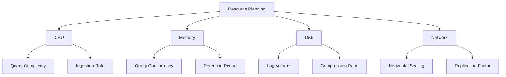

# Resource Planning

## Introduction

Resource planning is a critical aspect of deploying and maintaining a Grafana Loki environment. Proper resource allocation ensures your logging system operates efficiently, scales appropriately, and remains cost-effective. This guide will walk you through the essential considerations for planning resources in Grafana Loki deployments, from understanding the architecture to implementing practical sizing strategies.

Loki's unique "labels-first" approach to log aggregation means that resource requirements differ significantly from traditional logging systems. By understanding these differences, you can build a logging infrastructure that balances performance and resource consumption.

## Understanding Loki's Resource Requirements

Loki consists of several components, each with specific resource needs:

- **Distributor**: Handles incoming log streams and validation
- **Ingester**: Manages write path and builds chunks
- **Querier**: Handles query requests from Grafana
- **Query Frontend**: Optimizes and parallelizes queries
- **Compactor**: Optimizes storage in the background
- **Index Gateway/Store Gateway**: Provides optimized access to indices and chunks

### Key Resource Considerations



## Sizing Guidelines for Loki Components

Each component of Loki has different resource requirements. Here's a practical guide for sizing:

### Memory Requirements

Memory is particularly important for Loki's ingesters, which buffer data in memory before flushing to storage:

```yaml
loki:
  config:
    ingester:
      chunk_idle_period: 30m
      chunk_block_size: 262144
      chunk_target_size: 1572864
      max_chunk_age: 1h
      chunk_retain_period: 30s
```

A good starting point for memory allocation:

| Component | Memory Base | Per 100K logs/sec |
|-----------|-------------|-------------------|
| Distributor | 2GB | +0.5GB |
| Ingester | 4GB | +2GB |
| Querier | 2GB | +1GB |
| Query Frontend | 1GB | +0.5GB |

### CPU Considerations

CPU requirements scale with both ingestion rate and query complexity:

```yaml
loki:
  config:
    limits_config:
      ingestion_rate_mb: 10
      ingestion_burst_size_mb: 20
      max_entries_limit_per_query: 10000
      max_query_parallelism: 16
```

Recommended CPU allocation:

| Component | CPU Base | Per 100K logs/sec |
|-----------|----------|-------------------|
| Distributor | 1 core | +0.5 core |
| Ingester | 2 cores | +1 core |
| Querier | 2 cores | +2 cores |
| Compactor | 1 core | +0.5 core |

### Storage Planning

Storage requirements depend on log volume, retention period, and compression:

```yaml
loki:
  config:
    schema_config:
      configs:
        - from: 2020-07-01
          store: boltdb-shipper
          object_store: s3
          schema: v11
          index:
            prefix: index_
            period: 24h
    storage_config:
      boltdb_shipper:
        active_index_directory: /loki/index
        shared_store: s3
      aws:
        bucketnames: loki-data
        region: us-east-1
```

#### Storage Calculation Formula

```
Storage Required = Daily Log Volume × Retention Period × (1 - Compression Ratio)
```

For example, with:
- 100GB daily log volume
- 30-day retention
- 10:1 compression ratio (90% reduction)

```
Storage Required = 100GB × 30 days × (1 - 0.9) = 300GB
```

## Practical Examples

### Example 1: Small Development Environment

For a small development environment with:
- 10GB logs per day
- 2-week retention
- Low query volume

**Resource Allocation:**
```yaml
distributor:
  replicas: 1
  resources:
    requests:
      memory: 1Gi
      cpu: 0.5
    limits:
      memory: 2Gi
      cpu: 1

ingester:
  replicas: 2
  resources:
    requests:
      memory: 2Gi
      cpu: 1
    limits:
      memory: 4Gi
      cpu: 2

querier:
  replicas: 1
  resources:
    requests:
      memory: 1Gi
      cpu: 1
    limits:
      memory: 2Gi
      cpu: 2
```

### Example 2: Production Deployment

For a medium-sized production environment with:
- 200GB logs per day
- 30-day retention
- Moderate query load

**Resource Allocation:**
```yaml
distributor:
  replicas: 3
  resources:
    requests:
      memory: 4Gi
      cpu: 2
    limits:
      memory: 6Gi
      cpu: 3

ingester:
  replicas: 5
  resources:
    requests:
      memory: 8Gi
      cpu: 4
    limits:
      memory: 12Gi
      cpu: 6

querier:
  replicas: 4
  resources:
    requests:
      memory: 6Gi
      cpu: 4
    limits:
      memory: 8Gi
      cpu: 6

query_frontend:
  replicas: 2
  resources:
    requests:
      memory: 2Gi
      cpu: 1
    limits:
      memory: 4Gi
      cpu: 2

compactor:
  replicas: 1
  resources:
    requests:
      memory: 2Gi
      cpu: 1
    limits:
      memory: 4Gi
      cpu: 2
```

## Monitoring Resource Usage

Set up proper monitoring to track resource usage and adjust as needed:

```yaml
# Prometheus Rules for Loki resource monitoring
groups:
- name: loki_resource_alerts
  rules:
  - alert: LokiHighMemoryUsage
    expr: container_memory_usage_bytes{container=~"loki.*"} / container_spec_memory_limit_bytes{container=~"loki.*"} > 0.85
    for: 10m
    labels:
      severity: warning
    annotations:
      summary: "Loki component memory usage high"
      description: "{{ $labels.container }} memory usage is at {{ $value | humanizePercentage }} of limit for 10m"
      
  - alert: LokiHighCPUUsage
    expr: rate(container_cpu_usage_seconds_total{container=~"loki.*"}[5m]) / container_spec_cpu_quota{container=~"loki.*"} * 100 > 80
    for: 10m
    labels:
      severity: warning
    annotations:
      summary: "Loki component CPU usage high"
      description: "{{ $labels.container }} CPU usage is at {{ $value | humanizePercentage }} of limit for 10m"
```

## Scaling Strategies

### Vertical Scaling

When to increase resources per component:

- High memory utilization in ingesters
- CPU throttling during query peaks
- Increased query latency

### Horizontal Scaling

When to add more replicas:

```yaml
# Example of scaling based on ingestion rate
loki:
  distributor:
    replicas: {{ min(ceil(ingest_rate_mb / 100), 10) }}
  ingester:
    replicas: {{ min(ceil(ingest_rate_mb / 50), 15) }}
  querier:
    replicas: {{ min(ceil(query_rate / 20), 12) }}
```

## Optimizing Resource Usage

### Query Optimization

Reduce resource requirements with efficient queries:

```
# Less efficient - scans all labels
{app="frontend"}

# More efficient - uses label index
{app="frontend", env="production"}

# Most efficient - leverages stream selector
{app="frontend", env="production", instance="server1"}
```

### Cardinality Control

High cardinality increases resource requirements. Implement limits:

```yaml
loki:
  config:
    limits_config:
      max_label_names_per_series: 30
      max_label_name_length: 1024
      max_label_value_length: 2048
      reject_old_samples: true
      reject_old_samples_max_age: 168h
```

## Common Resource Planning Mistakes

1. **Underestimating memory needs for ingesters**: Ingesters require sufficient memory to buffer chunks before flushing to storage.

2. **Neglecting storage growth**: Log volumes typically grow over time; plan for expansion.

3. **Ignoring query complexity**: Complex queries require more resources, particularly for the querier and frontend.

4. **Setting aggressive retention without resources**: Longer retention periods require proportionally more storage and memory.

5. **Overlooking network requirements**: Distributed Loki deployments need sufficient network bandwidth.

## Summary

Effective resource planning for Grafana Loki requires understanding its unique architecture and the resource needs of each component. By properly sizing CPU, memory, and storage resources based on your log volume and query patterns, you can build a reliable and efficient logging system.

Remember these key points:
- Memory is critical for ingesters
- CPU scales with query complexity and ingestion rate
- Storage requirements depend on log volume, retention, and compression
- Monitor resource usage and adjust as needed
- Optimize queries and control cardinality

## Practice Exercises

1. Calculate the storage requirements for a system with 50GB daily logs, 60-day retention, and 85% compression.

2. Design a resource allocation plan for a high-availability Loki deployment handling 500GB logs daily.

3. Create a monitoring dashboard to track resource usage across Loki components.

4. Optimize a set of sample Loki queries for better resource efficiency.

## Additional Resources

- [Grafana Loki Operational Guide](https://grafana.com/docs/loki/latest/operations/)
- [Loki Architecture Documentation](https://grafana.com/docs/loki/latest/fundamentals/architecture/)
- [Kubernetes Resource Management](https://kubernetes.io/docs/concepts/configuration/manage-resources-containers/)