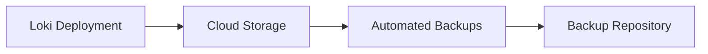
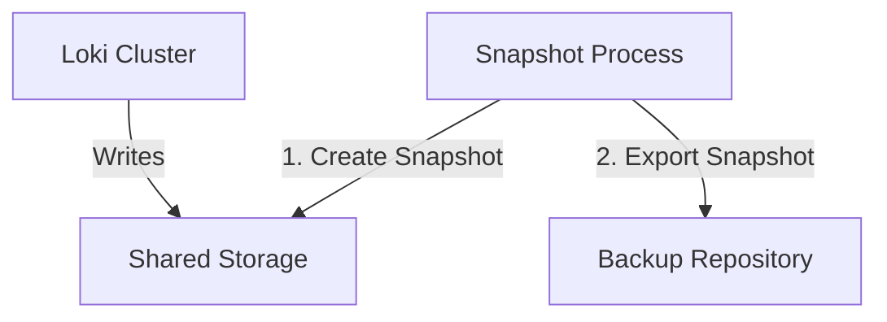
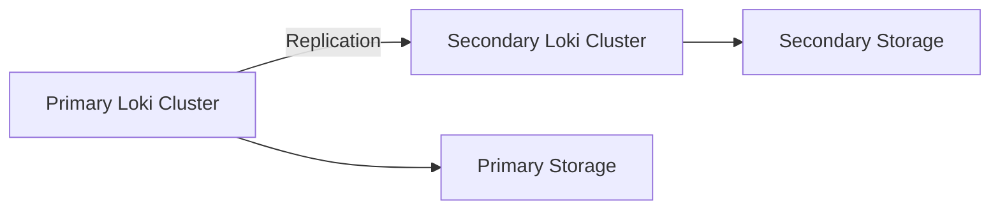

# Backup Strategies

## Introduction

A robust backup strategy is critical for any production Grafana Loki deployment. Logs often contain vital information about your system's behavior, security events, and user activities. Losing this data due to hardware failure, human error, or disaster can impact debugging capabilities, compliance requirements, and business operations.

This guide explores various backup approaches for Grafana Loki, helping you develop a comprehensive strategy to protect your log data and ensure system reliability.

## Understanding Loki's Storage Components

Before diving into backup strategies, it's important to understand what needs to be backed up in a Loki deployment.

Loki's architecture consists of several key components that store data:

1. **Index Store**: Contains metadata about your logs (labels and pointers to chunks)
2. **Chunk Store**: Contains the actual compressed log content
3. **Configuration**: Your Loki configuration files and rules
4. **Compactor State**: Information about compaction jobs

Each component requires a different backup approach depending on your deployment model.

## Backup Strategy Options

### Option 1: Storage-Level Backups

The simplest approach leverages your underlying storage system's native backup capabilities.

#### For Cloud-Based Deployments



If you're using cloud storage solutions:

- **AWS S3**: Set up S3 bucket versioning and lifecycle policies
- **Google Cloud Storage**: Configure GCS bucket versioning and retention policies
- **Azure Blob Storage**: Implement Azure Backup or snapshot policies

**Example AWS S3 Configuration:**

```bash
# Enable versioning on S3 bucket
aws s3api put-bucket-versioning \
    --bucket loki-storage \
    --versioning-configuration Status=Enabled

# Set up lifecycle policy for cost management
aws s3api put-bucket-lifecycle-configuration \
    --bucket loki-storage \
    --lifecycle-configuration file://lifecycle-config.json
```

Content of `lifecycle-config.json`:

```json
{
  "Rules": [
    {
      "ID": "Delete old versions after 30 days",
      "Status": "Enabled",
      "Filter": {
        "Prefix": ""
      },
      "NoncurrentVersionExpiration": {
        "NoncurrentDays": 30
      }
    }
  ]
}
```

#### For Self-Hosted Deployments

For self-hosted deployments using local storage or NFS:

- Implement regular filesystem backups
- Use tools like [Restic](https://restic.net/) or [Borg](https://www.borgbackup.org/) for efficient backups
- Ensure backups are stored off-site

**Example Restic Backup Command:**

```bash
# Initialize restic repository (first time only)
restic init --repo /path/to/backup/repository

# Create backup of Loki data directory
restic backup /var/lib/loki --tag loki-data --repo /path/to/backup/repository

# Maintain backup retention policy
restic forget --keep-daily 7 --keep-weekly 4 --keep-monthly 6 --repo /path/to/backup/repository
```

### Option 2: Loki-Specific Backup Methods

#### Using Shared Storage with Snapshots

For Loki deployments that use shared storage (such as a SAN or cloud volumes):

1. Create consistent snapshots of storage volumes
2. Ensure all write operations are paused or consistent during snapshot creation



#### Database-Specific Backups

If you're using databases for Loki's index store:

- **Cassandra**: Use [nodetool snapshot](https://cassandra.apache.org/doc/latest/cassandra/tools/nodetool/snapshot.html)
- **DynamoDB**: Configure [AWS Backup](https://aws.amazon.com/backup/)
- **BoltDB**: Use filesystem-level backups while ensuring consistency

**Example Cassandra Backup:**

```bash
# Create snapshot
nodetool snapshot -t loki_backup loki_index

# Copy snapshot files
cp -r /var/lib/cassandra/data/loki_index/*/snapshots/loki_backup /backup/destination
```

### Option 3: Multi-Cluster Replication

For mission-critical deployments, consider implementing a multi-cluster replication strategy:



1. Deploy Loki in multiple regions or data centers
2. Configure applications to send logs to both deployments
3. Use different storage backends for each deployment

**Example Promtail Configuration for Dual Sending:**

```yaml
clients:
  - url: http://primary-loki:3100/loki/api/v1/push
    tenant_id: tenant1
  - url: http://secondary-loki:3100/loki/api/v1/push
    tenant_id: tenant1
```

## Developing a Comprehensive Backup Strategy

A complete backup strategy includes:

1. **Regular Backups**: Schedule consistent backups of all components
2. **Backup Testing**: Regularly test restoration processes
3. **Retention Policies**: Define how long to keep different backup sets
4. **Monitoring**: Alert on backup failures
5. **Documentation**: Document backup and recovery procedures

### Sample Backup Schedule

| Component | Frequency | Retention | Method |
|-----------|-----------|-----------|--------|
| Index Store | Daily | 30 days | DB-specific backup |
| Chunk Store | Weekly | 90 days | Storage snapshot |
| Configuration | After changes | 1 year | Version control |
| Full System | Monthly | 1 year | Complete snapshot |

## Restoration Testing

Regular testing of your backup restoration process is crucial. Here's a recommended approach:

1. Set up a test environment that mimics your production setup
2. Restore your backups to this environment
3. Verify data integrity and system functionality
4. Document any issues encountered and improve the process

**Example Restoration Test Script:**

```bash
#!/bin/bash
# Script to test Loki backup restoration

# Create test environment
docker-compose -f loki-test-env.yml up -d

# Restore backup data
./restore-backup.sh --source /backups/loki-backup-2023-04-15 --target loki-test

# Verify restoration
curl -s "http://localhost:3100/loki/api/v1/query?query={job=\"test\"}" | jq .

# Cleanup
docker-compose -f loki-test-env.yml down
```

## Special Considerations for Loki

### Handling Compactor State

If you're using Loki's compactor:

- Backup the compactor's boltdb state files
- Include compactor configuration in your backups
- Consider temporary disabling compaction during backup operations

### Tenant Isolation

For multi-tenant Loki deployments:

- Consider tenant-specific backup strategies
- Implement selective restoration capabilities
- Test cross-tenant isolation during restoration

## Implementing Backup Automation

Automate your backup process using tools like:

- Kubernetes CronJobs for container deployments
- CI/CD pipelines for configuration backups
- Cloud provider backup automation services

**Example Kubernetes CronJob for Loki Backups:**

```yaml
apiVersion: batch/v1
kind: CronJob
metadata:
  name: loki-backup
spec:
  schedule: "0 2 * * *"  # Daily at 2 AM
  jobTemplate:
    spec:
      template:
        spec:
          containers:
          - name: backup
            image: backup-tool:latest
            command:
            - /bin/sh
            - -c
            - |
              # Backup Loki storage
              backup-loki.sh --destination gs://backups/loki/$(date +%Y-%m-%d)
          restartPolicy: OnFailure
```

## Summary

Implementing a robust backup strategy for Grafana Loki is essential for maintaining data integrity and system reliability. By understanding Loki's architecture and following the backup approaches outlined in this guide, you can protect your log data from various failure scenarios.

Remember these key points:

- Identify all components that need backup (index store, chunk store, configuration)
- Choose appropriate backup methods based on your deployment model
- Implement regular backup schedules with appropriate retention policies
- Test your restoration process regularly
- Automate backup procedures where possible

## Additional Resources

- [Grafana Loki Documentation](https://grafana.com/docs/loki/latest/)
- [Loki Storage Documentation](https://grafana.com/docs/loki/latest/operations/storage/)
- [Disaster Recovery Best Practices](https://grafana.com/docs/grafana/latest/administration/disaster-recovery/)

## Exercises

1. Set up a test Loki environment and implement a backup strategy using one of the methods described in this guide.
2. Create a restoration test plan and verify that you can successfully restore your Loki deployment.
3. Design a backup strategy for a multi-tenant Loki deployment with different retention requirements for each tenant.
4. Implement an automated backup solution using Kubernetes CronJobs or another automation tool.