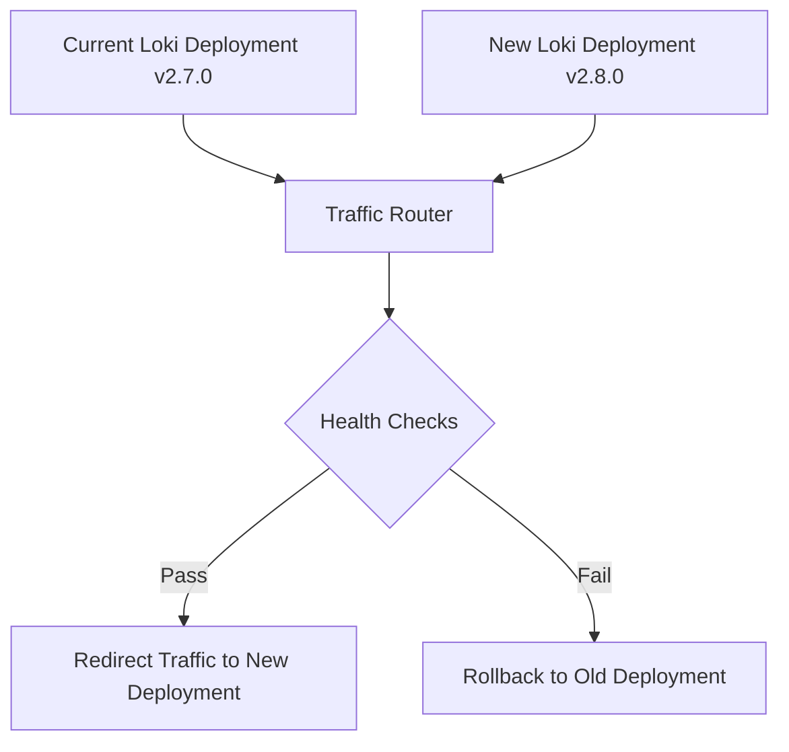

# Upgrade Procedures

## Introduction

Upgrading Grafana Loki is a critical operational task that requires careful planning and execution. This guide covers best practices for upgrading Loki deployments while minimizing downtime and avoiding data loss. Whether you're running Loki in a small single-binary deployment or a large distributed environment, following these procedures will help ensure smooth transitions between versions.

## Understanding Loki's Versioning

Grafana Loki follows semantic versioning (SemVer) which helps you understand the nature of changes in each release:

- **Major releases** (e.g., 2.0.0): May contain breaking changes requiring careful migration planning
- **Minor releases** (e.g., 2.4.0): Add new features in a backward-compatible manner
- **Patch releases** (e.g., 2.4.1): Contain backward-compatible bug fixes

Before any upgrade, it's essential to read the release notes for details on breaking changes, deprecations, and new features.

## Pre-Upgrade Checklist

Before upgrading your Loki deployment, complete this checklist:

1. **Read the release notes** for the target version
2. **Back up configurations** and critical data
3. **Ensure adequate resources** for the upgrade process
4. **Verify storage compatibility** with the new version
5. **Check dependency requirements** for the target version
6. **Plan for rollback** in case of issues

### Example Pre-Upgrade Configuration Backup

```bash
# Back up Loki configuration
cp /etc/loki/loki-local-config.yaml /etc/loki/loki-local-config.yaml.bak-$(date +%Y%m%d)

# Back up any custom runtime configurations
kubectl get configmap -n loki loki-runtime-config -o yaml > loki-runtime-config-backup.yaml
```

## Upgrade Strategies

### 1. In-Place Upgrades

Suitable for single-binary deployments or when minimal downtime is acceptable.

```bash
# Stop Loki service
systemctl stop loki

# Update binary
wget https://github.com/grafana/loki/releases/download/v2.8.0/loki-linux-amd64.zip
unzip loki-linux-amd64.zip
mv loki-linux-amd64 /usr/local/bin/loki

# Start Loki service
systemctl start loki

# Verify upgrade
curl http://localhost:3100/ready
```

### 2. Rolling Updates (for Kubernetes)

Ideal for distributed deployments requiring high availability.

```yaml
# Example Kubernetes manifest update
apiVersion: apps/v1
kind: StatefulSet
metadata:
  name: loki
spec:
  replicas: 3
  selector:
    matchLabels:
      app: loki
  template:
    metadata:
      labels:
        app: loki
    spec:
      containers:
      - name: loki
        image: grafana/loki:2.8.0  # Updated version
        # Rest of configuration remains the same
```

Apply with:

```bash
kubectl apply -f loki-statefulset.yaml
```

### 3. Blue-Green Deployment

For production environments where zero downtime is critical.



## Version-Specific Upgrade Considerations

### Upgrading from Loki 2.6.x to 2.7.x

```bash
# Example configuration update needed for 2.7.x
cat << EOF > ruler_config_update.yaml
ruler:
  storage:
    type: local
    local:
      directory: /loki/rules
  rule_path: /loki/rules-temp
  alertmanager_url: http://alertmanager.monitoring.svc.cluster.local:9093
  ring:
    kvstore:
      store: memberlist
EOF
```

### Upgrading from Loki 2.7.x to 2.8.x

With 2.8.x, the index configuration changed slightly:

```yaml
schema_config:
  configs:
    - from: 2020-07-01
      store: boltdb-shipper
      object_store: s3
      schema: v12
      index:
        prefix: loki_index_
        period: 24h
```

## Post-Upgrade Verification

After upgrading, perform these verification steps:

1. **Check service health**:

```bash
# Check if Loki is ready
curl http://loki:3100/ready

# Check metrics endpoint
curl http://loki:3100/metrics | grep loki_build_info
```

2. **Verify query functionality**:

```bash
# Test a simple LogQL query
curl -G -s "http://loki:3100/loki/api/v1/query" --data-urlencode 'query={job="loki"}' | jq
```

3. **Monitor for errors in logs**:

```bash
# Check for error patterns
kubectl logs -n loki -l app=loki | grep -i error

# Check for warnings about deprecated features
kubectl logs -n loki -l app=loki | grep -i deprecat
```

## Handling Common Upgrade Issues

### Issue: Configuration Compatibility Problems

```bash
# Error log example
# level=error msg="failed to initialize compactor: invalid compactor configuration: retention_enabled is set, but retention_period is zero"
```

**Solution**: Update configuration to match new requirements:

```yaml
compactor:
  retention_enabled: true
  retention_period: 90d
```

### Issue: Missing Indices After Upgrade

**Solution**: Check storage configuration and run compaction:

```bash
# Force compaction
curl -X POST http://loki:3100/loki/api/v1/compactor/run
```

## Upgrading Related Components

### Promtail Upgrade

When upgrading Loki, it's often beneficial to upgrade Promtail as well:

```bash
# Download latest Promtail
wget https://github.com/grafana/loki/releases/download/v2.8.0/promtail-linux-amd64.zip
unzip promtail-linux-amd64.zip
mv promtail-linux-amd64 /usr/local/bin/promtail

# Restart Promtail
systemctl restart promtail
```

### Grafana Upgrade for Loki Compatibility

Ensure Grafana version is compatible with your Loki version:

```bash
# Update Grafana helm chart
helm upgrade --install grafana grafana/grafana \
  --set "grafana.image.tag=9.3.2" \
  --namespace monitoring
```

## Upgrade Testing Environment

Before upgrading production, it's recommended to create a test environment:

```bash
# Create a namespace for testing
kubectl create ns loki-test

# Deploy the new version to test
helm upgrade --install loki-test grafana/loki \
  --set "loki.image.tag=2.8.0" \
  --namespace loki-test
```

## Summary

Upgrading Grafana Loki requires careful planning and execution. By following these best practices, you can minimize downtime and ensure smooth transitions between versions:

1. Always read release notes and prepare accordingly
2. Back up configurations before upgrading
3. Choose an appropriate upgrade strategy based on your deployment
4. Verify the upgrade with comprehensive testing
5. Have a rollback plan ready in case of issues

## Additional Resources

- [Grafana Loki GitHub Repository](https://github.com/grafana/loki)
- [Loki Operations Documentation](https://grafana.com/docs/loki/latest/operations/)
- [Loki Configuration Reference](https://grafana.com/docs/loki/latest/configuration/)

## Exercises

1. Create a backup and restore plan for your specific Loki deployment
2. Set up a test environment and practice upgrading from your current version to the next
3. Write a monitoring script that checks for Loki health post-upgrade
4. Automate the upgrade process for your Loki deployment using CI/CD
5. Design a rollback strategy for your specific environment