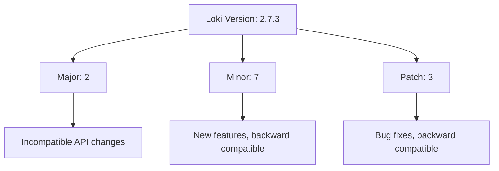
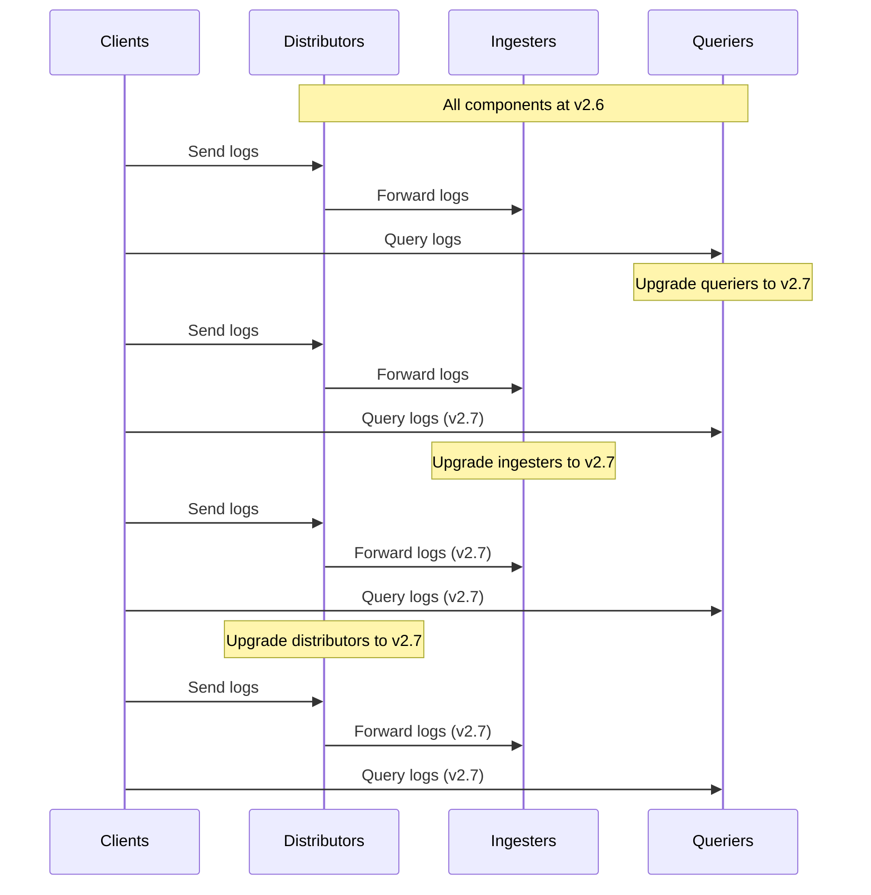

# Version Compatibility

## Introduction

Version compatibility is a critical aspect of working with Grafana Loki in production environments. As your logging infrastructure evolves, you'll need to understand how different versions of Loki components interact with each other and with the broader Grafana ecosystem. This guide will help you navigate version compatibility challenges and implement best practices to ensure smooth upgrades and stable operations.

## Why Version Compatibility Matters

In a distributed system like Grafana Loki, multiple components work together:

- Loki servers (distributors, ingesters, queriers)
- Promtail and other log agents
- Grafana for visualization
- Plugins and integrations

When these components have mismatched versions, you might encounter:

- Breaking API changes
- Missing features
- Performance degradation
- Data corruption (in worst cases)

## Understanding Loki's Versioning Scheme

Grafana Loki follows semantic versioning (SemVer) with the format `MAJOR.MINOR.PATCH`:

- **MAJOR**: Incompatible API changes
- **MINOR**: Backward-compatible new functionality
- **PATCH**: Backward-compatible bug fixes

For example, in version `2.7.3`:
- `2` is the major version
- `7` is the minor version
- `3` is the patch version



## Compatibility Between Loki Components

### Loki Server and Clients

The compatibility relationships between Loki components follow these general rules:

1. **Backward Compatibility**: Newer Loki servers generally support older clients
2. **Forward Compatibility**: Older Loki servers might not support newer clients
3. **Same Major Version**: Components with the same major version usually work together

Here's a compatibility matrix showing typical relationships:

| Component Relationship | Best Compatibility | Potential Issues |
|------------------------|-------------------|------------------|
| Loki Server → Promtail | Same version or Promtail older | Newer Promtail may use APIs not in older Loki |
| Loki → Grafana | Grafana same or newer version | Older Grafana may lack features to query newer Loki |
| Loki Microservices | Exactly same version | Different versions can cause internal API conflicts |

### Code Example: Checking Versions

You can use the API to check component versions before connecting them:

```bash
# Check Loki version
curl -s http://loki:3100/loki/api/v1/status/buildinfo | jq
```

Example output:

```json
{
  "status": "success",
  "data": {
    "version": "2.7.3",
    "revision": "89b0b74",
    "branch": "main",
    "buildUser": "loki-build",
    "buildDate": "2023-04-15T12:30:45Z",
    "goVersion": "go1.18.2"
  }
}
```

## Best Practices for Version Management

### 1. Document Your Versions

Create a version manifest for your deployment:

```yaml
# loki-version-manifest.yaml
components:
  loki_server: "2.7.3"
  promtail: "2.7.3"
  grafana: "9.5.1"
  mimir: "2.6.0"
  tempo: "1.5.0"
```

### 2. Implement Version Checking in Deployment

Add version validation to your deployment scripts:

```bash
#!/bin/bash
# version-check.sh

# Define compatible version ranges
LOKI_VERSION="2.7.3"
MIN_GRAFANA_VERSION="9.4.0"

# Get actual Grafana version
ACTUAL_GRAFANA=$(curl -s http://grafana:3000/api/health | jq -r '.version')

# Version comparison (simplified)
if [[ "$ACTUAL_GRAFANA" < "$MIN_GRAFANA_VERSION" ]]; then
  echo "ERROR: Grafana version $ACTUAL_GRAFANA is older than required minimum $MIN_GRAFANA_VERSION"
  exit 1
fi

echo "Version compatibility check passed!"
```

### 3. Follow the N-1 Rule

A pragmatic approach is to follow the "N-1 rule": clients should be no more than one minor version behind servers.

Example:
- If your Loki server is at version `2.7.3`
- Your Promtail should be at least `2.6.0`

### 4. Test in Staging First

Always verify compatibility in a staging environment before production:

```bash
# Deploy new versions to staging
helm upgrade --install loki grafana/loki-stack \
  --set loki.image.tag=2.8.0 \
  --set promtail.image.tag=2.7.3 \
  -n loki-staging

# Run compatibility tests
./test-queries.sh
```

## Real-World Compatibility Scenarios

### Scenario 1: Rolling Upgrade

When performing a rolling upgrade of Loki from 2.6 to 2.7:

1. Upgrade the queriers first (they need to understand both old and new formats)
2. Upgrade the ingesters next
3. Finally, upgrade the distributors



### Scenario 2: Microservices Deployment

In a microservices architecture where Loki components run separately:

```yaml
# docker-compose.yml
version: '3'
services:
  distributor:
    image: grafana/loki:2.7.3
    command: ["--target=distributor"]
    # ...
  
  ingester:
    image: grafana/loki:2.7.3  # Must match distributor version
    command: ["--target=ingester"]
    # ...
  
  querier:
    image: grafana/loki:2.7.3  # Must match ingester version
    command: ["--target=querier"]
    # ...
```

### Scenario 3: Handling Breaking Changes

When Loki introduces breaking changes (like from v1.x to v2.x):

1. Review the migration guide thoroughly
2. Identify required configuration changes
3. Consider running dual-stack temporarily
4. Update monitoring and alerting rules

Example configuration change from v1 to v2:

```yaml
# Loki v1.x config
schema_config:
  configs:
    - from: 2020-07-01
      store: boltdb
      object_store: filesystem
      schema: v11
      index:
        prefix: index_
        period: 24h

# Loki v2.x config
compactor:
  working_directory: /loki/compactor
  shared_store: filesystem
schema_config:
  configs:
    - from: 2020-07-01
      store: boltdb-shipper
      object_store: filesystem
      schema: v11
      index:
        prefix: index_
        period: 24h
```

## Troubleshooting Version Compatibility Issues

### Common Issues and Solutions

1. **API Errors**: If you see `404 Not Found` or `Method not allowed` errors:
   ```
   {"status":"error","message":"specified query range is outside of known index range"}
   ```
   **Solution**: Check if your Grafana version supports the Loki API version you're using.

2. **Missing Features**: If an expected feature isn't available:
   ```
   {"status":"error","message":"unknown log parser: 'json'"}
   ```
   **Solution**: Verify component versions meet minimum requirements for that feature.

3. **Performance Degradation**: If queries become slow after an upgrade:
   ```
   {"status":"error","message":"query timed out after 1m"}
   ```
   **Solution**: Check for new tuning parameters in the latest version.

### Diagnosing Version Problems

Use these commands to diagnose version-related issues:

```bash
# Check component versions
for svc in distributor ingester querier; do
  echo "Checking $svc version:"
  kubectl exec deploy/loki-$svc -n loki -- \
    wget -qO- localhost:3100/loki/api/v1/status/buildinfo
done
```

## Maintaining Long-Term Compatibility

For long-term reliability:

1. **Standardize versions** across your organization
2. **Create version policies** for minimum supported versions
3. **Automate compatibility checking** in CI/CD pipelines
4. **Subscribe to release announcements** for early awareness
5. **Contribute compatibility findings** back to the community

## Summary

Version compatibility is essential for maintaining a stable Grafana Loki deployment. By understanding versioning schemes, following best practices, and implementing proper testing procedures, you can avoid many common pitfalls when upgrading components.

Remember these key points:
- Follow semantic versioning principles
- Keep components within compatible version ranges
- Test thoroughly before production deployments
- Document your versions and compatibility requirements
- Prepare for breaking changes between major versions

## Additional Resources

- [Grafana Loki Release Notes](https://github.com/grafana/loki/releases)
- [Grafana Compatibility Matrix](https://grafana.com/docs/grafana/latest/setup-grafana/installation/requirements/#database-requirements)
- [Loki API Documentation](https://grafana.com/docs/loki/latest/api/)

## Exercises

1. Create a version compatibility matrix for your current Loki deployment.
2. Write a script to automatically check version compatibility between components.
3. Design a rollback plan in case of version incompatibility issues.
4. Practice a rolling upgrade in a test environment, documenting each step.
5. Research the latest Loki version and identify potential compatibility issues for your deployment.