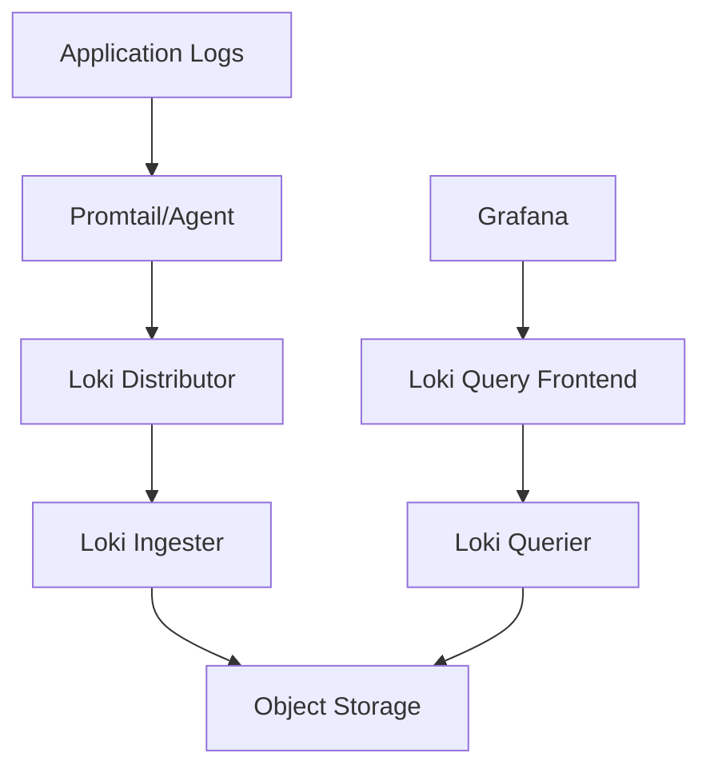

# Documentation Practices

## Introduction

Documentation is a crucial aspect of any software development project, and Grafana Loki implementations are no exception. Good documentation serves as a guide for current team members, onboards new developers quickly, and ensures that your logging system remains maintainable over time. In this lesson, we'll explore the importance of documentation in Grafana Loki projects and provide practical strategies for creating effective documentation.

## Why Documentation Matters for Loki

Grafana Loki, as a log aggregation system, involves multiple components and configurations that can quickly become complex. Without proper documentation:

- New team members may struggle to understand your logging architecture
- Troubleshooting becomes more difficult and time-consuming
- Knowledge becomes siloed and dependent on specific individuals
- Future maintenance and upgrades may introduce unexpected issues

## Essential Documentation Components

### 1. Architecture Overview

Start with a high-level description of your Loki implementation. This should include:

- Deployment model (single binary, microservices, etc.)
- Infrastructure details (Kubernetes, bare metal, cloud provider)
- Component relationships and data flow



### 2. Configuration Documentation

Document all configuration files with explanations for key settings. For example:

```yaml
auth_enabled: false  # Authentication disabled for development environment

server:
  http_listen_port: 3100  # The port Loki will listen on

ingester:
  lifecycler:
    ring:
      kvstore:
        store: inmemory  # Using in-memory store instead of Consul/etcd
      replication_factor: 1  # Single replica for development
```

Explain why certain configuration choices were made, especially when deviating from defaults.

### 3. Label Strategy

Since Loki relies heavily on labels for efficient querying, document your labeling strategy:


# Loki Label Strategy

## Standard Labels
- `app`: The application generating the logs (e.g., `frontend`, `api`, `database`)
- `environment`: Deployment environment (e.g., `production`, `staging`, `development`)
- `host`: Hostname of the originating server
- `severity`: Log level (e.g., `info`, `warn`, `error`, `debug`)

## Query Examples
- Find all errors in production API: `{app="api", environment="production", severity="error"}`
- Find all logs from a specific host: `{host="web-server-01"}`


### 4. Alert and Dashboard Documentation

For each Loki alert and dashboard, include:

- Purpose and what the alert/dashboard monitors
- Expected behavior and thresholds
- Troubleshooting steps when alerts trigger

Example:


## High Error Rate Alert

**Description**: Triggers when error logs exceed 5% of total logs over 5 minutes.

**Query**:

```
sum(rate({severity="error"}[5m])) / sum(rate({severity=~".+"}[5m])) > 0.05
```

**Troubleshooting Steps**:
1. Check application logs for specific error messages
2. Verify recent deployments or configuration changes
3. Check upstream dependencies for failures


### 5. Operational Procedures

Document routine operational tasks:


## Scaling Ingesters

When log volume increases beyond 10GB/day:

1. Increase replicas in `loki-ingester-statefulset.yaml`:
```yaml
replicas: 3  # Increase from previous value
   ```

2. Apply the change:

```bash
kubectl apply -f loki-ingester-statefulset.yaml
```

3. Monitor ingestion rate in Grafana dashboard "Loki Operations"


## Documentation Best Practices

### 1. Keep Documentation Close to Code

Store documentation in the same repository as your Loki configuration. This ensures that documentation changes are reviewed alongside code changes and stay in sync.

```
loki-deployment/
├── README.md  # Overview documentation
├── configs/
│   ├── loki.yaml
│   └── promtail.yaml
├── kubernetes/
│   ├── loki-statefulset.yaml
│   └── promtail-daemonset.yaml
└── docs/
├── architecture.md
├── scaling.md
├── troubleshooting.md
└── query-examples.md
```

### 2. Use Markdown for Readability

Markdown provides a good balance between readability and formatting capabilities:


# Loki Query Examples

## Finding Specific Error Messages

To find all occurrences of a specific error:

```logql
{app="api"} |= "connection refused"
```

This will return all logs from the API service containing the phrase "connection refused".


### 3. Include Context and Reasoning

Don't just document what was done, but why it was done. This helps future team members understand the reasoning behind decisions.


## Single-Store Configuration

We're using the `single-store` schema because:

1. Our log volume (`<5GB/day`) doesn't justify the complexity of separate stores
2. Simplifies backup and recovery procedures
3. Reduces operational overhead

If log volume exceeds 20GB/day, consider switching to the `boltdb-shipper` schema.


### 4. Document Query Patterns

Since Loki's LogQL has specific performance characteristics, document efficient query patterns:


## Efficient Querying

### DO:
- Always filter by labels first: `{app="api", environment="production"}`
- Use time ranges to limit results: `{app="api"} | last 1h`
- Use line filters after label selection: `{app="api"} |= "error"`

### AVOID:
- Querying without label filters: `{} |= "error"`  (scans all logs)
- Very large time ranges without aggregation: `{app="api"} | last 7d`


### 5. Automate Documentation Testing

Use tools to verify your documentation stays accurate:

```bash
# Example script to test if documented queries still work
#!/bin/bash

queries=(
  '{app="api", environment="production", severity="error"}'
  '{host="web-server-01"}'
)

for query in "${queries[@]}"; do
  echo "Testing query: $query"
  curl -s -G --data-urlencode "query=$query" http://loki:3100/loki/api/v1/query_range
  if [ $? -ne 0 ]; then
    echo "Query failed: $query"
    exit 1
  fi
done
```

## Real-World Example: Documenting a Complete Loki Setup

Let's look at a practical example of documenting a production Loki implementation:


# Acme Corp. Loki Logging Infrastructure

## Overview
This documentation describes our centralized logging solution using Grafana Loki.

## Architecture
- **Deployment Model**: Microservices on Kubernetes
- **Scale**: Processing ~50GB logs daily across 200 services
- **Storage**: S3-compatible object storage with 90-day retention

## Components
1. **Collection**: Promtail DaemonSet on all Kubernetes nodes
2. **Distribution**: 3 Loki Distributors with load balancing
3. **Storage**: BoltDB for index, S3 for chunks
4. **Querying**: 2 Query Frontends with 4 Queriers

## Label Strategy
We use the following labels for all logs:
- `namespace`: Kubernetes namespace
- `app`: Application name from pod labels
- `component`: Specific component (api, worker, scheduler)
- `environment`: prod, staging, dev
- `team`: Owning team

## Common Queries
- Find all errors for Team A in production:

```logql
{team="team-a", environment="prod", severity="error"}
```

- Detect increased error rates:

```logql
sum by(app) (rate({severity="error"}[5m]))
/
sum by(app) (rate({severity=~".+"}[5m]))
```

## Scaling Procedures
When ingestion rate exceeds 80% of capacity:
1. Scale ingesters to N+1
2. Verify ring status and distribution
3. Monitor query latency for degradation


## Common Documentation Mistakes to Avoid

1. **Outdated documentation**: Regularly review and update docs
2. **Missing context**: Include why decisions were made
3. **Lack of examples**: Provide real-world examples, not just theory
4. **Assuming knowledge**: Define terms and concepts for new team members
5. **Ignoring failure modes**: Document what can go wrong and how to fix it

## Summary

Effective documentation for Grafana Loki is an investment that pays dividends throughout the lifecycle of your logging implementation. By documenting your architecture, configuration, labeling strategy, and operational procedures, you create a valuable resource that enables your team to work more efficiently and reduces the risk of knowledge silos.

Remember that documentation is a living artifact that should evolve alongside your logging system. Schedule regular reviews to ensure documentation remains accurate and useful.

## Additional Resources

- [Grafana Loki Documentation](https://grafana.com/docs/loki/latest/)
- [LogQL Query Language Reference](https://grafana.com/docs/loki/latest/logql/)
- [Google's Documentation Style Guide](https://developers.google.com/style)

## Exercises

1. Create an architecture diagram for your current or planned Loki implementation
2. Document your labeling strategy, including at least 5 standard labels
3. Write documentation for 3 common operational tasks in your environment
4. Create a troubleshooting guide for a common issue with Loki
5. Review an existing piece of documentation and improve it by adding context, examples, or clarifying explanations