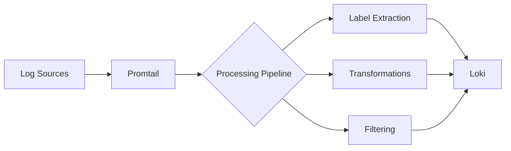

# Promtail Introduction

## What is Promtail?

Promtail is the official log collection agent for Grafana Loki. Just as Prometheus has Prometheus Node Exporter for metrics collection, Loki has Promtail for log collection. Promtail is responsible for gathering logs from various sources on your system and forwarding them to Loki for storage and analysis.

The name "Promtail" combines "Prometheus" and "tail" - reflecting its heritage from the Prometheus ecosystem and its primary function of tailing log files (following log files as they're written to).

## Why Use Promtail?

Promtail offers several key advantages as a log collection agent:

1. **Native Loki Integration**: Built specifically for Loki, Promtail ensures optimal compatibility and performance
2. **Service Discovery**: Automatically discovers targets to collect logs from (similar to Prometheus)
3. **Label Addition**: Attaches metadata labels to log entries, making them queryable in Loki
4. **Efficient**: Designed to be lightweight with minimal resource consumption

## How Promtail Works

Promtail operates using a pipeline-based architecture:



The basic workflow is:

1. Promtail discovers targets and identifies log files to collect
2. It tails these files, reading new log entries as they're written
3. It processes log entries through a configurable pipeline
4. It attaches labels to log entries based on their source and content
5. It batches and sends the labeled logs to Loki

## Installing Promtail

Promtail can be installed in several ways. Here's how to download and run the binary directly:

```bash
# Download Promtail (example for Linux AMD64)
curl -O -L "https://github.com/grafana/loki/releases/download/v2.8.0/promtail-linux-amd64.zip"

# Extract the binary
unzip "promtail-linux-amd64.zip"

# Make it executable
chmod +x promtail-linux-amd64

# Run with a configuration file
./promtail-linux-amd64 -config.file=promtail-config.yaml
```

For container environments, you can use the Docker image:

```bash
docker run -v /path/to/promtail-config.yaml:/etc/promtail/config.yml \
  -v /var/log:/var/log grafana/promtail:2.8.0 \
  -config.file=/etc/promtail/config.yml
```

## Basic Configuration

Promtail uses YAML for configuration. Here's a minimal configuration file to get started:

```yaml
server:
  http_listen_port: 9080
  grpc_listen_port: 0

positions:
  filename: /tmp/positions.yaml

clients:
  - url: http://loki:3100/loki/api/v1/push

scrape_configs:
  - job_name: system
    static_configs:
      - targets:
          - localhost
        labels:
          job: varlogs
          __path__: /var/log/*log
```

Let's break down this configuration:

- `server`: Defines the HTTP port Promtail listens on for metrics and API requests
- `positions`: Specifies where Promtail stores its reading position in files
- `clients`: Lists Loki servers to send logs to
- `scrape_configs`: Defines what logs to collect and how to label them

## Discovering and Collecting Logs

Promtail can discover logs through different mechanisms defined in `scrape_configs`:

### Static File Discovery

The simplest approach is to specify log paths directly:

```yaml
scrape_configs:
  - job_name: system
    static_configs:
      - targets:
          - localhost
        labels:
          job: varlogs
          __path__: /var/log/*log
```

This will collect all files ending with "log" in the /var/log directory.

### Dynamic Service Discovery

Promtail can also discover logs from services, similar to Prometheus:

```yaml
scrape_configs:
  - job_name: kubernetes-pods
    kubernetes_sd_configs:
      - role: pod
    relabel_configs:
      - source_labels:
          - __meta_kubernetes_pod_annotation_prometheus_io_scrape
        regex: "true"
        action: keep
      - source_labels:
          - __meta_kubernetes_pod_container_name
        target_label: container_name
      - source_labels:
          - __meta_kubernetes_pod_label_app
        target_label: app
      - source_labels:
          - __meta_kubernetes_namespace
        target_label: namespace
      - source_labels:
          - __meta_kubernetes_pod_node_name
        target_label: node_name
      - source_labels:
          - __meta_kubernetes_pod_name
        target_label: pod_name
      - replacement: /var/log/pods/*${__meta_kubernetes_pod_uid}/*/*.log
        target_label: __path__
```

This will discover and collect logs from Kubernetes pods based on annotations and add relevant labels.

## Processing Logs with Pipelines

Promtail's pipelines allow you to transform and extract information from logs:

```yaml
scrape_configs:
  - job_name: application
    static_configs:
      - targets:
          - localhost
        labels:
          job: application
          __path__: /var/log/app.log
    pipeline_stages:
      - regex:
          expression: '(?P<timestamp>\d{4}-\d{2}-\d{2} \d{2}:\d{2}:\d{2}) (?P<level>[A-Z]+) (?P<message>.*)'
      - labels:
          level:
      - timestamp:
          source: timestamp
          format: '2006-01-02 15:04:05'
```

This pipeline:
1. Uses regex to extract timestamp, level, and message from log entries
2. Adds the "level" as a label for easy filtering in Loki
3. Properly parses the timestamp for chronological ordering

## Real-World Example: Monitoring Web Server Logs

Let's see a practical example of monitoring Nginx web server logs:

```yaml
scrape_configs:
  - job_name: nginx
    static_configs:
      - targets:
          - localhost
        labels:
          job: nginx
          __path__: /var/log/nginx/access.log
    pipeline_stages:
      - regex:
          expression: '(?P<ip>\S+) - (?P<user>\S+) \[(?P<timestamp>.*?)\] "(?P<method>\S+) (?P<path>\S+) (?P<protocol>\S+)" (?P<status>\d+) (?P<size>\d+) "(?P<referer>.*?)" "(?P<agent>.*?)"'
      - labels:
          method:
          status:
          path:
      - timestamp:
          source: timestamp
          format: '02/Jan/2006:15:04:05 -0700'
```

With this configuration:
1. Promtail will collect Nginx access logs
2. It will extract HTTP method, status code, and requested path as labels
3. These labels allow you to create powerful queries in Loki such as:
   - Find all 404 errors: `{job="nginx", status="404"}`
   - See all POST requests: `{job="nginx", method="POST"}`
   - Monitor a specific endpoint: `{job="nginx", path="/api/users"}`

## Input and Output Example

To understand how Promtail transforms logs, here's a complete example:

**Input Log Entry:**
```
192.168.1.20 - - [10/Oct/2023:13:55:36 +0000] "GET /index.html HTTP/1.1" 200 2571 "http://example.com/home" "Mozilla/5.0 (Windows NT 10.0; Win64; x64) AppleWebKit/537.36"
```

**Promtail Configuration:**
```yaml
scrape_configs:
  - job_name: nginx
    static_configs:
      - targets:
          - localhost
        labels:
          job: nginx
          environment: production
          server: web-01
          __path__: /var/log/nginx/access.log
    pipeline_stages:
      - regex:
          expression: '(?P<ip>\S+) - (?P<user>\S+) \[(?P<timestamp>.*?)\] "(?P<method>\S+) (?P<path>\S+) (?P<protocol>\S+)" (?P<status>\d+) (?P<size>\d+)'
      - labels:
          method:
          status:
          path:
      - timestamp:
          source: timestamp
          format: '02/Jan/2006:15:04:05 -0700'
```

**Output to Loki:**
```json
{
  "streams": [
    {
      "stream": {
        "job": "nginx",
        "environment": "production",
        "server": "web-01",
        "method": "GET",
        "status": "200",
        "path": "/index.html"
      },
      "values": [
        [
          "1696945536000000000",
          "192.168.1.20 - - [10/Oct/2023:13:55:36 +0000] \"GET /index.html HTTP/1.1\" 200 2571 \"http://example.com/home\" \"Mozilla/5.0 (Windows NT 10.0; Win64; x64) AppleWebKit/537.36\""
        ]
      ]
    }
  ]
}
```

Notice how the log entry is now:
- Assigned a precise timestamp
- Tagged with meaningful labels
- Ready for efficient querying in Loki

## Common Integration Scenarios

Promtail can be integrated with various log sources:

### System Logs

```yaml
scrape_configs:
  - job_name: system
    static_configs:
      - targets:
          - localhost
        labels:
          job: syslog
          __path__: /var/log/syslog
```

### Multiple Applications

```yaml
scrape_configs:
  - job_name: applications
    static_configs:
      - targets:
          - localhost
        labels:
          job: app1
          __path__: /var/log/app1/*.log
      - targets:
          - localhost
        labels:
          job: app2
          __path__: /var/log/app2/*.log
```

### Docker Container Logs

```yaml
scrape_configs:
  - job_name: docker
    static_configs:
      - targets:
          - localhost
        labels:
          job: docker
          __path__: /var/lib/docker/containers/*/*.log
    pipeline_stages:
      - json:
          expressions:
            stream: stream
            attrs: attrs
            tag: attrs.tag
      - regex:
          expression: (?P<container_name>(?:[^|]*[^|]))
          source: tag
      - labels:
          container_name:
```

## Best Practices

When using Promtail, consider these best practices:

1. **Label Cardinality**: Avoid adding labels with high cardinality (many unique values) as they can impact Loki's performance
2. **Positions File**: Always configure a positions file on persistent storage to avoid reprocessing logs after restarts
3. **Resource Limits**: Set memory and CPU limits for Promtail in production environments
4. **Pipeline Efficiency**: Keep regex patterns simple and efficient
5. **Monitor Promtail**: Use Promtail's built-in metrics endpoint to monitor its own performance

## Troubleshooting

Common issues and their solutions:

### Logs Not Appearing in Loki

Check:
- Promtail's connection to Loki (URL and credentials)
- File permissions (Promtail needs read access to log files)
- Path patterns in `__path__` labels

### High Resource Usage

- Simplify regex patterns in pipeline stages
- Reduce the number of files being tailed
- Increase batching parameters

### Log Processing Delays

- Check for regex bottlenecks in pipeline stages
- Ensure Loki endpoints are responsive
- Verify network connectivity and latency

## Summary

Promtail is a powerful and flexible log collection agent designed specifically for Grafana Loki. It efficiently collects, processes, and forwards logs with relevant metadata labels that make logs queryable and meaningful in Loki. Key features include:

- Automatic service discovery
- Powerful log processing pipelines
- Label extraction and transformation
- Multiple deployment options
- Integration with various log sources

With Promtail, you can implement a robust log collection strategy that complements your metrics monitoring, providing a complete observability solution.

## Additional Resources

- [Official Promtail Documentation](https://grafana.com/docs/loki/latest/clients/promtail/)
- [Loki GitHub Repository](https://github.com/grafana/loki)
- [Grafana Community Forums](https://community.grafana.com/)

## Exercises

1. Install Promtail and configure it to collect and send system logs to a local Loki instance.
2. Create a pipeline stage that extracts JSON fields from a structured log and adds them as labels.
3. Configure Promtail to monitor logs from multiple applications with different label sets.
4. Implement a regex stage to extract HTTP status codes from web server logs and graph them in Grafana.
5. Set up a Kubernetes deployment to use Promtail for collecting container logs.