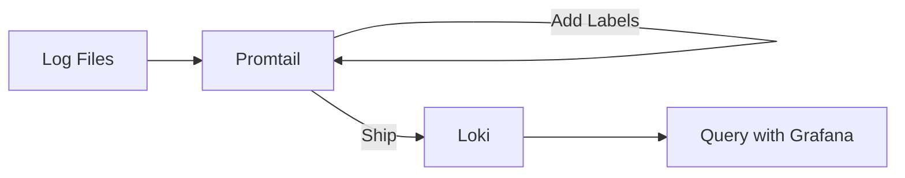

# Promtail Setup

## Introduction

Promtail is a log collection agent designed specifically to work with Grafana Loki. Its primary purpose is to discover log files, attach labels to the log streams, and ship them to Loki for storage and querying. Think of Promtail as the courier that picks up your logs from various sources and delivers them to Loki's doorstep.

In this guide, we'll walk through setting up Promtail in your environment, configuring it properly, and ensuring it efficiently collects and forwards logs to your Loki instance.

## Prerequisites

Before we begin, ensure you have:

- A running Loki instance (local or remote)
- Access to the system where logs are stored
- Basic understanding of YAML configuration
- Docker (optional, for containerized deployment)

## How Promtail Works

Promtail operates with a simple but powerful workflow:



The key components of Promtail include:

1. **Discovery**: Finding log files based on configured paths
2. **Labeling**: Adding metadata to logs for efficient querying
3. **Shipping**: Sending logs to Loki using its API
4. **Scraping**: Reading logs from various sources, including files and journals

## Installation Methods

### Method 1: Binary Installation

Download the latest Promtail release from the [Grafana Loki releases page](https://github.com/grafana/loki/releases).

```bash
# For Linux x86_64
curl -O -L "https://github.com/grafana/loki/releases/latest/download/promtail-linux-amd64.zip"
unzip "promtail-linux-amd64.zip"
chmod a+x "promtail-linux-amd64"
mv promtail-linux-amd64 /usr/local/bin/promtail
```

### Method 2: Docker

Pull and run Promtail using Docker:

```bash
docker pull grafana/promtail:latest
```

### Method 3: Package Managers

For Debian/Ubuntu:

```bash
sudo apt-get install promtail
```

For macOS:

```bash
brew install promtail
```

## Basic Configuration

Promtail requires a configuration file to define how it discovers, processes, and ships logs. Create a file named `promtail-config.yaml`:

```yaml
server:
  http_listen_port: 9080
  grpc_listen_port: 0

positions:
  filename: /tmp/positions.yaml

clients:
  - url: http://localhost:3100/loki/api/v1/push

scrape_configs:
  - job_name: system
    static_configs:
      - targets:
          - localhost
        labels:
          job: varlogs
          __path__: /var/log/*log
```

Let's break down this configuration:

- `server`: Defines the HTTP port for Promtail's API and metrics
- `positions`: Tracks which logs have been read to avoid duplication
- `clients`: Specifies where to send logs (your Loki instance)
- `scrape_configs`: Defines what logs to collect and how to label them

## Running Promtail

### Using the Binary

```bash
promtail --config.file=promtail-config.yaml
```

### Using Docker

```bash
docker run -v $(pwd)/promtail-config.yaml:/etc/promtail/config.yaml \
  -v /var/log:/var/log \
  grafana/promtail:latest \
  -config.file=/etc/promtail/config.yaml
```

## Advanced Configuration

### Labels and Relabeling

Labels are crucial in Loki as they define how logs are indexed and queried. You can add static labels or extract dynamic ones from log content:

```yaml
scrape_configs:
  - job_name: system
    static_configs:
      - targets:
          - localhost
        labels:
          job: varlogs
          environment: production
          host: ${HOSTNAME}
          __path__: /var/log/*log
    pipeline_stages:
      - regex:
          expression: '(?P<level>(INFO|WARN|ERROR))'
      - labels:
          level:
```

This configuration extracts log levels and adds them as labels.

### Pipeline Stages

Promtail can transform logs before sending them to Loki using pipeline stages:

```yaml
scrape_configs:
  - job_name: application_logs
    static_configs:
      - targets:
          - localhost
        labels:
          job: app_logs
          __path__: /var/log/app/*.log
    pipeline_stages:
      - json:
          expressions:
            level: level
            user: user
            message: message
      - labels:
          level:
          user:
      - output:
          source: message
```

This pipeline:
1. Parses JSON logs
2. Extracts `level` and `user` as labels
3. Outputs only the `message` field

### Journal Support (for systemd)

Promtail can collect logs from the systemd journal:

```yaml
scrape_configs:
  - job_name: journal
    journal:
      json: false
      max_age: 24h
      path: /var/log/journal
      labels:
        job: systemd-journal
    relabel_configs:
      - source_labels: ['__journal__systemd_unit']
        target_label: 'unit'
```

### Multiline Logs

For languages like Java that use multiline stack traces:

```yaml
scrape_configs:
  - job_name: java_app
    static_configs:
      - targets:
          - localhost
        labels:
          job: java_app
          __path__: /var/log/java-app/*.log
    pipeline_stages:
      - multiline:
          firstline: '^\d{4}-\d{2}-\d{2} \d{2}:\d{2}:\d{2}'
          max_wait_time: 3s
      - regex:
          expression: '^\d{4}-\d{2}-\d{2} \d{2}:\d{2}:\d{2} (?P<level>[A-Z]+)'
      - labels:
          level:
```

## Real-World Example: Microservices Setup

Consider a Kubernetes environment with multiple microservices. Here's how to configure Promtail:

```yaml
server:
  http_listen_port: 9080

positions:
  filename: /tmp/positions.yaml

clients:
  - url: http://loki:3100/loki/api/v1/push

scrape_configs:
  - job_name: kubernetes-pods
    kubernetes_sd_configs:
      - role: pod
    relabel_configs:
      - source_labels: [__meta_kubernetes_pod_label_app]
        target_label: app
      - source_labels: [__meta_kubernetes_pod_label_component]
        target_label: component
      - source_labels: [__meta_kubernetes_pod_node_name]
        target_label: node_name
      - action: replace
        replacement: /var/log/pods/*$1/*.log
        separator: /
        source_labels:
          - __meta_kubernetes_pod_uid
          - __meta_kubernetes_pod_container_name
        target_label: __path__
    pipeline_stages:
      - json:
          expressions:
            timestamp: time
            level: level
            message: msg
      - timestamp:
          source: timestamp
          format: RFC3339
      - labels:
          level:
      - output:
          source: message
```

This configuration:
1. Discovers pods using Kubernetes service discovery
2. Labels logs with pod metadata (app, component, node)
3. Parses JSON logs and extracts timestamps
4. Adds log levels as labels
5. Ships the logs to Loki

## Troubleshooting

### Common Issues

1. **Connection refused to Loki**
   
   Check if Loki is running and accessible from Promtail:
   
   ```bash
   curl http://loki:3100/ready
   ```

2. **No logs being shipped**
   
   Verify the paths in your configuration:
   
   ```bash
   ls -la /var/log/*log
   ```
   
   And check if Promtail has read permissions on the log files.

3. **High CPU or memory usage**
   
   Tune the `read_buffer_size` and `read_rate_limit` parameters:
   
   ```yaml
   limits_config:
     read_buffer_size: 2097152  # 2MB
     read_rate_limit: 10485760  # 10MB/s
   ```

### Checking Promtail Status

Access the Promtail UI at `http://localhost:9080/targets` to see the status of all configured targets.

## Security Considerations

1. **Authentication**: Use basic auth or tokens when connecting to Loki:

   ```yaml
   clients:
     - url: http://loki:3100/loki/api/v1/push
       basic_auth:
         username: my_username
         password: my_password
   ```

2. **TLS**: Enable TLS for secure communications:

   ```yaml
   server:
     http_listen_port: 9080
     grpc_listen_port: 0
     http_tls_config:
       cert_file: /path/to/cert.pem
       key_file: /path/to/key.pem
   ```

## Best Practices

1. **Label Cardinality**: Be cautious with high-cardinality labels (like user IDs or request IDs)
2. **Resource Limits**: Set appropriate resource limits in production environments
3. **Retention**: Configure local retention policies to handle network outages
4. **Regular Updates**: Keep Promtail updated to benefit from new features and bug fixes
5. **Monitoring**: Monitor Promtail itself with metrics exposed at `/metrics`

## Summary

In this guide, we've covered the essentials of setting up Promtail for log collection:

- Installing and configuring Promtail for various environments
- Basic and advanced configuration options
- Pipeline stages for transforming and enriching logs
- Real-world examples and best practices
- Troubleshooting common issues

Promtail serves as a reliable bridge between your application logs and Loki, enabling powerful log aggregation and querying capabilities. With proper configuration, it can handle logs from various sources while adding meaningful metadata through labels.

## Additional Resources

- [Official Promtail Documentation](https://grafana.com/docs/loki/latest/clients/promtail/)
- [Loki GitHub Repository](https://github.com/grafana/loki)
- [Grafana Community Forums](https://community.grafana.com/)

## Exercises

1. Set up Promtail to collect logs from a web server (Nginx or Apache)
2. Configure pipeline stages to extract HTTP status codes and add them as labels
3. Create a dashboard in Grafana to visualize log volume by status code
4. Implement a multiline configuration for a language runtime of your choice
5. Configure Promtail to send logs to both Loki and a local file for backup purposes