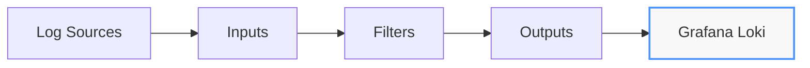

# Logstash Integration

## Introduction

Logstash is a powerful open-source data processing pipeline that ingests data from multiple sources, transforms it, and sends it to various destinations. In the context of Grafana Loki, Logstash serves as an efficient log collector and processor that can normalize, parse, and enrich your logs before forwarding them to Loki for storage and querying.

This guide will walk you through integrating Logstash with Grafana Loki, enabling you to leverage Logstash's robust transformation capabilities while utilizing Loki's efficient log storage and querying features.

## Prerequisites

Before we begin, ensure you have:

- Grafana Loki running and accessible
- Logstash installed (version 7.x or higher recommended)
- Basic understanding of log collection concepts
- Java 8 or higher installed (required for Logstash)

## Understanding the Logstash Pipeline

Logstash operates using a pipeline with three main components:

1. **Inputs**: Collect data from various sources
2. **Filters**: Process and transform the data
3. **Outputs**: Send the processed data to destinations



## Installing the Loki Output Plugin

To send logs from Logstash to Loki, you'll first need to install the Logstash Loki output plugin:

```bash
bin/logstash-plugin install logstash-output-loki
```

This plugin allows Logstash to format and send log entries directly to Loki's API.

## Basic Configuration

Let's create a simple Logstash pipeline configuration that collects logs from a file and forwards them to Loki:

```ruby
input {
  file {
    path => "/var/log/application.log"
    start_position => "beginning"
    sincedb_path => "/dev/null"
  }
}

filter {
  # Parse logs if they are in JSON format
  if [message] =~ /^\{.*\}$/ {
    json {
      source => "message"
    }
  }

  # Add custom labels for better querying in Loki
  mutate {
    add_field => {
      "job" => "application-logs"
      "env" => "production"
    }
  }
}

output {
  loki {
    url => "http://loki:3100/loki/api/v1/push"
    
    # Define labels from event fields
    labels => {
      "job" => "application-logs"
      "env" => "%{env}"
      "level" => "%{level}"
      "component" => "%{component}"
    }
    
    # Optional: batch settings for better performance
    batch_size => 102400
    retries => 5
    
    # Message formatting - what will be sent as log content
    message_field => "message"
  }
  
  # Optional: Output to stdout for debugging
  stdout {
    codec => rubydebug
  }
}
```

Save this configuration to a file named `loki-pipeline.conf`.

## Starting Logstash with the Configuration

Run Logstash with the configuration file:

```bash
bin/logstash -f loki-pipeline.conf
```

## Advanced Configuration Examples

### Multi-Source Configuration

In real-world scenarios, you might want to collect logs from multiple sources:

```ruby
input {
  file {
    path => "/var/log/application/*.log"
    tags => ["application"]
  }
  
  file {
    path => "/var/log/system/*.log"
    tags => ["system"]
  }
  
  beats {
    port => 5044
    tags => ["beats"]
  }
}

filter {
  if "application" in [tags] {
    # Application-specific processing
    grok {
      match => { "message" => "%{TIMESTAMP_ISO8601:timestamp} %{LOGLEVEL:level} %{GREEDYDATA:message_content}" }
    }
    
    # Extract additional fields
    mutate {
      add_field => { "component" => "application" }
    }
  }
  
  if "system" in [tags] {
    # System log processing
    grok {
      match => { "message" => "%{SYSLOGTIMESTAMP:timestamp} %{SYSLOGHOST:hostname} %{DATA:program}(?:\[%{POSINT:pid}\])?: %{GREEDYDATA:message_content}" }
    }
    
    mutate {
      add_field => { "component" => "system" }
    }
  }
}

output {
  loki {
    url => "http://loki:3100/loki/api/v1/push"
    
    labels => {
      "source" => "%{[tags][0]}"
      "component" => "%{[component]}"
      "level" => "%{[level]}"
      "host" => "%{[host][name]}"
    }
    
    # Send the processed message content
    message_field => "message_content"
  }
}
```

### Log Transformation Example

Logstash excels at transforming logs. Here's an example that parses Apache logs and extracts useful information:

```ruby
input {
  file {
    path => "/var/log/apache2/access.log"
    start_position => "beginning"
  }
}

filter {
  grok {
    match => { "message" => "%{COMBINEDAPACHELOG}" }
  }
  
  # Convert timestamp
  date {
    match => [ "timestamp", "dd/MMM/yyyy:HH:mm:ss Z" ]
    target => "@timestamp"
  }
  
  # Enrich with geo information if IP is present
  if [clientip] {
    geoip {
      source => "clientip"
    }
  }
  
  # Extract response time if it exists in the log
  if [message] =~ /response_time/ {
    grok {
      match => { "message" => ".*response_time=%{NUMBER:response_time}ms.*" }
    }
  }
}

output {
  loki {
    url => "http://loki:3100/loki/api/v1/push"
    
    labels => {
      "source" => "apache"
      "method" => "%{verb}"
      "status_code" => "%{response}"
      "path" => "%{request}"
      "country" => "%{[geoip][country_name]}"
    }
  }
}
```

## Handling High-Volume Logs

For high-volume log environments, you can optimize Logstash's performance:

```ruby
output {
  loki {
    url => "http://loki:3100/loki/api/v1/push"
    
    # Performance tuning
    batch_size => 512000
    batch_wait => 5
    min_delay => 1
    max_delay => 10
    retries => 3
    
    # Use snappy compression to reduce network usage
    compression_level => 9
    
    # Configure HTTP settings
    http_compression => true
    
    labels => {
      "source" => "high-volume-app"
      "component" => "%{[component]}"
    }
  }
}
```

## Monitoring Your Logstash-Loki Integration

To ensure your Logstash-Loki pipeline is working correctly, you can:

1. **Check Logstash Metrics**: Enable monitoring in Logstash to track events processed.

```ruby
# Add to your logstash.yml file
monitoring.enabled: true
```

2. **Query Logs in Grafana**: Once logs are flowing to Loki, use Grafana to query them:

```logql
{job="application-logs"} | json | level="error"
```

## Troubleshooting Common Issues

### Issue: Logs Not Appearing in Loki

**Solution**: Verify:
- Correct Loki URL in configuration
- Network connectivity between Logstash and Loki
- Check Logstash logs for errors

### Issue: Label Errors in Loki

**Solution**: Ensure all labels referenced in the configuration exist in your logs or have default values.

### Issue: High CPU Usage

**Solution**: Try:
- Increase batch size
- Reduce complex filter operations
- Increase Logstash heap size:

```bash
export LS_JAVA_OPTS="-Xmx1g -Xms1g"
```

## Best Practices

1. **Label Carefully**: Loki is designed for efficient querying with labels. Choose labels that you'll frequently query by.

2. **Don't Over-Label**: Too many unique label combinations can degrade Loki's performance.

3. **Process Before Sending**: Use Logstash filters to process and structure logs before sending to Loki.

4. **Monitor Pipeline Health**: Keep track of Logstash metrics to ensure efficient processing.

5. **Use Pipelines.yml**: For complex setups, use multiple pipelines with the `pipelines.yml` configuration:

```yaml
- pipeline.id: apache
  path.config: "/etc/logstash/conf.d/apache.conf"
  pipeline.workers: 2
- pipeline.id: application
  path.config: "/etc/logstash/conf.d/application.conf"
  pipeline.workers: 1
```

## Summary

Integrating Logstash with Grafana Loki creates a powerful log management solution that combines Logstash's extensive processing capabilities with Loki's efficient storage and querying. This setup allows you to:

- Collect logs from multiple sources
- Process and transform logs with Logstash's rich filtering options
- Add structured metadata as Loki labels
- Store logs efficiently in Loki
- Query and visualize logs in Grafana

By following this guide, you've learned how to set up this integration, optimize it for performance, and troubleshoot common issues.

## Further Learning

1. **Exercises**:
   - Set up a Logstash pipeline that collects logs from a sample application
   - Create custom Grok patterns for parsing specific log formats
   - Design a Grafana dashboard that queries your processed logs

2. **Advanced Topics**:
   - Explore the use of Logstash pipelines for different types of logs
   - Learn about Loki's LogQL query language for more advanced querying
   - Implement log lifecycle policies in Loki

3. **Related Technologies**:
   - Explore Promtail as an alternative log collector
   - Learn about Elasticsearch for full-text search capabilities
   - Discover how Fluentd compares to Logstash