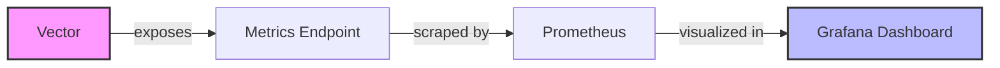

# Vector Integration

## Introduction

Vector is a high-performance, lightweight log and metrics processor that can collect, transform, and route observability data to multiple destinations, including Grafana Loki. In this guide, we'll explore how to integrate Vector with Loki to create a powerful and flexible log collection pipeline. Vector provides a modern alternative to traditional log shippers like Promtail, offering enhanced capabilities for data transformation and processing.

## What is Vector?

Vector is an open-source, end-to-end observability data pipeline designed to collect, transform, and route logs, metrics, and traces. Created by Datadog, Vector focuses on high performance, operational simplicity, and extensive customization options.

Key features of Vector include:

- **High Performance**: Written in Rust for memory efficiency and speed
- **Unified Pipeline**: Handles logs, metrics, and traces in a single tool
- **Rich Transformation Capabilities**: Over 50 built-in transforms for data manipulation
- **Multi-Cloud Support**: Works across environments with minimal configuration changes
- **Extensible Architecture**: Supports custom plugins and extensions

## Vector vs. Promtail

While Promtail is Loki's native agent specifically designed for log collection, Vector offers broader capabilities:

| Feature | Vector | Promtail |
| ------- | ------ | -------- |
| Language | Rust | Go |
| Data Types | Logs, Metrics, Traces | Logs only |
| Transformation | Advanced processing | Basic processing |
| Sources | 40+ | Limited |
| Sinks | 40+ destinations | Loki-focused |
| Memory Usage | Lower | Moderate |

## Setting Up Vector with Loki

Let's walk through the process of configuring Vector to collect logs and send them to Loki.

### Step 1: Install Vector

You can install Vector through various methods. Here are some common approaches:

#### Docker

```bash
docker run -d \
  -v $(pwd)/vector.yaml:/etc/vector/vector.yaml:ro \
  -v /var/log:/var/log \
  -p 8686:8686 \
  timberio/vector:latest
```

#### Package Managers

For Debian/Ubuntu:

```bash
curl -1sLf 'https://repositories.timber.io/public/vector/cfg/setup/bash.deb.sh' | sudo -E bash
sudo apt-get install vector
```

For RHEL/CentOS:

```bash
curl -1sLf 'https://repositories.timber.io/public/vector/cfg/setup/bash.rpm.sh' | sudo -E bash
sudo yum install vector
```

#### Binary Download

```bash
curl --proto '=https' --tlsv1.2 -sSf https://sh.vector.dev | bash
```

### Step 2: Configure Vector

Create a configuration file named `vector.yaml` with the following content:

```yaml
# Define sources for log collection
sources:
  file_source:
    type: file
    include:
      - /var/log/**/*.log
    exclude:
      - /var/log/vector-debug.log
    ignore_older: 86400 # 24 hours

# Optional transformations
transforms:
  parse_json:
    type: remap
    inputs:
      - file_source
    source: |
      # Attempt to parse JSON logs
      if is_json(.message) {
        . = merge(., parse_json(.message))
        del(.message)
      }
  
  add_service_label:
    type: remap
    inputs:
      - parse_json
    source: |
      # Add a 'service' label based on file path
      .service = split(string(.file), "/")[3] ?? "unknown"

# Configure Loki as sink
sinks:
  loki:
    type: loki
    inputs:
      - add_service_label
    endpoint: http://loki:3100
    encoding:
      codec: json
    labels:
      job: "vector"
      service: "{{ service }}"
      hostname: "{{ host }}"
    compression: gzip
    healthcheck:
      enabled: true
```

This configuration:
1. Collects logs from files in `/var/log`
2. Parses JSON logs when possible
3. Adds a service label based on the filepath
4. Forwards logs to Loki with appropriate labels

### Step 3: Start Vector

Start Vector as a service:

```bash
sudo systemctl start vector
```

Or run directly with your configuration:

```bash
vector --config /etc/vector/vector.yaml
```

### Step 4: Verify in Grafana

Once Vector is sending logs to Loki, you can verify by querying them in Grafana:

1. Open Grafana and navigate to Explore
2. Select Loki as the data source
3. Query logs with: `{job="vector"}`

## Advanced Vector Configurations

Vector's power lies in its transformation capabilities. Let's explore some advanced configurations.

### Structured Logging

```yaml
transforms:
  parse_log_formats:
    type: remap
    inputs:
      - file_source
    source: |
      # Handle different log formats
      if includes(string(.file), "nginx") {
        parsed = parse_regex(.message, r'^(?P<remote_addr>\S+) - (?P<remote_user>\S+) \[(?P<time_local>[^\]]+)\] "(?P<request>[^"]*)" (?P<status>\d+) (?P<body_bytes_sent>\d+) "(?P<http_referer>[^"]*)" "(?P<http_user_agent>[^"]*)"$')
        if exists(parsed) {
          . = merge(., parsed)
        }
      } else if includes(string(.file), "apache") {
        # Apache log format parsing
        # ...similar regex for Apache...
      }
```

### Multi-Source Configuration

This configuration collects logs from multiple sources:

```yaml
sources:
  file_logs:
    type: file
    include:
      - /var/log/**/*.log
  
  docker_logs:
    type: docker
    exclude_containers: ["vector"]
  
  kubernetes_logs:
    type: kubernetes
    auto_partial_merge: true

sinks:
  loki:
    type: loki
    inputs: [file_logs, docker_logs, kubernetes_logs]
    endpoint: http://loki:3100
    labels:
      source: "{{ source_type }}"
      # Additional dynamic labels...
```

### High-Availability Setup

For production environments, consider this high-availability configuration:

```yaml
# Global settings for reliability
buffer:
  type: disk
  max_size: 104900000 # ~100MB
  when_full: block

sinks:
  loki_primary:
    type: loki
    inputs: [processed_logs]
    endpoint: http://loki-primary:3100
    labels: { environment: "production" }
    buffer:
      type: disk
      max_size: 1073741824 # 1GB
    request:
      retry_attempts: 10
      retry_initial_backoff_secs: 1
      retry_max_duration_secs: 3600
      timeout_secs: 60
  
  loki_backup:
    type: loki
    inputs: [processed_logs]
    endpoint: http://loki-backup:3100
    labels: { environment: "production", replica: "backup" }
    buffer:
      type: disk
      max_size: 1073741824 # 1GB
```

## Implementing Vector in Different Environments

### Docker Compose

Here's an example `docker-compose.yml` file that sets up Vector with Loki:

```yaml
version: '3'
services:
  vector:
    image: timberio/vector:latest
    volumes:
      - ./vector.yaml:/etc/vector/vector.yaml:ro
      - /var/log:/var/log
    ports:
      - "8686:8686"
    restart: unless-stopped
    depends_on:
      - loki

  loki:
    image: grafana/loki:latest
    ports:
      - "3100:3100"
    volumes:
      - ./loki-config.yaml:/etc/loki/local-config.yaml
    command: -config.file=/etc/loki/local-config.yaml

  grafana:
    image: grafana/grafana:latest
    ports:
      - "3000:3000"
    environment:
      - GF_AUTH_ANONYMOUS_ENABLED=true
      - GF_AUTH_ANONYMOUS_ORG_ROLE=Admin
    volumes:
      - ./grafana-datasources.yaml:/etc/grafana/provisioning/datasources/datasources.yaml
```

### Kubernetes Deployment

For Kubernetes environments, you can deploy Vector as a DaemonSet:

```yaml
apiVersion: apps/v1
kind: DaemonSet
metadata:
  name: vector
  namespace: monitoring
spec:
  selector:
    matchLabels:
      app: vector
  template:
    metadata:
      labels:
        app: vector
    spec:
      containers:
      - name: vector
        image: timberio/vector:latest
        volumeMounts:
        - name: config
          mountPath: /etc/vector
        - name: var-log
          mountPath: /var/log
        - name: var-lib
          mountPath: /var/lib
      volumes:
      - name: config
        configMap:
          name: vector-config
      - name: var-log
        hostPath:
          path: /var/log
      - name: var-lib
        hostPath:
          path: /var/lib
```

## Visualizing Vector Metrics

Vector itself exposes metrics that you can collect to monitor its performance:

```yaml
sources:
  internal_metrics:
    type: internal_metrics

sinks:
  prometheus:
    type: prometheus_exporter
    inputs: [internal_metrics]
    address: 0.0.0.0:9598
```

You can create a Grafana dashboard to visualize Vector's performance:



## Troubleshooting Vector-Loki Integration

Common issues and their solutions:

1. **No logs appearing in Loki**
   - Verify Vector is running: `systemctl status vector`
   - Check Vector's output: `vector --config /etc/vector/vector.yaml --test`
   - Ensure Loki endpoint is correct and accessible
   - Validate label configuration (Loki requires at least one label)

2. **High resource usage**
   - Adjust the `buffer` settings for optimal performance
   - Implement rate limiting with the `ratelimit` transform
   - Use compression: `compression: gzip` in the Loki sink

3. **Log parsing errors**
   - Debug transform issues with the `stdout` sink
   - Add error handling to remap scripts:
   ```yaml
   transforms:
     safe_parser:
       type: remap
       inputs: [source]
       source: |
         if is_json(.message) {
           parsed = parse_json(.message) ?? {}
           . = merge(., parsed)
         } else {
           .parsing_error = true
         }
   ```

## Best Practices

1. **Structured Logging**
   - Encourage applications to output structured logs (JSON)
   - Parse unstructured logs early in the pipeline

2. **Label Management**
   - Use labels that facilitate efficient querying
   - Avoid high cardinality labels (like user IDs, session IDs)
   - Use transform operations to normalize labels

3. **Resource Management**
   - Implement disk buffers for reliability
   - Set appropriate compression for network efficiency
   - Monitor Vector's resource usage

4. **Security Considerations**
   - Use TLS for all communication with Loki
   - Implement authentication when required
   - Sanitize sensitive information before it reaches Loki

## Summary

Vector provides a powerful, flexible alternative for collecting and processing logs before sending them to Grafana Loki. Its performance advantages, rich transformation capabilities, and multi-source support make it an excellent choice for modern observability pipelines.

By integrating Vector with Loki, you can:
- Collect logs from multiple sources with a single agent
- Transform and structure logs before ingestion
- Label and organize logs for efficient querying
- Create resilient, high-performance log pipelines

## Additional Resources

- [Vector Documentation](https://vector.dev/docs/)
- [Grafana Loki Documentation](https://grafana.com/docs/loki/latest/)
- [Vector GitHub Repository](https://github.com/vectordotdev/vector)

## Exercises

1. Set up a basic Vector configuration to collect system logs and send them to Loki.
2. Create a transformation that parses JSON logs and adds custom labels.
3. Configure Vector to collect logs from multiple sources (files, Docker, etc.).
4. Implement a high-availability setup with buffering and retry logic.
5. Create a Grafana dashboard to monitor Vector's performance metrics.