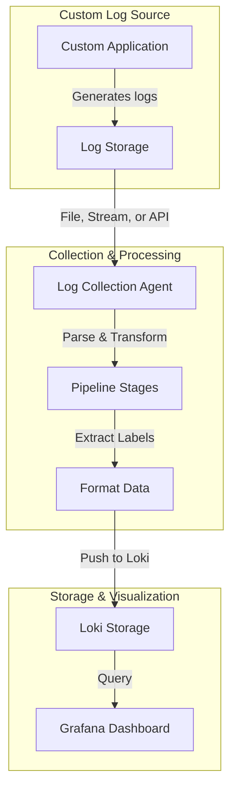

# Custom Log Sources

## Introduction

When working with Grafana Loki, you'll often need to collect logs from various sources beyond the standard system and application logs. Custom log sources can include specialized applications, home-grown services, IoT devices, or any system generating text-based output that doesn't have built-in support in standard log collection agents. This module explores how to configure, collect, and process logs from these custom sources to make them accessible in your Loki deployment.

## What are Custom Log Sources?

Custom log sources are any log producers that:

- Don't have out-of-the-box support in common log agents like Promtail or Grafana Agent
- Output logs in non-standard formats or locations
- Require special handling or preprocessing before ingestion into Loki

## Prerequisites

Before working with custom log sources, you should have:

- A working Grafana Loki deployment
- Familiarity with basic log collection concepts
- Access to the systems generating the logs
- A log collection agent installed (Promtail, Grafana Agent, Fluentd, etc.)

## Common Approaches to Custom Log Collection

### 1. File-based Collection

The simplest approach is to identify where your custom application writes its logs and configure your log agent to read from those locations.

#### Example: Configuring Promtail for a Custom Application Log

```yaml
scrape_configs:
  - job_name: custom_application_logs
    static_configs:
      - targets:
          - localhost
        labels:
          job: custom_app
          environment: production
          __path__: /var/log/custom-app/*.log
    pipeline_stages:
      - regex:
          expression: '^(?P<timestamp>\d{4}-\d{2}-\d{2} \d{2}:\d{2}:\d{2}) (?P<level>\w+): (?P<message>.*)$'
      - labels:
          level:
      - timestamp:
          source: timestamp
          format: '2006-01-02 15:04:05'
```

This configuration:
1. Looks for all log files in `/var/log/custom-app/` with a `.log` extension
2. Extracts timestamp, log level, and message using regex
3. Adds the log level as a label
4. Parses the timestamp into a format Loki can understand

### 2. Stream-Based Collection

For applications that output logs to stdout/stderr, you can use various methods to capture and forward these streams.

#### Example: Using systemd Journal for Custom Service Logs

Systemd automatically captures stdout/stderr from services it manages. Configure Promtail to read from the journal:

```yaml
scrape_configs:
  - job_name: journal
    journal:
      json: false
      max_age: 12h
      path: /var/log/journal
      labels:
        job: systemd-journal
    relabel_configs:
      - source_labels: ['__journal__systemd_unit']
        target_label: 'unit'
      - source_labels: ['__journal__systemd_unit']
        regex: 'my-custom-service.service'
        action: keep
```

This configuration filters the journal to only collect logs from `my-custom-service`.

### 3. Socket and API-based Collection

Some applications expose logs via sockets or APIs that log agents can connect to directly.

#### Example: Collecting Logs from a TCP Socket

```yaml
scrape_configs:
  - job_name: tcp_listener
    syslog:
      listen_address: 0.0.0.0:1514
      idle_timeout: 60s
      label_structured_data: yes
      labels:
        job: syslog
    relabel_configs:
      - source_labels: ['__syslog_connection_ip_address']
        target_label: 'ip'
```

This configures Promtail to listen on port 1514 for syslog messages, which your custom application could be configured to send.

## Handling Custom Log Formats

Many custom applications have unique log formats that require special parsing.

### Using Pipeline Stages

Loki supports pipeline stages to transform logs during ingestion:

```yaml
pipeline_stages:
  - json:
      expressions:
        level: level
        msg: message
        timestamp: time
  - labels:
      level:
  - timestamp:
      source: timestamp
      format: RFC3339
  - output:
      source: msg
```

This example:
1. Parses JSON logs
2. Extracts level, message, and timestamp fields
3. Sets the level as a label
4. Formats the timestamp
5. Outputs only the message content

### Example: Parsing Custom CSV Logs

If your application outputs CSV-formatted logs:

```yaml
pipeline_stages:
  - regex:
      expression: '^(?P<timestamp>[^,]+),(?P<user>[^,]+),(?P<action>[^,]+),(?P<status>[^,]+),(?P<message>.*)$'
  - labels:
      user:
      action:
      status:
  - timestamp:
      source: timestamp
      format: '2006-01-02T15:04:05Z07:00'
```

## Practical Example: IoT Device Logs

Let's walk through a complete example of collecting logs from IoT devices that output JSON-formatted logs to a central server.

### Step 1: Set up a log receiver

Create a simple Node.js service that receives logs via HTTP:

```javascript
const express = require('express');
const fs = require('fs');
const app = express();
const port = 3000;

app.use(express.json());

app.post('/log', (req, res) => {
  const timestamp = new Date().toISOString();
  const logEntry = {
    timestamp,
    device: req.body.device_id,
    type: req.body.type,
    message: req.body.message,
    data: req.body.data
  };
  
  fs.appendFileSync('/var/log/iot-devices.log', JSON.stringify(logEntry) + '
');
  res.status(200).send('Log received');
});

app.listen(port, () => {
  console.log(`Log receiver listening at http://localhost:${port}`);
});
```

### Step 2: Configure Promtail to collect these logs

```yaml
scrape_configs:
  - job_name: iot_devices
    static_configs:
      - targets:
          - localhost
        labels:
          job: iot_logs
          __path__: /var/log/iot-devices.log
    pipeline_stages:
      - json:
          expressions:
            timestamp: timestamp
            device: device
            type: type
            message: message
            data: data
      - labels:
          device:
          type:
      - timestamp:
          source: timestamp
          format: RFC3339
```

### Step 3: Query the logs in Grafana

```logql
{job="iot_logs", device="thermostat-living-room"} | json
```

This query would show all logs from a specific IoT device.

## Handling Complex Scenarios

### Multi-line Logs

Many applications produce multi-line logs, such as stack traces:

```yaml
scrape_configs:
  - job_name: multiline_logs
    static_configs:
      - targets:
          - localhost
        labels:
          job: java_app
          __path__: /var/log/java-app/*.log
    pipeline_stages:
      - multiline:
          firstline: '^\d{4}-\d{2}-\d{2} \d{2}:\d{2}:\d{2}'
          max_wait_time: 3s
      - regex:
          expression: '^(?P<timestamp>\d{4}-\d{2}-\d{2} \d{2}:\d{2}:\d{2}) (?P<level>\w+) (?P<message>.*)$'
      # Rest of the pipeline...
```

This configuration joins multiple lines into a single log entry if they don't start with a timestamp pattern.

### Dynamic File Discovery

For applications that create log files dynamically:

```yaml
scrape_configs:
  - job_name: dynamic_logs
    file_sd_configs:
      - files:
          - /etc/promtail/targets/*.yml
        refresh_interval: 5m
```

Combined with a separate process that generates target files based on discovered log sources.

## Flow Diagram: Custom Log Collection Process



## Best Practices for Custom Log Sources

1. **Standardize where possible**: Try to standardize log formats across your custom applications
2. **Add context in logs**: Include relevant information like service name, environment, and version
3. **Use structured logging**: JSON or other structured formats make parsing much easier
4. **Include timestamps**: Always include high-precision timestamps in a consistent format
5. **Add correlation IDs**: For distributed systems, include request/trace IDs to connect related logs
6. **Be mindful of volume**: Implement log levels and consider sampling high-volume logs
7. **Test your pipeline**: Verify that your parsing rules work with various log formats
8. **Monitor your log collection**: Set up alerts for log collection failures

## Performance Considerations

When dealing with custom log sources, be aware of:

- **CPU usage**: Complex regex and JSON parsing can be CPU-intensive
- **Memory usage**: Large multiline logs require more memory
- **Disk I/O**: High-volume log sources can cause I/O bottlenecks
- **Network bandwidth**: Remote log collection can consume significant bandwidth

Consider implementing log rotation, compression, and sampling for high-volume sources.

## Troubleshooting Custom Log Collection

Common issues and solutions:

1. **Logs not appearing in Loki**
   - Check file permissions
   - Verify the path patterns in your configuration
   - Check for errors in the log agent's own logs

2. **Timestamp parsing errors**
   - Ensure the timestamp format matches your configuration
   - Check for timezone issues

3. **High cardinality warnings**
   - Review which fields you're converting to labels
   - Avoid using high-cardinality fields like user IDs as labels

4. **Pipeline stage failures**
   - Test your regex patterns against actual log samples
   - Use tools like regex101.com to debug complex patterns

## Summary

Custom log sources are an essential part of a comprehensive logging strategy. By understanding the different collection methods and processing techniques, you can effectively ingest logs from any source into your Grafana Loki deployment.

The key takeaways are:

- Choose the right collection method based on how your application exposes logs
- Configure appropriate parsing and transformation rules
- Extract useful metadata as labels
- Follow best practices for performance and troubleshooting

## Exercises

1. Configure Promtail to collect logs from a custom application writing to `/var/log/app/`.
2. Create a pipeline that extracts timestamp, level, and user information from the logs.
3. Set up a multiline configuration for an application that outputs stack traces.
4. Create a Grafana dashboard that visualizes error rates from your custom log source.
5. Implement a log rotation strategy for a high-volume custom log source.

## Additional Resources

- [Grafana Loki Documentation](https://grafana.com/docs/loki/latest/)
- [Promtail Pipeline Documentation](https://grafana.com/docs/loki/latest/clients/promtail/pipelines/)
- [LogQL Query Language Guide](https://grafana.com/docs/loki/latest/logql/)
- [Structured Logging Best Practices](https://www.sumologic.com/blog/structured-logging-best-practices/)