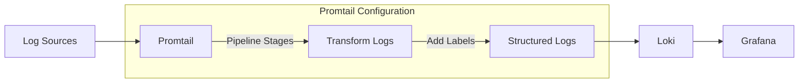

# Promtail Configuration

## Introduction

Promtail is a log collection agent designed to work seamlessly with Grafana Loki. It discovers targets, attaches labels to log streams, and forwards them to Loki. In this guide, we'll explore how to configure Promtail to efficiently collect logs from various sources and send them to your Loki instance.

Think of Promtail as the pipeline that connects your application logs to Loki's storage system. Proper configuration is crucial for effective log management, and this guide will help you understand the key components involved.

## Basic Concepts

Before diving into configuration details, let's understand some core concepts:

- **Targets**: Sources of logs that Promtail discovers and collects from
- **Scrape Configs**: Rules defining how Promtail finds and processes log sources
- **Pipeline Stages**: Steps that transform logs before sending them to Loki
- **Labels**: Key-value pairs attached to log streams for efficient querying

## Configuration File Structure

Promtail uses a YAML configuration file. Here's the basic structure:

```yaml
server:
  http_listen_port: 9080
  grpc_listen_port: 0

positions:
  filename: /tmp/positions.yaml

clients:
  - url: http://loki:3100/loki/api/v1/push

scrape_configs:
  - job_name: system
    static_configs:
      - targets:
          - localhost
        labels:
          job: varlogs
          __path__: /var/log/*log
```

Let's break down each section:

### Server Section

This configures Promtail's own HTTP server, used for metrics and API endpoints:

```yaml
server:
  http_listen_port: 9080  # Port for HTTP server
  grpc_listen_port: 0     # Port for gRPC server (0 to disable)
```

### Positions Section

Promtail keeps track of how far it has read into log files to avoid duplication:

```yaml
positions:
  filename: /tmp/positions.yaml  # Where to store read positions
  sync_period: 10s               # How often to update the positions file
```

### Clients Section

Defines where Promtail should send logs:

```yaml
clients:
  - url: http://loki:3100/loki/api/v1/push  # Loki endpoint for pushing logs
    tenant_id: tenant1                      # Optional tenant ID for multi-tenancy
    batchwait: 1s                           # Max wait time before sending batch
    batchsize: 1048576                      # Max batch size in bytes
```

### Scrape Configs Section

This is the heart of Promtail configuration, defining what logs to collect and how:

```yaml
scrape_configs:
  - job_name: system                # A unique name for this scrape config
    static_configs:                 # Statically defined targets
      - targets:
          - localhost
        labels:
          job: varlogs             # Label to attach to all logs from this target
          __path__: /var/log/*log  # Special label defining files to collect
```

## Label Configuration

Labels are critical for organizing logs in Loki. They determine how logs are stored and queried:

```yaml
scrape_configs:
  - job_name: app_logs
    static_configs:
      - targets:
          - localhost
        labels:
          job: app
          environment: production
          service: api
          __path__: /var/log/app/*.log
```

Some special labels influence Promtail's behavior:
- `__path__`: Pattern for matching files
- `__host__`: Host information
- `filename`: The file's full path

## Pipeline Stages

Pipelines allow you to transform logs before forwarding them to Loki. Here's an example:

```yaml
scrape_configs:
  - job_name: app_logs
    pipeline_stages:
      - regex:
          expression: '^(?P<timestamp>\d{4}-\d{2}-\d{2} \d{2}:\d{2}:\d{2}) (?P<level>\w+) (?P<message>.*)$'
      - labels:
          level:
      - timestamp:
          source: timestamp
          format: '2006-01-02 15:04:05'
    static_configs:
      - targets:
          - localhost
        labels:
          job: app
          __path__: /var/log/app/*.log
```

This pipeline:
1. Extracts timestamp, level, and message using regex
2. Adds the log level as a label
3. Sets the timestamp format

## Common Pipeline Stages

Promtail offers several pipeline stages for log transformation:

### Regex Stage

Extracts fields from log lines:

```yaml
- regex:
    expression: '^(?P<timestamp>\d{4}-\d{2}-\d{2}) (?P<level>\w+) (?P<message>.*)$'
```

### JSON Stage

Parses JSON-formatted logs:

```yaml
- json:
    expressions:
      level: level
      message: msg
      timestamp: ts
```

### Labels Stage

Adds extracted fields as labels:

```yaml
- labels:
    level:
    user:
```

### Timestamp Stage

Sets the timestamp for the log entry:

```yaml
- timestamp:
    source: timestamp
    format: '2006-01-02 15:04:05'
```

### Output Stage

Replaces the log line with a formatted string:

```yaml
- output:
    source: message
```

## Dynamic Configuration with File Discovery

For environments with changing log files, use file discovery:

```yaml
scrape_configs:
  - job_name: app_logs
    file_sd_configs:
      - files:
        - /etc/promtail/targets/*.yaml
        refresh_interval: 5m
```

Then create target files like `/etc/promtail/targets/app.yaml`:

```yaml
- labels:
    job: app
    environment: production
    __path__: /var/log/app/*.log
```

## Real-World Example: Collecting Kubernetes Logs

Here's a practical example for collecting logs from Kubernetes pods:

```yaml
scrape_configs:
  - job_name: kubernetes-pods
    kubernetes_sd_configs:
      - role: pod
    relabel_configs:
      - source_labels: [__meta_kubernetes_pod_annotation_prometheus_io_scrape]
        regex: "true"
        action: keep
      - source_labels: [__meta_kubernetes_pod_container_name]
        target_label: container
      - source_labels: [__meta_kubernetes_namespace]
        target_label: namespace
      - source_labels: [__meta_kubernetes_pod_name]
        target_label: pod
    pipeline_stages:
      - json:
          expressions:
            timestamp: time
            level: level
            message: msg
      - timestamp:
          source: timestamp
          format: RFC3339
      - labels:
          level:
```

This configuration:
1. Discovers pods in Kubernetes
2. Filters to include only pods with specific annotations
3. Adds container, namespace, and pod information as labels
4. Parses JSON-formatted logs
5. Extracts and sets timestamp
6. Adds log level as a label

## Visualizing Promtail Architecture

Let's visualize how Promtail fits within the Loki ecosystem:



## Troubleshooting Tips

If you encounter issues with your Promtail configuration:

1. **Check connectivity**: Ensure Promtail can reach Loki
   ```bash
   curl -v http://loki:3100/ready
   ```

2. **Verify file permissions**: Promtail needs read access to log files
   ```bash
   sudo chmod +r /var/log/app/*.log
   ```

3. **Inspect Promtail logs**: Look for error messages
   ```bash
   journalctl -u promtail.service
   ```

4. **Validate your configuration**: Use Promtail's config validation
   ```bash
   promtail --dry-run --config.file=promtail-config.yaml
   ```

5. **Check target discovery**: Ensure Promtail is finding your log files
   ```bash
   curl http://localhost:9080/targets
   ```

## Advanced Configuration: Multi-tenancy

For environments with multiple teams or services:

```yaml
clients:
  - url: http://loki:3100/loki/api/v1/push
    tenant_id: team-a
    
scrape_configs:
  - job_name: team_a_logs
    static_configs:
      - targets:
          - localhost
        labels:
          tenant: team-a
          __path__: /var/log/team-a/*.log
```

## Summary

Properly configuring Promtail is essential for an effective Grafana Loki deployment. We've covered:

- Basic configuration structure
- Label configuration for organized logs
- Pipeline stages for log transformation
- Dynamic configuration with file discovery
- Real-world examples for Kubernetes environments
- Troubleshooting common issues

With these fundamentals, you can tailor Promtail to your specific log collection needs and integrate it effectively with Loki.

## Exercises

1. Create a basic Promtail configuration to collect logs from your application.
2. Design a pipeline that extracts information from your logs and adds custom labels.
3. Configure Promtail to collect logs from multiple applications with different formats.
4. Set up dynamic file discovery for an environment with changing log files.
5. Implement a configuration that uses regex to extract structured data from unstructured logs.

## Additional Resources

- [Official Promtail Documentation](https://grafana.com/docs/loki/latest/clients/promtail/)
- [Grafana Loki GitHub Repository](https://github.com/grafana/loki)
- [Log Processing Pipeline Examples](https://grafana.com/docs/loki/latest/clients/promtail/pipelines/)
- [Best Practices for Log Aggregation](https://grafana.com/docs/loki/latest/best-practices/)