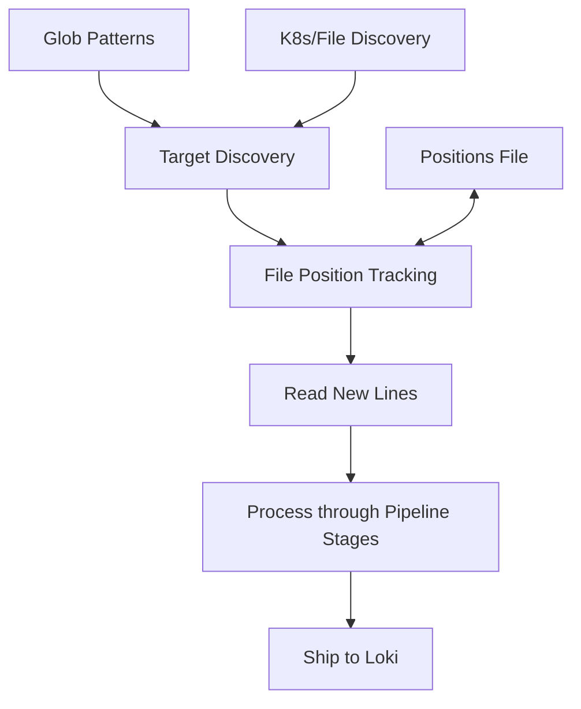

# Promtail Targets

## Introduction

Promtail is Grafana Loki's agent, responsible for gathering logs from various sources and forwarding them to Loki for storage and querying. At the heart of Promtail's functionality are **targets** - the specific log sources that Promtail monitors and collects from.

This guide will help you understand how Promtail targets work, how to configure them effectively, and how to implement them in real-world scenarios. By the end, you'll be able to set up Promtail to collect logs from multiple sources while applying the right labels and transformations.

## What Are Promtail Targets?

Targets in Promtail represent the individual log sources that need to be discovered, monitored, and scraped. Similar to how Prometheus uses targets for metrics scraping, Promtail uses targets for log collection.

A target in Promtail typically consists of:
- A **path** to the log file(s)
- **Labels** that will be attached to the log entries
- Optional **scrape configurations** including relabeling and processing rules

## Target Discovery Methods

Promtail supports several methods for discovering targets:

### 1. Static Targets

The simplest approach is to define static file paths directly in the configuration.

```yaml
scrape_configs:
  - job_name: static_files
    static_configs:
      - targets:
          - localhost
        labels:
          job: varlogs
          __path__: /var/log/*.log
```

In this example:
- `targets` contains arbitrary values (often just "localhost")
- The critical component is the `__path__` label, which defines which files to collect
- The glob pattern `/var/log/*.log` will match any file with a `.log` extension in the `/var/log` directory

### 2. File Discovery

For more dynamic environments, Promtail can discover targets using configuration files:

```yaml
scrape_configs:
  - job_name: file_discovery
    file_sd_configs:
      - files:
          - /etc/promtail/targets/*.yml
        refresh_interval: 5m
```

Each target file should contain static configurations in YAML format:

```yaml
# /etc/promtail/targets/app_logs.yml
- targets:
    - localhost
  labels:
    job: app_logs
    environment: production
    __path__: /var/log/app/*.log
```

The `refresh_interval` allows Promtail to periodically check for changes, making it easy to add or remove targets without restarting Promtail.

### 3. Journal Discovery (for systemd)

In systems using systemd, Promtail can directly scrape logs from the journal:

```yaml
scrape_configs:
  - job_name: journal
    journal:
      json: false
      max_age: 12h
      path: /var/log/journal
      labels:
        job: systemd-journal
```

### 4. Kubernetes Discovery

For containerized environments, Promtail offers robust Kubernetes integration:

```yaml
scrape_configs:
  - job_name: kubernetes
    kubernetes_sd_configs:
      - role: pod
    relabel_configs:
      - source_labels: [__meta_kubernetes_pod_annotation_promtail_scrape]
        regex: "true"
        action: keep
      - source_labels: [__meta_kubernetes_pod_container_name]
        target_label: container
      - source_labels: [__meta_kubernetes_pod_label_app]
        target_label: app
      - source_labels: [__meta_kubernetes_namespace]
        target_label: namespace
      - source_labels: [__meta_kubernetes_pod_name]
        target_label: pod
      - source_labels: [__meta_kubernetes_pod_uid]
        target_label: uid
      - source_labels: [__meta_kubernetes_pod_container_name]
        replacement: /var/log/pods/*$1/*.log
        target_label: __path__
```

This example:
1. Discovers all pods in the Kubernetes cluster
2. Keeps only pods with `promtail_scrape: "true"` annotation
3. Adds container, app, namespace, pod, and UID labels based on Kubernetes metadata
4. Constructs the log file path based on container name

## Configuring Target Labels

Labels are crucial in Loki's log management system. They enable efficient querying and categorization of logs. Promtail allows extensive label manipulation through `relabel_configs`:

```yaml
scrape_configs:
  - job_name: app_logs
    static_configs:
      - targets:
          - localhost
        labels:
          job: web_app
          env: production
          __path__: /var/log/webapp/*.log
    relabel_configs:
      - source_labels: [__path__]
        regex: "/var/log/webapp/([^/]+)\\.log"
        target_label: component
        replacement: $1
      - source_labels: [__path__]
        regex: ".*error.*\\.log"
        target_label: severity
        replacement: error
```

In this example:
- Every log line from files matching `/var/log/webapp/*.log` will have `job=web_app` and `env=production` labels
- The `component` label is extracted from the filename
- Files with "error" in their name get a `severity=error` label

## Target Scraping Behavior

Understanding how Promtail scrapes targets can help you configure it optimally:

1. **Discovery**: Promtail discovers targets based on your configured discovery methods
2. **Position Tracking**: Promtail keeps track of its reading position in files using a positions file (by default at `/var/lib/promtail/positions.yaml`)
3. **Reading**: New lines are read from target files and processed according to your pipeline stages
4. **Shipment**: Processed log entries are forwarded to Loki

The following diagram illustrates this flow:



## Practical Example: Multi-Environment Application Logs

Let's look at a real-world example where we collect logs from a web application deployed across multiple environments:

```yaml
scrape_configs:
  - job_name: web_application
    static_configs:
      - targets:
          - localhost
        labels:
          app: web_application
          __path__: /var/log/web-app/prod/*.log
          environment: production
      - targets:
          - localhost
        labels:
          app: web_application
          __path__: /var/log/web-app/staging/*.log
          environment: staging
    pipeline_stages:
      - regex:
          expression: '(?P<timestamp>\d{4}-\d{2}-\d{2} \d{2}:\d{2}:\d{2}) (?P<level>INFO|WARN|ERROR) \[(?P<component>\w+)\] (?P<message>.*)'
      - labels:
          level: 
          component:
      - timestamp:
          source: timestamp
          format: "2006-01-02 15:04:05"
```

This configuration:
1. Collects logs from both production and staging environments
2. Uses regex to extract the timestamp, log level, component, and message
3. Adds the extracted level and component as labels
4. Properly parses the timestamp for correct time-based queries in Loki

## Advanced Target Configuration

### Excluding Files

You might want to exclude certain files from being scraped:

```yaml
scrape_configs:
  - job_name: application_logs
    static_configs:
      - targets:
          - localhost
        labels:
          job: app_logs
          __path__: /var/log/application/*.log
    relabel_configs:
      - source_labels: [__path__]
        regex: ".*(tmp|temp).*\\.log"
        action: drop
```

This configuration drops any log files with "tmp" or "temp" in their paths.

### Target-Specific Pipeline Stages

Different targets might require different processing:

```yaml
scrape_configs:
  - job_name: mixed_format_logs
    static_configs:
      - targets:
          - localhost
        labels:
          format: json
          __path__: /var/log/app/json/*.log
      - targets:
          - localhost
        labels:
          format: text
          __path__: /var/log/app/text/*.log
    pipeline_stages:
      - match:
          selector: '{format="json"}'
          stages:
            - json:
                expressions:
                  level: level
                  component: service
                  msg: message
      - match:
          selector: '{format="text"}'
          stages:
            - regex:
                expression: '(?P<level>\w+):\s+\[(?P<component>\w+)\]\s+(?P<msg>.*)'
```

This approach allows you to apply different parsing logic to different log formats while keeping them under a single job.

## Managing Targets at Scale

For larger deployments, consider these best practices:

1. **Use hierarchical configurations** - Split your configuration into smaller files and use file discovery
2. **Leverage dynamic discovery** - In containerized environments, use Kubernetes discovery
3. **Implement meaningful labels** - Design a consistent labeling scheme (e.g., environment, component, service)
4. **Monitor Promtail itself** - Watch for errors or lagging targets

Example of a file-based discovery structure:

```
/etc/promtail/
├── promtail.yaml             # Main config with global settings
└── targets/
    ├── database.yaml         # Database-specific targets
    ├── web-servers.yaml      # Web server targets
    ├── microservices.yaml    # Microservice targets
    └── infra.yaml            # Infrastructure targets
```

## Troubleshooting Targets

If you're having issues with target discovery or scraping, check these common problems:

1. **Permission issues** - Ensure Promtail has read access to the log files
2. **Path expressions** - Verify your glob patterns with `ls` to check if they match expected files
3. **Position file issues** - If Promtail seems to be re-reading files, check the positions file permissions
4. **Kubernetes metadata** - For Kubernetes discovery, ensure the necessary annotations or labels are present

You can debug target discovery by running Promtail with increased log levels:

```bash
promtail -config.file=/etc/promtail/config.yml -log.level=debug
```

Watch for log messages containing "targets" or "discovery" to identify issues.

## Summary

Promtail targets are the foundation of effective log collection with Grafana Loki. By properly configuring targets, you can:

- Discover and collect logs from various sources
- Apply meaningful labels for efficient querying
- Process logs differently based on their source or format
- Scale your log collection infrastructure as your applications grow

Understanding how to configure and manage targets will help you build a robust logging infrastructure that provides valuable insights into your applications and systems.

## Additional Resources

- Experiment with different discovery methods on a test system
- Try implementing a hierarchical configuration for a multi-application environment
- Practice writing relabeling rules to extract meaningful metadata from your logs

## Exercises

1. Configure Promtail to collect logs from a web server and extract HTTP status codes as labels
2. Set up a file discovery configuration that can dynamically add new applications without restarting Promtail
3. Create a configuration for a Kubernetes environment that collects logs from specific namespaces and adds deployment information as labels