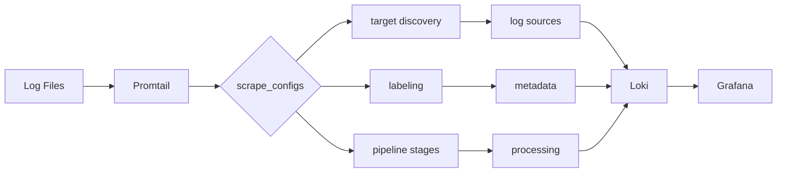

# Promtail Scrape Configs

## Introduction

Promtail is a log collection agent designed to work with Grafana Loki. One of its most important components is the `scrape_configs` section, which defines how Promtail discovers, processes, and forwards logs to Loki. This configuration is inspired by Prometheus's scrape configuration, making it familiar for users already working with Prometheus.

In this guide, we'll explore how to effectively configure Promtail's `scrape_configs` to collect logs from various sources, add labels, and prepare them for efficient querying in Loki.

## Basic Structure of scrape_configs

The `scrape_configs` section is a list of configurations, where each configuration defines:

1. What logs to collect (targets)
2. How to label these logs
3. How to process these logs before sending them to Loki

Here's the basic structure of a `scrape_configs` entry:

```yaml
scrape_configs:
  - job_name: <job_name>
    static_configs:
      - targets:
          - localhost
        labels:
          <label_name>: <label_value>
    pipeline_stages:
      - <stage_name>:
          <stage_config>
```

Let's break down each component:

- **job_name**: A unique identifier for the scrape job
- **static_configs**: Defines static targets and their labels
- **pipeline_stages**: A series of transformations to apply to logs before sending them to Loki

## Target Discovery

Promtail supports several service discovery mechanisms to find log sources. Let's explore the most common ones:

### Static Targets

The simplest approach is to manually specify targets:

```yaml
scrape_configs:
  - job_name: static_logs
    static_configs:
      - targets:
          - localhost
        labels:
          job: varlogs
          __path__: /var/log/*.log
```

In this example:
- We define a job named `static_logs`
- We're targeting `localhost`
- We assign the label `job: varlogs` to all logs
- The special label `__path__` tells Promtail which files to read (all .log files in /var/log)

### File Discovery

For environments with dynamic log files, file discovery is more appropriate:

```yaml
scrape_configs:
  - job_name: file_discovery
    file_sd_configs:
      - files:
          - /etc/promtail/targets/*.yaml
        refresh_interval: 5m
```

With this configuration, Promtail reads target definitions from all YAML files in `/etc/promtail/targets/`. These files should contain target specifications similar to `static_configs`.

Example target file (`/etc/promtail/targets/app_logs.yaml`):

```yaml
- targets:
    - localhost
  labels:
    job: app_logs
    __path__: /var/log/app/*.log
    app: myapp
```

### Kubernetes Discovery

Promtail excels at collecting logs from Kubernetes pods:

```yaml
scrape_configs:
  - job_name: kubernetes-pods
    kubernetes_sd_configs:
      - role: pod
    relabel_configs:
      - source_labels: [__meta_kubernetes_pod_annotation_prometheus_io_scrape]
        action: keep
        regex: true
      - source_labels: [__meta_kubernetes_pod_container_name]
        target_label: container
      - source_labels: [__meta_kubernetes_namespace]
        target_label: namespace
      - source_labels: [__meta_kubernetes_pod_name]
        target_label: pod
      - source_labels: [__meta_kubernetes_pod_node_name]
        target_label: node
      - replacement: /var/log/pods/*$1/*.log
        separator: /
        source_labels:
          - __meta_kubernetes_pod_uid
          - __meta_kubernetes_pod_container_name
        target_label: __path__
```

This configuration:
1. Discovers all Kubernetes pods
2. Keeps only pods with the annotation `prometheus.io/scrape: "true"`
3. Extracts container, namespace, pod, and node information as labels
4. Constructs the file path for each container's logs

## Labeling Strategies

Labels are crucial for efficient log querying in Loki. Here are some best practices:

### Static Labels

Add static labels to identify the source or type of logs:

```yaml
scrape_configs:
  - job_name: nginx_logs
    static_configs:
      - targets:
          - localhost
        labels:
          job: nginx
          environment: production
          service: web
          __path__: /var/log/nginx/*.log
```

### Dynamic Labels with relabel_configs

Use `relabel_configs` to dynamically generate labels:

```yaml
scrape_configs:
  - job_name: app_logs
    static_configs:
      - targets:
          - localhost
        labels:
          __path__: /var/log/apps/*.log
    relabel_configs:
      - source_labels: [__path__]
        regex: "/var/log/apps/(.*)\\.log"
        target_label: app
        replacement: $1
```

This extracts the application name from the log file path and adds it as a label.

## Pipeline Stages

Pipeline stages process logs before sending them to Loki. Let's explore some common stages:

### Extracting JSON Fields

For logs in JSON format:

```yaml
scrape_configs:
  - job_name: json_logs
    static_configs:
      - targets:
          - localhost
        labels:
          job: json_app
          __path__: /var/log/json_app/*.log
    pipeline_stages:
      - json:
          expressions:
            level: level
            user: user.name
            request_id: request.id
      - labels:
          level:
          user:
          request_id:
```

This configuration:
1. Parses JSON logs
2. Extracts fields: `level`, `user.name` (nested field), and `request.id`
3. Adds these fields as labels to facilitate querying

### Regular Expression Extraction

For logs in custom formats:

```yaml
scrape_configs:
  - job_name: nginx_access_logs
    static_configs:
      - targets:
          - localhost
        labels:
          job: nginx
          __path__: /var/log/nginx/access.log
    pipeline_stages:
      - regex:
          expression: '^(?P<ip>\\S+) - (?P<user>\\S+) \\[(?P<timestamp>\\S+) \\S+\\] "(?P<method>\\S+) (?P<path>\\S+) (?P<protocol>\\S+)" (?P<status>\\d+) (?P<size>\\d+) "(?P<referer>[^"]*)" "(?P<agent>[^"]*)"$'
      - labels:
          method:
          status:
          path:
```

This configuration:
1. Uses regex to parse the standard NGINX access log format
2. Extracts HTTP method, status code, and path
3. Adds these as labels

### Filtering Logs

Filter out noisy or unnecessary logs:

```yaml
scrape_configs:
  - job_name: app_logs
    static_configs:
      - targets:
          - localhost
        labels:
          job: app
          __path__: /var/log/app/*.log
    pipeline_stages:
      - json:
          expressions:
            level: level
      - match:
          selector: '{level="debug"}'
          action: drop
```

This configuration drops all debug logs, reducing the volume sent to Loki.

### Timestamp Processing

Ensure logs have the correct timestamp:

```yaml
scrape_configs:
  - job_name: timestamped_logs
    static_configs:
      - targets:
          - localhost
        labels:
          job: app
          __path__: /var/log/app/*.log
    pipeline_stages:
      - json:
          expressions:
            ts: timestamp
      - timestamp:
          source: ts
          format: RFC3339
```

This extracts a timestamp field from the JSON and uses it as the log entry's timestamp.

## Real-World Example: Multi-Component Application

Let's combine these concepts into a comprehensive example for a hypothetical microservice application:

```yaml
scrape_configs:
  # Frontend Nginx logs
  - job_name: frontend
    static_configs:
      - targets:
          - localhost
        labels:
          component: frontend
          service: nginx
          __path__: /var/log/nginx/*.log
    pipeline_stages:
      - regex:
          expression: '^(?P<ip>\\S+) - (?P<user>\\S+) \\[(?P<timestamp>\\S+) \\S+\\] "(?P<method>\\S+) (?P<path>\\S+) (?P<protocol>\\S+)" (?P<status>\\d+) (?P<size>\\d+)'
      - timestamp:
          source: timestamp
          format: '02/Jan/2006:15:04:05'
      - labels:
          method:
          status:
          path:

  # Backend API logs (JSON format)
  - job_name: backend_api
    static_configs:
      - targets:
          - localhost
        labels:
          component: backend
          service: api
          __path__: /var/log/api/*.log
    pipeline_stages:
      - json:
          expressions:
            level: level
            message: message
            method: request.method
            path: request.path
            status: response.status
            user_id: user.id
            timestamp: time
      - timestamp:
          source: timestamp
          format: RFC3339
      - labels:
          level:
          method:
          status:
          user_id:
      - match:
          selector: '{level="debug"}'
          action: drop

  # Database logs
  - job_name: database
    static_configs:
      - targets:
          - localhost
        labels:
          component: database
          service: postgres
          __path__: /var/log/postgres/*.log
    pipeline_stages:
      - regex:
          expression: '^(?P<timestamp>\\d{4}-\\d{2}-\\d{2} \\d{2}:\\d{2}:\\d{2}.\\d+) \\[(?P<pid>\\d+)\\] (?P<level>\\w+): (?P<message>.*)$'
      - timestamp:
          source: timestamp
          format: '2006-01-02 15:04:05.000'
      - labels:
          level:
```

This configuration:
1. Collects logs from three components: frontend (Nginx), backend API (JSON), and database (Postgres)
2. Applies appropriate parsing for each format
3. Extracts useful fields as labels
4. Handles timestamps correctly for each source
5. Filters out debug logs from the API service

## Visualizing Log Flow



## Best Practices

1. **Label Cardinality**: Be mindful of high-cardinality labels (e.g., user IDs, IP addresses). Too many unique label values can impact Loki's performance.

2. **Structured Logging**: Encourage structured logging in your applications (e.g., JSON) to make extraction easier.

3. **Resource Considerations**: Monitor Promtail's resource usage. Reading many large log files can consume significant memory and CPU.

4. **Pipeline Efficiency**: Order your pipeline stages efficiently - filtering early reduces processing work.

5. **Test Configurations**: Use Promtail's dry-run mode to test configurations before deployment:
   ```bash
   promtail --dry-run --config.file=promtail-config.yaml --client.url=http://loki:3100/loki/api/v1/push
   ```

## Troubleshooting

If logs aren't appearing in Loki, check these common issues:

1. **Path Patterns**: Ensure your `__path__` patterns match the actual log files.

2. **Permissions**: Verify Promtail has permission to read the log files.

3. **Label Filters**: Check if pipeline stages are inadvertently dropping logs.

4. **Connection Issues**: Verify Promtail can reach your Loki instance.

5. **Log Timestamps**: Ensure timestamps are correctly extracted and formatted.

## Summary

Promtail's `scrape_configs` provide a flexible and powerful way to collect, process, and forward logs to Grafana Loki. By understanding the key components - target discovery, labeling, and pipeline stages - you can build efficient log collection pipelines that make your logs accessible and queryable.

Remember these key points:
- Target discovery finds your log sources
- Labels make logs queryable in Loki
- Pipeline stages transform logs before ingestion
- Be mindful of resource usage and cardinality

## Exercises

1. Configure Promtail to collect logs from a web server (Apache or Nginx) and extract useful fields like HTTP method, path, and status code.

2. Set up a pipeline that parses JSON logs, extracts fields, and filters out logs below a certain severity level.

3. Create a configuration for a multi-container Docker environment that adds container name, image, and service as labels.

## Additional Resources

- [Promtail Configuration Documentation](https://grafana.com/docs/loki/latest/clients/promtail/configuration/)
- [Loki Query Language (LogQL) Documentation](https://grafana.com/docs/loki/latest/logql/)
- [Grafana Loki Best Practices](https://grafana.com/docs/loki/latest/best-practices/)