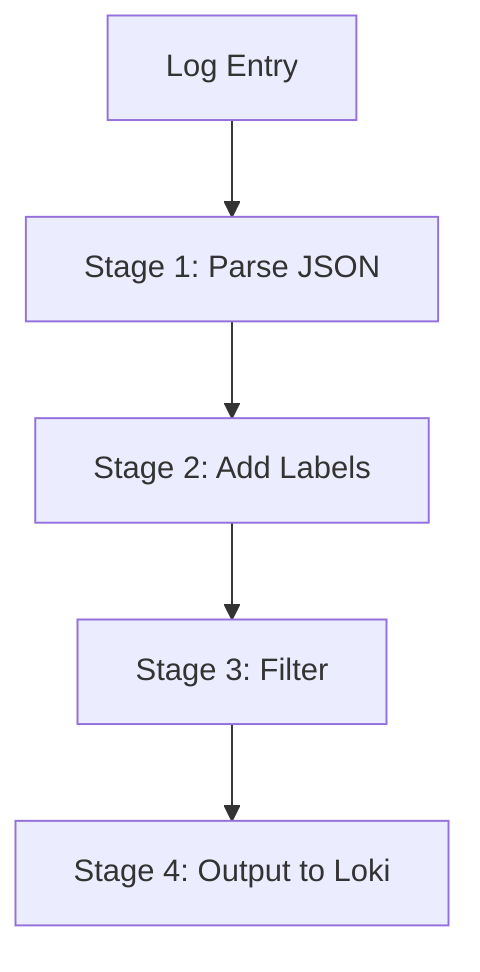

# Promtail Pipelines

## Introduction

Promtail is Grafana Loki's agent responsible for gathering logs from local files and forwarding them to Loki. One of its most powerful features is **pipelines**, which allow you to process, transform, and route your logs before they reach Loki.

Pipelines are a series of stages that logs go through in sequence. Each stage performs a specific action on the log entry, such as parsing, filtering, or relabeling. This processing capability makes Promtail much more than just a log forwarder - it's a comprehensive log processor that can significantly enhance your log management workflow.

In this guide, you'll learn how to configure and use Promtail pipelines to unlock the full potential of your logging system.

## Understanding Promtail Pipeline Basics

### What is a Pipeline?

A pipeline in Promtail is a sequence of stages that process log entries. Each log entry enters at the top of the pipeline and passes through each stage in order. Stages can:

- Extract data from logs
- Add, modify, or remove labels
- Filter log entries
- Parse log formats (JSON, logfmt, regex)
- Transform log contents
- Route logs to different destinations

Here's a simple visualization of how a pipeline works:



### Pipeline Components

A Promtail pipeline consists of:

1. **Positions file**: Tracks the reading position in log files to ensure no logs are missed or processed twice
2. **Scrape configs**: Define what log sources to collect and how to process them
3. **Pipeline stages**: The sequence of processing steps for the logs

## Configuring a Basic Pipeline

Promtail pipelines are defined in the Promtail configuration file, typically `promtail-config.yaml`. Here's a basic pipeline configuration:

```yaml
scrape_configs:
  - job_name: system
    static_configs:
    - targets:
        - localhost
      labels:
        job: varlogs
        __path__: /var/log/*.log
    pipeline_stages:
      - regex:
          expression: "^(?P<timestamp>\\S+) (?P<severity>\\S+) (?P<component>\\S+): (?P<message>.*)$"
      - labels:
          severity:
          component:
      - timestamp:
          source: timestamp
          format: RFC3339
```

This configuration:
1. Collects logs from `/var/log/*.log`
2. Uses regex to extract timestamp, severity, component, and message
3. Adds the severity and component as labels
4. Parses the timestamp in RFC3339 format

## Common Pipeline Stages

Promtail offers numerous pipeline stages. Let's explore the most commonly used ones:

### 1. Regex Stage

The regex stage extracts data using regular expressions:

```yaml
- regex:
    expression: "^(?P<timestamp>\\S+) (?P<level>\\S+) (?P<message>.*)$"
```

**Input Example:**
```
2023-09-15T12:34:56Z INFO User login successful
```

**Result:** Extracts temporary variables:
- timestamp: `2023-09-15T12:34:56Z`
- level: `INFO`
- message: `User login successful`

### 2. JSON Stage

The JSON stage parses JSON formatted logs:

```yaml
- json:
    expressions:
      level: level
      user: user.name
      message: msg
```

**Input Example:**
```
{"level":"error","user":{"name":"john","id":123},"msg":"Failed login attempt"}
```

**Result:** Extracts temporary variables:
- level: `error`
- user: `john`
- message: `Failed login attempt`

### 3. Labels Stage

The labels stage adds extracted data as labels:

```yaml
- labels:
    level:
    component:
    environment:
```

This adds the `level`, `component`, and `environment` extracted variables as labels to the log entry.

### 4. Timestamp Stage

The timestamp stage parses and sets the timestamp for a log entry:

```yaml
- timestamp:
    source: timestamp
    format: RFC3339
```

This uses the extracted `timestamp` field and parses it in RFC3339 format.

### 5. Output Stage

The output stage allows controlling where logs are sent:

```yaml
- output:
    source: message
```

This sends only the `message` part of the log to Loki, discarding other extracted fields.

### 6. Match Stage

The match stage allows conditional processing:

```yaml
- match:
    selector: '{container="nginx"}'
    stages:
      - regex:
          expression: '^(?P<remote_addr>\S+) - (?P<user>\S+) \[(?P<timestamp>\S+) \S+\] "(?P<method>\S+) (?P<path>\S+) (?P<protocol>\S+)" (?P<status>\d+) (?P<bytes_sent>\d+)'
      - labels:
          remote_addr:
          method:
          status:
```

This applies additional processing only to logs from the nginx container.

## Advanced Pipeline Configurations

Let's look at some more advanced pipeline configurations for specific use cases:

### Handling Multi-Line Logs

For applications like Java that produce multi-line stack traces:

```yaml
scrape_configs:
  - job_name: java_app
    static_configs:
    - targets:
        - localhost
      labels:
        job: java_app
        __path__: /var/log/app/*.log
    pipeline_stages:
      - multiline:
          firstline: '^\d{4}-\d{2}-\d{2} \d{2}:\d{2}:\d{2}.\d{3}'
          max_wait_time: 3s
      - regex:
          expression: '^(?P<timestamp>\d{4}-\d{2}-\d{2} \d{2}:\d{2}:\d{2}.\d{3}) (?P<level>\w+) (?P<message>.*(?:
.*)*)$'
      - labels:
          level:
      - timestamp:
          source: timestamp
          format: '2006-01-02 15:04:05.000'
```

This configuration:
1. Uses the multiline stage to combine log lines into a single entry
2. Parses the combined entry to extract timestamp, level, and message
3. Adds the level as a label
4. Sets the timestamp based on the extracted timestamp field

### Parsing Different Log Formats with Conditional Pipelines

When dealing with multiple log formats:

```yaml
scrape_configs:
  - job_name: mixed_logs
    static_configs:
    - targets:
        - localhost
      labels:
        job: mixed_logs
        __path__: /var/log/mixed/*.log
    pipeline_stages:
      - match:
          selector: '{filename=~".*json.*"}'
          stages:
            - json:
                expressions:
                  timestamp: time
                  level: level
                  message: msg
                  user: user.name
            - labels:
                level:
                user:
            - timestamp:
                source: timestamp
                format: RFC3339

      - match:
          selector: '{filename=~".*apache.*"}'
          stages:
            - regex:
                expression: '^(?P<ip>\\S+) - (?P<user>\\S+) \\[(?P<timestamp>\\S+ \\S+)\\] "(?P<method>\\S+) (?P<request>\\S+) (?P<protocol>\\S+)" (?P<status>\\d+) (?P<size>\\d+)'
            - labels:
                method:
                status:
                user:
            - timestamp:
                source: timestamp
                format: '02/Jan/2006:15:04:05 -0700'
```

This configuration uses match stages to apply different processing based on the filename:
1. For JSON logs, it uses the JSON parser
2. For Apache logs, it uses regex parsing

### Dropping Sensitive Information

To remove sensitive data before sending logs to Loki:

```yaml
scrape_configs:
  - job_name: api_logs
    static_configs:
    - targets:
        - localhost
      labels:
        job: api_logs
        __path__: /var/log/api/*.log
    pipeline_stages:
      - json:
          expressions:
            timestamp: time
            level: level
            message: msg
            user_id: user.id
            email: user.email
            credit_card: payment.card_number
      - regex:
          expression: '(?P<masked_cc>\\d{12})'
          source: credit_card
      - template:
          source: masked_cc
          template: "XXXX-XXXX-XXXX-{{ .Value | last 4 }}"
      - labels:
          level:
          user_id:
      - timestamp:
          source: timestamp
          format: RFC3339
      - output:
          source: message
```

This pipeline:
1. Extracts data including sensitive fields like email and credit card
2. Uses regex to isolate the credit card number
3. Applies a template to mask all but the last 4 digits
4. Only keeps non-sensitive fields as labels

## Real-World Example: Comprehensive Web Server Log Processing

Here's a real-world example for processing Nginx web server logs:

```yaml
scrape_configs:
  - job_name: nginx_logs
    static_configs:
    - targets:
        - localhost
      labels:
        job: nginx
        env: production
        __path__: /var/log/nginx/access.log
    pipeline_stages:
      # Parse standard Nginx log format
      - regex:
          expression: '^(?P<remote_addr>\S+) - (?P<remote_user>\S+) \[(?P<timestamp>\d{2}/\w+/\d{4}:\d{2}:\d{2}:\d{2} [+-]\d{4})\] "(?P<method>\S+) (?P<path>\S+) (?P<protocol>\S+)" (?P<status>\d+) (?P<bytes_sent>\d+) "(?P<referer>[^"]*)" "(?P<user_agent>[^"]*)"'
      
      # Parse the path into components
      - regex:
          expression: '^/(?P<service>[^/]+)/(?P<endpoint>[^/]+)'
          source: path
      
      # Extract API version from path if present
      - regex:
          expression: 'v(?P<api_version>\d+)'
          source: service
      
      # Add extracted information as labels
      - labels:
          status:
          method:
          service:
          endpoint:
          api_version:
      
      # Parse timestamp
      - timestamp:
          source: timestamp
          format: '02/Jan/2006:15:04:05 -0700'
      
      # Add dynamic labels based on status code
      - template:
          source: status_category
          template: '{{ if and (ge .status 200) (lt .status 300) }}success{{ else if and (ge .status 400) (lt .status 500) }}client_error{{ else if ge .status 500 }}server_error{{ else }}other{{ end }}'
      - labels:
          status_category:
      
      # Filter out health check endpoints to reduce noise
      - match:
          selector: '{path=~".*/health|.*/ping"}'
          action: drop
      
      # Calculate request size category
      - template:
          source: size_category
          template: '{{ if lt .bytes_sent 1024 }}small{{ else if lt .bytes_sent 102400 }}medium{{ else }}large{{ end }}'
      - labels:
          size_category:
```

This comprehensive pipeline for Nginx logs:
1. Parses standard Nginx log format
2. Extracts service and endpoint information from the path
3. Identifies API versions
4. Categorizes status codes (success, client error, server error)
5. Filters out health check endpoints
6. Categorizes request sizes
7. Adds all relevant information as labels for querying in Loki

## Troubleshooting Pipeline Issues

When working with Promtail pipelines, you might encounter these common issues:

### 1. Logs Not Being Processed

If logs aren't appearing in Loki:

1. Check the positions file (`/run/promtail/positions.yaml` by default)
2. Enable debug logging in Promtail:
   ```yaml
   server:
     log_level: debug
   ```
3. Verify file permissions for the log files

### 2. Incorrectly Parsed Timestamps

If logs appear with incorrect timestamps:

1. Verify the timestamp format matches your logs exactly
2. Use a timestamp stage with the correct format string
3. Test your format with sample log entries

### 3. Regular Expression Issues

If regex stages aren't extracting data correctly:

1. Test your regex patterns with sample log entries
2. Use a regex testing tool to validate expressions
3. Consider using named capture groups (e.g., `(?P<name>pattern)`)

## Best Practices for Promtail Pipelines

When designing your pipelines, follow these best practices:

1. **Start simple and iterate**: Begin with basic pipelines and add complexity as needed
2. **Use labels efficiently**: Only add labels that you'll use for querying
3. **Test thoroughly**: Validate your pipeline with various log formats
4. **Consider performance**: Complex regex patterns can slow down processing
5. **Structure for maintainability**: Use comments and meaningful stage names
6. **Monitor Promtail itself**: Track Promtail's performance and resource usage
7. **Use templates for dynamic processing**: Templates provide powerful transformation capabilities
8. **Drop unnecessary data early**: Filter out unneeded logs as early as possible in the pipeline

## Summary

Promtail pipelines are a powerful tool for processing, transforming, and routing logs before they reach Loki. By configuring appropriate pipeline stages, you can extract meaningful data from your logs, add relevant labels for querying, and ensure your logs are formatted consistently.

Key takeaways:
- Pipelines consist of sequential stages that process logs in order
- Common stages include regex, JSON, labels, timestamp, and match
- Pipeline configurations can range from simple parsing to complex conditional processing
- Well-designed pipelines improve query performance and log usability in Loki

## Exercises

1. Create a basic pipeline that extracts severity levels from your application logs and adds them as labels.
2. Modify the pipeline to handle multi-line Java stack traces.
3. Add a template stage that categorizes logs based on their content.
4. Create a pipeline that handles both JSON and plain text logs from the same application.
5. Implement a pipeline that masks sensitive information like email addresses and passwords.

## Additional Resources

- [Official Promtail Documentation](https://grafana.com/docs/loki/latest/clients/promtail/)
- [Pipeline Stages Reference](https://grafana.com/docs/loki/latest/clients/promtail/stages/)
- [Regular Expression Testing Tools](https://regex101.com/)
- [Loki Query Language (LogQL) Documentation](https://grafana.com/docs/loki/latest/logql/)