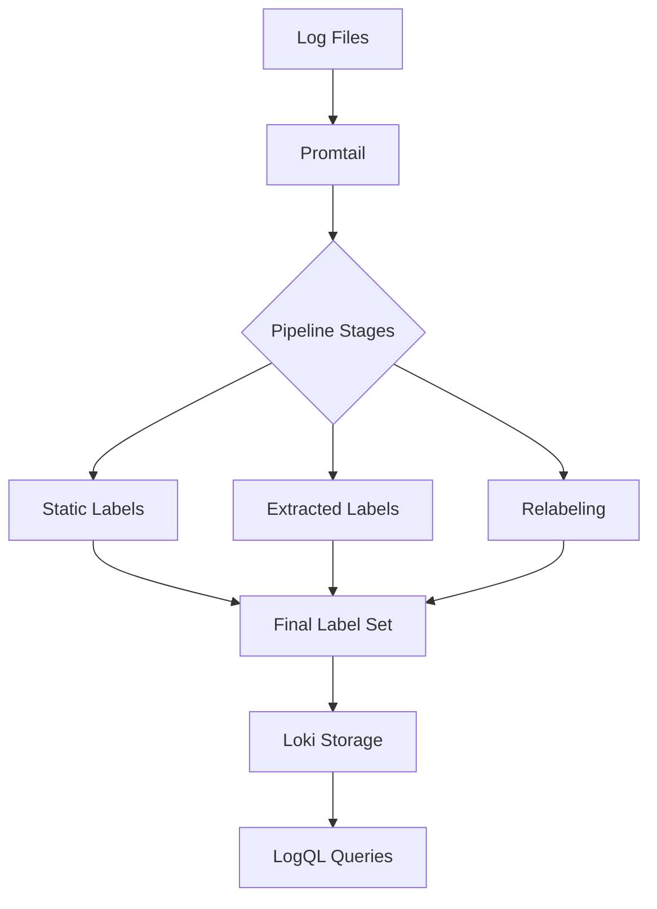

I'll create comprehensive educational content for "Promtail Labels" in Grafana Loki, following your specifications.

---
title: "Promtail Labels"
description: "Learn how to use and configure labels in Promtail to efficiently organize and query logs in Grafana Loki"

---

# Promtail Labels

## Introduction

Labels are a fundamental concept in Grafana Loki's log collection ecosystem. When working with Promtail (Loki's official log collecting agent), understanding labels is crucial for effective log management and retrieval. 

Labels in Promtail serve as metadata tags attached to log entries, allowing for efficient organization, filtering, and querying of your logs. Think of labels as the index cards in a library catalog system - they help you quickly locate the exact information you need among vast amounts of log data.

In this guide, we'll explore how Promtail labels work, how to configure them effectively, and demonstrate their power through practical examples.

## What Are Promtail Labels?

Labels in Promtail are key-value pairs that get attached to log entries before they're sent to Loki. Each log stream in Loki is uniquely identified by its label set, making labels critically important for log organization.

### Key Characteristics of Labels

- Labels define unique log streams in Loki
- They enable efficient querying and filtering of logs
- Well-designed labels significantly improve query performance
- Labels should be high-cardinality (job, service) rather than low-cardinality (detailed error messages, user IDs)

## Label Basics

Let's look at the basic structure of a Promtail label:

```yaml
{app="api", environment="production", component="auth"}
```

In this example:
- `app`, `environment`, and `component` are label names
- `"api"`, `"production"`, and `"auth"` are their respective values

## Configuring Labels in Promtail

Promtail offers several ways to add and manipulate labels. Let's explore the main methods:

### Static Labels

The simplest way to add labels is by defining static labels in your Promtail configuration:

```yaml
scrape_configs:
  - job_name: system
    static_configs:
    - targets:
        - localhost
      labels:
        job: varlogs
        environment: production
        __path__: /var/log/*log
```

In this configuration:
- All logs from the specified path will receive `job=varlogs` and `environment=production` labels
- The special `__path__` label tells Promtail where to find the log files

### Dynamic Labels with `labelmap` Stage

You can extract labels from log content using Promtail pipeline stages. The `labelmap` stage allows you to convert extracted data from your logs into labels:

```yaml
scrape_configs:
  - job_name: app_logs
    static_configs:
    - targets:
        - localhost
      labels:
        job: app
        __path__: /var/log/app/*.log
    pipeline_stages:
      - regex:
          expression: "level=(\\w+).*msg=\"(.*?)\""
          stages:
            - labels:
                level:
                msg:
```

This configuration:
1. Uses a regex to extract log level and message content
2. Creates `level` and `msg` labels with those extracted values

### Using the `labeldrop` and `labelkeep` Stages

Sometimes you need to filter labels. Promtail provides stages for this purpose:

```yaml
scrape_configs:
  - job_name: filtered_logs
    static_configs:
    - targets:
        - localhost
      labels:
        job: app
        temporary: "yes" 
        environment: development
        __path__: /var/log/app/*.log
    pipeline_stages:
      - labeldrop:
          - temporary
```

This configuration drops the `temporary` label before sending logs to Loki.

Similarly, you can use `labelkeep` to specify which labels to retain and drop all others:

```yaml
pipeline_stages:
  - labelkeep:
      - job
      - environment
```

## Label Best Practices

Labels are powerful, but they need to be used carefully. Here are some best practices:

### 1. Keep Cardinality in Mind

High-cardinality labels (those with many possible values) can impact Loki's performance:

```yaml
# BAD: Creates a new stream for every unique user ID
{app="api", user_id="12345"}

# GOOD: Groups logs by service and component
{app="api", component="auth"}
```

### 2. Use Consistent Label Names

Maintain consistency in your label naming across different services:

```yaml
# Consistent naming pattern
{app="service1", environment="production", component="database"}
{app="service2", environment="production", component="api"}
```

### 3. Use Labels for Logical Grouping

Group related logs together using appropriate labels:

```yaml
# Grouping by microservice and instance
{service="payment-processor", instance="payment-processor-1"}
{service="payment-processor", instance="payment-processor-2"}
```

## Real-World Examples

Let's explore some practical examples of using Promtail labels in real-world scenarios.

### Example 1: Multi-Environment Application Logging

For an application deployed across multiple environments:

```yaml
scrape_configs:
  - job_name: app_logs
    static_configs:
    - targets:
        - localhost
      labels:
        app: user-service
        environment: production
        region: us-west
        __path__: /var/log/production/user-service/*.log
    
  - job_name: app_logs_staging
    static_configs:
    - targets:
        - localhost
      labels:
        app: user-service
        environment: staging
        region: us-west
        __path__: /var/log/staging/user-service/*.log
```

With this configuration, you can easily filter logs by environment in Loki:

```
{app="user-service", environment="production"}
```

### Example 2: Extracting Labels from Structured Logs

For applications that output JSON logs:

```yaml
scrape_configs:
  - job_name: json_app_logs
    static_configs:
    - targets:
        - localhost
      labels:
        job: json_app
        __path__: /var/log/app/*.log
    pipeline_stages:
      - json:
          expressions:
            level: level
            user: user.id
            operation: operation
      - labels:
          level:
          user:
          operation:
```

This configuration:
1. Parses JSON logs
2. Extracts `level`, `user.id` (from nested JSON), and `operation` fields
3. Creates corresponding labels

For a log line like:
```json
{"timestamp":"2023-05-15T12:34:56Z", "level":"error", "user":{"id":"user-123"}, "operation":"login", "message":"Authentication failed"}
```

The resulting labeled log in Loki would have these labels:
```
{job="json_app", level="error", user="user-123", operation="login"}
```

### Example 3: Dynamic Service Discovery with Labels

For Kubernetes environments:

```yaml
scrape_configs:
  - job_name: kubernetes-pods
    kubernetes_sd_configs:
      - role: pod
    relabel_configs:
      - source_labels:
          - __meta_kubernetes_pod_label_app
        target_label: app
      - source_labels:
          - __meta_kubernetes_namespace
        target_label: namespace
      - source_labels:
          - __meta_kubernetes_pod_name
        target_label: pod
    pipeline_stages:
      # Additional processing stages...
```

This configuration:
1. Automatically discovers Kubernetes pods
2. Creates labels based on Kubernetes metadata
3. Allows queries like `{namespace="production", app="backend"}`

## Visualizing Label Flow

Here's a diagram showing how labels flow through the Promtail pipeline:



## Querying Logs Using Labels

Once your logs are in Loki with appropriate labels, you can use LogQL to query them:

```
# Basic label selection
{app="user-service", environment="production"}

# Combining labels with text search
{app="user-service", level="error"} |= "database"

# Advanced queries with label filters
{app="payment-service"} | json | transaction_amount > 1000
```

## Common Pitfalls and Solutions

### Pitfall 1: Too Many Labels (High Cardinality)

```yaml
# Problematic: Creates a unique stream for each request_id
labels:
  request_id: "{{.request_id}}"
```

**Solution**: Use these high-cardinality values as part of the log content, not as labels:

```yaml
# Better approach
# The request_id stays in the log line but isn't a label
pipeline_stages:
  - labeldrop:
      - request_id
```

### Pitfall 2: Inconsistent Label Naming

```yaml
# Inconsistent naming
service_a_labels:
  app: api
  env: prod

service_b_labels:
  application: web
  environment: production
```

**Solution**: Standardize label names across services:

```yaml
# Standardized naming
service_a_labels:
  application: api
  environment: production

service_b_labels:
  application: web
  environment: production
```

## Summary

Promtail labels are powerful tools for organizing and querying your logs in Grafana Loki. They create a structured way to filter and retrieve log data efficiently. By following best practices around cardinality and consistent naming, you can build a robust logging system that scales well.

Key takeaways:
- Labels define unique log streams in Loki
- Use static labels for consistent metadata
- Use pipeline stages to extract dynamic labels from log content
- Be careful with high-cardinality labels
- Consistent label naming improves query experience

## Exercise: Configure Your Own Promtail Labels

Try configuring Promtail with the following requirements:
1. Collect logs from a web application
2. Add static labels for environment and application name
3. Extract HTTP method and status code as labels
4. Add custom error detection logic using pipeline stages
5. Query your logs using LogQL and filter by your custom labels

## Additional Resources

- [Official Promtail Documentation](https://grafana.com/docs/loki/latest/clients/promtail/)
- [LogQL Query Language Reference](https://grafana.com/docs/loki/latest/logql/)
- [Loki Best Practices](https://grafana.com/docs/loki/latest/best-practices/)

---