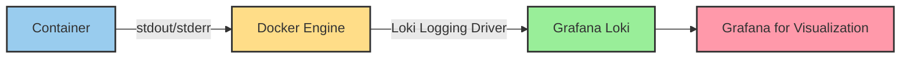

# Docker Logging Driver

## Introduction

Docker containers generate logs that contain valuable information about application behavior, errors, and performance metrics. By default, Docker captures the standard output (stdout) and standard error (stderr) streams from containers and writes them to files using the JSON file logging driver. However, in a modern monitoring environment, you may want to send these logs directly to a centralized logging system like Grafana Loki.

This is where Docker logging drivers come in. They provide a pluggable architecture to route container logs to different destinations without changing your application code.

In this guide, we'll explore how to configure Docker to send container logs directly to Grafana Loki using the Loki logging driver.

## What are Docker Logging Drivers?

Docker logging drivers are plugins that determine where container logs are sent. Each container can use a different logging driver, allowing for flexible log routing strategies.

Docker supports several built-in logging drivers:

- `json-file`: The default driver that writes logs to JSON files
- `local`: Optimized local logging driver similar to json-file but with better performance
- `syslog`: Writes logs to the syslog facility
- `journald`: Writes logs to journald (systemd journal)
- `fluentd`: Writes logs to fluentd (forward input)
- `loki`: Sends logs directly to Grafana Loki (what we'll focus on)
- And several others including `gelf`, `awslogs`, `splunk`, and `etwlogs`

## The Loki Logging Driver

The Loki logging driver was introduced to seamlessly integrate Docker with Grafana Loki. It allows containers to send logs directly to Loki without requiring an intermediate collection agent like Promtail.

### How It Works

Let's visualize how the Loki logging driver works:



## Installing the Loki Docker Driver Plugin

Before using the Loki logging driver, you need to install it as a Docker plugin:

```bash
docker plugin install grafana/loki-docker-driver:latest --alias loki --grant-all-permissions
```

You can verify the installation with:

```bash
docker plugin ls
```

Expected output:

```
ID             NAME    DESCRIPTION                ENABLED
ac720b8fcfdb   loki    Loki Logging Driver        true
```

## Configuring the Loki Logging Driver

You can configure the Loki logging driver at three different levels:

1. **Per-container**: Apply the logging configuration to a specific container
2. **Per-daemon**: Set as the default for all containers managed by the Docker daemon
3. **Per-compose file**: Configure logging for all services in a Docker Compose setup

Let's explore each approach:

### 1. Per-Container Configuration

To use the Loki logging driver for a specific container:

```bash
docker run --log-driver=loki \
  --log-opt loki-url="http://localhost:3100/loki/api/v1/push" \
  --log-opt loki-batch-size="400" \
  --name test-loki \
  alpine echo "This log message goes to Loki"
```

### 2. Docker Daemon Configuration

To set Loki as the default logging driver for all containers, edit the Docker daemon configuration file `/etc/docker/daemon.json`:

```json
{
  "log-driver": "loki",
  "log-opts": {
    "loki-url": "http://localhost:3100/loki/api/v1/push",
    "loki-batch-size": "400",
    "loki-retries": "5",
    "loki-timeout": "10s"
  }
}
```

After modifying this file, restart the Docker daemon:

```bash
sudo systemctl restart docker
```

### 3. Docker Compose Configuration

For Docker Compose deployments, you can configure the logging driver in your `docker-compose.yml` file:

```yaml
version: '3'
services:
  web:
    image: nginx:latest
    logging:
      driver: loki
      options:
        loki-url: "http://localhost:3100/loki/api/v1/push"
        loki-external-labels: "job=docker,container_name={{.Name}},compose_service={{index .Config.Labels \"com.docker.compose.service\"}}"
```

## Key Configuration Options

The Loki logging driver supports several configuration options:

| Option                 | Description                                   | Default                    |
|------------------------|-----------------------------------------------|----------------------------|
| `loki-url`             | The Loki push API endpoint                    | `Required`                 |
| `loki-batch-size`      | Number of log entries to batch before sending | `1000`                     |
| `loki-timeout`         | Maximum time to wait before sending a batch   | `10s`                      |
| `loki-retries`         | Number of retries when sending fails          | `5`                        |
| `loki-external-labels` | Labels to add to every log line               | `container_name={{.Name}}` |
| `loki-tenant-id`       | Tenant ID when using multi-tenancy            | `-`                        |

### Using Labels for Better Organization

One of the most powerful features of the Loki logging driver is the ability to add custom labels to your logs. These labels can be used for filtering and organizing logs in Grafana.

For example:

```bash
docker run --log-driver=loki \
  --log-opt loki-url="http://localhost:3100/loki/api/v1/push" \
  --log-opt loki-external-labels="env=production,service=api,region=us-west" \
  alpine echo "Production log message"
```

## Practical Example: Setting Up a Complete Stack

Let's create a practical example where we configure a complete stack with Loki and some services using Docker Compose:

```yaml
version: '3'
services:
  loki:
    image: grafana/loki:latest
    ports:
      - "3100:3100"
    command: -config.file=/etc/loki/local-config.yaml
    volumes:
      - ./loki-config.yaml:/etc/loki/local-config.yaml

  grafana:
    image: grafana/grafana:latest
    ports:
      - "3000:3000"
    environment:
      - GF_AUTH_ANONYMOUS_ENABLED=true
      - GF_AUTH_ANONYMOUS_ORG_ROLE=Admin
    depends_on:
      - loki

  # Example application that will send logs to Loki
  web:
    image: nginx:latest
    depends_on:
      - loki
    logging:
      driver: loki
      options:
        loki-url: "http://loki:3100/loki/api/v1/push"
        loki-external-labels: "job=nginx,environment=dev"
```

Save this as `docker-compose.yml` and run:

```bash
docker-compose up -d
```

Now access Grafana at http://localhost:3000, add Loki as a data source (URL: http://loki:3100), and start exploring your logs.

## Viewing Logs in Grafana

Once you've set up the Loki logging driver, you can view your logs in Grafana:

1. Open Grafana (typically at http://localhost:3000)
2. Configure a Loki data source if not already done
3. Go to the Explore tab
4. Use LogQL queries to filter and display your logs

Example LogQL query to view logs from our web service:

```
{job="nginx", environment="dev"}
```

## Common Issues and Troubleshooting

### 1. Plugin Not Found

If you see an error like:

```
Error response from daemon: error looking up logging plugin loki: plugin loki not found
```

Solution: Install the plugin as shown in the installation section.

### 2. Connection Refused

```
level=error msg="error sending batch" error="Post \"http://localhost:3100/loki/api/v1/push\": dial tcp 127.0.0.1:3100: connect: connection refused"
```

Solution: Ensure Loki is running and accessible at the configured URL.

### 3. Labels Must Be Paired

If you see an error about labels not being paired, check your label configuration. Labels must be in key=value format.

## Advanced Usage: Filtering and Parsing Logs

The Loki logging driver can be combined with Docker's log processing options for more control:

### Using Log Labels to Control Routing

```bash
docker run --label "com.docker.compose.service=api" \
  --log-driver=loki \
  --log-opt loki-url="http://localhost:3100/loki/api/v1/push" \
  --log-opt loki-external-labels="container={{.ID}},image={{.ImageName}}" \
  alpine echo "Example log"
```

### Filtering Sensitive Information

You can use Docker's built-in log processing to filter sensitive data before it reaches Loki:

```bash
docker run --log-driver=loki \
  --log-opt loki-url="http://localhost:3100/loki/api/v1/push" \
  --log-opt env="PASSWORD" \
  --log-opt env-regex="^(API_KEY|SECRET_).*" \
  alpine env
```

This will exclude environment variables matching the specified patterns from logs.

## Performance Considerations

When using the Loki logging driver in production, consider these performance tips:

1. **Batch Size**: Increase `loki-batch-size` for higher throughput, but be aware of memory usage
2. **Label Cardinality**: Limit the number of unique label combinations to avoid Loki performance issues
3. **Log Volume**: For high-volume log producers, consider using a dedicated logging agent like Promtail instead

## Summary

The Docker Loki logging driver provides a straightforward way to send container logs directly to Grafana Loki without intermediate agents. It offers:

- Simple configuration at the container, daemon, or compose level
- Flexible labeling to organize and filter logs
- Integration with Docker's native logging infrastructure

By configuring containers to log directly to Loki, you can:
- Centralize logs from all your containers
- Correlate logs with metrics when combined with Prometheus
- Create powerful visualizations and alerts in Grafana

## Further Learning

To deepen your understanding of Docker logging and Loki integration:

1. Explore Grafana's LogQL language for advanced log querying
2. Set up log alerting based on patterns or thresholds
3. Experiment with log aggregation and transformation using LogQL
4. Combine logs with metrics for comprehensive observability

## Exercises

1. Set up a multi-container application with Docker Compose using the Loki logging driver
2. Configure different labels for different services and practice filtering in Grafana
3. Create a custom LogQL query to find error messages across all containers
4. Configure log retention and compaction policies in Loki for production use
5. Compare the performance of the Loki logging driver versus using Promtail