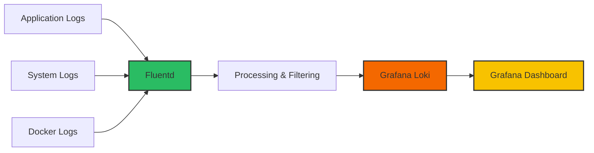

# Fluentd Integration with Grafana Loki

## Introduction

Fluentd is an open-source data collector that lets you unify data collection and consumption for better use and understanding of data. In this guide, we'll explore how to integrate Fluentd with Grafana Loki to create a powerful logging pipeline.

Fluentd acts as a unified logging layer, collecting logs from various sources, processing them, and then forwarding them to Loki for storage and querying. This integration is particularly useful in microservices and containerized environments where log management can become complex.

## Prerequisites

Before we begin, make sure you have:

- Grafana Loki set up and running
- Basic understanding of logging concepts
- Fluentd installed (we'll cover this in the next section)

## Installing Fluentd

Let's start by installing Fluentd on your system:

```bash
# For Debian/Ubuntu
sudo apt-get install -y build-essential ruby-dev
sudo gem install fluentd --no-doc

# For RHEL/CentOS
sudo yum install -y ruby-devel gcc
sudo gem install fluentd --no-doc

# Alternatively, use the td-agent package (recommended for production)
# See: https://docs.fluentd.org/installation
```

Once installed, verify your installation:

```bash
fluentd --version
```

Expected output:
```
fluentd 1.15.3
```

## Installing the Loki Plugin for Fluentd

To send logs from Fluentd to Loki, we need to install the Fluentd Loki plugin:

```bash
gem install fluent-plugin-grafana-loki
```

Or if you're using td-agent:

```bash
td-agent-gem install fluent-plugin-grafana-loki
```

## Basic Configuration

Now let's create a basic Fluentd configuration file that collects logs and forwards them to Loki:

```xml
<source>
  @type tail
  path /var/log/syslog
  pos_file /var/log/td-agent/syslog.pos
  tag system.syslog
  <parse>
    @type syslog
  </parse>
</source>

<match system.**>
  @type loki
  url "http://loki:3100"
  extra_labels {"job": "fluentd"}
  flush_interval 10s
  flush_at_shutdown true
  buffer_chunk_limit 1m
</match>
```

This configuration:
1. Collects logs from `/var/log/syslog`
2. Parses them using the syslog format
3. Forwards logs with the tag `system.**` to Loki running at `http://loki:3100`
4. Adds an extra label `job: fluentd` to all logs
5. Sets buffer and flush parameters for performance

Save this configuration to a file (e.g., `fluentd-loki.conf`).

## Advanced Configuration

### Adding Labels from Log Content

One of the powerful features of Loki is its label system. We can extract fields from our logs to create labels:

```xml
<match system.**>
  @type loki
  url "http://loki:3100"
  extra_labels {"job": "fluentd"}
  
  <label>
    hostname ${hostname}
    severity ${level}
    application ${tag}
  </label>
  
  <buffer>
    flush_interval 10s
    chunk_limit_size 1m
    flush_at_shutdown true
  </buffer>
</match>
```

### Processing Logs with Filters

Fluentd allows you to process logs before sending them to Loki:

```xml
<filter system.**>
  @type record_transformer
  <record>
    hostname "#{Socket.gethostname}"
    environment "production"
  </record>
</filter>

<filter system.**>
  @type grep
  <exclude>
    key message
    pattern /health check/
  </exclude>
</filter>
```

This configuration:
1. Adds hostname and environment fields to each log record
2. Filters out any logs containing "health check" in the message

## Collecting Docker Logs

In containerized environments, you'll likely want to collect logs from Docker containers:

```xml
<source>
  @type forward
  port 24224
  bind 0.0.0.0
</source>

<match docker.**>
  @type loki
  url "http://loki:3100"
  extra_labels {"job": "docker"}
  
  <label>
    container_name ${container_name}
    image_name ${image_name}
    container_id ${container_id}
  </label>
  
  <buffer>
    flush_interval 10s
    chunk_limit_size 1m
    flush_at_shutdown true
  </buffer>
</match>
```

To use this setup, configure your Docker containers to use the Fluentd logging driver:

```bash
docker run --log-driver=fluentd --log-opt fluentd-address=localhost:24224 your-image
```

## Visual Representation of the Fluentd-Loki Integration

Here's a diagram showing how Fluentd integrates with Grafana Loki:



## Complete Example Configuration

Let's put everything together in a complete configuration file:

```xml
# Input plugins - collect logs from different sources
<source>
  @type tail
  path /var/log/syslog
  pos_file /var/log/td-agent/syslog.pos
  tag system.syslog
  <parse>
    @type syslog
  </parse>
</source>

<source>
  @type tail
  path /var/log/app/*.log
  pos_file /var/log/td-agent/app.pos
  tag application.logs
  <parse>
    @type json
  </parse>
</source>

<source>
  @type forward
  port 24224
  bind 0.0.0.0
  tag docker
</source>

# Processing filters
<filter **>
  @type record_transformer
  <record>
    hostname "#{Socket.gethostname}"
    environment "production"
  </record>
</filter>

<filter application.logs>
  @type grep
  <exclude>
    key log
    pattern /DEBUG/
  </exclude>
</filter>

# Output to Loki
<match **>
  @type loki
  url "http://loki:3100"
  
  <label>
    job fluentd
    hostname ${hostname}
    environment ${environment}
    tag ${tag}
  </label>
  
  # Optional: extract labels from JSON log fields
  <extra_label>
    container_name $.container.name
    severity $.level
  </extra_label>
  
  <buffer>
    @type memory
    flush_interval 10s
    chunk_limit_size 1m
    flush_at_shutdown true
    retry_max_interval 30
    retry_forever true
  </buffer>
</match>
```

## Troubleshooting

If you're having issues with your Fluentd-Loki integration, here are some troubleshooting tips:

1. **Check Fluentd logs:**
   ```bash
   tail -f /var/log/td-agent/td-agent.log
   ```

2. **Verify connectivity to Loki:**
   ```bash
   curl -v http://loki:3100/ready
   ```

3. **Enable debug logging in Fluentd:**
   Add this to your configuration:
   ```xml
   <system>
     log_level debug
   </system>
   ```

4. **Check Loki logs for ingestion errors:**
   ```bash
   kubectl logs -l app=loki -c loki
   ```

## Real-World Use Case: Monitoring Web Application Logs

Let's walk through a practical example of monitoring a web application using Fluentd and Loki.

### Scenario
You have a Node.js web application running in Docker, and you want to:
1. Collect application logs
2. Parse JSON log output
3. Add metadata
4. Send to Loki for monitoring and alerting

### Step 1: Configure Your Application Logging

First, ensure your application is logging in JSON format:

```javascript
// Node.js example using Winston
const winston = require('winston');
const logger = winston.createLogger({
  level: 'info',
  format: winston.format.json(),
  defaultMeta: { service: 'web-service' },
  transports: [
    new winston.transports.Console(),
    new winston.transports.File({ filename: '/var/log/app/combined.log' })
  ]
});

// Example log
logger.info('User logged in', { userId: '123', action: 'login' });
```

### Step 2: Create Fluentd Configuration

```xml
# Input: Tail application logs
<source>
  @type tail
  path /var/log/app/combined.log
  pos_file /var/log/td-agent/app.pos
  tag app.nodejs
  <parse>
    @type json
  </parse>
</source>

# Process: Add metadata
<filter app.nodejs>
  @type record_transformer
  <record>
    environment "production"
    hostname "#{Socket.gethostname}"
    app_version "1.0.0"
  </record>
</filter>

# Output: Send to Loki
<match app.nodejs>
  @type loki
  url "http://loki:3100"
  
  <label>
    job web_application
    environment ${environment}
    hostname ${hostname}
    service ${service}
  </label>
  
  <buffer>
    flush_interval 5s
    chunk_limit_size 1m
    flush_at_shutdown true
  </buffer>
</match>
```

### Step 3: Set Up Docker Compose

```yaml
version: '3'
services:
  web-app:
    image: your-nodejs-app
    volumes:
      - /var/log/app:/var/log/app
    # other configuration...
    
  fluentd:
    image: fluent/fluentd:v1.15
    volumes:
      - ./fluentd/conf:/fluentd/etc
      - /var/log:/var/log
    environment:
      - FLUENTD_CONF=fluentd-loki.conf
    ports:
      - "24224:24224"
    depends_on:
      - loki
      
  loki:
    image: grafana/loki:2.7.0
    ports:
      - "3100:3100"
    # other configuration...
    
  grafana:
    image: grafana/grafana:9.3.0
    ports:
      - "3000:3000"
    depends_on:
      - loki
    # other configuration...
```

### Step 4: Create LogQL Queries in Grafana

Once your logs are flowing into Loki, you can create queries in Grafana:

1. Count of errors over time:
   ```
   sum(count_over_time({job="web_application"} |= "error" [5m])) by (service)
   ```

2. Find all login attempts:
   ```
   {job="web_application"} |= "login" | json | line_format "{{.userId}} logged in at {{.timestamp}}"
   ```

## Summary

In this guide, we've covered:

- How to install and configure Fluentd for log collection
- Installing the Grafana Loki plugin for Fluentd
- Basic and advanced configuration options for sending logs to Loki
- Filtering and processing logs before shipment
- Collecting logs from various sources including Docker containers
- Troubleshooting common issues
- A real-world example of monitoring a web application

Fluentd provides a flexible and powerful way to collect and process logs before sending them to Loki for storage and analysis. By leveraging Fluentd's extensive plugin ecosystem and Loki's efficient log storage and querying capabilities, you can build a comprehensive logging solution for any application or infrastructure.

## Additional Resources

- [Fluentd Official Documentation](https://docs.fluentd.org/)
- [Grafana Loki Documentation](https://grafana.com/docs/loki/latest/)
- [Fluentd Loki Plugin Documentation](https://github.com/grafana/loki/tree/main/clients/cmd/fluentd)

## Exercises

1. Set up Fluentd to collect logs from a web server (Apache or Nginx) and forward them to Loki.
2. Create a Fluentd configuration that parses multiline logs from a Java application and sends them to Loki.
3. Configure Fluentd to add custom labels based on the content of your logs.
4. Set up a Grafana dashboard that displays error rates and response times from your application logs.
5. Implement log rotation and clean-up policies to manage your log storage efficiently.